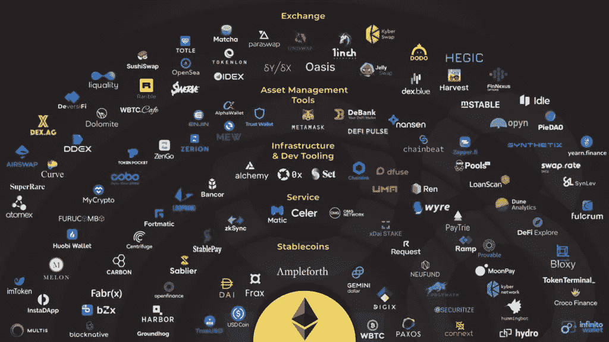
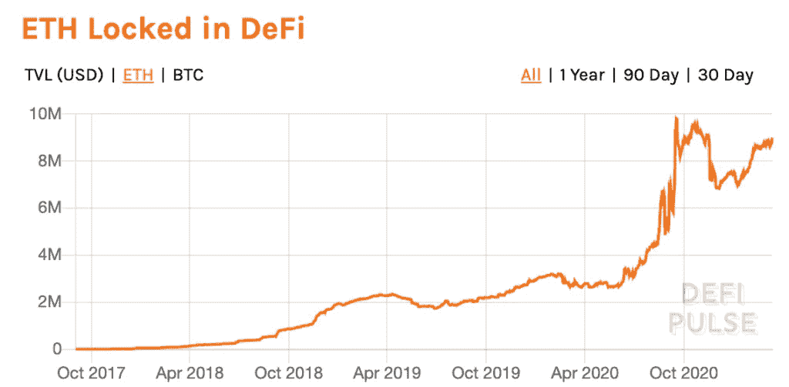
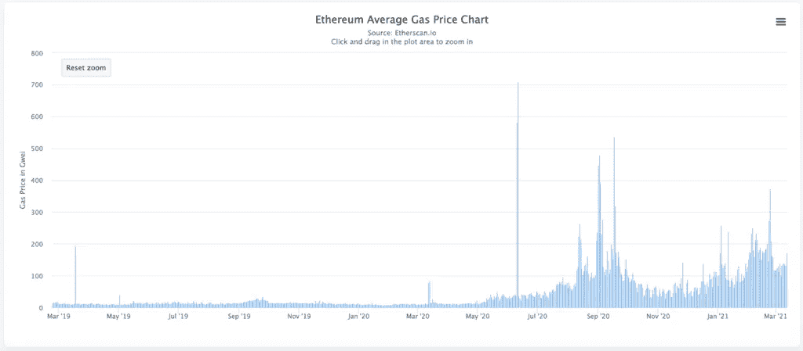

# 为什么我对以太坊的规模持乐观态度

> 原文：<https://medium.com/coinmonks/why-im-optimistic-about-ethereum-scaling-73f8fdec53a8?source=collection_archive---------6----------------------->

任何在过去几个月里与以太坊网络互动过的人都会直接知道它正经历着一些严重的可扩展性问题。以太坊的工作证明共识算法利用相对较慢且低效的蛮力计算，并且所有网络节点的联合努力一次只能生成一个块。这就是为什么以太坊网络目前只能达到每秒 16 次交易的速度。此外，当前的分散金融(DeFi)运动导致了对块空间前所未有的需求，你可以看到为什么当前的网络基础设施不再适用。

# 以太坊交易费

每当用户想要在钱包之间转移资金或与许多可用的智能合约之一进行交互时，以太坊网络必须就交易的有效性达成共识，并将其添加到一个区块中。然而，在这发生之前，提交的事务必须在所谓的 mempool 中等待。挖掘器检查这个内存池，并选择在下一个块中包含哪些事务。发布这些交易的用户能够定义他们愿意向矿工支付的费用(以 gwei 指定，eth 的一种命名),以使交易包含在下一个块中。在以太网中，这种费用被称为气体。在交易中提供更多的天然气会激励矿商选择你的交易。在网络高度拥堵的时候，这不可避免地导致用户抬高天然气价格，以便更快地确认他们的交易。这也解释了为什么低汽油的交易需要几个小时才能完成。

即将到来的以太坊 2.0 升级包含各种旨在解决这些问题的更新。然而，它仍在开发中，离完成还有一段距离。幸运的是，有许多公司实现了不同的扩展解决方案(第 2 层)，这些解决方案有效地运行在以太坊主链(第 1 层)之上。这些扩展解决方案背后的共同想法是允许交易独立于以太坊主链发生，但仍然通过在那里锚定状态来利用其安全性。目前的解决方案分为三类:国家渠道(更具体地说，支付渠道)，等离子链和卷。本文试图提供这些是什么以及它们能为网络做些什么的高级概述。

# 支付渠道:

我想讨论的第一个扩展解决方案是支付渠道。

支付通道基本上是两个参与者之间的协议，发送者在以太坊主链上的智能合约中存放若干令牌。然后，直接的点对点支付可以通过交换私人信息在链外进行，这些私人信息对两个参与者之间的价值转移进行数字签名。因为这些交换发生在链外，所以它们不需要以太网中的计算资源，而且基本上是免费的。一旦参与者完成了他们的业务，并希望提取他们应得的资金，智能合同将检查最后签署的消息，并在主链上结算索赔。存款中未抵押给接收者的任何剩余代币将被返还给发送者。

虽然支付通道中的交易基本上是免费的，但在通道打开和关闭时，需要向以太坊矿工支付汽油费。此外，通过使用双向通道，支付可以在两个方向进行，这需要双方参与者在以太坊智能合约中存放令牌。对等支付也可以发生在不通过支付通道直接连接的两个参与者之间。这是通过使用多跳传输来实现的。致力于这种解决方案的项目的一个例子是[雷电网络](https://raiden.network/101.html)。

支付渠道就是他们所说的那样。他们非常擅长促成两个参与者之间快速、廉价的点对点小额支付。不幸的是，它们不支持智能合约，而且由于智能合约是当今大部分网络需求的来源，支付渠道无法提供所需的扩展能力。

# 等离子体链:

等离子链(又名子链)基本上是一个以太坊兼容的独立区块链，通过智能合约(称为桥)访问。实施这种方法的一个例子是 [OMG 网络](https://omg.network/)。理论上，可以有无限数量的等离子体链与以太坊主链平行运行，它们中的每一个都可以独立运行，满足不同的需求。此外，可以在这些链的顶部构建额外的等离子体链，从而形成树状结构。

血浆链使用它们自己的共识机制运行，由它们自己的验证器节点网络支持。由于共识计算发生在以太坊网络之外，网络内的交易非常快速和便宜。所有交易数据都存储在等离子链中，并定期以 [Merkle root](https://www.investopedia.com/terms/m/merkle-root-cryptocurrency.asp#:~:text=A%20Merkle%20root%20is%20a,whole%2C%20undamaged%2C%20and%20unaltered.) 的形式批量发布到主链。此时，资产所有者也会收到所有权证明。由于等离子网络通常比以太坊拥有更少的验证者节点，因此集中化程度更高。因此，假设血浆验证器节点不可信要安全得多。因此，要撤回资产，用户需要公布其所有权证明，并启动 7 至 14 天的质询期，在此期间资产被锁定。这段时间让其他网络参与者有机会提交相互矛盾的证据，证明他们对资产的主张不成立。如果一个等离子网络验证者被证明有不诚实的行为，该交易将被撤销，验证者将面临经济处罚。如果在质询期间没有提出有效的争议，用户可以成功撤回资产。尽管这个等待时间远非理想，但它确实确保了诚实的参与者能够提取他们的资产，即使网络上的验证者试图发起某种敌对攻击。

然而，等离子体链有一个缺陷。为什么它们是安全的背后的游戏理论依赖于对象具有逻辑所有者的概念。来自[维塔利科的博客](https://vitalik.ca/general/2021/01/05/rollup.html):

> *如果所有者不关心他们资产，那么可能导致涉及该资产的“无效”结果。这对于许多应用程序来说没问题，但对于许多其他应用程序(如 Uniswap)来说却是一个障碍。*
> 
> 维塔利克·布特林

例如，要求用户拥有的对象的状态在未经他们同意的情况下被更新的系统，比如增加他们的帐户余额，在 Plasma 上不能很好地工作。某些应用程序能够通过实现“特定于应用程序的逻辑”来处理这种限制。然而，这并不允许创建一个更通用的、开放参与的系统，比如模拟[以太坊虚拟机](https://ethereum.org/en/developers/docs/evm/) (EVM)。

# 汇总

卷形物与等离子体链有一些相似之处。它们需要一个单独的区块链来卸载计算任务，它们通过智能合约与以太坊主链进行交互，并定期批处理(汇总)事务并将它们发布到主链。然而，与等离子体链不同，上卷被视为混合第 2 层解决方案。要完全考虑第 2 层，所有计算和所有事务数据都应该从主链中移出。相比之下，汇总将所有计算转移到第 2 层区块链，但将事务数据保留在以太坊主链上。通过结合离线计算和聪明的链上数据压缩，网络需求和交易费用可以大大减少。

在以太坊主链上有现成的数据允许网络更容易地就汇总内容的有效性达成共识。这限制了恶意链外验证器节点通过扣留或更改交易数据可能造成的损害。除此之外，链上数据可用性消除了像我们在血浆链中看到的那样将所有者映射到资产的需要。这使得上卷更加通用，甚至可以模拟 EVM。这将改变游戏规则，因为 Uniswap、Synthetix 或 Aave 等现有的 DeFi 应用程序可以轻松迁移。

# ZK-汇总

有两种类型的汇总，零知识(ZK-汇总)和乐观汇总。Zk-rollups 利用了一个相对较新的密码学领域，叫做[零知识证明](https://hackernoon.com/eli5-zero-knowledge-proof-78a276db9eff) (ZKPs)。用非常基本的术语来说，这些提供了底层数据有效的数学证明，而实际上不必揭示具体的数据。zkp 不提供任何缩放功能，但是它们增加了一个非常需要的隐私元素。不幸的是，在它们当前的形式中，zkp 需要过多的计算，使得它们不适合大规模使用，因此这种解决方案不太可能缓解以太坊网络所经历的直接问题。然而，随着 ZKP 技术在未来几年的发展和完善，我们很可能会看到 zk-rollups 成为以太坊基础设施的基本组成部分。一家已经有工作产品的公司是 [Loopring](https://loopring.org/#/) 。

# 乐观累计

第二种类型的汇总，可能是目前最有趣的第 2 层解决方案，是乐观汇总。它们处理无效事务的方式不同于 ZK-roll up。ZK-roll up 使用 ZKPs 来确保所有事务数据在发布到主链之前都是有效的。相比之下，乐观汇总假设所有数据都是有效的，直到证明并非如此。换句话说，他们是“乐观的”。像血浆链一样，当汇总发布到主链时，挑战期开始，资产被锁定。如果在此质询期间提交了欺诈证据，并且以太坊网络认为该质询有效，则相关交易将被恢复，负责的验证者将受到惩罚。如果没有人提出质疑，那么在这一时期结束时可以提取资产。

一家开发这种解决方案的公司是乐观公司。他们计划实现一个乐观虚拟机(OVM)，它实际上和以太坊虚拟机是一样的。这意味着它支持任何目前在以太坊上运行的智能合约。这已经开发了几年，很快将在以太坊主链上推出，并有一些[大牌支持它](https://a16z.com/2021/02/24/investing-in-optimism/)。许多现有的应用程序已经在乐观的 testnet 上构建了[演示版本](https://optimism.io/demos)。例如，以太坊上的合成资产交易所 Synthetix 记录了网络交易费用的 x143 减少和仅 0.3 秒的确认时间。Uniswap 还开发了一个性能同样令人印象深刻的演示。比特币基地已经将他们的钱包与乐观测试网整合在一起，所以一旦 mainnet 启动，他们将完全兼容。此外，以太坊的创造者 Vitalik Buterin 非常支持这个项目，并且已经在之前写了[关于累积的好处。](https://vitalik.ca/general/2021/01/05/rollup.html)

总之，有许多项目试图以各种方式扩大以太坊的规模，以利用当前的燃气费危机。支付渠道在两个用户之间进行大量小额支付时非常有效。等离子体链也为一些应用提供缩放，但不是完全通用的。汇总看起来非常有前景，但在零知识证明技术能够大规模有效实施之前，乐观的汇总可能会在以太坊第 2 层扩展叙述中占据中心位置。现有应用程序轻松迁移的能力可能会推动其采用，并极大地增强用户体验。

感谢你花时间阅读这篇文章。写这些文章需要大量的工作和研究，所以如果你发现你所读的有价值，请给我留言，让我知道。

# 来源:

*   [https://near.org/blog/layer-2/](https://near.org/blog/layer-2/)
*   [https://docs . eth hub . io/ether eum-roadmap/layer-2-scaling/ZK-rollups/](https://docs.ethhub.io/ethereum-roadmap/layer-2-scaling/zk-rollups/)
*   【https://vitalik.ca/general/2021/01/05/rollup.html 
*   https://www.youtube.com/watch?v=l4jccXoqLGM&ab _ channel = ETHDenver
*   https://www.youtube.com/watch?v=IwY-D5J8otU&ab _ channel = economics design