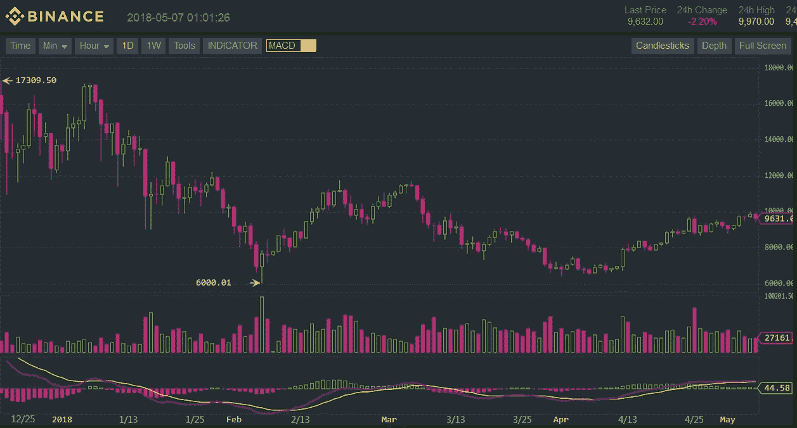
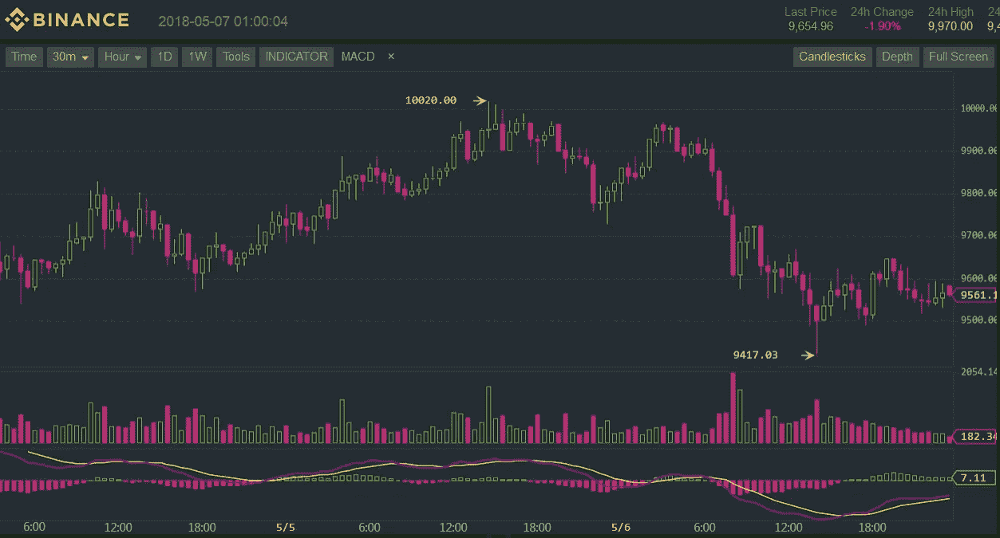
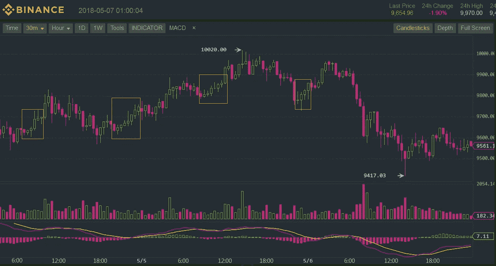
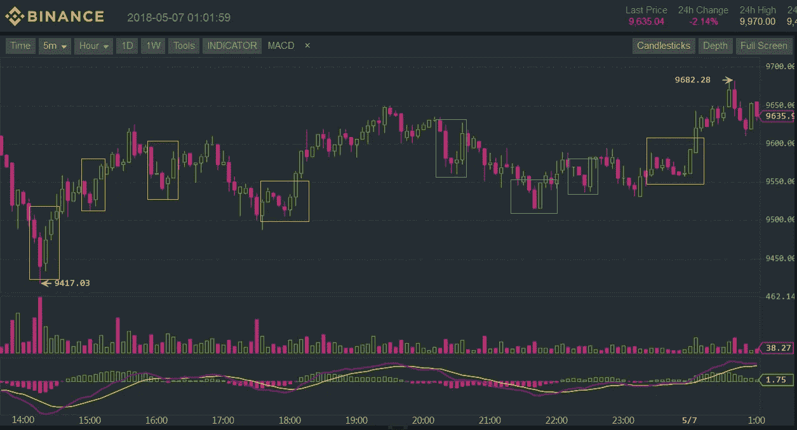

# 为什么日内交易加密比持有要好

> 原文：<https://medium.com/coinmonks/why-intra-day-trading-crypto-can-be-better-than-holding-cbb8afe43d00?source=collection_archive---------1----------------------->

如果你相对来说是交易加密货币的新手，那么这个教程就是你所需要的。在本教程中，我将尝试解释如何使用加密来增加你的资本基础，每天至少 1%。

# 不要只是 Hodl

odling(又称持有货币)是购买一些加密资产(如莱特币)并持有数天、数周、数月甚至数年的策略。对于新推出的 ico 来说，这可能是一个很好的策略，这些 ico 的价值可能很快会增加一倍、两倍或四倍。但我个人劝你不要持有，换句话说，不要从众，不要做无头鸡。

> 在我的例子中，我将使用币安交易所。请记住，我与币安没有任何形式的联系。

对于成熟的硬币来说，持有不是一个非常实际的举动，原因是它们的波动性。例如，比特币(见下图)在 20 天内上涨了 30%。但这并不意味着它每天有 1.5%的线性增长，有些日子下降，有些日子上升。

Bitcoin at daily intervals

## 持有风险

假设你使用上面的图表来预测比特币的增长——通过查看图表，价格应该在未来 20 天左右达到 12.4 万美元。另一方面，现实并不是某种线性计算——没有人能够预测到明天价格甚至会达到 1 万美元。价格甚至可能暴跌至 8000 美元。所以你的 96000 美元的投资将会变得更少，因为你胡乱猜测并且输了。持有更像赌博，而不是交易，原因很简单，因为风险太高，不确定性太多。

我的策略是持续交易。我非常相信未使用的资产会减少——意思是:无论你用什么，你都会失去。把成堆的硬币藏在床下，希望它们会升值并不总是最好的方法——除非你愿意冒这个险，或者你非常确定一些加密硬币的价格会在未来几天、几周或几个月内上涨。

> 另请阅读:[最佳加密交易机器人](/coinmonks/crypto-trading-bot-c2ffce8acb2a)

# 日间交易

定期交易资产可能是一个更安全的赌注，对你来说可能更有利可图。从上一节我们了解到，比特币平均每天增长 1.5%(过去 20 天)。所以你可以冒险今天买入，明天或未来几天卖出。不能保证明天的价格会比你现在的买入价高，但总比交叉手指无限期持有要好。

你可以设定一个价格下限，例如，如果你的投资减少了 5%并持续下跌，那么你应该卖出以避免更多的损失。另一方面，继续持有，直到你的涨幅至少达到 1%。在这种情况下，日内交易比持有风险小，因为它更容易计算。

# 日内交易

我总是担保日内交易超过持股，但是我们真的能做到每天超过 1%吗？我们每天两次、三次、四次甚至五次产生 1%怎么样？这是可能的，证据就在数字中。

如果你分析许多加密货币，你会注意到它们具有很高的波动性，也就是说，它们的价值会以很大的幅度快速上升或下降。看看下面的图表，它以 30 分钟为间隔显示了比特币的价格:

在几个小时内，价格可能会上下 1%、2%、3%，有时甚至更多。这是一件伟大的事情，因为我们需要做的就是等待一个好的进场位置(即买入)，然后在几个小时后，一旦它上涨了一定的百分比，就卖出。通过重复这个过程，你每天都可以获得可观的投资回报。即使在下跌趋势期间(在日线图上可以看到下跌趋势)，日内间隔仍然有这些高利润的机会。

## 使用指标

许多交易者使用指标(如 MACD、均线、均线、相对强弱指标等等)来保持领先，发现他们的黄金买入/卖出机会。这些指标“可以”发挥作用，但千万不要盲目依赖。

## “乘风破浪”战略

记住，利润来自于尽可能低的买入和尽可能高的卖出。所以一切从找到一个好的低进场位置开始。在下图中，我画了橙色的矩形来表示好的买入位置。

在这个策略中，你至少要等 2-3 个小时，如果(几乎)每个烛台都是绿色的，那么你应该买。然后等待，直到你达到你想要的投资回报率(如 1%)或直到价格开始下降。但是不要害怕，因为一路上你会遇到几个红色的烛台。记住，不是你做的每一笔交易都会盈利，但是如果你坚持下去，那么你的赢会比输多。

## “扭转”战略

在上面的图表中，我用 30 分钟蜡烛图交易。或者，您可能希望使用较短的时间间隔。例如，我们可以使用 5 分钟烛台。通过使用更小的时间间隔，我们通常将目标定在更低的投资回报率，如 0.5%，另一方面，有更多的机会。

5 分钟区间策略是寻找“转机点”。我在下面的图表上做了标记。在这些时刻，烛台上有一个“U”或“V”形。一旦你发现这些，那么是时候购买了。一个更好的位置是在“U”形的最低点(谷底)买入，但这需要猜测，也不容易察觉。

请注意，我使用了两个不同的矩形:橙色和蓝色。橙色显示的是可以获利的进场位置，在这个区域(最好是最低点)买入，然后隔一段时间卖出。蓝色的是会导致亏损或盈亏平衡的交易。

这个想法是为了避免进行被蓝色矩形分类的交易，只关注橙色标记的交易。由于市场的不确定性和复杂性，这对我们人类来说是不现实的。这是我们试图通过使用机器学习和人工智能技术来解决的一个问题。

# 结论

在这篇文章中，我解释了三种通过交易加密货币，尤其是比特币，获得至少 1%日投资回报率的方法。尽管交易可能是一件有风险的事情，但只有在你不知道自己在做什么的情况下才会如此。但是一旦你有了一个可行的基本计划，你就万事俱备了。我希望这篇文章对许多有抱负的密码交易者有用。请记住:每天 1%的投资回报率在 365 天内会变成 3396%——这是一大笔钱。

感谢阅读&祝你有美好的一天！
——伊利亚·涅沃林

## 另外，阅读

*   最好的加密交易机器人
*   [Deribit 审查](/coinmonks/deribit-review-options-fees-apis-and-testnet-2ca16c4bbdb2) |选项、费用、API 和 Testnet
*   [FTX 密码交易所评论](/coinmonks/ftx-crypto-exchange-review-53664ac1198f)
*   最好的比特币[硬件钱包](/coinmonks/the-best-cryptocurrency-hardware-wallets-of-2020-e28b1c124069?source=friends_link&sk=324dd9ff8556ab578d71e7ad7658ad7c)
*   [密码本交易平台](/coinmonks/top-10-crypto-copy-trading-platforms-for-beginners-d0c37c7d698c)
*   最好的[加密税务软件](/coinmonks/best-crypto-tax-tool-for-my-money-72d4b430816b)
*   [最佳加密交易平台](/coinmonks/the-best-crypto-trading-platforms-in-2020-the-definitive-guide-updated-c72f8b874555)
*   最佳[密码借贷平台](/coinmonks/top-5-crypto-lending-platforms-in-2020-that-you-need-to-know-a1b675cec3fa)
*   [莱杰 vs 特雷佐](/coinmonks/ledger-vs-trezor-best-hardware-wallet-to-secure-cryptocurrency-22c7a3fd391e)
*   [Bitsgap 评论](/coinmonks/bitsgap-review-a-crypto-trading-bot-that-makes-easy-money-a5d88a336df2)——一个轻松赚钱的加密交易机器人
*   为专业人士设计的加密交易机器人
*   [PrimeXBT 审查](/coinmonks/primexbt-review-88e0815be858) |杠杆交易、费用和交易
*   HaasOnline 评论享受九折优惠
*   Bitmex 保证金交易的白痴指南
*   [eToro 评论](/coinmonks/etoro-review-78807ddeb33c) |交易股票、密码、交易所交易基金、差价合约和商品
*   [Bitmex 高级保证金交易指南](/coinmonks/bitmex-advanced-margin-trading-guide-2270c195ce25?source=friends_link&sk=1d986cca731f5084b9a2db4a4bc4a7ad)
*   开发人员的最佳加密 API
*   [加密套利](/coinmonks/crypto-arbitrage-guide-how-to-make-money-as-a-beginner-62bfe5c868f6)指南:新手如何赚钱
*   顶级[比特币节点](https://blog.coincodecap.com/bitcoin-node-solutions)提供商
*   最佳[加密制图工具](/coinmonks/what-are-the-best-charting-platforms-for-cryptocurrency-trading-85aade584d80)
*   了解比特币最好的[书籍有哪些？](/coinmonks/what-are-the-best-books-to-learn-bitcoin-409aeb9aff4b)

> [直接在您的收件箱中获得最佳软件交易](https://coincodecap.com?utm_source=coinmonks)

