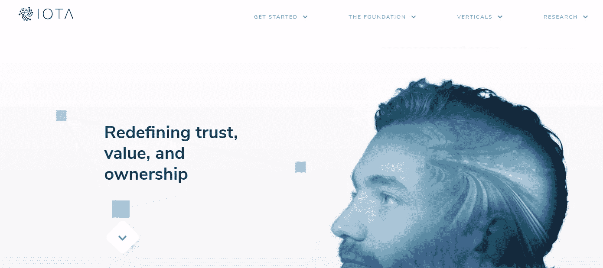
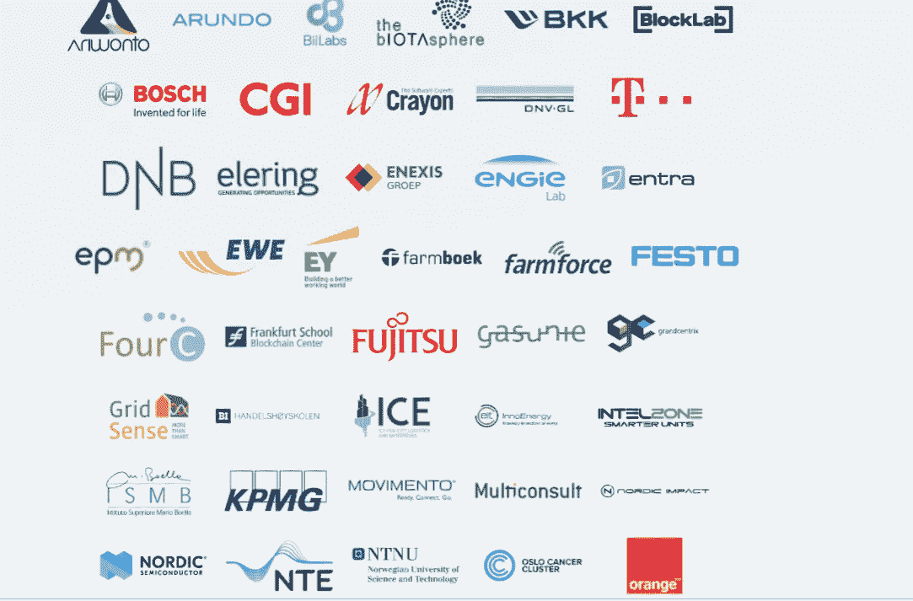
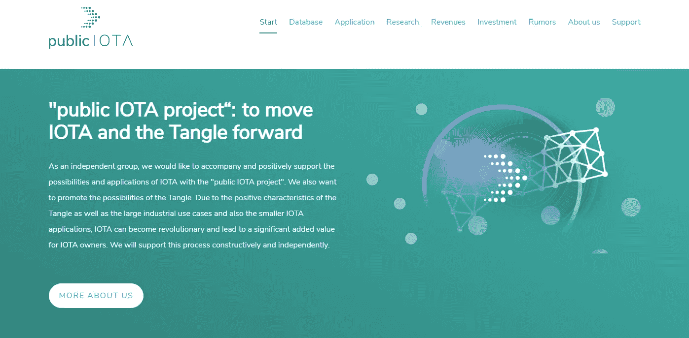
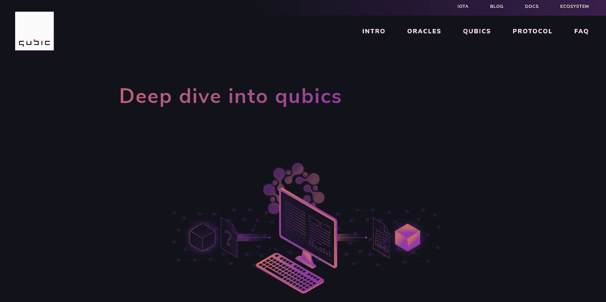
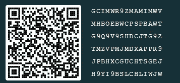

# 为什么 IOTA 成为全球标准…

> 原文：<https://medium.com/coinmonks/why-iota-becomes-the-global-standard-bf2576bb58ad?source=collection_archive---------2----------------------->

IOTA 仍然是一种非常年轻的加密货币，但与其他加密货币相比非常突出。这有许多原因，总之可以为全球标准铺平道路。全球标准意味着什么？那些没有和 IOTA 如此深入合作过的人会在这篇文章中找到很多答案。

> [在您的收件箱中直接获得最佳软件交易](https://coincodecap.com/?utm_source=coinmonks)

我们已经多次读到，在未来几年，数十亿台设备将相互通信并交换现金流。

物联网(IoT)中的设备联网正在快速发展。市场研究公司预计，全球联网设备预计将达到 84 亿台。这将比去年增加近三分之一。分析师预计，2020 年将有多达 200-500 亿台联网设备。很快就能找到这样的例子:

**汽车:**除了预计 2020 年将有 2.5 亿辆联网汽车上路之外，75%的新车将拥有互联网连接。汽车上的传感器数量将从目前的 60 个增加到 100 到 200 个。

[**智慧城市:**](http://publiciota.com/iota-and-smart-cities) 无论是智能城市、智能照明、智能处置还是类似领域，基础设施领域基本上都是关于传感器数据与来自联网基础设施和其他(通常是外部)数据源(如天气或交通数据)的信息的集成。

[**能源:**](/coinmonks/iota-allrounder-in-the-energy-transition-a53232e9fa55) 许多大型发电厂在未来很可能或多或少只有备用功能。无数的小型风力和光伏系统将越来越多地提供所需的电力，但它们需要以最佳方式协同工作，并相互共享数据。这将使能源转型成为有史以来最大的 IT 项目，只有与数字化相结合才能取得成功。因此，在这样一个系统中，支付流必须能够快速可靠地来回推送，数据传输量巨大。在未来，数百万生产者和消费者将需要实时交流，不仅共享信息，还共享数字价值。关于 IOTA 和 energy 的更多信息可以在这里找到。

**健康:**例如，成功治疗慢性疾病的关键措施之一是经常监测患者最重要的健康值。问题是去医院或检测中心的次数增加会影响患者的日常生活，增加治疗费用。这就是物联网解决方案的用武之地。一名慢性病患者可以配备多个联网的物联网设备。

**客户服务:**支持物联网的应用和产品具有集成的分析功能，可以帮助企业和组织了解客户如何使用他们的产品，并快速集成付费服务。这使得公司能够快速响应当前问题，将新的或额外的功能集成到他们的产品中，并最终积极影响客户体验。

# IOTA 提供了什么？

IOTA 可以为所有这些应用程序的数据和现金流提供积极的标准。以下是造成这种情况的一些主要原因:

**1。)IOTA 的优点**

有许多因素使 IOTA 变得有趣。总之，IOTA 在 5 个领域明显领先于其他加密货币:

*   交易率
*   可扩展性
*   小额支付的可行性
*   效率
*   可验证的操纵安全性

这些观点已经在其他地方被广泛讨论过了，它们与我在 2 分钟内解释的[相关联！](https://www.youtube.com/watch?v=ivWqqfzunhI)由[一切纠结](https://www.youtube.com/channel/UCQaOR_QLI2tGceGAp3ZWfQw)

**2。)IOTA 基金会**

IOTA 基金会由富有奉献精神和才华的个人组成，他们拥有良好的业绩记录，并努力完成任务。该基金会是 IOTA 背后事实上的公共组织。最近几个月，该基金会获得了大量引人注目的增长。IOTA 专注于长期创新、稳定和改进，而不是一个纯粹的投机对象。

IOTA Homepage [https://www.iota.org/](https://www.iota.org/)

**3。)生态系统**

IOTA 生态系统是一个由开发者、企业家、企业高管、政府官员、慈善家、业余爱好者和 IOTA 项目的一般贡献者组成的全球社区，是一个会面、协作、学习、启发、开发和构建的平台。

**4。)数据市场**

IOTA 基金会正在测试物联网(IoT)设备传感器数据的数字市场。该项目的参与者包括 50 多家知名公司。市场应该允许用户出售和购买传感器数据。

IOTA Data Merketplace: [https://data.iota.org](https://data.iota.org/#/)

根据 IOTA 基金会的公告中提到的麦肯锡研究，物联网设备生成的数据中只有 1%目前正在使用，99%未使用。因此，市场应该能够让其他人轻松访问这些未使用的数据。[有关智能数据的更多信息，请点击此处](/@markusgebhardt/how-iota-combined-with-smart-data-can-help-to-save-carbon-emissions-and-create-new-business-modells-5e3d4890f93d)

**5。)IOTA 社区和支持者**

IOTA 有一个非常强大的社区，这使得基金会和生态系统成为可能。这个社区是 IOTA 基金会和整个 IOTA 系统的真正支持和帮助。非常愿意帮助任何感兴趣的人。

IOTA [福音传道者网络](https://ien.io/)是一个独特的 IOTA 爱好者全球网络。IOTA 传播者是那些希望为 IOTA 技术建立足够数量的支持，并随后将 IOTA 确立为全球市场中的技术标准的人。这是一个真正独一无二的强大的全球网络。

除了 IOTA 社区之外，还出现了许多独立的支持者，他们在 IOTA 背后的想法和愿景上花了很多时间。在这种情况下，值得注意的是，其中有[纠结者](http://www.tangleblog.com/)、[公共 IOTA](http://publiciota.com/) 、[万物纠结者](https://www.youtube.com/channel/UCQaOR_QLI2tGceGAp3ZWfQw)，当然还有许多其他人。这些支持者是 IOTA 在基金会和社区之外的中坚力量。在此背景下，您还可以阅读文章[“独立“公共 IOTA 项目”的未来活动](/@markusgebhardt/future-activities-of-the-independent-public-iota-project-b48c3b371415)。

public IOTA Homepage [http://publiciota.com/](http://publiciota.com/)

**6。)强大的合作伙伴**

与其他加密货币和平台相比，IOTA 已经与多家公司合作。IOTA 的合作伙伴包括:富士通、大众、博世、联合国(项目厅)、DNB、MOBI、ICT、台北、DXC、迅达集团、Kontakt_io、InnoEnergy、Grandcentrix、Biilabs、Lattice80 和 Sopra Steria。有了这些伙伴关系，IOTA 就有了广泛的分布和实用性。欲了解更多信息，请阅读本文。

**7。)Qubic**

IOTA 社区期待已久的一个项目是 Qubic。通过 Qubic，IOTA 网络将成为一种超级计算机，IOTA Tangle 网络中的应用程序可以通过它来执行。这将使 Qubic 成为任何应用的分散平台。这将允许全新的商业模式发展。通过 Qubic，IOTA 将增加许多新功能:

*   智能合约:类似于以太坊，IOTA 将在 Qubic 版本中拥有智能合约。不过功能上要优于以太坊。欲了解更多信息，请阅读本文。
*   神谕:神谕也将作为 Qubic 的一部分成为 IOTA 网络的一部分。Oracles 允许访问 IOTA 网络中的外部数据。例如，可以使来自 IOTA 网络中的传感器的温度数据可用。可以想象，每个人都可以通过小额支付来获取数据。但是诸如股票价格或选举结果之类的其他数据源也可以在 IOTA 网络中获得。
*   计算能力的外包:有了 Qubic，将有可能把计算密集型的计算外包给不同的计算机。这具有特别的优势，即物联网设备可以非常便宜地制造。因为对于复杂的计算，计算可以很容易地通过量子网络外包。所以这些设备可以处理最少的计算能力。[欲了解更多信息，请阅读本文。](/@markusgebhardt/why-iota-qubics-outsourcing-computer-concept-is-becoming-revolutionary-87c93f0d3df7)

Website Qubic: [https://qubic.iota.org/qubics](https://qubic.iota.org/qubics)

**8。)量子证明**

IOTA 是量子证明，因为它使用了即使是四进制计算机也无法破解的加密技术。这被称为后量子密码。IOTA 使用 Winternitz 一次性签名过程。因此，IOTA 为未来做好了充分的准备。目前，全球的工作都是在量子计算机上进行的，一些大公司，如英特尔或谷歌也参与其中。这些加密货币是否会在 10 年或 15 年内上市仍不确定，但它会更早地给加密货币的特征蒙上阴影。

**IOTA 正走在一条非常好的道路上**

以上是 IOTA 成为巨星的几点。有了这个工具包，IOTA 在未来的几个月和几年里会变得越来越重要，并成为数十亿应用程序的全球标准协议。我相信 IOTA 在这方面走得很好。

## 你对咖啡和[公共 IOTA 项目](http://publiciota.com/)的支持

请记住，我们是一个独立的小团体，没有财务空间。我们感谢对这个项目的任何财政和其他援助。

一杯咖啡总是有助于让漫漫长夜变成美妙的夜晚，如果你喜欢我们的项目，我们很乐意得到你的支持！非常感谢！

我们的 IOTA 捐赠地址:gcimwr 9 zmamimwvmhboebwcpspbawtg 9 q 9v 9 shdcjtg 9 ztmzvpmjmdxappr 9 jpbhxcguchtsgejh 9 yi 9 bslchliwjw

“公共 IOTA 项目”不是 IOTA 基金会的一部分，也不与任何其他方式相联系，它是一个支持 IOTA 及其应用的独立项目。

联系人:info@publiciota.com

