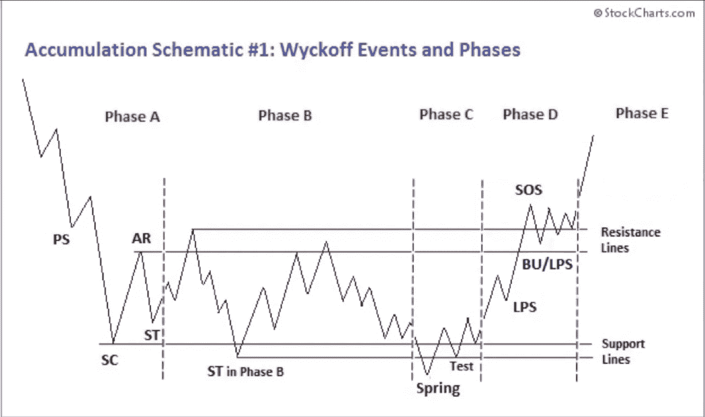
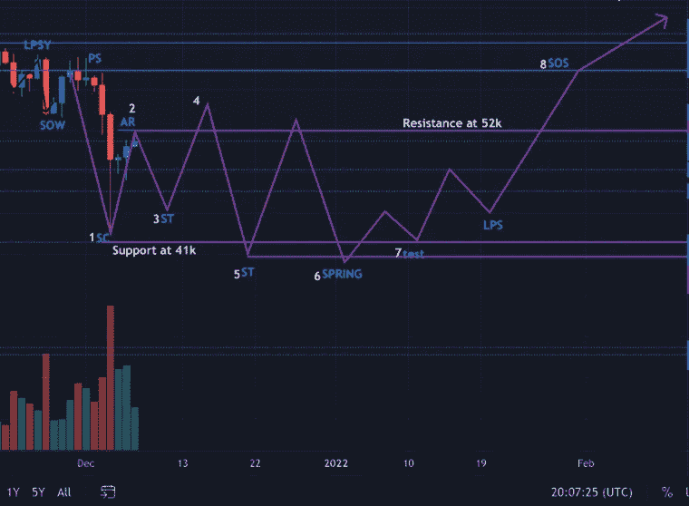
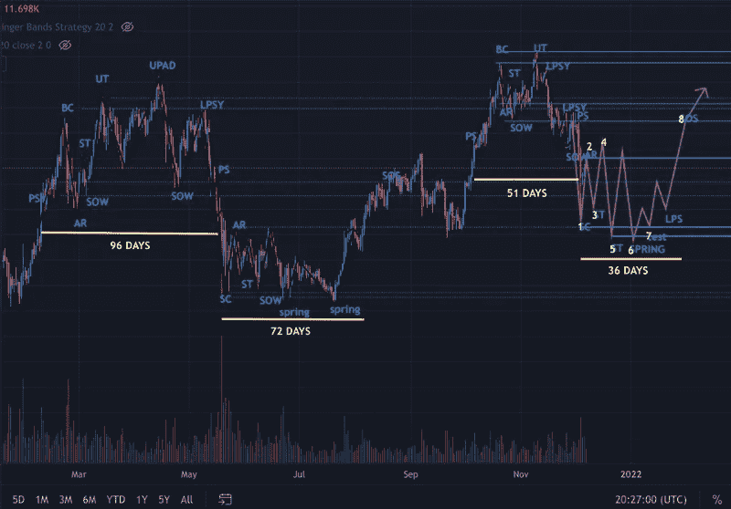

# 为什么 BTC 崩溃了？:威科夫积累

> 原文：<https://medium.com/coinmonks/why-is-btc-crashing-wyckoff-accumulation-4fc6d9b71263?source=collection_archive---------2----------------------->

尽管市场整体看涨，但比特币价格在过去几天一直在暴跌。本轮牛市与之前的周期非常不同。

一方面，总体而言，这次经济的宏观方面有所不同。由于疫情和飙升的通货膨胀，世界正在经历一个经济不确定的时期。另一方面，这次参与的玩家也不同。大型机构、加密巨鲸和亿万富翁一直在积极积累 BTC 并塑造价格。做到这一点的主要策略之一被称为“威科夫积累”。

威科夫累积图是由理查德·威科夫发明的，他是 20 世纪技术分析的先驱。

威科夫解释说，市场中的所有波动都应该被当作一个人操作的结果来研究，而“合成人”坐在幕后操纵市场，让处于不利地位的人获利。但是，如果你理解了他玩的游戏，你也可以享受到巨大的收益。

> 如果一个人理解了复合人的市场行为，他就能及早发现许多拖延和投资机会，并从中获利。

我们在比特币市场经历的所有价格波动都是由大利益集团操纵的。这就是事情的经过…

“Compisite Man”利用威科夫分销模式抬高价格，然后出售并收取利润。之后，他用威科夫累积图抛出价格，这样他就能以更低的价格回购头寸，获得更多的硬币。

现在，我们正在经历一个威科夫积累模式，在价格大幅上涨之前，大利益集团吸收了市场上的所有供应。

根据威科夫累积原理，价格下跌是由在价格上涨前建立资产头寸的机构操纵的。我认为我们刚刚经历了 10 月和 11 月的威科夫分布，现在我们正在进入威科夫积累阶段。

威科夫积累阶段有不同的阶段:1 .首先，我们经历了价格的大幅下跌(销售高潮，2。随后价格暴涨或回升(自动反弹)。接下来又是 3。价格下降(第二次测试)。接下来，4。又一次反弹发生，价格上涨，然后又是 5。第二次测试，可以把价格降到比销售高潮还低，还有一个春天。6.春季是这个图表中的最低价格水平，然而，不是每个威科夫积累都有一个。在最后一次转储之后，出现了以 7 为特征的恢复。最后一次测试阻力位和 8。力量的标志，高于阻力位，表明熊市结束。

接下来几周会发生什么…

支撑位由卖出高潮(SC)设定在 41k，所以我们可以预计第二次测试(st)和春季将低于该水平。阻力水平由自动反弹(AR)设定在 52k，所以我们可以预计在这个水平附近会有一个泵，在这个价格之上的力量迹象(SOS)将表明熊市已经结束。

这并不是这些示意图第一次应用于比特币市场。回到 2021 年 3 月至 6 月，同样的把戏上演了。

过去在 5 月份进行的威科夫分配需要 96 天才能完成，这次需要 51 天，时间框架几乎缩短了一半。在价格开始回升之前，过去的威科夫积累花了 72 天时间。如果我们遵循这一次时间框架将被减半的逻辑，这将意味着可能需要长达 36 天的积累才能发生(大约 1 月 5 日)。

此外，在过去的威科夫分布和累积示意图中，分布支撑位(48k)是随后累积阶段的下一个强势标志。如果这是准确的，这意味着这个积累期的下一个强势标志应该在 58k(这是最近分布的支撑位)。

因此，我们可以预计进程将在 55k 和 41k 之间保持振荡，但是它仍然可能会下降，因为我们错过了第二个测试/Spring 事件。尽管如此，我仍然非常看好 BTC。所以继续 HODLing，不要恐慌抛售！记住，我们仍然处于牛市中！！

> 加入 Coinmonks [电报频道](https://t.me/coincodecap)和 [Youtube 频道](https://www.youtube.com/c/coinmonks/videos)了解加密交易和投资

## 另外，阅读

*   [火币交易机器人](https://blog.coincodecap.com/huobi-trading-bot) | [如何购买 ADA](https://blog.coincodecap.com/buy-ada-cardano) | [Geco？一次回顾](https://blog.coincodecap.com/geco-one-review)
*   [币安 vs Bitstamp](https://blog.coincodecap.com/binance-vs-bitstamp) | [比特熊猫 vs 比特币基地 vs Coinsbit](https://blog.coincodecap.com/bitpanda-coinbase-coinsbit)
*   [如何购买 Ripple (XRP)](https://blog.coincodecap.com/buy-ripple-india) | [非洲最好的加密交易所](https://blog.coincodecap.com/crypto-exchange-africa)
*   [非洲最佳加密交易所](https://blog.coincodecap.com/crypto-exchange-africa) | [胡交易所评论](https://blog.coincodecap.com/hoo-exchange-review)
*   [eToro vs 罗宾汉](https://blog.coincodecap.com/etoro-robinhood)|[MoonXBT vs Bybit vs Bityard](https://blog.coincodecap.com/bybit-bityard-moonxbt)
*   [Stormgain 评论](https://blog.coincodecap.com/stormgain-review) | [Probit 评论](https://blog.coincodecap.com/probit-review) | [北海巨妖评论](/coinmonks/kraken-review-6165fc1056ac)
*   [如何在势不可挡的域名上购买域名？](https://blog.coincodecap.com/buy-domain-on-unstoppable-domains)
*   [印度的秘密税](https://blog.coincodecap.com/crypto-tax-india) | [altFINS 审查](https://blog.coincodecap.com/altfins-review) | [Prokey 审查](/coinmonks/prokey-review-26611173c13c)
*   [Blockfi vs 比特币基地](https://blog.coincodecap.com/blockfi-vs-coinbase) | [BitKan 评论](https://blog.coincodecap.com/bitkan-review) | [期货交易机器人](/coinmonks/futures-trading-bots-5a282ccee3f5)
*   [南非的加密交易所](https://blog.coincodecap.com/crypto-exchanges-in-south-africa) | [BitMEX 加密信号](https://blog.coincodecap.com/bitmex-crypto-signals)
*   如何在 WazirX 上购买柴犬(SHIB)硬币？
*   [MoonXBT 副本交易](https://blog.coincodecap.com/moonxbt-copy-trading) | [阿联酋的加密钱包](https://blog.coincodecap.com/crypto-wallets-in-uae)
*   [MoonXBT vs Bybit vs 币安](https://blog.coincodecap.com/bybit-binance-moonxbt) | [硬件钱包](/coinmonks/hardware-wallets-dfa1211730c6)
*   [雷米塔诺评论](https://blog.coincodecap.com/remitano-review)|[1 英寸协议指南](https://blog.coincodecap.com/1inch)
*   [买 PancakeSwap(蛋糕)](https://blog.coincodecap.com/buy-pancakeswap)|[matrix export Review](https://blog.coincodecap.com/matrixport-review)