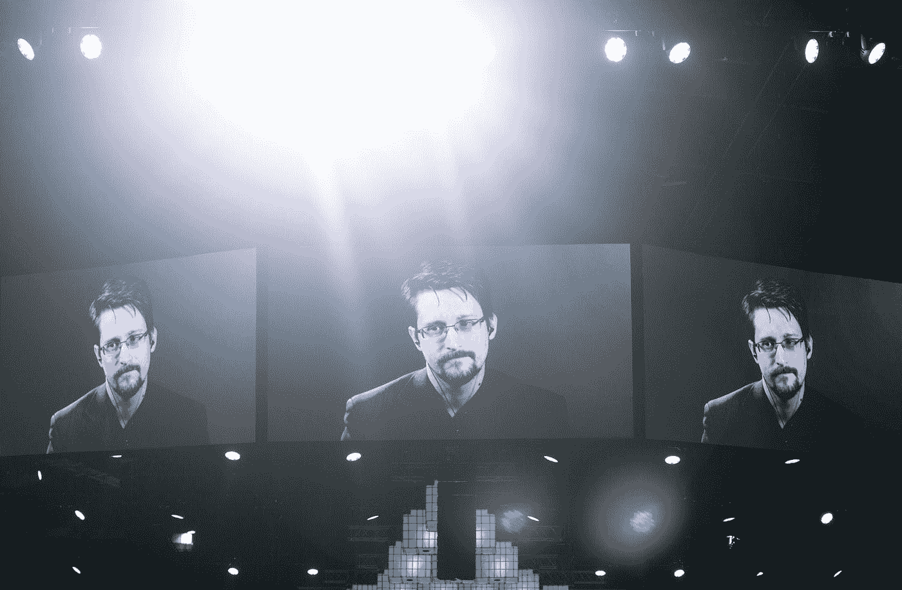

# 爱德华·斯诺登为什么要批评比特币生态系统？

> 原文：<https://medium.com/coinmonks/why-is-edward-snowden-criticizing-the-bitcoin-ecosystem-5b3c3c45e3d9?source=collection_archive---------1----------------------->

Photo by [Random Institute](https://unsplash.com/@randominstitute?utm_source=medium&utm_medium=referral) on [Unsplash](https://unsplash.com?utm_source=medium&utm_medium=referral)

告密者爱德华·斯诺登(Edward Snowden)批评比特币的“灾难性”隐私——以及比特币场景，为了财富，比特币场景已经看不到其最初的崇高目标。

爱德华·斯诺登是自 2013 年美国国家安全局泄密事件以来最典型的告密者，也是有史以来最著名的数字隐私活动家之一，他在一个虚拟的…