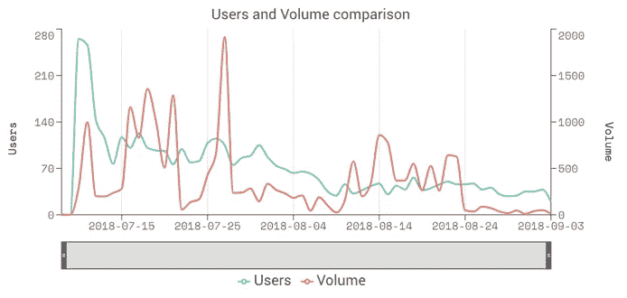
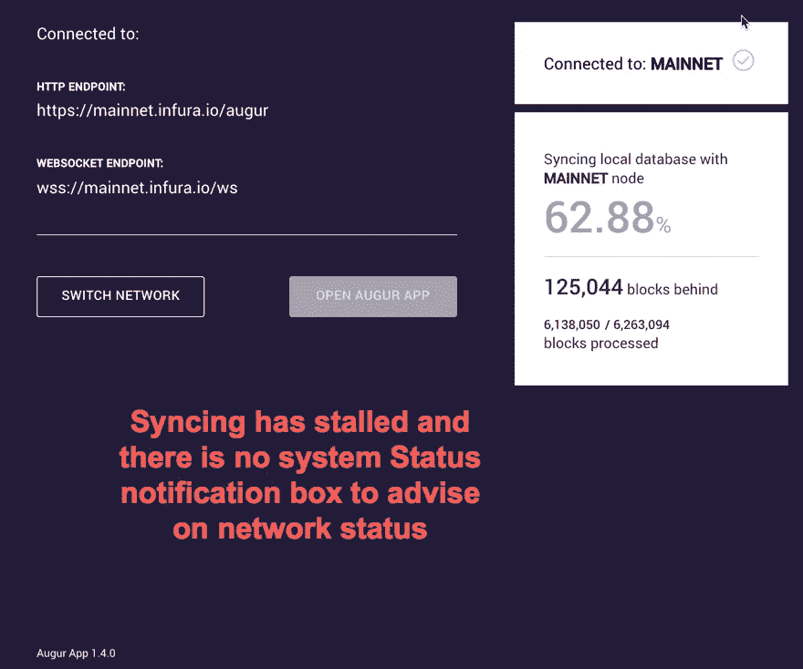

# 为什么没有人真的在用占卜？

> 原文：<https://medium.com/coinmonks/why-is-no-one-really-using-augur-161448a8e198?source=collection_archive---------2----------------------->

## 我使用平台的经验

Graph of Augur usage from dappradar

Augur 一直以来每天只有不到 50 个用户。对于一枚目前市值超过 2.2 亿美元的硬币来说，它没有达到许多人的预期。但是为什么会这样呢？这是预兆的错还是所有 DAPPs 都面临的普遍问题？

我对在区块链上开发预测市场平台感到非常兴奋，但当 Augur 推出时，我感到失望。我真的很想使用这个平台，但发现自己无法使用。我决定分析占卜，并分解我希望在区块链预测市场平台上看到改进的东西。

**我的角色背景:**

*   我定期在其他运动平台下注。特别是 NBA 博彩。在 NBA 赛季期间，我几乎每天都使用博彩平台。我不是一个大赌注者，更喜欢自发地快速下小赌注。总的来说，我每次访问平台平均花费 2-5 分钟。
*   自从我开始在银行工作以来，我一直在零售经纪平台上交易股票。时间框架大约是 15 年。
*   自 2015 年以来，我一直参与区块链，特别是以太坊区块链。
*   多年来，我使用了多个交易和赌博平台。

即使我有以上的经验，我仍然发现 Augur 平台不可用。我还没有在平台上进行第一笔交易。

作为一个小练习，我将使用我自己的个人资料和经验来评论 Augur 平台的具体领域。为了比较起见，我使用了其他没有重大问题的已发布的加密平台: **Iconomi** 、 **Cryptokitties** 、 **Gods Unchained、Metamask、** [**PoWH3D**](https://powh.io/) 甚至是诸如 **Etherdelta** 的加密交换平台。

# 我的痛点

归纳为 4 个主要类别:

## **1。可访问性**

*   你不能**只是登录一个网站**来访问占卜
*   您需要将**auger 应用程序**客户端下载到您的桌面
*   作为先决条件，你需要安装一个类似 Metamask 的**以太坊加密钱包**服务来与 Augur 交互。这增加了用户学习曲线的复杂性。Metamask 本身并不友好，但这是另一篇博文的主题。
*   你需要在你的 Metamask 钱包里有一个**乙醚平衡表**。如果你没有，你需要花汽油(目前约 0.20 美元)来转移一些。

**改进建议:**

DAPPs 仍然处于婴儿阶段，需要大量的进步才能被大规模用户采用。应用程序和 DAPPs 之间的主要问题是，应用程序可以直接下载到你的设备上并立即使用。有了 DAPPs，以及它们与区块链连接的性质，你需要通过跳圈来进行交易。

我们可以通过复制我们的智能手机/桌面操作系统的生态系统来解决这个问题。你已经有了一个账户。在您下载 DAPPs 之前，您已经设置了带有余额的加密钱包。操作系统连接到区块链，就像我们的手机总是连接到互联网一样。当你下载并安装 DAPP 后，它就可以运行了。

这不仅是奥格面临的问题，也是所有 DAPPs 面临的问题。以太坊开发社区可以发起一个协作努力来建立这样一个服务。

我见过比特币基地钱包，但它更像是 DAPPs 的网络用户界面浏览器。我希望它们发展成我所描述的那样，与 DAPPs 无缝集成。

## 2.时间

*   启动 Augur 花费的时间太长，而且非常不稳定。即使在正常情况下，光是获得访问权限就需要 **30 分钟到一个小时**。

**改进:**

我已经尝试访问了 3 个小时的预兆，但没有运气。网络上没有通知，我不知道还要等多久。团队之间的简单交流有助于改善网络状态。

## 3.设计

*   对于普通用户来说，UI 过于复杂。

**改进:**

考虑不同用户的平台复杂程度。提供一个**基本和高级 UI** 选项。这些选项在大多数大型加密交易平台上都已经存在。

当前的 Augur 界面已经非常复杂，很可能属于高级选项。可以开发另一个轻量级的基本版本。

## 4.选择

*   可押注的有限预测市场。

**改进**:

当在一个正规的赌博平台上已经有许多市场建立，这是一个简单的练习，浏览那里有什么，并作出赌注。有了预兆就有了做市商的概念。平台依靠做市商创造市场。做市商的动机是什么？我相信他们能够在他们创造的市场上收取%的费用，但是我不认为这些广告宣传得很清楚。

博彩市场是博彩平台的重要组成部分。赌客自然会被那些为他们提供最佳赔率的平台所吸引。没有市场，赌客就不会来。

在 Augur 推出的早期，可能会有更好的活动激励措施来吸引做市商。奖励奖赏可能是代表代币的形式。

## 5.费用

*   **每次你想通过区块链以太坊进行交易，都需要支付燃气费**。奥格是使用智能合约构建的，因此无论何时进行预测，都会产生相关的成本。煤气费用不是微不足道的，目前使用以太坊区块链非常昂贵。我最近为一笔交易支付了**0.20 美元**。
*   包括汽油费和佣金在内的预测费用**很昂贵**。当区块链的一个主要卖点是降低成本，但实际上恰恰相反时，那就大错特错了。

**改进:**

**缩放**对于包括以太坊在内的许多区块链来说是最高优先级的项目。在扩展问题得到解决之前，费用仍将居高不下。然而，没有关于何时实施扩展解决方案的明确日期，这将继续是一个采用预兆的问题。不幸的是，所有的 DAPPs 都遇到了同样的问题，高昂的费用阻止了进一步的使用。

# 早期

我仍然对奥格抱有希望，我确信车队正在努力改进。我肯定会在未来使用占卜，但最有可能的是在许多版本升级之后。这些问题主要是由以太坊区块链当前形式的局限性引起的。缩放是主要的一个。

我知道我们需要让我们的期望与 DAPPs 保持一致。我知道区块链将会是革命性的，但我们显然仍处于起步阶段。

要想大量采用 DAPPs，还需要发生更多与生态系统相关的变化。