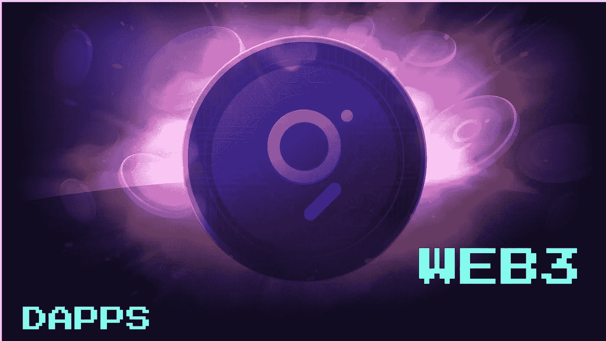
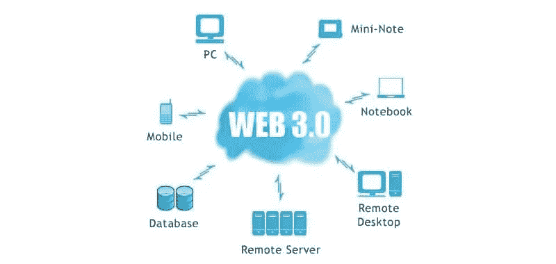

# 为什么图表对 Web3 至关重要？

> 原文：<https://medium.com/coinmonks/why-is-the-graph-critical-to-web3-4fb6ed438e6?source=collection_archive---------4----------------------->

最近在加密社区中有很多关于 Web3 的讨论；一个提议的分散式服务器系统将处理集中式 Web 2.0 的不规则性。多年来，web 应用程序的集中化引起了争议，因为一些中央机构利用这些系统的缺陷来垄断应用程序，从而使许多 web 2.0 用户难以享受可靠性，而不受集中式专有用户对用户的限制。我们也不能忘记，这些中央系统也是掠夺性的，大多数时候是以平台用户为代价的。

Web3 带来了什么？

来自世界各地的开发人员不仅可以一起工作来分享想法，还可以为可互操作的开源代码和数据的可持续性建立网络，这些代码和数据是创建不断增长的分布式应用程序生态系统(DApps)所必需的，这些应用程序是与集中式应用程序进行有效竞争所必需的。有了 Web3，分散的应用程序将比集中的和独占的应用程序更有优势。以下是 Web3 带来的一些特性:

## **互通**

这使得 DApps 之间的无缝切换和运行变得更加容易。

## **数据和身份所有权**

众所周知，集中式系统会在背后获取用户的私人数据，这表明用户并不完全拥有自己的身份、声誉和数据。然而，使用 DApps 和 Web3 协议，用户可以完全控制他们的数据和身份。

## **安全**

默认情况下，区块链技术是不可变的、分散的和加密的。这使得不良行为者很难获得用户数据，从而使私人数据不可能被获取，就像一些集中式社交媒体平台的情况一样，在用户不知情的情况下，用户数据被获取用于利润和其他目的。

## **可靠性**

Web3 协议有望继续运行到无限期，同时进行扩展并为改进留出空间。此外，它的稳定性使它成为目前我们所拥有的中央系统的可靠替代品。

## **治理**

想象一下，规则不仅是透明的，而且是由人民创造和执行的。这意味着，没有一个人对另一个人有权力，这是分散系统的许多优点之一。

## **钱**

这将是一个创建去中心化应用的良好平台，这些应用将有助于金融合同和可编程或数字货币的功能。

## **图在这一切中的重要性**

图形网络是作为一种协议创建的，以促进分散应用程序的功能。它的产品之一是 Graph，这是一个去中心化的索引和查询协议，带有一个全球性的 API。有趣的是，Graph Network 从一开始就一直在进行一系列的测试，它将在 2020 年结束前在 mainnet 上推出。mainnet 的发布将会看到平台的 GRT 令牌和协议合同被发送到以太坊 mainnet 进行处理和执行。当发布发生时，索引奖励将给予索引器作为查询得到处理。索引器也将开始赚取查询费。

有些人可能想知道 Graph 和 Web3 之间的关系，这很简单。基本上，该图是一个具有分散能力的索引协议，它是 Web3 的一个组成部分，考虑到它是提供无缝分散应用程序(DApps)所需的一个重要补充，对于使用它们的任何人来说都是有效的，特别是在它们的集中版本上。

想法是有一个全栈索引和查询平台，这是分散的，图开始发挥作用，作为一个分散的互联网应用的推动者，将完全由公共基础设施促进。有了一个完全分散的系统，易受故障影响的应用程序将克服它们的挑战，并享受更好的互操作性。开发人员和用户都将受到保护，免受影响集中式系统的常见违规行为的影响。

Graph Network 的目标之一是提供一个分散式网络，为分散式应用程序(DApps)带来活力，并确保网络参与者和贡献者受到激励。为了实现这一点，协议将考虑不知疲倦地工作以确保始终提供最佳服务的节点操作符或索引器、负责子图上使用的信号和数据的准确组织的管理员、以及负责在图上创建 DApps 的开发者，并且还肩负着确保查询量被驱动到协议网络的责任。

Web3 是独立运行的不同组件和协议的组合，以提供网络内 DApps 的无缝分散操作，并且考虑到索引和查询是交换数据和信息的任何系统的重要部分，图形是其核心功能之一。有了 graph 提供的完整的索引和查询系统，用户就可以确保从查询中获得顶级的结果。

在追求高效、高效、可靠的互联网的过程中，Web3 具备了实现这一目标的一切条件。Web3 最令人兴奋的一点是，当数据通过不同的点进行传输时，它们会在网络上进行处理和存储，而网络不仅是开源的，而且是透明的，具有可验证的可靠性和完整性。如果您知道 Graph 的作用是确保用户能够以安全、可靠和快速的方式轻松地查询数据，那么事情就会变得更加有趣。

目前，开发人员正在竭尽全力为所谓的下一级分散式应用程序提供令人惊叹的能力，这种能力将超过用户在与集中式应用程序交互时的通常预期。可以有把握地说，未来已经加快，并且比预期和预期更快地到来。Graph 和 Web3 是具有惊人能力的未来派协议，互联网用户会很高兴拥有并使用它们。

> ***有用的环节:***

[走势图](https://thegraph.com/)

[图形浏览器](https://thegraph.com/explorer/)

[博客](https://thegraph.com/blog/)

[文件](https://thegraph.com/docs/introduction)

[Github](https://github.com/graphprotocol)

[Twitter](https://twitter.com/graphprotocol)

[电报](https://t.me/graphprotocol)

[Reddit](https://www.reddit.com/r/thegraph/)

## 此外，请阅读

*   [加密交易机器人](/coinmonks/crypto-trading-bot-c2ffce8acb2a)
*   [Uniswap API](https://bitquery.io/blog/uniswap-pool-api)——如何获取 unis WAP 数据？
*   [AAX 交易所点评](/coinmonks/aax-exchange-review-2021-67c5ea09330c) |推荐代码、交易费、利弊
*   [衍生工具回顾](/coinmonks/deribit-review-options-fees-apis-and-testnet-2ca16c4bbdb2) |期权、费用、API 和 Testnet
*   [FTX 数字货币交易回顾](/coinmonks/ftx-crypto-exchange-review-53664ac1198f)
*   [bit 交易所点评](/coinmonks/bybit-exchange-review-dbd570019b71)
*   最佳比特币[硬件钱包](/coinmonks/the-best-cryptocurrency-hardware-wallets-of-2020-e28b1c124069?source=friends_link&sk=324dd9ff8556ab578d71e7ad7658ad7c)
*   [密码本交易平台](/coinmonks/top-10-crypto-copy-trading-platforms-for-beginners-d0c37c7d698c)
*   [Bitsgap vs 3 commas vs quad ency](https://blog.coincodecap.com/bitsgap-3commas-quadency)
*   最好的[加密税务软件](/coinmonks/best-crypto-tax-tool-for-my-money-72d4b430816b)
*   [最佳加密交易平台](/coinmonks/the-best-crypto-trading-platforms-in-2020-the-definitive-guide-updated-c72f8b874555)
*   最佳[加密贷款平台](/coinmonks/top-5-crypto-lending-platforms-in-2020-that-you-need-to-know-a1b675cec3fa)
*   [莱杰 Nano S vs 特雷佐 one vs 特雷佐 T vs 莱杰 Nano X](https://blog.coincodecap.com/ledger-nano-s-vs-trezor-one-ledger-nano-x-trezor-t)
*   [block fi vs Celsius](/coinmonks/blockfi-vs-celsius-vs-hodlnaut-8a1cc8c26630)vs Hodlnaut
*   [bits gap review](/coinmonks/bitsgap-review-a-crypto-trading-bot-that-makes-easy-money-a5d88a336df2)——一个轻松赚钱的加密交易机器人
*   为专业人士设计的加密交易机器人
*   [PrimeXBT 审查](/coinmonks/primexbt-review-88e0815be858) |杠杆交易、费用和交易
*   [Altrady 评论](https://blog.coincodecap.com/altrady-reivew)
*   [埃利帕尔泰坦评论](/coinmonks/ellipal-titan-review-85e9071dd029)
*   [赛克斯石评论](https://blog.coincodecap.com/secux-stone-hardware-wallet-review)
*   [BlockFi 评论](/coinmonks/blockfi-review-53096053c097) |赚取高达 8.6%的加密利息
*   开发人员的最佳加密 API
*   [最佳区块链分析工具](https://bitquery.io/blog/best-blockchain-analysis-tools-and-software)
*   [加密套利](/coinmonks/crypto-arbitrage-guide-how-to-make-money-as-a-beginner-62bfe5c868f6)指南:新手如何赚钱
*   顶级[比特币节点](https://blog.coincodecap.com/bitcoin-node-solutions)提供商
*   最佳[加密制图工具](/coinmonks/what-are-the-best-charting-platforms-for-cryptocurrency-trading-85aade584d80)
*   了解比特币的[最佳书籍有哪些？](/coinmonks/what-are-the-best-books-to-learn-bitcoin-409aeb9aff4b)

> [在您的收件箱中直接获得最佳软件交易](/coinmonks/newsletters/coinmonks)

