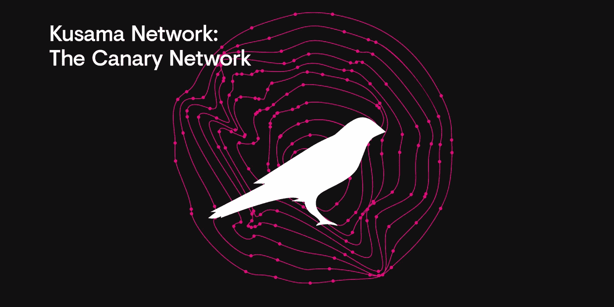

# 为什么草间弥生是目前最被低估的硬币之一！

> 原文：<https://medium.com/coinmonks/why-kusama-is-one-of-the-most-undervalued-coins-right-now-4919b87db19a?source=collection_archive---------1----------------------->

草间弥生被认为是波尔卡多特的野生近亲。它最初是波尔卡多特的实验网络。最初的意图是使用 Kusama 来早期部署可能未经审计的代码，并且更快地移动。草间弥生比波尔卡多特快 4 倍。然而，草间弥生从那时起已经走了很长一段路。这两个网络有足够的分歧，可以被认为是独立的链。慢慢地，事实证明这两种网络可能有两种不同的用途。

Polkadot 更适合于企业网络和需要更多安全性的网络，如分散式金融。可以说，它也更抗虫。草间弥生更能抵抗审查，更艺术，更适合网络朋克。记住这一点，我们可以看到这两个网络都不是绝对的，它们将相互补充。Blockahin 目前的两大服务支柱是分散金融和不可替代的代币。分散融资将走向 Polkadot，NFTs 将走向 Kusama。

这仅仅意味着，尽管是两个独立的网络，草间弥生仍然处于波尔卡多特的阴影之下。此外，加文伍德不做炒作营销。(在最近的一次 AMA 中，IOHK 首席执行官 Charles Hoskinson 表示，当以太坊的最初创始人分离时，Gavin 和 Vitalik 都代表着技术和价值观，而不是引入企业监督。)

即将到来的 parachain 拍卖是 2021 年的顶级活动之一。草间弥生 Parachain 拍卖将会比波尔卡多更早发生。像加瑠罗(Acala 在草间弥生网络中的姐妹项目)这样的重要项目正在草间弥生启动，然后将被连接到 Polkadot 网络。此外，像 RMRK 这样的 NFT 项目也计划留在草间弥生。我不认为很多人理解这一点。我看到人们仍然在努力创建一个 polkadot.js 钱包，并让他们的草间弥生转移。

知识曲线很高，但人们最终会到达那里，网络中有活跃的人员流动。

人们还需要理解的是，像加瑠罗这样的项目并不是通过 IDO 等来发布令牌的。代币将奖励给那些将草间弥生与代币联系在一起的人。这将有助于他们赢得 parachain 拍卖。

## **草间弥生副链**

草间弥生是一个有真实经济激励的活网络。这有两个主要目的。它将成为副链的另一个试验场。社区可以观察网络效果并进行测试和升级。这将有助于他们在 Polkadot Parachain 拍卖期间做好准备。对于草间弥生的专属项目，是时候赢得 parachain 或成为 parathread 了。草间弥生政府将发挥重要作用。它将首先投票启用 parachain 功能。然后，它将投票开始槽拍卖。

## 副链槽拍卖

草间弥生将进行未经许可的蜡烛拍卖。蜡烛拍卖是竞标者提交更高价格的拍卖。拍卖结束时出价最高的人将赢得它。拍卖的结束时间将由一个随机产生的数字决定。从第一次拍卖开始，拍卖将继续滚动进行。拍卖之间会有大约 2 周的间隔。拍卖中胜出的副链将在其租赁期开始时部署到网络中。

这表明草间弥生拍卖将与波尔卡多特拍卖具有相同的内在价值。他们将遵循相同的原则，强度和重点将是相同的，如果不是更多。此外，草间弥生快 4 倍。是的，作为第一次拍卖，有失败的可能，但是，相关的回报是非常高的。与波尔卡多特相比，草间弥生目前的市值被严重低估。通过购买这种被低估的硬币并将它们与项目绑定，您可以轻松获得项目的原生令牌作为奖励。

在我的下一篇文章中，我将谈论阿卡拉(草间弥生的加瑠罗)计划如何在草间弥生上船。

**阅读上一篇:** [如何玩黑暗森林，zkSNARK powered MMO 游戏—第一部分](https://tulip311bit.medium.com/how-to-play-dark-forest-the-zksnark-powered-mmo-game-part-1-7222e2c3ab4)

***注:*** *本帖最初发表于* [*此处*](https://www.voice.com/post/@tulip/why-kusama-is-one-of-the-most-undervalued-coins-right-now-1614353318-332202131) *为与 voice.com 联合的密码作者。*

**通过我的推荐加入**

[Crypto.com](https://binance.com/en/register?ref=E8PCD3AF)——[币安](https://platinum.crypto.com/r/sut3pd9bzn)

跟我来

**👉** [推特](https://twitter.com/rumadas123)

**👉**[**Linkedin**](https://www.linkedin.com/in/ruma-das-a1439320/)

> **加入 coin monks[Telegram group](https://t.me/joinchat/EPmjKpNYwRMsBI4p)学习加密交易和投资**

## **另外，阅读**

*   **最好的[密码交易机器人](/coinmonks/crypto-trading-bot-c2ffce8acb2a) | [网格交易](https://blog.coincodecap.com/grid-trading)**
*   **[3 商业评论](/coinmonks/3commas-review-an-excellent-crypto-trading-bot-2020-1313a58bec92) | [Pionex 评论](/coinmonks/pionex-review-exchange-with-crypto-trading-bot-1e459d0191ea) | [Coinrule 评论](/coinmonks/coinrule-review-2021-a-beginner-friendly-crypto-trading-bot-daf0504848ba)**
*   **[AAX 交易所评论](/coinmonks/aax-exchange-review-2021-67c5ea09330c) | [德里比特评论](/coinmonks/deribit-review-options-fees-apis-and-testnet-2ca16c4bbdb2) | [FTX 交易所评论](/coinmonks/ftx-crypto-exchange-review-53664ac1198f)**
*   **[n rave ZERO Review](/coinmonks/ngrave-zero-review-c465cf8307fc)|[phe MEX Review](/coinmonks/phemex-review-4cfba0b49e28)|[PrimeXBT Review](/coinmonks/primexbt-review-88e0815be858)**
*   **[by bit Exchange Review](/coinmonks/bybit-exchange-review-dbd570019b71)|[bit yard Review](/coinmonks/bityard-review-7d104239be35)|[coin spot Review](https://blog.coincodecap.com/coinspot-review)**
*   **[3 commas vs crypto hopper](/coinmonks/3commas-vs-pionex-vs-cryptohopper-best-crypto-bot-6a98d2baa203)|[赚取秘密利息](/coinmonks/earn-crypto-interest-b10b810fdda3)**
*   **最好的比特币[硬件钱包](/coinmonks/the-best-cryptocurrency-hardware-wallets-of-2020-e28b1c124069?source=friends_link&sk=324dd9ff8556ab578d71e7ad7658ad7c) | [BitBox02 回顾](/coinmonks/bitbox02-review-your-swiss-bitcoin-hardware-wallet-c36c88fff29)**
*   **[莱杰 vs n rave](/coinmonks/ledger-vs-ngrave-zero-7e40f0c1d694)|[莱杰 nano s vs x](/coinmonks/ledger-nano-s-vs-x-battery-hardware-price-storage-59a6663fe3b0)**
*   **[密码本交易平台](/coinmonks/top-10-crypto-copy-trading-platforms-for-beginners-d0c37c7d698c)**
*   **[Vauld Review](/coinmonks/vauld-review-2021-lend-trade-and-buy-bitcoin-in-india-e37a96374961)|[you hodler Review](/coinmonks/youhodler-4-easy-ways-to-make-money-98969b9689f2)|[BlockFi Review](/coinmonks/blockfi-review-53096053c097)**
*   **最好的[加密税务软件](/coinmonks/best-crypto-tax-tool-for-my-money-72d4b430816b) | [硬币追踪评论](/coinmonks/cointracking-review-a-reliable-cryptocurrency-tax-software-5114e3eb5737)**
*   **最佳[密码借贷平台](/coinmonks/top-5-crypto-lending-platforms-in-2020-that-you-need-to-know-a1b675cec3fa) | [杠杆令牌](/coinmonks/leveraged-token-3f5257808b22)**
*   **[block fi vs Celsius](/coinmonks/blockfi-vs-celsius-vs-hodlnaut-8a1cc8c26630)|[Hodlnaut Review](/coinmonks/hodlnaut-review-best-way-to-hodl-is-to-earn-interest-on-your-bitcoin-6658a8c19edf)**
*   **[Bitsgap 审查](/coinmonks/bitsgap-review-a-crypto-trading-bot-that-makes-easy-money-a5d88a336df2) | [Quadency 审查](/coinmonks/quadency-review-a-crypto-trading-automation-platform-3068eaa374e1) | [Bitbns 审查](/coinmonks/bitbns-review-38256a07e161)**
*   **[埃利帕尔泰坦评论](/coinmonks/ellipal-titan-review-85e9071dd029) | [赛克斯斯通评论](/coinmonks/secux-stone-hardware-wallet-review-15-discount-coupon-2020-7577032faa6e)**
*   **[本地比特币评论](/coinmonks/localbitcoins-review-6cc001c6ed56)**
*   **最佳[区块链分析](https://bitquery.io/blog/best-blockchain-analysis-tools-and-software)工具| [赚比特币](/coinmonks/earn-bitcoin-6e8bd3c592d9)**
*   **[加密套利](/coinmonks/crypto-arbitrage-guide-how-to-make-money-as-a-beginner-62bfe5c868f6)指南| [如何做空比特币](/coinmonks/how-to-short-bitcoin-568a2d0b4ae5)**
*   **最佳[加密制图工具](/coinmonks/what-are-the-best-charting-platforms-for-cryptocurrency-trading-85aade584d80) | [最佳加密交易所](/coinmonks/crypto-exchange-dd2f9d6f3769)**
*   **[如何在印度购买比特币？](/coinmonks/buy-bitcoin-in-india-feb50ddfef94) | [瓦济克斯审查](/coinmonks/wazirx-review-5c811b074f5b)**
*   **[印度比特币交易所](/coinmonks/bitcoin-exchange-in-india-7f1fe79715c9) | [比特币储蓄账户](/coinmonks/bitcoin-savings-account-e65b13f92451)**
*   **[CoinDCX 评论](/coinmonks/coindcx-review-8444db3621a2)**

**包括附属链接**

> **[在您的收件箱中直接获得最佳软件交易](/coinmonks/newsletters/coinmonks)**

****