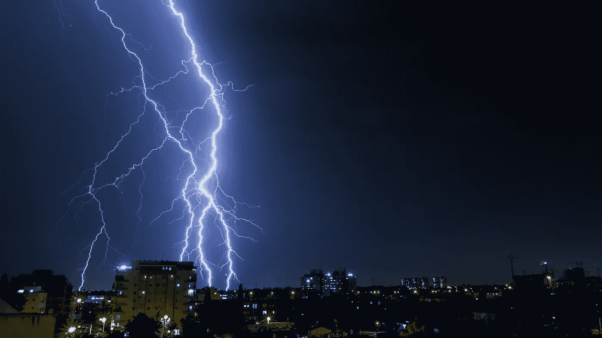

# 为什么⚡Lightning Network⚡毫无意义😱

> 原文：<https://medium.com/coinmonks/why-lightning-network-makes-no-sense-39ca172f50d1?source=collection_archive---------0----------------------->

Photo by [Yoav Aziz](https://unsplash.com/photos/Cnnv8oJ9YCU?utm_source=unsplash&utm_medium=referral&utm_content=creditCopyText) on [Unsplash](https://unsplash.com/search/photos/lightning?utm_source=unsplash&utm_medium=referral&utm_content=creditCopyText)

我对闪电网络的试验越多，我就越确信:这是一个针对错误问题的很好的技术解决方案。

原因如下。

# 什么是闪电网络

根据[https://Lightning . Network/](https://lightning.network/)的说法，Lightning network 的目标是使用**双向支付渠道的**网络**，以极低的**费用实现**可扩展的即时支付。**

这是我们需要的吗？

# 闪电网络是如何工作的

如果你是这个概念的新手，你可以阅读我以前的文章《[比特币闪电网络:在家里运行你的节点以获得乐趣和(无)利润⚡》中的内容🤑](/coinmonks/bitcoin-lightning-network-run-your-node-at-home-for-fun-and-no-profit-da5b61be2ba9)”，但这里有一个超级快速的回顾。

在更简单的解释中，我们有 Alice 和 Bob，他们打开一个通道，来回进行几次链外交易**。然后 Bob 打开了与 Charlie 的通道，Charlie 打开了与 Dave 的通道:现在 Alice 可以与 Dave 来回进行交易，而无需与他建立直接通道。**

**太棒了，不是吗？**

# **现实生活是如何运作的**

**现在，花些时间想想你的真实生活:你和别人以瞬间的速度来回交换了多少次钱？(注意重点在*来回*和*瞬间)***

**如果你问我，在我的日常生活中，我不会和任何人来回换钱:**

*   **我早上买早餐，但是酒吧老板不会从我这里买东西回来。**
*   **我在餐馆付了午餐费，但店主不会从我这里买东西回来。**
*   **我在超市或零售店购物，但是他们不从我这里买东西。**

**所有“b2c”交易都是单向的。**

**有人可能会说，零售商店需要从某种供应商那里购买商品和服务，所以他们可以使用 LN。让我们称那些交易为“b2b 交易”。同样，根据我的观点，在 b2b 交易中，资金也是单向流动的，从零售店流向供应商。**

**有人可能会说，经济是“循环的”，所以最终，在涉及零售商、供应商、政府等的几次交易之后..这些钱将通过“最终用户”的工资流回他们手中。**

**我的观点是:对于那些交易，我们需要**即时**交易吗？**

**和今天一样，b2b 支付交易本质上是延迟的:供应商提前或可能在 30 天后得到付款，但不是立即得到。低“足够”的费用和快速“足够”的交易是我们所需要的，任何具有这些功能的加密货币都可以完成这项工作。**

**在现实生活中，我们需要可扩展的、即时的、几乎零费用的单向渠道，从零售用户到商家转移资金。**

**闪电网络正在建立一个点对点经济的解决方案，爱丽丝和鲍勃在**双向**渠道:**闪电网络正在解决错误的问题。****

# **更多证据**

**你是商人吗？您是否考虑通过照明网络接受付款？再想想…**

**要收钱，你需要入站能力，所以你需要说服别人跟你开通道。你可以打开所有你想要的频道，但是如果你没有入站频道，你就不能收到付款。**

**这不是一件容易的工作。**

**是的，这个问题有几个“解决方案”，但是我们需要一些解决方案或变通方法来使商家能够收到付款，这一事实清楚地表明 LN 的设计是有缺陷的:**它无法解决它存在的主要用例。****

**让我们来看看涉及照明网络的有前途的发展:原子交换、原子多路径支付、环路、蹦床支付、Turbo 信道…都试图解决两个基本问题:**

*   **没有已知的算法能够将给定进口的付款从一个任意节点可靠地发送到另一个任意节点。**
*   **网络使用得越多，最终用户向零售商转移的余额就越多，找到支付途径的几率就越低。**

**但我相信人类的想象力和创造力，所以让我们假设我们以分散的方式解决了(但无法解决的)从一个节点到另一个节点(在一百万节点的网络中)的可用路由的问题，找到具有足够入站容量进行支付的路由的问题，以有效的方式重新平衡渠道的问题，以及所有保持网络“分散”的问题。还有一件事我不明白:**运营一个照明网络节点的经济动机是什么？****

**路由费用设计得非常低:LNBig.com 的所有者(目前是容量最高的节点)在 [reddit](https://www.reddit.com/r/Bitcoin/comments/al2wok/the_lnbig_network_earned_from_29_december_2018_to/) 上宣布，他在 2019 年 1 月赚了 5.74 美元。因此，他免费管理 20 个节点，或者说亏本管理，因为他需要支付服务器费用(电力、网络连接……)。从长远来看，这显然不可持续。**

**此外，他在渠道中“锁定”了几个比特币，**几十万**美元，而他可以用它们赚取某种形式的利息(使用借贷机器人、复利、达摩……)**

# **请把西红柿扔给我**

**我想听听你对这个话题的看法，请让我相信我错了:我想继续相信未来是光明的！**

> **[在您的收件箱中直接获得最佳软件交易](https://coincodecap.com/?utm_source=coinmonks)**

****