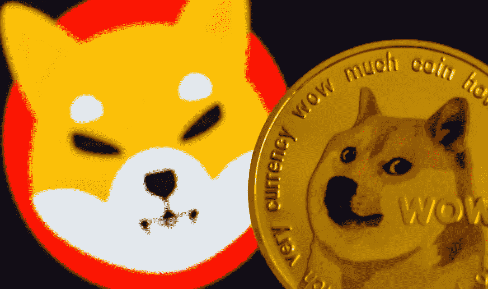
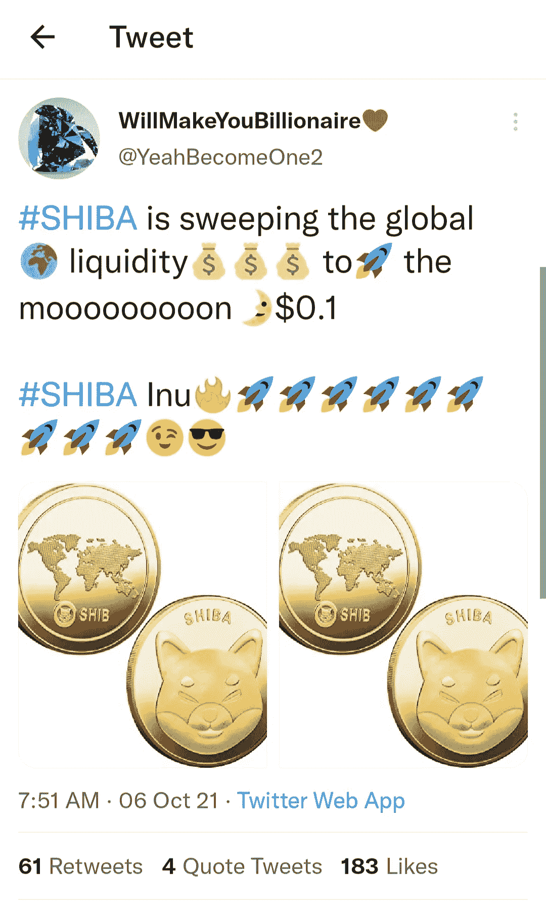
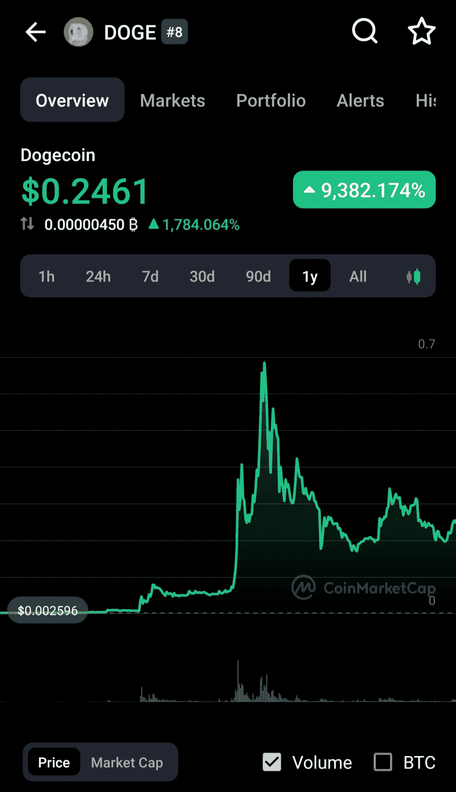
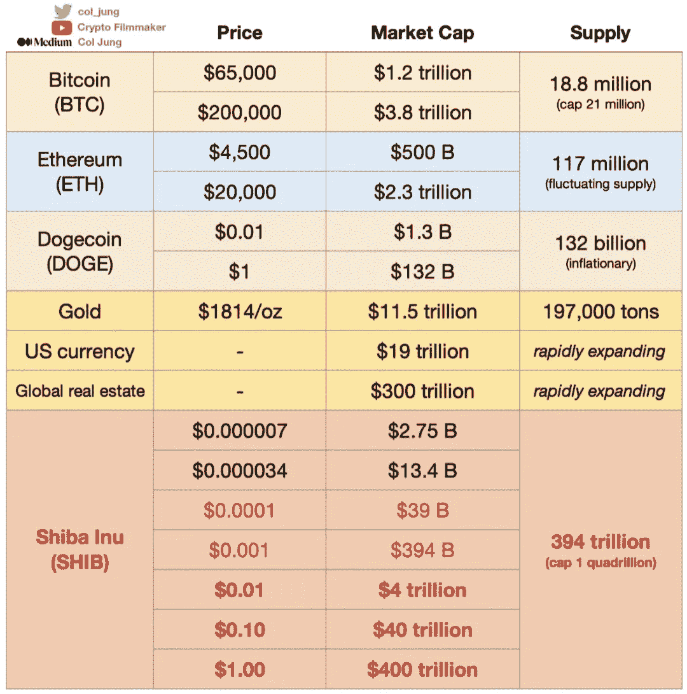

# 为什么柴犬这样的迷因币对 Crypto 不好！

> 原文：<https://medium.com/coinmonks/why-meme-coins-like-shiba-inu-are-bad-for-crypto-3e11478965bb?source=collection_archive---------3----------------------->

过去一周，许多百万富翁可能是通过购买柴犬赚来的。我可以看到他们现在正在检查他们的账户，说“SHIB 到月球！”。此外，认为这是 Dogecoin 杀手，我要去 HODL(坚持住，亲爱的生活)，直到一美元。他们将幻灭，很多影响他们想法的因素是初学者和新手进入密码市场的主要问题。

> 订阅 [**Coinmonks Youtube 频道**](https://www.youtube.com/c/coinmonks/videos) 获取每日加密新闻。

# 比特币/狗币理论

我知道我们都记得埃隆·马斯克在周六夜现场亮相前称自己为“狗狗爸爸”。随后在节目中继续说道“…这有点拥挤。”在所有这些迷因币热潮期间，社交媒体上的人们都在狂热地谈论“Doge to the moon”和“当它达到比特币的价格时，我将变得富有”。出于多种原因，所有这些都有点像做梦。首先，Dogecoin 是软件工程师比利·马库斯和杰克逊·帕尔默开的一个玩笑，目的是将他们的硬币与比特币区分开来。

## 他们有用例吗？

大部分迷因币除了在人与人之间转移之外，没有任何效用。对此的自然反应是“比特币做着同样的事情”。大多数人会同意，但他们忘记了把象征经济学(数学和经济学)考虑进去。世界上只会有 2100 万个比特币，预计到 2140 年，最后一个比特币将是我的，如果量子计算取得成果，这个时间可能会更早。迷因硬币有可怕的记号经济学。

例如，每开采一个 Doge 块，矿工将获得 10k DOGE 奖励，每分钟开采一个块。你自己算算吧！

即使是柴犬，总的代币供应量也是从 1000 吨开始的，这意味着，要想让柴犬触及 1 美元，全世界必须让它的市值达到 1000 亿美元或 1 万亿美元约 1000 倍。(由于令牌燃烧，更新 0.5 万亿令牌上限)

这种可能性有多大？

Shib 试图通过焚烧代币来缓解代币经济学问题。令牌燃烧引入了另一个关于 meme coin(又名“$h*tCoins”)的完整性问题。

与政府控制的可以随意印刷的法定货币不同，Crypto 被创造出来有一个固定的数量。令牌燃烧类似于用一套规则开始一个游戏，并且中途改变游戏规则。

## 回到“狗狗爸爸和朋友”

埃隆不是唯一一个对迷因币感到愤怒的人。马克·库班也在 Doge-train 上，允许达拉斯小牛队接受 Doge 的门票付款。我不是一个完全的憎恨者，因为任何主流的加密技术的采用都是值得赞赏的。不过，这两个人都有操纵市场为自己谋利的臭名昭著的过去。

库班和马斯克都与美国证券交易委员会有过一段只能被视为黑幕操纵的历史。

*   [马克·库班诉美国证券交易委员会](https://texaslawbook.net/the-behind-the-scenes-story-in-mark-cubans-insider-trading-trial/)——“美国证券交易委员会声称，库班利用他从 Mamma.com 首席执行官盖伊·福雷那里获得的内幕信息，在该公司宣布私募发行股票的前一天出售了他在该公司的所有股票，从而稀释了股票的价值，从而避免了 75 万美元的损失。
*   broadcast.com 以 50 亿美元的价格卖给了 Yahoo.com，结果却在两年内被关闭。
*   [埃隆·马斯克和证交会](https://www.sec.gov/news/press-release/2018-226)——“根据证交会对他的指控，马斯克在 2018 年 8 月 7 日发推文称，他可以以每股 420 美元的价格将特斯拉私有化——这比当时的交易价格有很大溢价——交易的资金已经得到保障，唯一剩下的不确定性是股东投票。”

我想澄清一下，他们是极其了不起的企业家和商人。然而，这并不能使他们免于将数十亿美元投入低市值的迷因硬币。他们有恶名和追随者，以获得大量的金钱和各种类型的人接受他们在加密空间的建议。这让人想起了 90 年代中期互联网诞生之初，股票交易员创建了一个网站，给人们提供买入股票然后抛售的建议。经典的泵和倾卸！有证据表明“Dogefather”正在对 DOGE 和 SHIB 做这件事！加密是一个获得巨额收益和损失的好地方，但当亿万富翁可以通过大量转移资金成为鲸鱼时，它可能会被操纵。

## 最后的想法

这对于加密领域来说是非常糟糕的。我从 2011 年开始看它的成长，把比特币输给了 Bitconnect 骗局，2017 年后损失了很多价值。我注意到的一件事是加密再授权保持不败。它的社区方面有一个清除坏演员的好方法，以促进整个行业的成熟。我写这篇文章是为了帮助人们理解在投资你不太了解的东西之前做好尽职调查的重要性。地毯拉或，转储，或得到 REKT 随时发生，尤其是没有官方规定。

如果你想了解更多关于加密的信息，请点击“关注”或“跟我来”

推特: [@Web3Freshco](http://twitter.com/web3freshcotech)

# 达里厄斯·辛格尔顿

*   ***如果你喜欢这个，*** [***订阅我的媒介***](https://darriussingleton.medium.com/subscribe) ***获取独家内容！***
*   ***同样，你也可以*** [***关注我上媒***](https://darriussingleton.medium.com/membership)
*   ***跟我上***[***LinkedIn***](https://www.linkedin.com/in/darrius-singleton-8b515012b/)***其他内容***

> 加入 Coinmonks [电报频道](https://t.me/coincodecap)和 [Youtube 频道](https://www.youtube.com/c/coinmonks/videos)了解加密交易和投资

## 另外，阅读

*   [网格交易机器人](https://blog.coincodecap.com/grid-trading) | [Cryptohopper 审查](/coinmonks/cryptohopper-review-a388ff5bae88) | [Bexplus 审查](https://blog.coincodecap.com/bexplus-review)
*   [7 个最佳零费用加密交换平台](https://blog.coincodecap.com/zero-fee-crypto-exchanges)
*   [分散交易所](https://blog.coincodecap.com/what-are-decentralized-exchanges) | [比特 FIP](https://blog.coincodecap.com/bitbns-fip) | [Pionex 审查](https://blog.coincodecap.com/pionex-review-exchange-with-crypto-trading-bot)
*   [用信用卡购买密码的 10 个最佳地点](https://blog.coincodecap.com/buy-crypto-with-credit-card)
*   [加密复制交易平台](/coinmonks/top-10-crypto-copy-trading-platforms-for-beginners-d0c37c7d698c) | [如何在 WazirX 上购买比特币](/coinmonks/buy-bitcoin-on-wazirx-2d12b7989af1)
*   [信用贷款审查](https://blog.coincodecap.com/coinloan-review)|[Crypto.com 审查](/coinmonks/crypto-com-review-f143dca1f74c) | [货币融资融券交易](/coinmonks/huobi-margin-trading-b3b06cdc1519)
*   [Bookmap 评论](https://blog.coincodecap.com/bookmap-review-2021-best-trading-software) | [美国 5 大最佳加密交易所](https://blog.coincodecap.com/crypto-exchange-usa)
*   最佳加密[硬件钱包](/coinmonks/hardware-wallets-dfa1211730c6) | [Bitbns 评论](/coinmonks/bitbns-review-38256a07e161)
*   [新加坡十大最佳密码交易所](https://blog.coincodecap.com/crypto-exchange-in-singapore) | [收购 AXS](https://blog.coincodecap.com/buy-axs-token)
*   [投资印度的最佳加密软件](https://blog.coincodecap.com/best-crypto-to-invest-in-india-in-2021) | [WazirX P2P](https://blog.coincodecap.com/wazirx-p2p)
*   [加拿大最佳加密交易机器人](https://blog.coincodecap.com/5-best-crypto-trading-bots-in-canada) | [库币评论](https://blog.coincodecap.com/kucoin-review)
*   [火币加密交易信号](https://blog.coincodecap.com/huobi-crypto-trading-signals) | [HitBTC 审核](/coinmonks/hitbtc-review-c5143c5d53c2)
*   [如何在 FTX 交易所交易期货](https://blog.coincodecap.com/ftx-futures-trading) | [OKEx vs 币安](https://blog.coincodecap.com/okex-vs-binance)
*   [OKEx vs KuCoin](https://blog.coincodecap.com/okex-kucoin) | [摄氏替代品](https://blog.coincodecap.com/celsius-alternatives) | [如何购买 VeChain](https://blog.coincodecap.com/buy-vechain)
*   [币安期货交易](https://blog.coincodecap.com/binance-futures-trading)|[3 commas vs Mudrex vs eToro](https://blog.coincodecap.com/mudrex-3commas-etoro)
*   [如何购买 Monero](https://blog.coincodecap.com/buy-monero) | [IDEX 评论](https://blog.coincodecap.com/idex-review) | [BitKan 交易机器人](https://blog.coincodecap.com/bitkan-trading-bot)
*   [YouHodler vs CoinLoan vs Hodlnaut](/coinmonks/youhodler-vs-coinloan-vs-hodlnaut-b1050acde55a) |[Cryptohopper vs HaasBot](https://blog.coincodecap.com/cryptohopper-vs-haasbot)