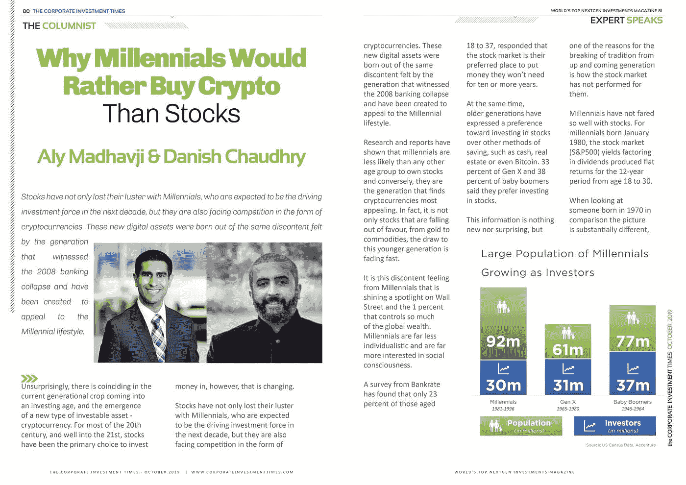
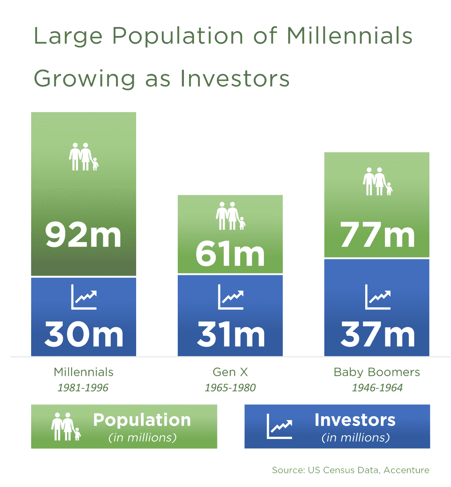
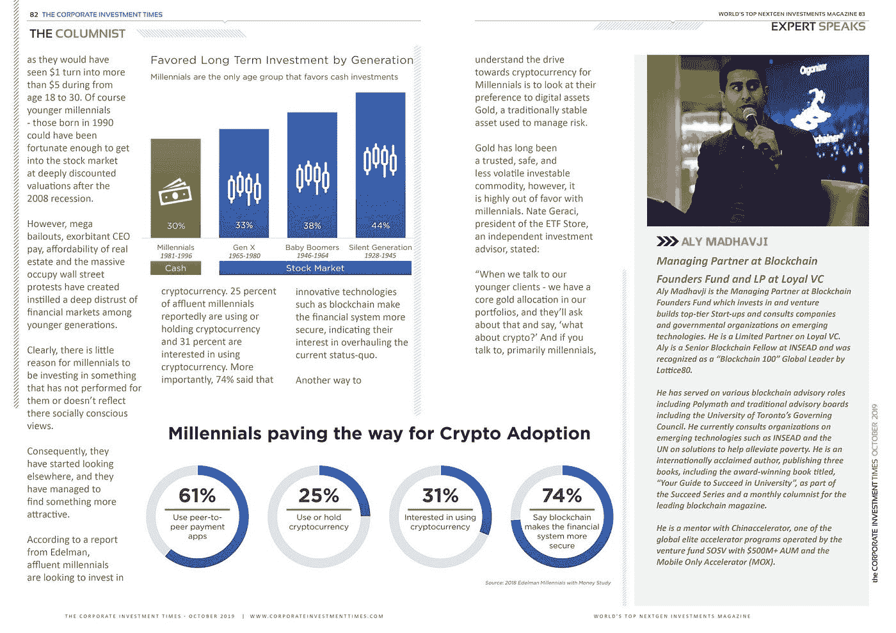
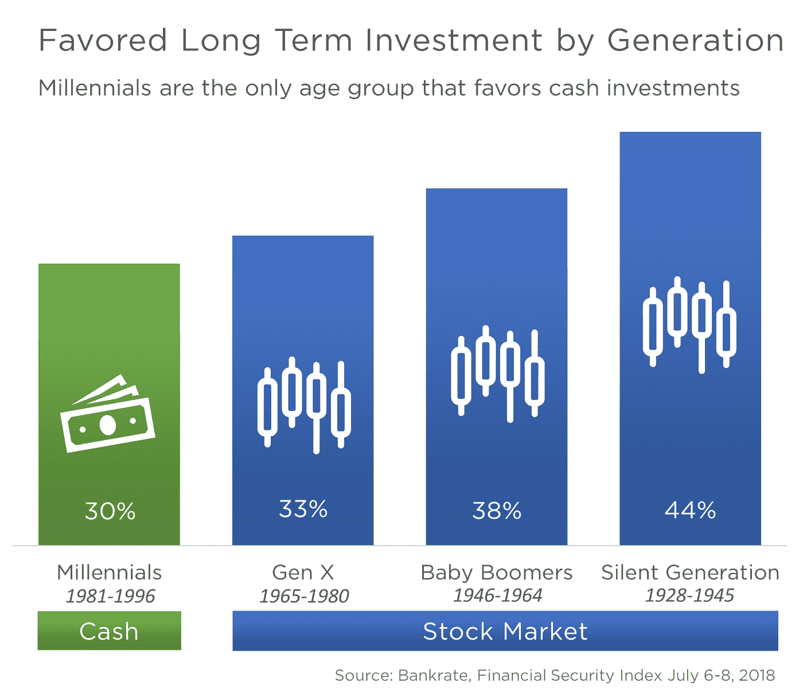
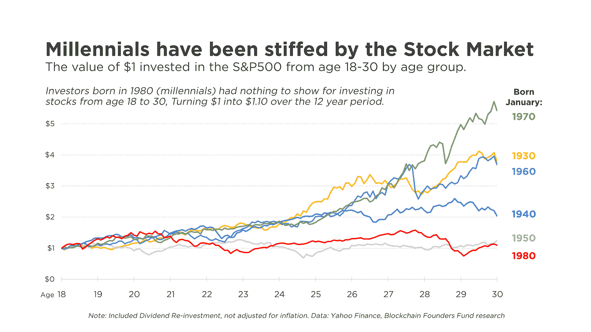
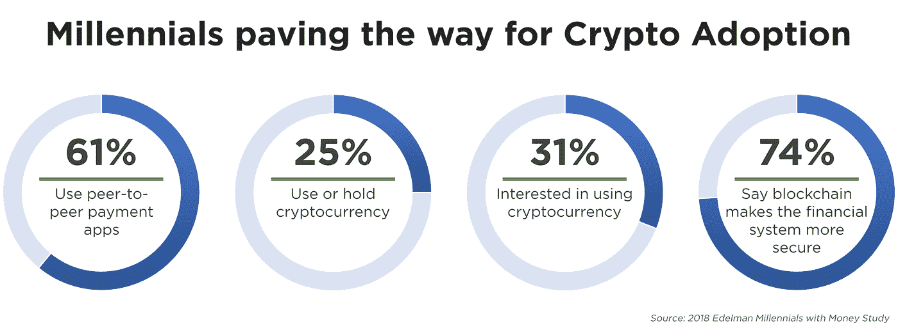
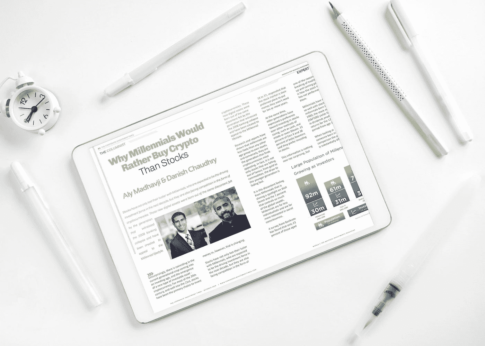

# 为什么千禧一代宁愿买密码也不买股票

> 原文：<https://medium.com/coinmonks/why-millennials-would-rather-buy-crypto-than-stocks-1dce03ac193b?source=collection_archive---------0----------------------->

不出所料，当前这一代人恰好进入了投资时代，一种新型可投资资产——加密货币——也出现了。在 20 世纪的大部分时间里，以及进入 21 世纪后，股票一直是投资资金的主要选择，然而，这种情况正在发生变化。

股票不仅失去了对千禧一代的吸引力，他们有望成为未来十年的投资驱动力，而且他们还面临着加密货币形式的竞争。这些新的数字资产诞生于见证了 2008 年银行业崩溃的一代人所感受到的同样的不满，并被创造出来以吸引千禧一代的生活方式。

研究和报告显示，千禧一代比其他任何年龄组都不太可能拥有股票，相反，他们是发现加密货币最有吸引力的一代。事实上，不仅仅是股票，从黄金到大宗商品，对年轻一代的吸引力正在迅速减弱。

正是千禧一代的这种不满情绪让华尔街和控制着全球如此多财富的 1%的人受到了关注。千禧一代远没有那么个人主义，对社会意识更感兴趣。

来自 [Bankrate](https://www.bankrate.com/investing/financial-security-july-2018/) 的一项调查发现，在 18 岁至 37 岁的人群中，只有 23%的人表示，股市是他们十年或更长时间内不需要的资金的首选去处。

与此同时，老一代人表示更喜欢投资股票，而不是现金、房地产甚至比特币等其他储蓄方式。33%的 X 一代和 38%的婴儿潮一代表示，他们更喜欢投资股票。

这些信息并不新鲜，也不令人惊讶，但上一代和下一代打破传统的原因之一是股票市场对他们来说表现不佳。

千禧一代在股票方面表现不佳。对于 1980 年 1 月出生的千禧一代来说，从 18 岁到 30 岁的 12 年间，股票市场(S&P500)的收益率(计入股息因素)产生的回报持平。对比一下 1970 年出生的人，情况就大不相同了，因为他们在 18 岁到 30 岁期间会看到 1 美元变成 5 美元以上。当然，更年轻的千禧一代——1990 年出生的人可能已经足够幸运，能够在 2008 年经济衰退后以大幅折价进入股市。然而，巨额救助、过高的首席执行官薪酬、房地产的可负担性以及大规模的占领华尔街抗议活动，已经在年轻一代中灌输了对金融市场的深深不信任。

显然，千禧一代没有理由去投资那些对他们来说没有效果或者没有反映他们的社会意识观点的东西。因此，他们开始寻找其他地方，他们设法找到了更有吸引力的东西。

根据爱德曼公司的一份报告，富裕的千禧一代正在寻求投资加密货币。据报道，25%的富裕千禧一代正在使用或持有加密货币，31%的人对使用加密货币感兴趣。更重要的是，74%的人表示，像区块链这样的创新技术使金融系统更加安全，这表明他们有兴趣彻底改变现状。

理解千禧一代对加密货币的驱动力的另一种方式是看他们对数字资产黄金的偏好，黄金是一种传统上用于管理风险的稳定资产。

黄金长期以来一直是一种可信、安全、波动性较小的可投资商品，然而，它很不受千禧一代的青睐。独立投资顾问，[ETF Store 总裁 Nate Geraci 表示](https://www.bloomberg.com/news/videos/2019-05-23/in-the-etf-crosshairs-u-s-china-trade-war-bitcoin-etf-delay-concealed-etf-structures-video):

> “当我们与我们的年轻客户交谈时，我们的投资组合中有一个核心黄金配置，他们会问这个问题，并说，‘加密怎么样？’如果你与千禧一代交谈，问他们更喜欢比特币还是黄金，这是一个压倒性的优势。它甚至不接近；好像 90%的人更喜欢比特币。"

Bankrate 年的一项调查显示，9%的千禧一代选择加密货币作为首选的长期投资，进一步证实了千禧一代对虚拟货币的需求正在增长。

千禧一代受够了留给他们的财务遗产；他们看到那 1%的人继续充实自己，同时让年轻一代更难获得财务自由。

像占领华尔街这样的运动是千禧一代对金融体系不满和沮丧的明显迹象，他们领导了对社会和经济不平等、贪婪、腐败以及企业对政府的不当影响的抗议。

新一代人已经达到了一个临界点，他们不再乐意继续生活在一个压迫性的体系之下，在一个新的金融体系获得恶名、合法性和常态的时候，他们已经达到了临界点。因此，可以理解为什么千禧一代正涌向使用加密货币的去中心化系统，而不是传统投资。

参考资料:

*这是由 Aly Madhavji 和 Danish Chaudhry 为《企业投资时代》杂志 2019 年 10 月版撰写的文章的转贴:*[https://corporateinvestmenttimes . com/cit 18/Corporate-Investment-Times-December-2019 . pdf](https://corporateinvestmenttimes.com/CIT18/Corporate-Investment-Times-October-2019.pdf)

> [在您的收件箱中直接获得最佳软件交易](https://coincodecap.com/?utm_source=coinmonks)

