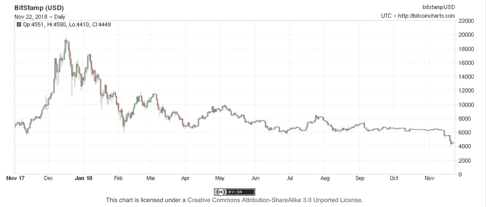
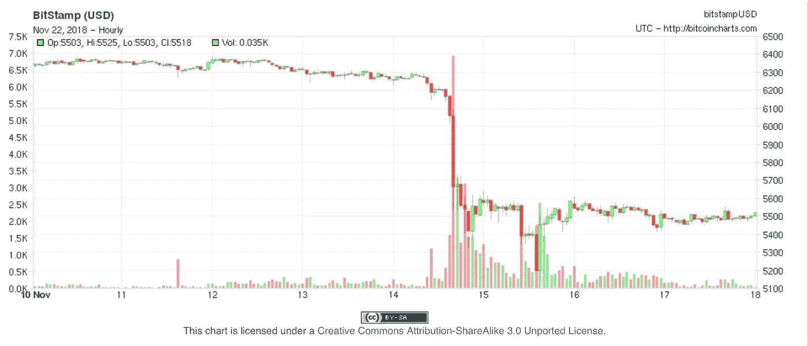

# 为什么(哦为什么)比特币刚好在感恩节的时候崩盘？

> 原文：<https://medium.com/coinmonks/why-oh-why-did-bitcoin-crash-just-in-time-for-thanksgiving-49c142a7a841?source=collection_archive---------0----------------------->

Bitcoin’s price in US dollars from Thanksgiving 2017 to 2018\. It starts at about $7,000, rises to nearly $20,000 and slumps to $4,500 in time for everyone to gather round the turkey.

不难想象，本周在美国的餐桌上有许多冷酷的沉默。这是感恩节，一家人聚在一起反思过去的一年。去年，有很多关于这种新的“比特币”的激动人心的文章，它的价值——显然是以美元衡量的——正在飙升，并将*飞向月球*。约翰·麦卡菲是这么说的，而且*那家伙睡觉的时候带着枪！*

正如你从图表中看到的，激动的文章，以及激动的返乡儿子说服他们的父母将他们的 401ks 投入比特币，是对的——直到他们错了。任何在 2017 年感恩节前后购买比特币兴奋感的人(这个话题在谈论灾难性的“双方都是好人”总统的第一年时，肯定取得了令人愉快的突破)。一开始。

8000 美元变成了，哇，2 万美元！如果你能在五月中旬出来，你就没事了。从那以后，呃，就没那么多了。价格在 6，000 美元左右徘徊了几个月。(我真的希望《华盛顿邮报》会修改[在 2 月](https://www.washingtonpost.com/business/economy/bitcoin-is-my-potential-pension-what-is-driving-people-in-kentucky-to-join-the-craze/2018/02/03/aaaea3be-05dc-11e8-b48c-b07fea957bd5_story.html)写的肯塔基的这个团体，描述那些在 2010 年跳入比特币的人..urgh，2017 年圣诞节刚过，其中一人随后钻进了一个名为“mintcoin”的 altcoin。这似乎是如此稀少的交易，没有人能够画出它的价格。)

尽管现在比特币的价格已经跌到了 5000 美元以下，并且在我写这篇文章的时候还在 4500 美元左右徘徊。问题是:它为什么会坠毁到现在？

我认为有很多原因凑巧在一起创造了完美风暴，导致了一点点砸门和“嗯，你知道在这个愉快的假期周末有一些风险”的谈话。

他们是三重的。

*   美国证券交易委员会决定，两种 ico(初始硬币发行——基本上是替代加密货币)是受监管证券，它们必须用美元偿还任何对原价不满的人。
*   2017 年买入比特币的对冲基金正接近年终会计期
*   感恩节和圣诞节即将到来:这是人们传统上花钱买礼物的时候，他们用美元而不是比特币购买礼物。

让我们过一遍。

# 1:锤子落下

ico 在 2017 年底是一件非常重要的事情。对于站在加密货币领域之外的任何人(比如我)来说，有人会购买这种货币似乎是荒谬的。你把你实际的钱交给一家公司，这家公司说它会做一些很棒的事情，作为回报，它会给你有限数量的代币中的一个，这些代币可能会也可能不会因为公司的努力而升值，但它不会让你对公司的运营或组织有任何发言权。你知道会计们把这叫做什么吗？无投票权的股份。你知道容易被愚弄的人把这叫做什么吗？他们致富的通行证。

美国证券交易委员会最终也这样称呼他们，并于 11 月 16 日宣布对两家 ico，Paragon 和 Carrie req 处以 25 万美元的民事罚款，并要求他们通知投资者，如果他们仍然拥有该令牌或亏本出售，他们有资格获得退款。这里有一个难题:买家的补偿必须是原价，并以法定货币支付。这里没有你的比特币/系绳废话。这是那两家公司急需的 2700 万美元。

现在看下面的图表。峰值是销售:红色表示低于优势价格销售，绿色表示高于优势价格购买。

考虑一下在证交会宣布的两天前，价格下跌的位置。7,000BTC 的售价约为 6000 美元，相当于 4200 万美元。

现在问问你自己，Paragon 和 CarrierEQ 的人是否知道证交会将要宣布他们的发现，他们需要一些真金白银。或者，同样地，其他人听说美国证券交易委员会将对 ICOs 进行调查，这将是一个弥天大谎。

The latest selloff in bitcoin seems to have been triggered by a 14 November disposal of about 7,000BTC.

这还没完:属于 SEC 管辖范围的其他 ico(基本上，任何卖给美国人的 ico)将不可避免地遭受同样的调查。只是时间问题。从 crypto 到 fiat 的转换将会一次又一次地发生。

# 2:“加里，你的同比表现如何？”

2017 年底，许多对冲基金认为，一点比特币可能会增加他们投资组合的味道。事实证明:见上图中的助跑。但是[正如 Anthony Pompliano 几天前指出的](https://offthechain.substack.com/p/icos-and-crypto-fund-managers-are)，对冲基金倾向于进行同比比较，到 11 月初，这些看起来并不太热门。交给安东尼:

> 由于高水位问题，加密对冲基金将开始关闭。高水位线是基金文件中的一项合同条款，旨在确保基金经理仅在基金的资产净值高于以往任何投资期的情况下，才能获得业绩费(对于加密基金，通常为利润的 20%)。
> 
> 2017 年 12 月是大多数基金最后一个投资期的结束，但也是上一轮牛市的顶部。自那以后，我们已经看到一些基金的净资产价值减少了 50-80%。这意味着这些基金经理在 2018 年将不会收到绩效费，这大大减少了单个经理的收入。此外，基金经理在能够将基金的资产净值从当前水平提高 2-4 倍之前，不会再收到绩效费。
> 
> 如果基金经理至少要到 2020 年才能实现这样的利润水平，我不会感到惊讶。这种最重要的财务激励资格的缺失，将导致许多基金经理关闭他们的基金，将资本返还给投资者。他们可能会退出游戏几个月甚至一年，然后带着一只不会受到高水位挑战的新基金回来。

现在，他们可能会选择搁置投资，但如果投资价值没有任何提升，撤出投资不是同样有意义吗？因此，也许 11 月中旬的一些销售只是获利回吐，或者更可能是止损。

不过，安东尼还没完。他在上面提到了 SEC 对 ICO 的资助，并指出这对于 ICO 来说是一个大问题，因为加密货币的价格*已经从其水印高点下跌了 50–90%。他解释道:

> 几乎每个项目都以加密货币的形式筹集资金——例如，假设投资者以 1 万美元的价格向一个项目投入 50 BTC，总共筹集了 50 万美元。这个示例团队将因在 SEC 罚款的基础上向投资者返还 50 万美元而陷入困境。
> 
> 通常情况下，这不会是一个大问题，除非密码价格从历史高点下跌了 50-90%。一个 ICO 项目不太可能有足够的资金(以美元计)来偿还投资者(取决于 ICO 的筹集时间——大多数是在 2017 年第三季度和第四季度)。在我们的例子中，如果自从投资者贡献了 50 BTC 以来，比特币下跌了 50%，团队手头只有 250，000 美元来偿还投资者(如果团队还没有花掉任何钱)。他们唯一的选择是筹集更多资金(不太可能)或者宣布破产。

是的，B 开头的词。他认为“对于加密基金和 ICO 市场来说，当前的熊市将很快变得更糟。”这产生了多米诺骨牌效应:如果加密货币减记其价值，或者只是价值下降，那么任何持有它们的基金都必须这么做——这就是所谓的市值计价。美国的纳税年度于 12 月 31 日结束，而且很快就要到了(还有五周！)，这意味着一些基金可能会非常紧张。蓬皮亚诺认为，在情况好转之前，情况还会变得更糟。

需要[一个具体的例子](https://www.bloomberg.com/news/articles/2018-11-21/these-traders-paid-a-100-premium-for-bitcoin-at-the-market-top)？彭博，为您服务。这是迈克尔·帕特森:

> 要了解过去一年中最不合时宜的交易之一，不妨看看 10 亿美元的灰度比特币投资信托基金。12 月 18 日，也就是比特币大崩盘开始的前一天，该信托的买家将比特币相对于净资产价值的溢价推高至 100%以上。粗略地说，这就像花 4 万美元购买现货市场交易价格接近 2 万美元的比特币。
> 
> 价格上涨很大程度上是稀缺价值的结果。购买信托是受监管的美国机构投资者获得加密货币敞口的少数几种方式之一。一些人愿意为这种特权付费，因为他们认为对密码的狂热才刚刚开始。
> 
> 当然，我们现在知道那是顶峰。随着比特币跌至 4000 美元，灰度信托的溢价缩水，12 月 18 日的看涨押注看起来一天比一天糟糕。虽然不清楚买家持有头寸的时间有多长，但任何坚持交易的人都会遭受超过 87%的损失。

你怎么看——估计他们一直在霍丁，或者他们看他们的估价，看屏幕，看对方…

对此的更新(在这篇报道首次发表后发现):[市场观察](https://www.marketwatch.com/story/how-bitcoins-meltdown-is-ravaging-hedge-funds-2018-11-21)报道称，“自 2018 年初以来，35 只加密相关基金已经关闭，占该公司[加密基金研究]跟踪的 633 只基金的 5%以上。”

> 根据 Crypto Fund Research 的数据，在加密热潮中配置资本的热潮始于 2017 年下半年，2018 年 1 月达到顶峰，有 44 只基金发行，这是有记录以来的最高月份。

与之配套的图表显示了比特币发行的高峰期，当时比特币正经历着漫长的下坡路。(讽刺的是，在 2018 年底推出的基金可能会没事，在 2017 年 8 月之前推出的基金也是如此。其他人——如果你把他们加起来，大约是他们的三分之二——在同比比较中会有一些问题。当然，他们可能会长期参与:坚持数年。但是，如果所有的资金都流出这个行业，价格什么时候才能回来呢？

正如一位分析师对比特币不耐烦地表示的那样，“没有基本面，只有技术面”——也就是说，没有购买比特币的潜在理由(比如，与黄金不同，你至少可以辩称，比特币在镀金、电接触等方面有使用价值，这意味着对实际商品的需求与其他信仰完全不同)。唯一改变其价格的是人们认为其价格将会发生的事情。

但是等等，我们还没完呢。

# 3:树下的东西

如果你没有注意到，美国人正在过感恩节，这意味着他们将在周五冲击零售店，并在周一在网站上点击购买按钮。这种购买需要非虚拟的金钱，一些已经看到他们巨大的希望破灭的人只是套现，这样他们就可以买一些礼物，或者只是一些燃料。当然，你不必相信我；想象一下，孩子们总是问他们的父母“你给我买了什么圣诞礼物？”想象一下当你回答“没有任何有形的东西，但我希望我的虚拟钱包里有这种下降的投机资产”时，他们脸上的激动。

人们兑现的都是从市场流出的钱。没有资金进入市场，就没有支撑价格的东西。随着资金退出市场，通过人们出售他们的比特币，因为他们不得不支付现实世界的账单，价格将继续下降。(是的，每个卖家都必须匹配一个买家；但当潜在卖家多于买家时，价格就会下降。)

所以这就是为什么我认为比特币价格暴跌。现在我们来看一个明显的后续问题:它会再次上涨吗？我认为答案是否定的。原因如下。

比特币在 2017 年年中重新获得的关注超出了疯狂。人们出现在美国有线电视上兜售它，谈论这种被当作神奇摇钱树的东西。事实上，科技行业已经停滞了一两年——在影响和兴奋度方面，没有什么可以与本世纪初的智能手机相提并论——这意味着任何东西都会被捡起来，即使(就像在这种情况下)它自身的内在限制意味着它不能在广泛的层面上作为货币发挥作用(处理速度太慢)，即使你绕过了建立钱包的挑战。2011 年，我在[写关于比特币的文章，当时这些问题显而易见，但它的主要用途是购买黑市药物和进行勒索支付。与现在相反，当时它的主要用途似乎是购买黑市药物，支付勒索软件，并使更大的傻瓜变得贫穷。](https://www.theguardian.com/technology/2011/oct/18/bitcoin-value-crash-cryptocurrency)

所以电视和报纸上都是比特币比特币，这导致一些人试图购买比特币(还有很多人试图出售比特币)，这推高了价格，吸引了想快速致富的人，这推高了价格，这……是的，你知道。

此外，比特币价格在 2017 年夏天的上涨——被视为高度可疑。彭博(再次)表示，美国司法部正在调查价格是否是由 Tether 推高的，Tether 是一种据称与美元“挂钩”的加密货币(Tether 的基本说法是:“我们在世界上的某个地方藏了一枚真实的美元，以匹配我们发行的每一枚美元。看你能不能猜出在哪里！”)，由运营加密交易所 Bitfinex 的同一团队发行。今年六月[的一项学术研究](https://papers.ssrn.com/sol3/papers.cfm?abstract_id=3195066)认为，是的，通过在关键时期发行和购买比特币，Tether 被用来操纵比特币价格上涨。

我确实认为，关于 Bitfinex 和 Tether，有一些巨大的问题需要回答；撇开什么不说，他们为什么找不到愿意替他们保管钱的银行呢？为什么他们不接受真正的审计？他们在搞什么鬼？

关于后者，我不知道。我只是不知道。

顺便问一下，有人看过网飞系列奥扎克吗？由杰森·贝特曼饰演的马蒂·伯德是墨西哥贩毒集团的洗钱者。他们为他提供了大量的“脏”钱，他必须找到投资的地方，这将很快产生大量的“干净”钱。劣币进，良币出。我想知道哪里可以找到一个允许人们做这种事情的方案——用可疑资金购买大量资产，然后迅速以合法资金出售。我希望我知道！

哦，顺便提一下，本月早些时候，Tether 的推定市值约为 25 亿美元——这实际上是已发行的“Tether”数量，当然，每一笔都是由银行账户中的实际美元支持的(因为他们是这么说的，这是金融界的一贯做法)。某处。奇怪的是，有很多人试图在 Bitfinex 上套现，并表示他们面临几天甚至几周的延迟。在某些情况下，人们已经观察到系绳的“交换”价格低于名义美元，这在流动性市场中通常意味着套利的绝佳机会。(作为参考，请阅读“[日元套息交易](https://www.thebalance.com/yen-carry-trade-explained-pros-cons-how-it-is-today-3305971)”，这是关于利用利差的交易。)当你不得不以低价出售时，你当然不会以全价购买，对吗？

🤔

总之。我们现在已经确定，比特币的价格已经崩溃，因为 ico 受到了美国证券交易委员会(SEC)的严密监视，对冲基金正在关注它们的同比涨幅，而普通人只是需要一点他们实际上可以花掉的钱。

为什么有人要回到比特币？疯狂已经结束。是的，我知道人们会说“它以前有过崩溃，但总是会回来的。”(上面那篇 2011 年的采矿文章指出，价格从 30 美元跌至 2 美元，“低于采矿成本”。快乐的日子。)这次有点不一样。由于欠下*巨额*债务，矿业公司正以大*大*的方式走向破产。采矿设备制造商正在抑制销售。尤其是在美国，饱和的覆盖率意味着没有人有理由再次尝试那个游戏。我们也只是在这个秋天的开始:除了主要影响(矿工出售工具包，甚至因为价格太低而放弃支付成本)，还会有次要影响(矿业公司破产；未付票据；失业的人；价格下跌的投资组合)，这些都将在接下来的几个月里发生。

加上最重要的一点:如果你把比特币当成投机资产，那么它就不可能也是货币。要么你把它当作可以花掉的东西，要么当作可以囤积的东西。不可能两者兼得。不过，已经没有回头路了。对于为什么你现在应该购买比特币，有什么可能的解释？当然，没有一波巨大的市场操纵推动价格上涨，并诱惑人们回来……直到他们想起 2018 年感恩节的对话。

祝你好运，克尔顿。

*如果你喜欢这个，你可以* [*注册我的每日电子邮件链接列表*](http://eepurl.com/bx3znn) *关于技术、科学和出于某些原因偶尔政治的***。或者以网页的形式发布。你甚至可以在 RSS* *上* [*阅读那种东西。他们接下来会想到什么？*](https://theoverspill.blog/feed/)*

> **加入 Coinmonks* [*电报频道*](https://t.me/coincodecap) *和* [*Youtube 频道*](https://www.youtube.com/c/coinmonks/videos) *获取每日* [*加密新闻*](http://coincodecap.com/)*

# *另外，阅读*

*   *[复制交易](/coinmonks/top-10-crypto-copy-trading-platforms-for-beginners-d0c37c7d698c) | [加密税务软件](/coinmonks/crypto-tax-software-ed4b4810e338)*
*   *[电网交易](https://coincodecap.com/grid-trading) | [加密硬件钱包](/coinmonks/the-best-cryptocurrency-hardware-wallets-of-2020-e28b1c124069)*
*   *[密码电报信号](http://top%204%20telegram%20channels%20for%20crypto%20traders/) | [密码交易机器人](/coinmonks/crypto-trading-bot-c2ffce8acb2a)*
*   *[最佳加密交易所](/coinmonks/crypto-exchange-dd2f9d6f3769) | [印度最佳加密交易所](/coinmonks/bitcoin-exchange-in-india-7f1fe79715c9)*
*   *[币安收费](/coinmonks/binance-fees-8588ec17965) | [僵尸加密审查](/coinmonks/botcrypto-review-2021-build-your-own-trading-bot-coincodecap-6b8332d736c7) | [热点审查](/coinmonks/hotbit-review-cd5bec41dafb)*
*   *[my constant Review](https://coincodecap.com/myconstant-review)|[8 款最佳摇摆交易机器人](https://coincodecap.com/best-swing-trading-bots)*
*   *[我的加密副本交易经历](/coinmonks/my-experience-with-crypto-copy-trading-d6feb2ce3ac5) | [AAX 交易所评论](/coinmonks/aax-exchange-review-2021-67c5ea09330c)*
*   *[逐位融资融券交易](/coinmonks/bybit-margin-trading-e5071676244e) | [币安融资融券交易](/coinmonks/binance-margin-trading-c9eb5e9d2116) | [超位审核](/coinmonks/overbit-review-9446ed4f2188)*
*   *[有哪些交易信号？](https://coincodecap.com/trading-signal) | [比特斯坦普 vs 比特币基地](https://coincodecap.com/bitstamp-coinbase)*
*   *[面向开发人员的最佳加密 API](/coinmonks/best-crypto-apis-for-developers-5efe3a597a9f)*
*   *最佳[密码借贷平台](/coinmonks/top-5-crypto-lending-platforms-in-2020-that-you-need-to-know-a1b675cec3fa)*
*   *[免费加密信号](/coinmonks/free-crypto-signals-48b25e61a8da) | [加密交易机器人](/coinmonks/crypto-trading-bot-c2ffce8acb2a)*
*   *[杠杆代币](/coinmonks/leveraged-token-3f5257808b22)终极指南*