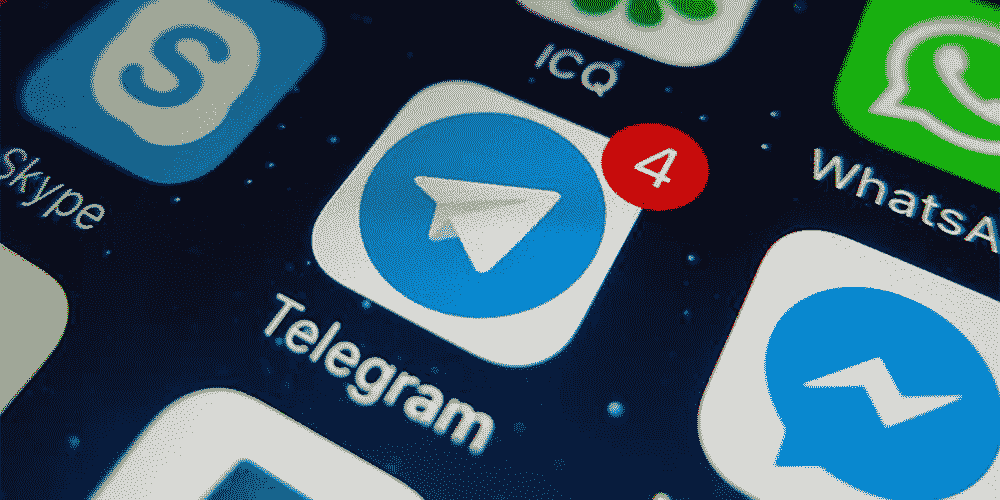

# “为什么‘密码’空间的人使用电报，我一点也不明白”

> 原文：<https://medium.com/coinmonks/why-people-in-crypto-space-use-telegram-is-all-beyond-me-24af1b481fda?source=collection_archive---------14----------------------->

Source: [http://www.mosaicventures.com/mosaicblog/2015/12/15/telegram-the-next-generation-messaging-platform](http://www.mosaicventures.com/mosaicblog/2015/12/15/telegram-the-next-generation-messaging-platform)

最近，我最喜欢的人物，来自区块链世界的 Amber Baldet 在推特上写道，为什么没有一个应用程序可以让她给刚认识的人提供用户名而不是电话号码。所以这条推文引发了一个帖子，有人建议她使用 telegram，哦，天哪，她抨击了！

我完全同意她的观点。

她还强调了一点，她不明白为什么在“加密”空间的人使用电报！

> 那些为区块链提供的卓越安全性担保的人实际上在世界上最不安全的聊天应用程序上进行大部分对话——Telegram。

## 电报的问题

*   默认情况下，它不会加密聊天。人们必须打开一个额外的设置，以一种被称为**秘密聊天**选项的加密格式进行交谈。要知道怎么做，点击[这里](https://smartphones.gadgethacks.com/how-to/telegram-101-enable-end-end-encryption-for-your-chats-0179439/)。电报传递了政府希望的一切。
*   你所有的数据都储存在电报服务器上。谁知道是什么形式(加密与否)！
*   桌面应用也不安全。黑客利用这个漏洞，在电脑中安装了远程控制的恶意软件。

查看这篇精彩的文章，它深入探讨了所使用的加密协议的技术细节。

 [## 为什么我告诉我的朋友停止使用 WhatsApp 和 Telegram

### 即使有了端到端加密，老大哥仍然在你的手机里:元数据

medium.freecodecamp.org](https://medium.freecodecamp.org/why-i-asked-my-friends-to-stop-using-whatsapp-and-telegram-e93346b3c1f0) 

## “为什么‘密码’空间的人使用电报，我一点也不明白”——安珀·巴尔代特

## 如果你们谁知道最好的聊天应用，请在下面的评论中告诉我。提前感谢！:)