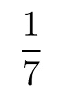
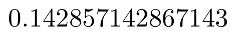
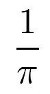
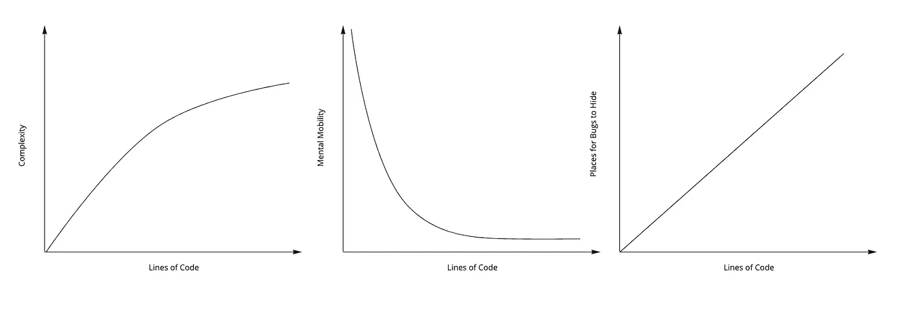
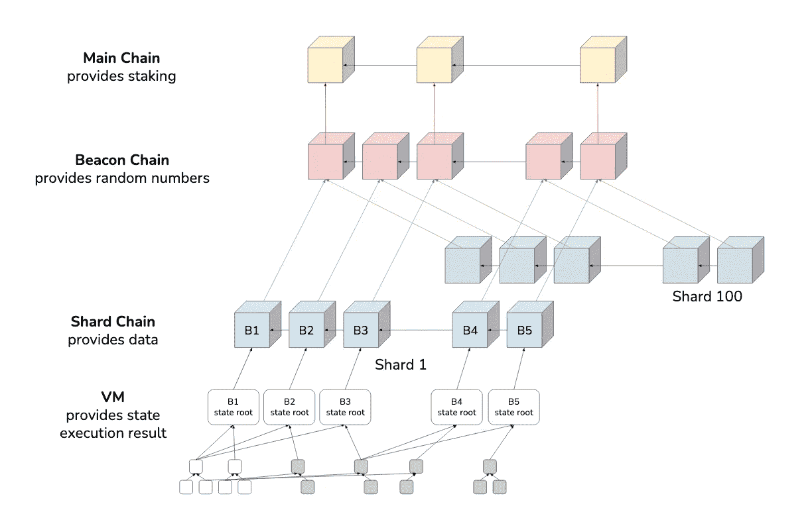
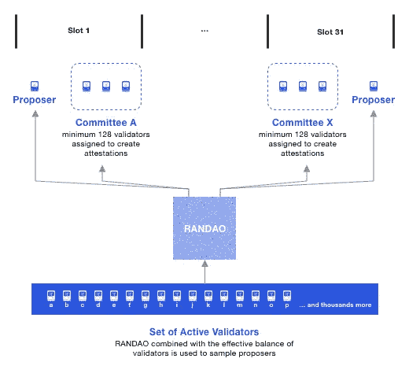

# 为什么工作证明是优雅的，而利益证明不是

> 原文：<https://medium.com/coinmonks/why-proof-of-work-is-elegant-and-proof-of-stake-is-not-4988cdc8805f?source=collection_archive---------6----------------------->

The best stadium, Busch Stadium | [Wikimedia](https://upload.wikimedia.org/wikipedia/commons/8/8e/Busch_Stadium_Panorama_%286040385355%29.jpg)

在[我的上一篇与加密相关的帖子](https://thegoldenmule.medium.com/crypto-is-an-elegant-way-to-destroy-the-world-ede8e37c04)中，我个人得罪了加密社区的一半人(为自己辩护，我只需要 30%的 ETH2 网络支持我——这是一个股权证明的笑话，伙计们)，一些人要求我解释为什么我认为工作证明( **PoW** )如此优雅，为什么股权证明( **PoS** )如此糟糕…不。

这篇 2200 字的文章对你来说就像《赤脚小乔》这本书对我一样。你们这些不识字的非利士人可能知道这本书是电影《梦的领域》。我是作家 W. P .金塞拉，这是 ***赤脚密码*** 。它将充满棒球隐喻。

你看，在读完*赤脚的乔*之后，我不认为我爱上了棒球，但是*赤脚的乔*描绘了一幅某人*如何爱上棒球的浪漫画面。我对这项运动的奥秘变得真正开放了。一种…二手的爱。这就是我在这篇文章中要做的——除了在这个类比中，用权力代替棒球。你还不明白我在说什么吗？**这篇文章要让你和 PoW** 坠入二手情网。*

伙计们，我不知道怎么说得更清楚了。

Babe Ruth, thinking about DApps.

# 优雅的数学

让我们从数学开始，因为世界上一切美好的事物都始于数学(这篇文章可能比加拿大国家图书奖获奖*无鞋乔*更笨拙一点)。是什么让一些数学比其他数学更优雅？有些人认为所有的数学都是难以理解的胡言乱语——但是等一下，记住:*我是金塞拉*你正在学着爱上棒球*。*

先说分数。

**分数**

分数是优雅的，因为除了其他原因之外，它们简单明了。如果我想把某物分成七份，自己拿一份，我可以把结果写成分数:

我就有这么多。这不是两个数字，这是一个数字:七分之一。我们现在有一个选择，我们可以选择*将这个数字变得复杂*并将其表示为一个小数:

现在，因为我们愚蠢的选择，我们已经失去了轻松处理这个数字的能力。你能认出这个数字是七分之一吗？如果你用沾满面粉的手在量杯抽屉里翻找十进制茶匙，你会知道该拿哪一个吗？

然而，这里还有另一个问题，比当你打算添加第七个时添加第六汤匙小苏打大得多:这个十进制值*不等于七分之一*。我换了你身上的一个数字——你注意到了吗？不，你没有。当你的小数有错误时，很难判断。如果我没说漏嘴，你永远不会注意到。

小数的两个好球(看，我*告诉*你们棒球隐喻来了)。

分数的另一个好处是我可以很容易地在脑子里思考它们。比如:如果我把东西分成***【π】***几块，想拿一个呢？为什么这么简单，我只要这么多块(发音为 *one-pieth* ):**

****

**就像七分之一一样，这是一个具有精确值的单一数字。如果我想要两个呢？哦，那很简单，我只是在上面放了一个 2。如果我用十进制来尝试这个，宇宙中将没有足够的原子来写十进制展开式。**

**将军，你的小数没了。**

**这些都是让分数比我在这里构建的稻草人小数更优雅的属性。当然，优雅的这些属性不是二元的:它们各自存在于一个连续统上(巧合的是，这个连续统不能用有理数来表示——哎呀)。然而，我正在描述一些数学家可能用来给优雅打分的东西:**

*   **简单**
*   **很容易在你的脑海里移动**
*   **容易识别故障**

**我很想进一步探索数学的优雅，但出于同样的原因，赤脚的乔 T21 只有 514 / 2 页，我必须继续前进。**

****

**Shea Stadium | [Rudi Riet](https://www.flickr.com/photos/rudiriet/2713796569)**

> **订阅 [**Coinmonks Youtube 频道**](https://www.youtube.com/c/coinmonks/videos) 获取每日加密新闻。**

# **优雅的编程**

**现在，我只是一名业余数学家(((ℂ，+，*)是我梦想的领域)，但是像任何曾经在工作中使用 Excel 的人一样，我是一名职业程序员。那么是什么造就了优雅的代码呢？我不想在这里偷工减料，但是我们基本上想要我们的代码和我们的数学有相同的属性。**

**这可能会让你吃惊，但是世界上最优雅的代码是零行长的**。**这是最容易写的代码，也是最容易理解的代码。一看就知道那些零线是干嘛的。我可以把这些零线交给任何技能水平的程序员，并保证他们也能理解。这些零线代码从现在起三年后维护起来将是轻而易举的事情，并且很容易成为整个世界上最没有 bug 的代码。**

**但是上帝会帮助程序员添加下一行代码。**

**这显然是一个愚蠢的事情来写，你现在，不幸的是，读了它有点愚蠢。然而，这就是如何通过归纳建立一个无懈可击的案例:从琐碎的案例开始，一步步往上。**

**在我们添加了*的下一行*代码后，我们需要使用我上面描述的标准重新评估我们的程序:**

*   **随着代码越来越多，我们很有可能增加了更多的复杂性(尽管这不是*必须的—* 冷静下来)。因此，**我们的简单性得分*趋向于*下降**。**
*   **我们有稍微多一点的代码，程序员必须在脑子里移动来考虑问题空间。不幸的是，这意味着**心理灵活性得分也将呈下降趋势**。**
*   **我们的失败认知分数如何？这再次 ***很可能*下降**仅仅是因为有更多失败可以隐藏的地方。我们添加的代码越多，添加的特定代码行越复杂，就越难在表面上看到失败。**

****

**I’m a man of many graphs. Three in this case.**

**我可以听到一千副眼镜滑过一千个油腻腻的鼻子时发出的刺耳声音:“*实际上，我会把代码行和精神流动性之间的关系归类为五次方递减，这里你显然使用了三次回归*”——是的，非常感谢你的深刻贡献，[comparatorbridgeorderiterorinstancebean 先生](https://projects.haykranen.nl/java/)。我在这里清楚地描绘了一幅概括性的图画:原色，没有消失点，没有细微差别。然而，从我这个专业软件爱好者的角度来看，这些事情一般都是真的。**

**我们试图解决的问题越大越复杂，我们正在解决的代码库的规模越大，时间越长，我们在这些优雅指标上的得分就越低。**

****

**Fenway Park | [Wikimedia](https://upload.wikimedia.org/wikipedia/commons/0/0f/Fenway_Park%2C_Boston%2C_MA_2008.jpg)**

# **优雅的密码**

**你可以明白我的意思。我的案子无懈可击。我告诉过你它有多密封吗？该死。品牌名称特百惠，*内*一个超重型，三重密封拉链。迷你胡迪尼自己也很难挤出这个时间。**

**我写的是数学和编程，因为最初的比特币白皮书是这两个领域的混合(顺便说一句，你读过我的关于比特币未知发明者的同人短篇小说吗，名为[中本聪:时间旅行者](https://thegoldenmule.svbtle.com/satoshi-nakamoto-time-traveler)？？？).所以当我说 PoS“不优雅”时，我的意思是它在这三个指标上得分很低。**

**让我们检查一下我毫无根据的说法。**

1.  ****PoS 巨大** **复杂**。您的密码爱好者朋友，除非她为以太坊基金会工作，否则不知道一个实际的 PoS 实现实际上是如何工作的。Vitalik Buterin 可以“把这些东西扔来扔去”，但对于我们这些凡人来说，我们必须看一个 [3 集系列](https://www.youtube.com/watch?v=bz16BURH_u8)才能理解多项式承诺的基础。另一方面(正如我在[之前的帖子](https://thegoldenmule.medium.com/crypto-is-an-elegant-way-to-destroy-the-world-ede8e37c04)中描述的那样)，我可以通过画一些箭头和圆圈，以高度准确的方式向任何人解释一个战俘方案。我甚至可以在他们面前设计一个散列函数(虽然不是很好，但仍然是一个散列函数)。利害关系证明在简单性方面得分较低。**
2.  **我能在脑子里想出一个战俘计划吗？我会给你看一张图片，然后我要你闭上眼睛，在上面转动你的大脑。**

****

**[What you can do for Ethereum 2.0 a.k.a. sharding](https://docs.google.com/presentation/d/1G5UZdEL71XAkU5B2v-TC3lmGaRIu2P6QSeF8m3wg6MU/edit#slide=id.p4) | Hsiao-Wei Wang**

**废话，等等，我也忘了委员会，所以你也需要在你的脑海里有这样的画面:**

****

**[The Beacon Chain Ethereum 2.0 explainer you need to read first](https://ethos.dev/beacon-chain/)**

**等等，我还忘了硬币部分。某处不是有硬币吗？我肯定我把它放在这里的某个地方了…是的，我也完全理解 3 小时多项式承诺解释器系列在这里的位置。**

**或者，我承认这是完全可能的:也许我要走了，你们这些善良的比特币基地日内交易者真的会得到这些东西。**

**3.假设我们能记住以上内容，那么让我们寻找潜在的 bug 藏身之处。老实说，甚至很难找到一个起点，因为不清楚你在哪里进入和离开这个系统。让我从更简单的开始:加密。**

**加密是 PoW 和 PoS 系统核心部分。然而，这是一个展示如何构建复杂软件的例子。我们需要加密来开始构建这些东西的任何部分，所以我们理所当然地认为好的加密技术是存在的，而且为玩笑硬币起有趣名字的那些程序员也知道如何在实际编写软件时很好地使用加密技术。**

**加密是如此难以置信的复杂和容易出错，以至于有一个常见的编程格言:[不要推出自己的加密](https://www.vice.com/en/article/wnx8nq/why-you-dont-roll-your-own-crypto)。全世界每个程序员都使用的可信加密库屈指可数。这些库是持续研究、代码审查和渗透测试的主题。几十年来，数以千计的博士仔细研究了这些东西，试图找出错误。这些安全研究人员是在试管中培养的，试管中滴有几滴危险的科学，婴儿时期，他们醒着躺在婴儿床里，盯着由推测的玻色子和虚数组成的手机。**

**加密的复杂性绝对需要如此多的关注——然而，在 2014 年， [Heartbleed bug](https://heartbleed.com/) 在多年未被发现*之后，还是通过了。这个漏洞非常严重，除了别的以外，它允许黑客窃取通过安全网页发送的任何信息。你知道，就像所有的钱是如何运作的？我有一个朋友告诉我，他并不担心这一点，因为他只在商店亲自使用他的卡，从不在网上使用。他非常失望地得知 TJ Maxx 读卡器确实“使用互联网”。***

**当然，试管婴儿解决了这个加密问题，当然，这拯救了世界。叹气。我为接下来的故事埋下了伏笔——这是像我和加拿大勋章获得者金塞拉这样的伟大作家所做的。记住，人们必须正确地使用软件，当然他们没有。这个问题被修复五年后，200，000 台服务器仍然没有升级到修复版本。**

**这就是复杂软件解决棘手问题的结果。我甚至还没有提到《幽灵党》和《熔毁党》，它们对我写这篇文章的电脑和你阅读这篇文章的电脑都有影响。**

**正如我一开始所说的，PoS 和 PoW 都使用这些特定的加密库——然而，我的观点是，狡猾、复杂的想法不会通过人类的指尖出来，然后奇迹般地毫发无损地进入计算机。他们出来时汗流浃背，气喘吁吁，破破烂烂的。想法越复杂，软件解决方案就可能越不完善。**

****

**Wrigley Field | [Wally Gobetz](https://www.flickr.com/photos/wallyg/169877822)**

# **越差越好**

**金塞拉总结道*赤脚的乔*在我看来，是一个充满希望的音符。大多数非反社会者在看到最后一章时都流泪了，同样，我想你现在正泪汪汪地读着这些文字。不幸的是，这场混乱以失望告终。**

****不幸的是，优雅不是——引用迷因的话——“所有的东西”。****

**弗兰肯斯坦软件在野外生存和呼吸的是令人难以置信的[,耙入惊人的金钱。这也不仅仅是钱的问题——有很多可怕的、满是 bug 的软件非常有用。你试过使用 Gmail 吗？天哪，多么大的垃圾箱着火了！这些怪物就在我们中间，但是就像古老的魔像一样，最好用退格键](https://www.dreamsongs.com/RiseOfWorseIsBetter.html)消灭它们。只有简单的软件才真正有效，即使这样也只是一种可能。**

**然而，尽管股权证明无法与工作证明的优雅相提并论，但我仍然相信这仍然是我们最好的未来。你会很高兴知道我不是一个彻头彻尾的伪君子。我说的是真心话，卖了我的尖叫，2000 瓦炉——呃，GPU 矿工。**

**叹气。**

**再见工作证明，我的老朋友。是时候离开球场了。**

> **加入 Coinmonks [电报频道](https://t.me/coincodecap)和 [Youtube 频道](https://www.youtube.com/c/coinmonks/videos)了解加密交易和投资**

## **另外，阅读**

*   **[用信用卡购买密码的 10 个最佳地点](https://blog.coincodecap.com/buy-crypto-with-credit-card)**
*   **[加拿大最佳加密交易机器人](https://blog.coincodecap.com/5-best-crypto-trading-bots-in-canada) | [Bybit vs 币安](https://blog.coincodecap.com/bybit-binance-moonxbt)**
*   **[用于 Huobi 的加密交易信号](https://blog.coincodecap.com/huobi-crypto-trading-signals) | [Swapzone 审查](/coinmonks/swapzone-review-crypto-exchange-data-aggregator-e0ad78e55ed7)**
*   **最佳[密码交易机器人](https://blog.coincodecap.com/best-crypto-trading-bots) | [购买索拉纳](https://blog.coincodecap.com/buy-solana) | [矩阵导出评论](https://blog.coincodecap.com/matrixport-review)**
*   **[Coldcard 评论](https://blog.coincodecap.com/coldcard-review) | [BOXtradEX 评论](https://blog.coincodecap.com/boxtradex-review)|[uni swap 指南](https://blog.coincodecap.com/uniswap)**
*   **[阿联酋五大最佳加密交易所](https://blog.coincodecap.com/best-crypto-exchanges-in-uae) | [SimpleSwap 评论](https://blog.coincodecap.com/simpleswap-review)**
*   **购买 Dogecoin 的 7 种最佳方式**
*   **[最佳期货交易信号](https://blog.coincodecap.com/futures-trading-signals) | [流动性交易所评论](https://blog.coincodecap.com/liquid-exchange-review)**
*   **[3 commas Review](/coinmonks/3commas-review-an-excellent-crypto-trading-bot-2020-1313a58bec92)|[Pionex Review](https://blog.coincodecap.com/pionex-review-exchange-with-crypto-trading-bot)|[coin rule Review](/coinmonks/coinrule-review-2021-a-beginner-friendly-crypto-trading-bot-daf0504848ba)**
*   **[莱杰 vs Ngrave](/coinmonks/ledger-vs-ngrave-zero-7e40f0c1d694) | [莱杰 nano s vs x](/coinmonks/ledger-nano-s-vs-x-battery-hardware-price-storage-59a6663fe3b0) | [币安评论](/coinmonks/binance-review-ee10d3bf3b6e)**
*   **[Bybit Exchange 审查](/coinmonks/bybit-exchange-review-dbd570019b71) | [Bityard 审查](https://blog.coincodecap.com/bityard-reivew) | [CoinSpot 审查](https://blog.coincodecap.com/coinspot-review)**
*   **[3 commas vs crypto hopper](/coinmonks/3commas-vs-pionex-vs-cryptohopper-best-crypto-bot-6a98d2baa203)|[赚取加密利息](/coinmonks/earn-crypto-interest-b10b810fdda3)**
*   **最好的比特币[硬件钱包](/coinmonks/hardware-wallets-dfa1211730c6) | [BitBox02 回顾](/coinmonks/bitbox02-review-your-swiss-bitcoin-hardware-wallet-c36c88fff29)**
*   **[BlockFi vs 摄氏](/coinmonks/blockfi-vs-celsius-vs-hodlnaut-8a1cc8c26630) | [Hodlnaut 点评](/coinmonks/hodlnaut-review-best-way-to-hodl-is-to-earn-interest-on-your-bitcoin-6658a8c19edf) | [KuCoin 点评](https://blog.coincodecap.com/kucoin-review)**
*   **[Bitsgap 审查](/coinmonks/bitsgap-review-a-crypto-trading-bot-that-makes-easy-money-a5d88a336df2) | [Quadency 审查](/coinmonks/quadency-review-a-crypto-trading-automation-platform-3068eaa374e1) | [Bitbns 审查](/coinmonks/bitbns-review-38256a07e161)**
*   **[加密复制交易平台](/coinmonks/top-10-crypto-copy-trading-platforms-for-beginners-d0c37c7d698c) | [Coinmama 审核](/coinmonks/coinmama-review-ace5641bde6e)**
*   **[印度的加密交易所](/coinmonks/bitcoin-exchange-in-india-7f1fe79715c9) | [比特币储蓄账户](/coinmonks/bitcoin-savings-account-e65b13f92451)**
*   **[OKEx vs KuCoin](https://blog.coincodecap.com/okex-kucoin) | [摄氏替代品](https://blog.coincodecap.com/celsius-alternatives) | [如何购买 VeChain](https://blog.coincodecap.com/buy-vechain)**
*   **[币安期货交易](https://blog.coincodecap.com/binance-futures-trading)|[3 commas vs Mudrex vs eToro](https://blog.coincodecap.com/mudrex-3commas-etoro)**
*   **[如何购买 Monero](https://blog.coincodecap.com/buy-monero) | [IDEX 评论](https://blog.coincodecap.com/idex-review) | [BitKan 交易机器人](https://blog.coincodecap.com/bitkan-trading-bot)**
*   **[CoinDCX 评论](/coinmonks/coindcx-review-8444db3621a2) | [加密保证金交易交易所](https://blog.coincodecap.com/crypto-margin-trading-exchanges)**
*   **[Bookmap 评论](https://blog.coincodecap.com/bookmap-review-2021-best-trading-software) | [美国 5 大最佳加密交易所](https://blog.coincodecap.com/crypto-exchange-usa)**
*   **[如何在 FTX 交易所交易期货](https://blog.coincodecap.com/ftx-futures-trading) | [OKEx vs 币安](https://blog.coincodecap.com/okex-vs-binance)**
*   **[CoinLoan 审查](https://blog.coincodecap.com/coinloan-review) | [YouHodler 审查](/coinmonks/youhodler-4-easy-ways-to-make-money-98969b9689f2) | [BlockFi 审查](https://blog.coincodecap.com/blockfi-review)**
*   **[CoinFLEX 评论](https://blog.coincodecap.com/coinflex-review) | [AEX 交易所评论](https://blog.coincodecap.com/aex-exchange-review) | [UPbit 评论](https://blog.coincodecap.com/upbit-review)**
*   **[AscendEx 保证金交易](https://blog.coincodecap.com/ascendex-margin-trading) | [Bitfinex 赌注](https://blog.coincodecap.com/bitfinex-staking) | [bitFlyer 审核](https://blog.coincodecap.com/bitflyer-review)**
*   **[AscendEx Staking](https://blog.coincodecap.com/ascendex-staking)|[Bot Ocean Review](https://blog.coincodecap.com/bot-ocean-review)|[最佳比特币钱包](https://blog.coincodecap.com/bitcoin-wallets-india)**
*   **[Bitget 回顾](https://blog.coincodecap.com/bitget-review)|[Gemini vs block fi](https://blog.coincodecap.com/gemini-vs-blockfi)|[OKEx 期货交易](https://blog.coincodecap.com/okex-futures-trading)**
*   **[美国最佳加密交易机器人](https://blog.coincodecap.com/crypto-trading-bots-in-the-us) | [不断回顾](https://blog.coincodecap.com/changelly-review)**
*   **[在印度利用加密套利赚取被动收入](https://blog.coincodecap.com/crypto-arbitrage-in-india)**
*   **[霍比评论](https://blog.coincodecap.com/huobi-review) | [OKEx 保证金交易](https://blog.coincodecap.com/okex-margin-trading) | [期货交易](https://blog.coincodecap.com/futures-trading)**
*   **[麻雀交换评论](https://blog.coincodecap.com/sparrow-exchange-review) | [纳什交换评论](https://blog.coincodecap.com/nash-exchange-review)**
*   **最好的[加密税务软件](/coinmonks/best-crypto-tax-tool-for-my-money-72d4b430816b) | [硬币追踪评论](/coinmonks/cointracking-review-a-reliable-cryptocurrency-tax-software-5114e3eb5737)**