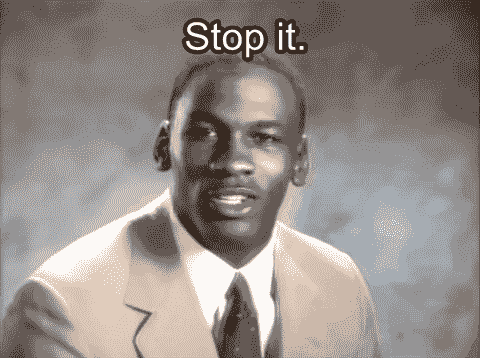
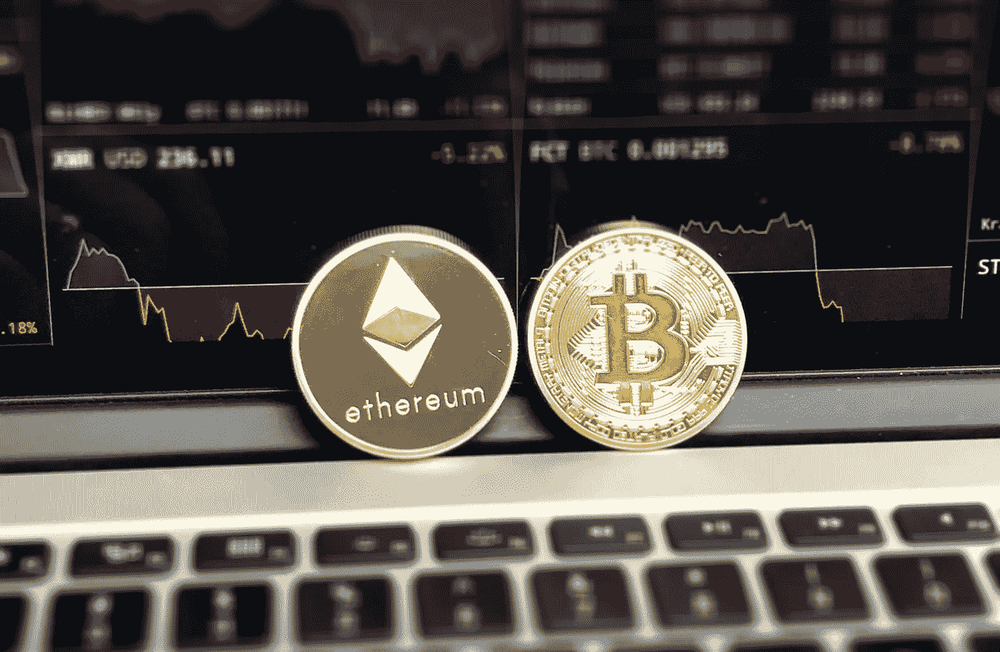

# 为什么传播 FUD 是加密市场最糟糕的事情

> 原文：<https://medium.com/coinmonks/why-spreading-fud-is-the-worst-thing-you-can-do-for-the-crypto-market-570157471fab?source=collection_archive---------3----------------------->

FUD 代表“恐惧、不确定和怀疑”。这是散户投资者看到自己的投资下降时的一种心态。这在市值较低的硬币中尤其明显，定期预期的下跌导致这些人声称“*这种硬币正在死去或死亡。*

## 你只是在伤害你自己

对那些人——**别说了**。你表达怀疑对任何人都没有帮助，我很快会解释为什么。

对于那些在加密市场及其各种基于硬币的社区中度过了一点时间的人来说，我相信你已经看到恐惧的投资者担心他们的投资下降。更糟糕的是，他们在 Discord、Reddit 或 Twitter 上表达了自己的恐惧立场。

这在散户投资者中，甚至在它传播的社区中的长期持有者中，造成了怀疑和不确定性的级联多米诺骨牌效应。导致许多看到下跌的人用他们的纸手恐慌抛售，而他们通常会购买，或者至少用 10，000 颗钻石的意志力持有。

## 饼干是如何碎的

原因是我提到的连锁多米诺效应。1 人 FUDS 不睦而卖，3 人多见之，开始 FUD，也卖。随着这种反应的扩大，下降变得更严重，并导致更多的 FUD；只需要一个人就能开始这一切。

在这种情况下，您可以做的两件最好的事情是:

1.继续 HODL，不采取任何行动

2.买蘸酱！

## 爆炸了！去月球！抛物线！

现在，这种负面现象的对立面是我们都喜欢的——当你的硬币或代币起飞时，整个社区都在欢呼和炒作！我写这篇文章的目的是尽量减少那些传播 FUD 的人，最大限度地炒作。

每个人都希望他们各自的硬币去月球，并继续永远上升。令人难以下咽的事实是，股价下跌非常普遍；加密货币市场像呼吸一样循环运作。大多数时候，当市场上涨时，一切都会上涨。

除了 XRP，去他妈的一团糟(我当然是在开玩笑，我希望他们的诉讼能有个好结果。)

## 循环往复，一次又一次

然后，当市场下跌时，猜猜其他大多数东西会怎么做。这是一个正常和持续的事件序列；它们被称为修正。下跌也可能是许多人(或鲸鱼)出售他们的包包的副产品，甚至是一些在加密空间广泛传播的负面消息。

对于较大的加密货币来说，下跌和修正已经相当具有破坏性，但对于较小的 alt 币来说，它们可能是灾难性的。

这就是为什么把你的 FUD 留给自己很重要的原因，如果有任何事情继续传播积极和炒作。假装直到你成功，伙计们。或者你可以依靠另一个童年格言——如果你没有什么好话要说，那就什么都不要说。

Up, Down, Up, Down. It’s gonna happen, might as well roll with it.

## 把你的眉头拧下来

总之，请试着保持乐观。如果你不能，那就努力不要传播你那充满 FUD 色彩的观点。如果被别人发现，最终只会损害你的投资。

感谢您的阅读，我希望这能引起你们中一些人的共鸣。保持乐观！

我接受以太坊形式的写作技巧。然而，阅读我的作品不需要任何提示。只有当你觉得自己很慷慨并且负担得起的时候。

非常感谢，敬请期待更多。

以太坊小费钱包地址:0x 6522 da 07 f 7d 7 Fe 2d 24 a2 f 4513 Fe 96569 f 836479 c