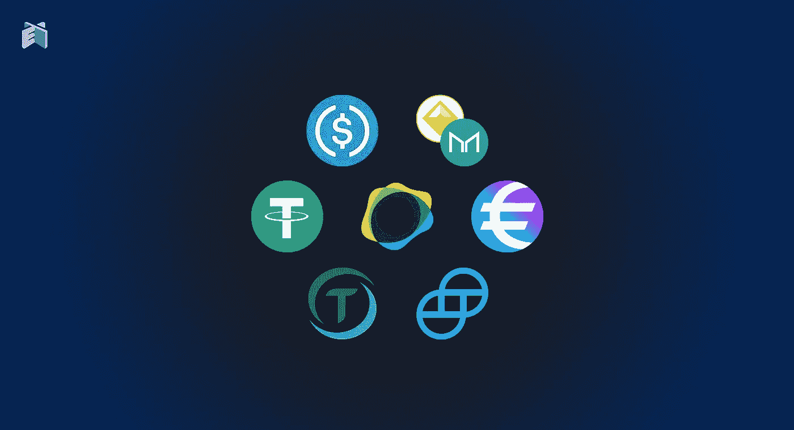

# 为什么稳定的货币不能保持钉住汇率

> 原文：<https://medium.com/coinmonks/why-stablecoins-will-not-be-able-to-maintain-the-peg-fb07327999dc?source=collection_archive---------6----------------------->

## 不可避免的崩溃

稳定的货币与另一种货币挂钩。通常，这是美元。在密码市场，我们目前拥有 1000 亿美元的稳定密码，接近整个行业市值的 10%。

所有联系汇率安排都面临困境，这使人们对政策制定者维持联系汇率的能力产生了怀疑。

-哈里斯·德拉斯(伯恩大学教授)——[资料来源](https://www.jstor.org/stable/1049783?item_view=read_online&refreqid=excelsior%3Ae42e121afdc16fd9010d8eaf4da93b42) (2002 年)

纵观历史，人们曾多次试图将一国货币与另一国货币挂钩。盯住美元通常是固定的，结果往往是灾难性的失败。

国家法定货币，如阿根廷比索、泰国铢、黎巴嫩镑和许多其他货币都与美元挂钩，完全无法维持挂钩，货币崩溃。通胀通常会上调，因为在盯住美元政策失败后，央行的第一反应是增加货币供应。

# 浮动和固定加密货币

加密货币行业的稳定货币是一个类似于与美元挂钩的法定货币的概念。

正如外汇市场(Forex)一样，加密货币也根据其汇率分为两种不同的类型。

## **浮动加密货币**

浮动加密货币(非稳定货币)旨在实现更高的采用水平，因为网络效应为系统提供了更高的价值。每个区块链项目中的这个值都显示在基础加密货币的价格中。

## **威胁:**

加密货币的价格取决于政府的规定和接受程度。全面禁止(印度，2018 年)或贸易限制(中国，2017 年)等负面监管导致用户减少，从而减少需求。

一些顶级加密货币(BTC、BCH、长期加密货币)的固定供应有助于抵御较低的需求水平，并在稍后恢复。其他供给低通胀的加密货币(以太坊)也能找到支撑，不会完全崩溃。

然而，需求对供应同样至关重要，网络效应将加密货币的价格推至更高水平。加上有限的供应，它造成了大规模的波动。

我反对库存流向模型的一个重要原因是，它没有考虑需求，也没有包含网络效应。这也是我拒绝将 BTC 作为投资的原因，因为 BTC 的资产缺乏效用，而其他分散的区块链网络的网络效应从长期来看提供了更好的机会和风险/回报比。

## **固定加密货币**

稳定的货币与法定货币挂钩，通常是美元。它们也分为两个不同的类别:

*   公司稳定积分(USDT、USDC、天秤座)
*   分散稳定社区

Libra 是 facebook 试图创造一种受监管的平行货币，与一篮子货币挂钩。2020 年末，它将名称改为 Diem，并推动监管机构接受它，然而，它看起来已经像一个死亡的项目。

美国政府和美联储绝不会接受私人实体发起对美元的竞争，尤其是在加密货币已经被视为威胁的时候。

私营公司创造的中央集权货币需要得到政府的同意和认可才能运行。他们面临着生死存亡的问题，以防无法说服金融监管当局。USDT、USDC 和其他稳定的城市是中央集权的，受母公司控制。

从这个意义上说，这对一种稳定的硬币来说更糟糕，因为如果美国政府决定让它停止存在，它就可以停止存在。这与美国政府发行并最终关闭“ [Liberty Reserve](https://en.wikipedia.org/wiki/Liberty_Reserve) ”或“E-Gold”没有什么不同。被集中就等于受制于监管机构，同时运营商还可能被指控财务违规和欺诈。

此外，稳定的货币必须维持其固定汇率。在市场下跌期间，这可能是一个挑战。稳定币主要用于交易所交易。它们帮助交易所减少了所需的巨额银行存款，并在市场上提供了更多的流动性。

维持联系汇率还需要有同等价值的资产作为抵押品。这需要发行这些稳定币的母公司完全透明，而这是顶级稳定币 USDT 多年来一直避免的。

## 【戴】戴

DAI 是一个运行在以太网上的分散智能契约，它有一个有趣的抵押品系统。这是一个由 MakerDAO 创建的系统，其概念旨在降低高波动性带来的风险。投资者以 MakerDAO(主要是 ETH)接受的资产作抵押，并返还戴作为回报。

这是一个我仍在研究的系统，并试图彻底理解它可能产生的潜在影响。但它是基于非常不稳定的储备资产(以太坊和 ERC20 代币)，暂时没有真正的经济应用。MakerDAO 有想法将某些类型的真实资产作为抵押品，这将弥合传统经济和 DeFi 之间的差距。它也是去中心化的和抵制审查的，这使得它可能是目前为止所有稳定的内容中最好的选择。

# 结论

与美元挂钩的法定货币没有任何问题，因为它们得到了蓬勃发展的经济的支持。几十年来，中国一直盯住美元，直到上个十年，它才决定缓慢调整汇率。人民币相对于美元的估值被认为受到抑制。这是为了增加中国的出口和 GDP 增长。

在比特币出现之前，之前所有创造数字货币的尝试都失败了，主要是因为它们的集中化特征。一个管理员就能阻止交易并关闭整个网络。目前大多数稳定的内容都是集中的，可以被审查。

P2P 交易网络和区块链让比特币能够绕过任何政府审查，并提供了一个现代支付网络，赋予个人权力，将国家和银行从交易等式中移除。

世界各地的金融法规都禁止未经授权发行任何形式的新货币。Stablecoins 是完全全球化的加密货币行业中的集中化实体。

Tether 在 2016 年发行了 USDT，在市场上创造了这个新的类别，stablecoins，从那以后他们一直在增加自己的市场主导地位。我已经在这篇文章中解释了我对泰瑟的 USDT 的想法和立场:[泰瑟($USDT):一场等待发生的事故](https://read.cash/@Pantera/tether-usdt-an-accident-waiting-to-happen-43a8d733)。

稳定的货币与另一种货币挂钩，通常是法定货币。大多数货币都与美元挂钩，历史告诉我们，金融监管机构不喜欢与国家法定货币竞争。

除了目前稳定密码资产的**集中状态**，**的第二个缺点是支持这些稳定密码所需的底层资产**。储备应该等于稳定货币的总市值，然而，我们经常看到它们缺乏透明度，母公司无法提供足够的证据。

此外，用作储备的不稳定资产可能会带来额外的危险。如果储备是极不稳定的资产，那么与美元 1:1 的挂钩可能很难长期维持。

与所有钉住的国家法定货币一样，汇率最终将不得不改变，因为经济正在快速变化，并经历繁荣和萧条的周期。母公司持有的供应代币的燃烧将看起来类似于泰国政府试图维持与美元的挂钩，并通过购买 Bhat 来减少贬值。

*导语图片来自:* [*火神帖*](https://vulcanpost.com/738088/what-makes-stablecoins-different-from-bitcoin-and-other-cryptocurrencies/)

**参考文献:**

*   维基百科:[自由储备](https://en.wikipedia.org/wiki/Liberty_Reserve)
*   维基百科:[网络效应](https://en.wikipedia.org/wiki/Network_effect)
*   Investopedia: [最高汇率](https://www.investopedia.com/articles/forex/061015/top-exchange-rates-pegged-us-dollar.asp)
*   Investopedia: [钉住与浮动货币](https://www.investopedia.com/articles/forex/08/pegged-vs-floating-currencies.asp)
*   JSTOR: [汇率挂钩的崩溃](https://www.jstor.org/stable/1049783?item_view=read_online&refreqid=excelsior%3Ae42e121afdc16fd9010d8eaf4da93b42)

*原发布于*[*https://read . cash*](https://read.cash/@Pantera/why-stablecoins-will-not-be-able-to-maintain-the-peg-1558bd5c)*。*

> 加入 [Coinmonks 电报频道](https://t.me/coincodecap)，了解加密交易和投资

## 另外，阅读

*   [什么是保证金交易](https://blog.coincodecap.com/margin-trading) | [美元成本平均法](https://blog.coincodecap.com/dca)
*   [3 商业评论](/coinmonks/3commas-review-an-excellent-crypto-trading-bot-2020-1313a58bec92) | [Pionex 评论](/coinmonks/pionex-review-exchange-with-crypto-trading-bot-1e459d0191ea) | [Coinrule 评论](/coinmonks/coinrule-review-2021-a-beginner-friendly-crypto-trading-bot-daf0504848ba)
*   [莱杰 vs n rave](/coinmonks/ledger-vs-ngrave-zero-7e40f0c1d694)|[莱杰 nano s vs x](/coinmonks/ledger-nano-s-vs-x-battery-hardware-price-storage-59a6663fe3b0) | [币安评论](/coinmonks/binance-review-ee10d3bf3b6e)
*   [Bybit Exchange 审查](/coinmonks/bybit-exchange-review-dbd570019b71) | [Bityard 审查](/coinmonks/bityard-review-7d104239be35) | [CoinSpot 审查](https://blog.coincodecap.com/coinspot-review)
*   [3 commas vs Cryptohopper](/coinmonks/3commas-vs-pionex-vs-cryptohopper-best-crypto-bot-6a98d2baa203)|[赚取加密利息](/coinmonks/earn-crypto-interest-b10b810fdda3) | [网格交易机器人](https://blog.coincodecap.com/grid-trading)
*   最好的比特币[硬件钱包](/coinmonks/the-best-cryptocurrency-hardware-wallets-of-2020-e28b1c124069?source=friends_link&sk=324dd9ff8556ab578d71e7ad7658ad7c) | [BitBox02 回顾](/coinmonks/bitbox02-review-your-swiss-bitcoin-hardware-wallet-c36c88fff29)
*   [block fi vs Celsius](/coinmonks/blockfi-vs-celsius-vs-hodlnaut-8a1cc8c26630)|[Hodlnaut 审核](/coinmonks/hodlnaut-review-best-way-to-hodl-is-to-earn-interest-on-your-bitcoin-6658a8c19edf) | [KuCoin 审核](https://blog.coincodecap.com/kucoin-review)
*   [CoinLoan 评论](/coinmonks/coinloan-review-18128b9badc4) | [YouHodler 评论](/coinmonks/youhodler-4-easy-ways-to-make-money-98969b9689f2) | [BlockFi 评论](/coinmonks/blockfi-review-53096053c097)
*   最好的[加密税务软件](/coinmonks/best-crypto-tax-tool-for-my-money-72d4b430816b) | [硬币追踪评论](/coinmonks/cointracking-review-a-reliable-cryptocurrency-tax-software-5114e3eb5737)
*   [Stackedinvest 评论](https://blog.coincodecap.com/stackedinvest-review) | [北海巨妖评论](/coinmonks/kraken-review-6165fc1056ac) | [期货交易机器人](/coinmonks/futures-trading-bots-5a282ccee3f5)
*   最佳[加密借贷平台](/coinmonks/top-5-crypto-lending-platforms-in-2020-that-you-need-to-know-a1b675cec3fa) | [杠杆令牌](/coinmonks/leveraged-token-3f5257808b22)
*   最佳[加密制图工具](/coinmonks/what-are-the-best-charting-platforms-for-cryptocurrency-trading-85aade584d80) | [最佳加密交易所](/coinmonks/crypto-exchange-dd2f9d6f3769)
*   [如何在印度购买比特币？](/coinmonks/buy-bitcoin-in-india-feb50ddfef94) | [瓦济里审查](/coinmonks/wazirx-review-5c811b074f5b) | [HitBTC 审查](/coinmonks/hitbtc-review-c5143c5d53c2)
*   [WazirX vs coin dcx vs bit bns](/coinmonks/wazirx-vs-coindcx-vs-bitbns-149f4f19a2f1)|[block fi vs coin loan vs Nexo](/coinmonks/blockfi-vs-coinloan-vs-nexo-cb624635230d)
*   [本地比特币审核](/coinmonks/localbitcoins-review-6cc001c6ed56) | [加密货币储蓄账户](https://blog.coincodecap.com/cryptocurrency-savings-accounts)
*   [比特币基地评论](/coinmonks/coinbase-review-6ef4e0f56064) | [德里比特评论](/coinmonks/deribit-review-options-fees-apis-and-testnet-2ca16c4bbdb2) | [FTX 评论](/coinmonks/ftx-crypto-exchange-review-53664ac1198f)
*   [n rave ZERO Review](/coinmonks/ngrave-zero-review-c465cf8307fc)|[phe MEX Review](/coinmonks/phemex-review-4cfba0b49e28)|[PrimeXBT Review](/coinmonks/primexbt-review-88e0815be858)
*   [最佳加密交易信号电报](/coinmonks/best-crypto-signals-telegram-5785cdbc4b2b) | [MoonXBT 评论](/coinmonks/moonxbt-review-6e4ab26d037)
*   [Godex.io 审核](/coinmonks/godex-io-review-7366086519fb) | [邀请审核](/coinmonks/invity-review-70f3030c0502) | [BitForex 审核](/coinmonks/bitforex-review-c4bb28d9e271)