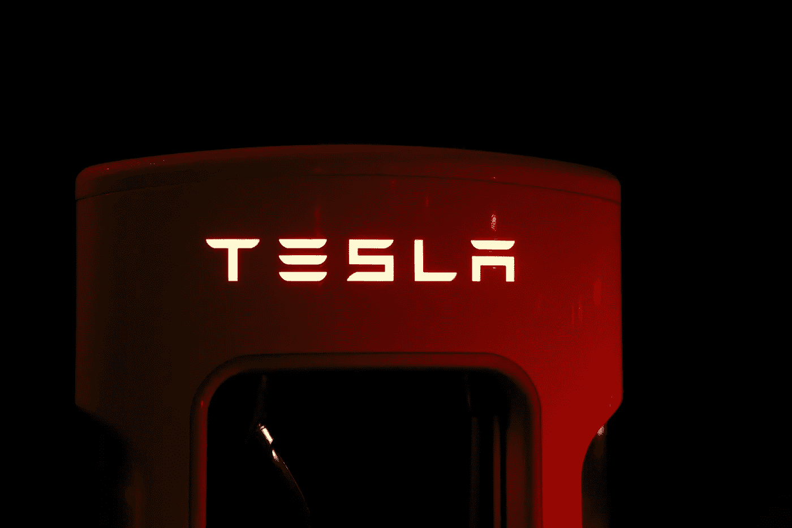
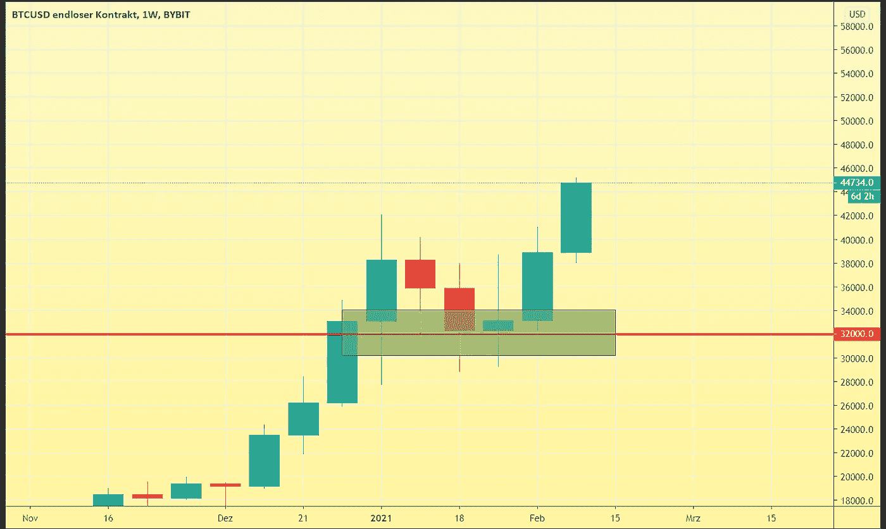
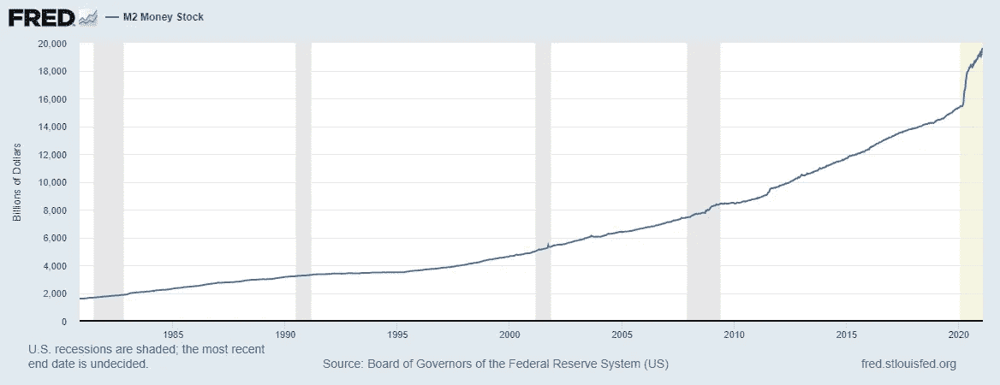
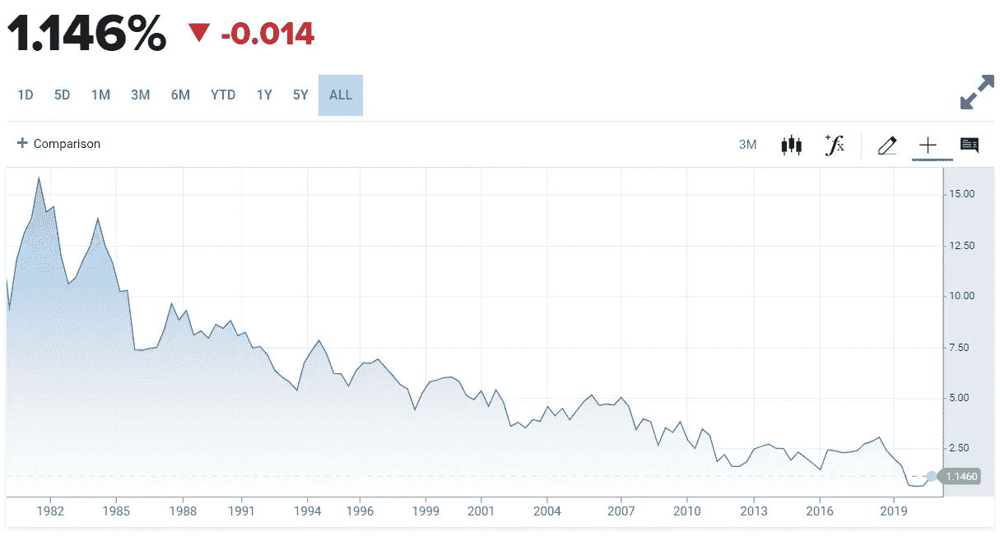
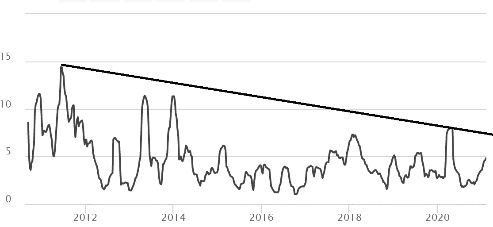
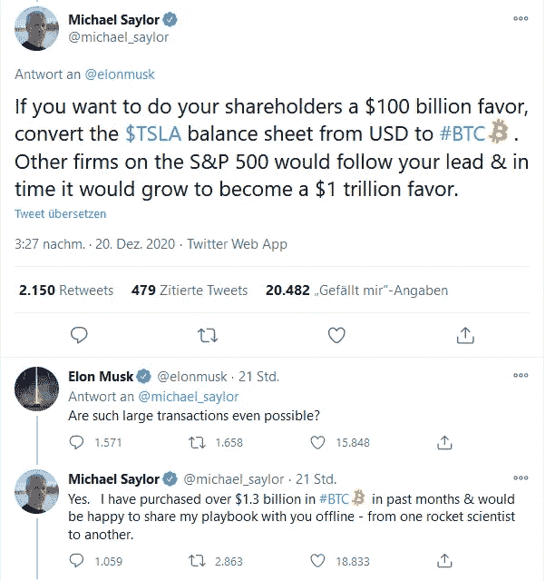

# 为什么特斯拉的比特币赌注实际上比你想象的更有意义

> 原文：<https://medium.com/coinmonks/why-teslas-bitcoin-bet-is-actually-more-significant-than-you-think-fb72c5120a39?source=collection_archive---------3----------------------->

## 这可能导致范式转变的 5 个原因

Photo by Pixabay from Pexels

当一份 [SEC 文件](https://www.sec.gov/ix?doc=/Archives/edgar/data/1318605/000156459021004599/tsla-10k_20201231.htm#ITEM_1_BUSINESS)公之于众，特斯拉公司宣布他们以 15 亿美元购买了比特币，并将其记入资产负债表时，加密社区迎来了爆炸性新闻。他们还计划接受比特币支付。由于他们是一家上市公司，他们必须每年通过美国证券交易委员会披露他们的持股和意图。投资者有机会根据这份公开报告调整他们的决策。尽管 stonks 只上升，你应该做你的研究！

特斯拉拥有多少比特币？嗯，我们还不知道他们是在 2021 年 1 月购买的，我们必须等到明年或者等到埃隆在推特上告诉我们。我认为一个选择比另一个更有可能。我们知道的一件事是，在 1 月份有一个大约 32000 美元的巨大需求区域，这可能是特斯拉的出价，根据平均价格，我们将看到一个巨大的 46875 BTC。尽管投资本身在数量上已经很大胆，但它将能够重塑企业的财务状况。它还可能使比特币正常化、合法化，并作为一种价值储存手段发展壮大。

Screenshot from www.tradingview.com

# 特斯拉的决定有什么启示？

鉴于这个重大新闻，我们应该更仔细地看看比特币经济将会发生什么，以及对其他大公司的结论。

## 埃隆太大了，不能倒

特斯拉带着他们 8%的现金或现金等价物进入[。他们计划加入到这个堆栈中。他们还拥有当前比特币供应量的 0.25%(如果你扣除假设丢失的硬币，则为 0.32%)。两者都是大男孩数字。在接下来的监管过程中，美国监管机构将会更加谨慎和深思熟虑。知道美国投资者会受到损失的强烈影响将是比特币友好监管的一个因素。许多拥有大量美国国债的大公司可能会效仿特斯拉，实施严格的监管以压低比特币价格的难度将日益加大，因为这将严重影响上述公司的价值。](https://www.cnbc.com/2021/02/08/tesla-buys-1point5-billion-in-bitcoin.html)

## 传统的国债策略将难以为继

传统保守的美国国债中最大的头寸是现金和债券。鉴于目前两个市场的形势以及央行利率的不断下降，这两种情况都将变得更加难以自圆其说。传统上最安全的投资，现在可能只有贬值才是最安全的。美元[年复一年](https://howmuch.net/articles/rise-and-fall-dollar)贬值，看看下图中的 M2 曲线，可能不会很快好转。 [M2 供应量](https://www.investopedia.com/terms/m/m2.asp)从 20 年 3 月的 15500 猛增至 21 年 1 月的 19500。一年内增长了 25%。你不必了解国民经济就能看出我们正在通过印刷走出危机。债券利率持续下降，在某些情况下甚至为负(德国为 0.44%)。债券在过去可能是有吸引力的工具，但我认为这些在未来不会是理想的回报。10 年期美国债券 1146%的回报甚至没有超过有争议的官方通胀率【2020 年 1.4%。

[https://fred.stlouisfed.org/series/M2](https://fred.stlouisfed.org/series/M2)

[https://www.cnbc.com/quotes/US10Y](https://www.cnbc.com/quotes/US10Y)

## 资产越大，风险越小

随着比特币的市值仅在 2020 年就增长了 370%(在最近的埃隆注资后增长了 22%)，随着我们接近 1 万亿大关，该资产对机构投资者更具吸引力，因为小实体将无法轻松操纵价格。宏观波动趋势是向下的，虽然这可能意味着每年的回报递减，但也将刺激机构和公司的投资意愿。随着价格上涨和波动性放缓，BTC 将对他们更具吸引力。

[https://www.buybitcoinworldwide.com/volatility-index/](https://www.buybitcoinworldwide.com/volatility-index/)

## 过程的不确定性消失了

埃隆做到了，那么其他人也可以做到。迈克尔·塞勒也做到了。Saylor 自己公司的股票自上市以来上涨了 700%。可能性的问题是不可能的。也没有人会责怪下一任首席执行官为财政部购买比特币，因为他是第一个用股东的钱承担如此前所未有的风险的人。迈克尔·塞勒为企业举办了一次比特币会议，并在 www.hope.com 公开了所有资源。到目前为止，每个问题都有一个经过测试的剧本。保管，正式备案，营销。埃隆马斯克(Elon Musk)和迈克尔塞勒(Michael Saylor)都为他们的继任者消除了这一过程中的风险。

[https://redaktion.onvista.de/wp-content/uploads/2020/12/saylor.png](https://redaktion.onvista.de/wp-content/uploads/2020/12/saylor.png)

## 股东要求参与数字化的压力

如果你是一名首席执行官，有一些闲钱，因为你今年不能为员工举办大型圣诞派对，或者有几十亿美元的投资，那么从现在开始，你应该计划一些时间在董事会上谈论比特币。因为你的股东会开始质疑。比特币通常被描述为数字黄金。现在原黄石公园的市值接近 12 万亿美元。虽然它是模拟的，很难随身携带，我们还不知道它的最终供应。如果你挖得更快，你会发现更多。有着 5000 年的历史记录。另一方面，比特币是数字的，易于发送，编程的最终供应量为 2100 万。2140.如果你试图挖掘更多，比特币的协议将使其更难找到区块，并通过这一过程在时间和数量上调节供应。有着 12 年的记录。

毫无疑问，在数字时代，我们将很快找到一种新的方式来[储存货币能量](https://lennartheinrichs.medium.com/3-ways-to-create-monetary-energy-f44649fd613d)。想想我们的孙辈会用我们藏在某个金库里的贵重金属来做这件事，这有多荒谬？比特币不仅是更优雅、更有潜力的解决方案，而且与黄金相比，就像互联网与传真机相比一样。

# 下一个是谁？

在我们看到早期采用者法案之后，是时候让其他人采取行动了。这可能是显而易见的，但我认为我们会看到越来越多的公司将现金转移到比特币上，原因我刚刚谈到了。但是让我们推测一下。谁会是下一个目标，我们在谈什么样的投资？数据来自 2020 年底，来源为[宏观趋势](https://www.macrotrends.net/)。

**特斯拉:**当他们开始购买时，手头的现金约为 150 亿美元，未来可能会购买更多。可能会尽量不超过总分配的 10%。

**Alphabet(谷歌):**坐拥一堆约 1370 亿的现金。与他们的国库规模相比，类似规模的投资加起来大约是特斯拉收购金额的 10 倍。这会破坏互联网。谷歌的收购也会让登月任务的价格飙升，而且没有回报。

苹果公司:手头现金约为 770 亿美元。未来的投资是可能的。与 apple pay 集成作为第三方支付系统是一种可能性。

**亚马逊:**谁知道亚马逊不能做什么？也许在脸书推出 DIEM 后，他们会带着自己的货币出现。比特币将是很好的抵押品。他们在银行有大约 850 亿英镑的现金存款。

**脸书:**DIEM 计划于今年推出，我们将看看它对采用意味着什么。他们有 620 亿自由现金。

**微软:**希望比尔不要和他的朋友沃伦过多谈论比特币，沃伦称比特币为[【老鼠药平方】](https://money.cnn.com/2018/05/07/investing/warren-buffett-bitcoin/index.html)。他们国库中 1320 亿美元现金的一部分将对比特币产生巨大影响。

**秘密最爱:**更有可能投资比特币的是 **PayPal** 和 **Square。**他们要么已经投资了比特币，要么即将投资比特币。加密社区中的一个传言是甲骨文公司的一项投资。他们的国库接近 400 亿英镑，是埃隆的两倍多。

除了 Square，这些公司的资金都比特斯拉多，它们的参与也比特斯拉更有意义。与消费者或其他行业相比，科技公司更有可能在短期内采用比特币。沃尔玛和可口可乐是目前难以想象的候选者。只有时间能告诉我们，路已经铺好了，要继续走下去。当前演变的重要性不应被低估，这是对所有倾向于将比特币理解为提高既定标准的一种方式的人的有力证实。

***法律声明:*** *本人不是理财顾问。这里给出的意见不是财务建议，尽管我的兴奋可能会让它看起来像这样。做好自己的尽职调查。尽管所有事实都经过了仔细研究，但此内容仅用于娱乐目的。*

> 加入 T21 电报集团，学习加密交易和投资

## 另外，阅读

*   什么是[闪贷](https://blog.coincodecap.com/what-are-flash-loans-on-ethereum)？
*   最好的[密码交易机器人](/coinmonks/crypto-trading-bot-c2ffce8acb2a) | [网格交易](https://blog.coincodecap.com/grid-trading)
*   [3 商业评论](/coinmonks/3commas-review-an-excellent-crypto-trading-bot-2020-1313a58bec92) | [Pionex 评论](/coinmonks/pionex-review-exchange-with-crypto-trading-bot-1e459d0191ea) | [Coinrule 评论](https://blog.coincodecap.com/coinrule-review-a-perfect-trading-bot)
*   [AAX 交易所评论](/coinmonks/aax-exchange-review-2021-67c5ea09330c) | [德里比特评论](/coinmonks/deribit-review-options-fees-apis-and-testnet-2ca16c4bbdb2) | [FTX 交易所评论](/coinmonks/ftx-crypto-exchange-review-53664ac1198f)
*   [n 零复习](/coinmonks/ngrave-zero-review-c465cf8307fc) | [Phemex 复习](/coinmonks/phemex-review-4cfba0b49e28) | [PrimeXBT 复习](/coinmonks/primexbt-review-88e0815be858)
*   [Bybit Exchange 审查](/coinmonks/bybit-exchange-review-dbd570019b71) | [Bityard 审查](https://blog.coincodecap.com/bityard-reivew) | [CoinSpot 审查](https://blog.coincodecap.com/coinspot-review)
*   [3Commas vs Cryptohopper](/coinmonks/3commas-vs-pionex-vs-cryptohopper-best-crypto-bot-6a98d2baa203)
*   最好的比特币[硬件钱包](/coinmonks/the-best-cryptocurrency-hardware-wallets-of-2020-e28b1c124069?source=friends_link&sk=324dd9ff8556ab578d71e7ad7658ad7c) | [BitBox02 回顾](/coinmonks/bitbox02-review-your-swiss-bitcoin-hardware-wallet-c36c88fff29)
*   [莱杰 vs n rave](https://blog.coincodecap.com/ngrave-vs-ledger)|[莱杰 nano s vs x](https://blog.coincodecap.com/ledger-nano-s-vs-x)
*   [密码拷贝交易平台](/coinmonks/top-10-crypto-copy-trading-platforms-for-beginners-d0c37c7d698c) | [比特码拷贝交易](https://blog.coincodecap.com/bityard-copy-trading)
*   [Vauld 审查](https://blog.coincodecap.com/vauld-review) | [YouHodler 审查](/coinmonks/youhodler-4-easy-ways-to-make-money-98969b9689f2) | [BlockFi 审查](/coinmonks/blockfi-review-53096053c097)
*   最好的[加密税务软件](/coinmonks/best-crypto-tax-tool-for-my-money-72d4b430816b) | [硬币追踪评论](/coinmonks/cointracking-review-a-reliable-cryptocurrency-tax-software-5114e3eb5737)
*   最佳[加密借贷平台](/coinmonks/top-5-crypto-lending-platforms-in-2020-that-you-need-to-know-a1b675cec3fa) | [杠杆代币](/coinmonks/leveraged-token-3f5257808b22)
*   [莱杰纳米 S vs 特雷佐 one vs 特雷佐 T vs 莱杰纳米 X](https://blog.coincodecap.com/ledger-nano-s-vs-trezor-one-ledger-nano-x-trezor-t)
*   [BlockFi vs 摄氏](/coinmonks/blockfi-vs-celsius-vs-hodlnaut-8a1cc8c26630) | [霍德瑙特评论](https://blog.coincodecap.com/hodlnaut-review)
*   [Bitsgap 审查](/coinmonks/bitsgap-review-a-crypto-trading-bot-that-makes-easy-money-a5d88a336df2) | [Quadency 审查](/coinmonks/quadency-review-a-crypto-trading-automation-platform-3068eaa374e1)
*   [埃利帕尔泰坦评论](/coinmonks/ellipal-titan-review-85e9071dd029) | [赛克斯斯通评论](https://blog.coincodecap.com/secux-stone-hardware-wallet-review)
*   [DEX Explorer](https://explorer.bitquery.io/ethereum/dex) | [区块链 API](https://explorer.bitquery.io/graphql)|[本地比特币评论](https://blog.coincodecap.com/localbitcoins-review)
*   最佳[区块链分析](https://bitquery.io/blog/best-blockchain-analysis-tools-and-software)工具| [赚比特币](https://blog.coincodecap.com/earn-bitcoin)
*   [加密套利](/coinmonks/crypto-arbitrage-guide-how-to-make-money-as-a-beginner-62bfe5c868f6)指南:新手如何赚钱
*   最佳[加密制图工具](/coinmonks/what-are-the-best-charting-platforms-for-cryptocurrency-trading-85aade584d80) | [最佳加密交易所](/coinmonks/crypto-exchange-dd2f9d6f3769)
*   了解比特币最好的[书籍有哪些？](/coinmonks/what-are-the-best-books-to-learn-bitcoin-409aeb9aff4b)

> [直接在您的收件箱中获得最佳软件交易](/coinmonks/newsletters/coinmonks)

