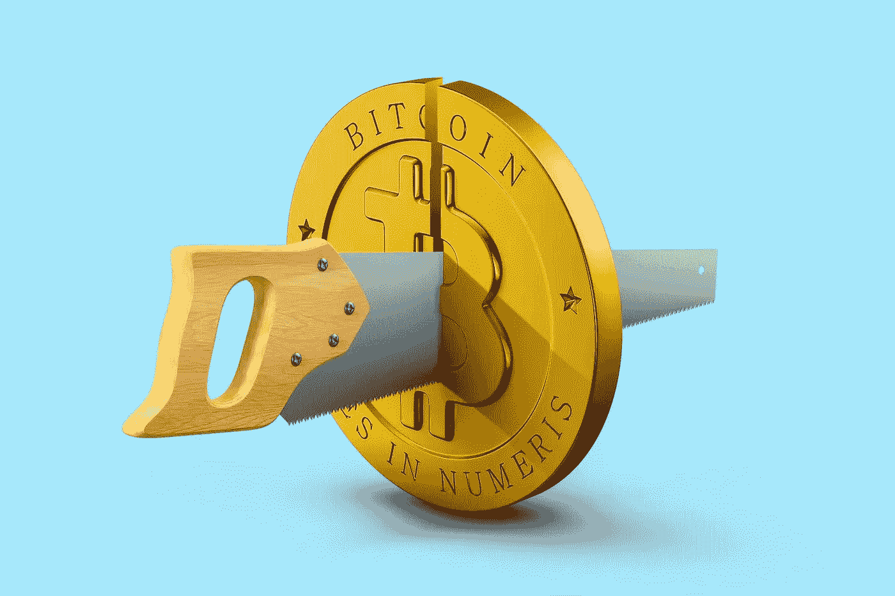

# 为什么密码去中心化的最大威胁不是监管

> 原文：<https://medium.com/coinmonks/why-the-biggest-threat-to-decentralisation-in-crypto-isnt-regulation-c71cfa19ab3c?source=collection_archive---------1----------------------->

Image by [Morning Brew on Unsplash](https://unsplash.com/photos/6oUXzAmHaPI)

> 不是你的钥匙，不是你的密码

任何一个加密货币领域的狂热追随者都会遇到一两次这种说法。

这是比特币诞生的主要目的之一的核心信仰者一遍又一遍重复的一句话。