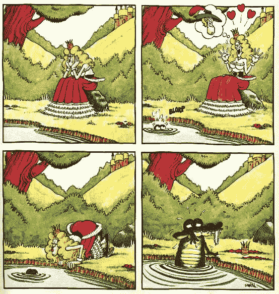
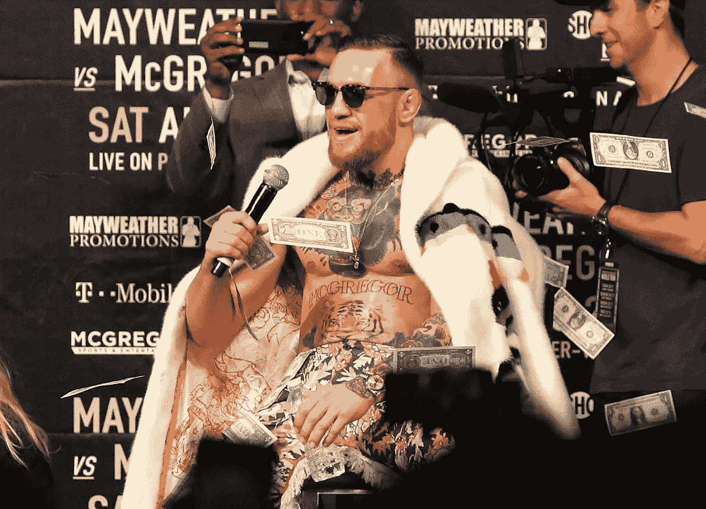
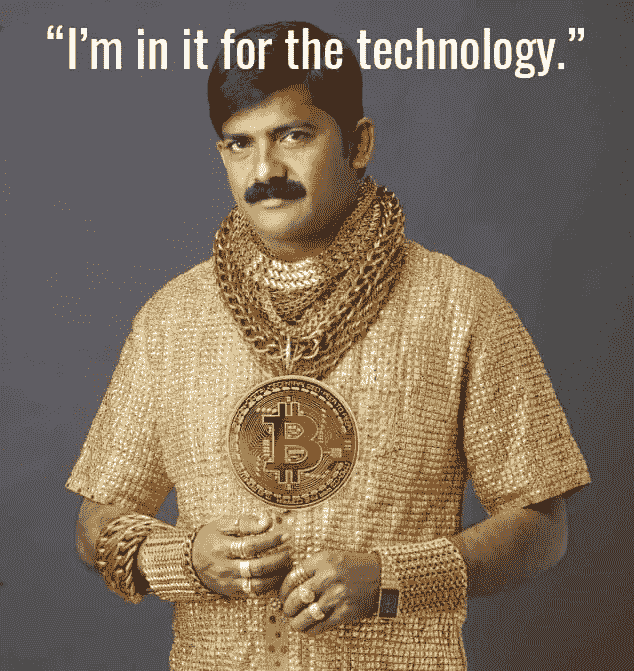

# 为什么媒体喜欢比特币&这说明了我们什么

> 原文：<https://medium.com/coinmonks/why-the-media-loves-cryptocurrencies-what-that-says-about-us-8dd2f8d6c314?source=collection_archive---------8----------------------->

很简单吧？一切都是为了钱。这是真的，但我相信它远不止如此，因为加密货币的吸引力实际上是围绕着人类的野心。请允许我在全面论述这项声明之前先离题。我向你保证，这个切线是相关的，更重要的是值得你的时间。毕竟，这不就是所有好故事(并不意味着这是其中之一)的内容吗:在建立预期后，实现解决问题的承诺。

[Anticipation](http://www.justriddlesandmore.com/Comics/anticipation.html)

除了爱情和联系的故事，我们都可以联系到的其他故事是金钱的故事(尽管有些人会认为后者导致前者)。加密货币之所以能够吸引全世界的注意力，不是因为其底层技术本身，而是因为围绕它的故事。这些叙事反过来为人类情感提供了充足的空间，而人类情感与财富和权力深深交织在一起。因此，围绕加密货币的许多兴趣总是依赖于超越技术细节，以便与人类情感的核心真理相关联:

*   我们的好奇心让我们想象未来的可能性，我们是如此的富有，以至于有些东西是我们的钱买不到的
*   我们对神秘事物的热爱让我们不断猜测这项新技术的神秘起源，以及这个故事将如何结束
*   我们对冒险的需求继续把我们拉进这个故事，希望不要错过这个一生一次的旅程
*   我们对正义的吸引力是希望相信一个优雅的民主解决方案，这个方案将推翻过去对我们犯下错误的既定机构

难怪许多人已经抓住了这一正在进行的神秘和正义的叙事，只要有足够的勇气或足够的愚蠢(取决于你如何看待它)，他们就可以轻松地参与这场将定义社会未来的冒险(无论是更民主的社会还是历史上最大的泡沫)。有可能在某个地方拥有一辆蓝宝也没有坏处。安德鲁·斯坦顿(《海底总动员》和《瓦力》的作者)在下面的引用中完美地抓住了这一点:

> “最伟大的故事戒律，……‘让我关心’——请从情感上、智力上、美学上，让我关心吧”

**没人(除了极客)关心你的区块链**

如果你走到街上，提到比特币，每个人都会有个人观点或朋友的故事，尽管大多数人可能无法定义区块链是什么。就像有多少体育迷从未玩过他们如此热爱的运动一样，吸引他们的不是这项运动本身，而是每场比赛背后的历史和背景。写这篇文章的时候:英格兰将不得不再等 4 年，才有机会高唱'[It ' s Home](https://www.thesun.co.uk/world-cup-2018/6750454/its-coming-home-mean-three-lions-released-baddiel-skinner-the-lightning-seeds-song-about/)'，结束他们 52 年的 FIFA 冠军荒；勒布朗·詹姆斯在背负着克里夫兰球迷的所有希望并不断被队友[失望](https://www.businessinsider.sg/jr-smith-forgets-score-dribbles-clock-game-1-finals-2018-5/?r=US&IR=T)后加入湖人；康纳·麦格雷戈正步迈克·泰森的后尘，发表大量垃圾言论，当然还有“造雨”[图片](https://www.independent.co.uk/sport/general/boxing/mayweather-mcgregor/floyd-mayweather-vs-conor-mcgregor-prize-money-how-much-purse-ppv-numbers-winner-make-sponsorship-a7894376.html)。

Definitely watching it for the sport

这就是为什么美国国旗[下方](http://www.newsflashing.com/crazy/top-10-most-expensive-painting)的画作在一场拍卖会上以 1 . 1 亿美元成交，而你在别处只需花几美元就能轻松买到一面国旗的原因。

When art becomes more than just ‘art’

然而，与艺术作品不同的是，让体育更吸引人的是它的故事总是最新的，容易理解，因此更有关联。体育有能力克服一切界限。你不需要一个共同的语言来理解它。其核心是让一个人或团队的欲望和毅力与另一个人或团队相抗衡。这是一场激情的碰撞，最终会产生一个赢家。这就是为什么国际足联的淘汰赛比资格赛更令人兴奋。

同样，加密货币能够跨越任何文化界限，因为它所需要的只是对货币的理解，而任何现代社会都已经对此有了大量的知识。围绕加密货币的故事已经成为一个关于技术与中间人、无政府主义者与政府、人民与机构之间冲突的故事。由于其内在价值迄今已从物理世界中抽象出来，大多数人已决定对其进行货币估值，以决定这场战斗的赢家。比特币价格的飙升将意味着技术专家、无政府主义者和民主取得了胜利，反之亦然。一如既往，真相总是在中间的某个地方，但这种划分正是加密货币如此分裂的原因，正如我在这里提出的。

> “戏剧是夹杂着不确定性的期待”——威廉·阿彻

一个好故事是不可避免的，但不可预测，因此加密货币的波动性使这个故事更加令人兴奋。加密货币的价格在这个故事中不断变化，这使它保持有趣。

考虑到即使是远程理解区块链技术也需要陡峭的学习曲线，围绕技术的困惑迫使我们去推断和演绎谁是对的，以及我们的演绎是否正确。此外，比特币创造背后的神秘及其与暗网的联系(我强烈推荐[阅读关于丝绸之路创始人罗斯·乌布里希特的](https://www.wired.com/2015/04/silk-road-1/))构成了一个更加有趣的故事。这些无政府主义的开端，加上过去导致许多金融危机的机构自身利益，把我们推到了座位的边缘。实际上，这是一个关于诚实的冲突的失败者的故事，这引起了对真相的怀疑，因此我们要求给这个故事一个结论。

**每个人(包括极客)都关心你的区块链能为他们做什么**

真正将我们推离座位的是区块链开始影响我们的日常生活。按照现在的情况，这很可能是通过投资的货币收益/损失。使这个致富故事与大多数不同的是，由于它的民主设计，这项技术是多么容易获得。

与传统资产市场不同，传统资产市场需要最低资本金额和银行或经纪人的许可才能参与，所有加密货币的参与都需要智能设备和互联网连接。我们已经看到发展中国家跨越计算机技术，在智能手机上进行银行业务，因此可访问性是其中的一个关键因素。

因此，除了监管措施，进入网络的主要障碍(尤其是现在这么多应用程序使得加密货币交易变得容易)是心理障碍。该行业的监管仍然是一项正在进行的工作，这一事实使这一决定更加模糊，因为用户必须适应社会定义的某些灰色区域。这种容易获得和缺乏监管使得资金快速流入和流出该行业，这导致了我们周围的人讲述了许多从赤贫到暴富和从暴富到略好的赤贫的故事。

实际上，这种叙述符合吸引人的故事的许多标准:

*   及时性:主题(金钱，或者更具体地说，交换媒介)总是相关的。在我们目前所处的以消费者为导向的世界中，这一点更是如此
*   邻近性:这项技术很容易获得，并慢慢开始出现在我们周围。参与这个故事只需要下载一个应用程序。
*   影响:与一些人对金钱的看法相反，我仍然宁愿在法拉利里哭，也不愿在自行车上哭。金钱肯定会对我们追求自己的激情产生重大影响。
*   意义:这项技术有可能影响大量的人，这可以从你认识的投资这项技术的人数中推断出来，而且这是在这个行业还很年轻的时候。
*   新颖性:技术本身相对较新，很难理解，因此需要读者自己投资来完成这个谜
*   突出:我们知道的许多社会影响者都受到了这项技术的影响。他们可能是信徒，也可能是怀疑论者，但这种二分法让我们好奇，为什么在各自领域备受尊敬的人会有如此不同的观点。

这终于让我们回到了本文标题中提出的问题。加密货币对主流媒体具有如此大的吸引力，因为它是一个公开邀请任何足够大胆的人加入其叙事的故事。这是一个公开的号召，号召人们参与到一个更激进的，但未经证实的治理形式中，这种形式由于区块链的基础技术而成为可能。对于那些注意到这一呼吁的人来说，这就变成了确认他们的个人信念是正确的，无论这是来自对技术的仔细考虑，还是纯粹基于周围人建议的赌博。对于那些不这样做的人来说，这也是一个证明他们相信他们避免投资是正确的，并阻止他们的朋友投资于它，因为他们害怕被它烧伤的可能性。

无论你站在哪一边，这项技术的无处不在和简单易用确保了一件事，如果你的预测被证明是错误的，那就没什么好责备的了。如果比特币涨了很多倍，而你却无法从中获利，那是因为你无法利用这种对未来的憧憬，尽管现在有很多投资机会。相反，如果比特币崩盘，而你空手而归，那是因为你对未来的预测与现实脱节，你忽视了当今的许多专家。要么是这样，要么你只是基于蓝宝和 FOMO 的梦想而砸钱，不要成为这样的人。

[Tech guy](https://o4uxrk33.com/dqp7qw48?key=fb957c286168b7afe4164ba4e2b54b99)

最终，主流媒体喜欢上了加密货币，就像蜜蜂喜欢蜂蜜一样，因为每一份关于加密货币价格变动的报告都成为我们判断是否正确的指标。我们在等待，我们期待着这个不断发展的故事的结局，哪怕只是为了让自己确信我们做出了正确的决定。就像区块链科技的设想一样，它将我们决策的责任放回我们自己手中，并让我们决定我们生活的故事是否与加密货币的故事交织在一起。

谢谢你坚持到最后。希望听到你的想法/评论，所以请留言。我在 twitter 上很活跃[*@*AwKaiShin](https://twitter.com/awkaishin)*如果你想收到更多易消化的密码相关信息，或者访问我的* [*个人网站*](https://www.awkaishin.com/) *如果你想要我的服务:)*