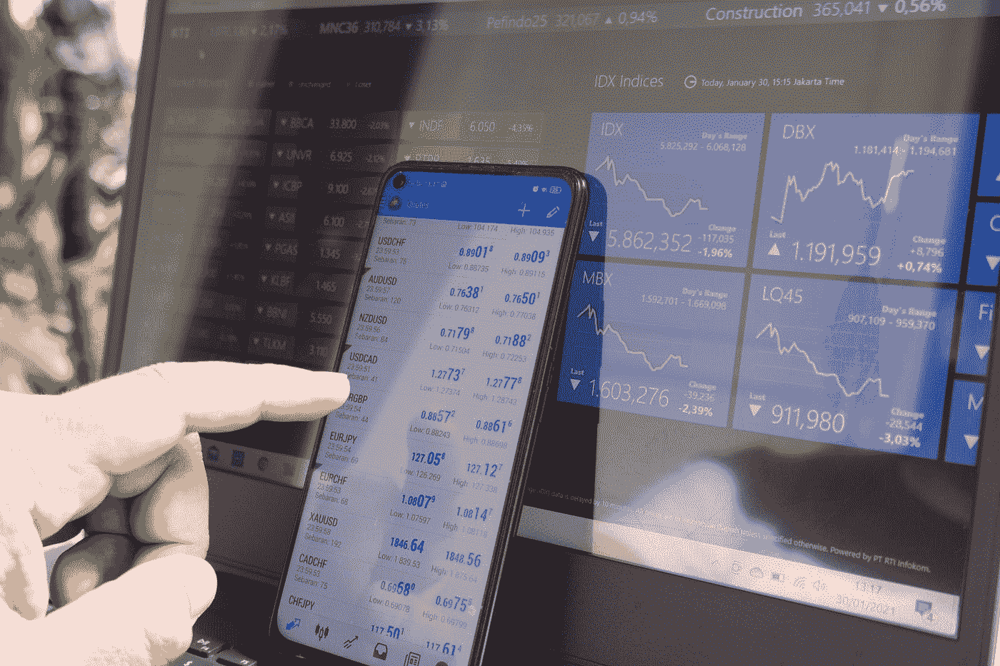

# 为什么图表的技术分析是有用的及其批评

> 原文：<https://medium.com/coinmonks/why-the-technical-analysis-of-charts-is-useful-3ac7745f0069?source=collection_archive---------7----------------------->

Photo by [Marga Santoso](https://unsplash.com/@margabagus?utm_source=medium&utm_medium=referral) on [Unsplash](https://unsplash.com?utm_source=medium&utm_medium=referral)

你可能正在问自己什么是技术分析？

真的有可能根据图表对未来的价格走势做出有根据的预测吗？

如果这些或类似的问题正在你的脑海中盘旋，你渴望得到答案，那么你来对了…