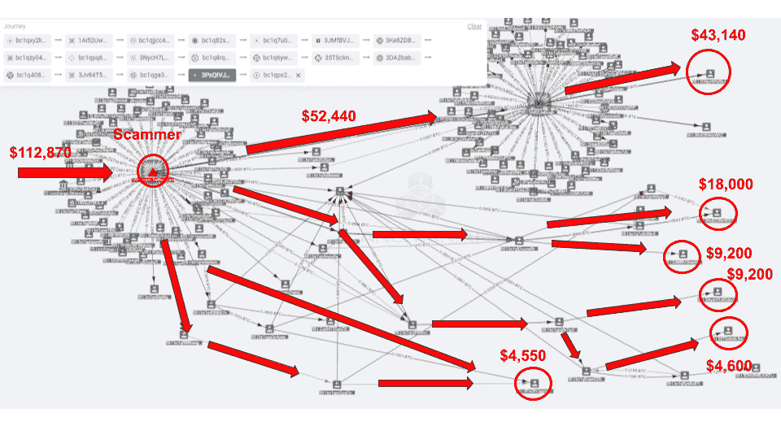
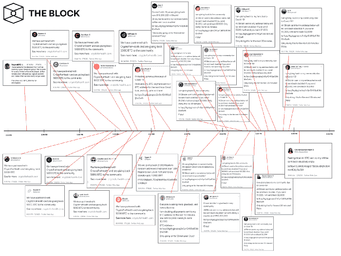
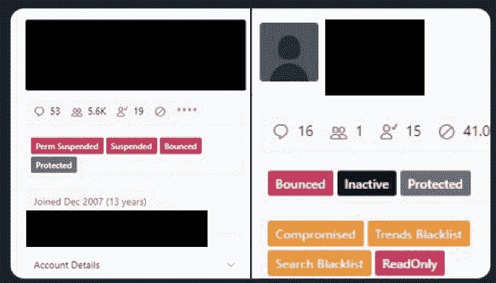

# 为什么 Twitter 的黑客攻击与 Twitter 或比特币无关:它关乎我们在互联网上的身份

> 原文：<https://medium.com/coinmonks/why-twitters-hack-isn-t-about-twitter-or-bitcoin-it-s-about-our-identity-on-the-internet-b4e36fe5e23f?source=collection_archive---------2----------------------->

## 作为[BlockRelations](https://medium.com/u/53bf16fe8912?source=post_page-----b4e36fe5e23f--------------------------------)'[Block bit 系列](/@blockrelations/blogbit-episode-one-1f6cd5b9d49b)的一部分发布，作者 Brian Hough，Block Relations 商业情报局

在所有与疫情、新冠肺炎和全球对我们星球的未来的担忧有关的新闻中，有一件事成功地在全世界引发了新闻，那就是 Twitter 平台上的一次全球黑客攻击。

我们经常把我们的社交平台和账户放在一个不可触及、不可及的基座上，现在很难不这么想。我们生活在一个多因素认证(MFA)、加密密钥、语音授权认证、AI/ML，甚至视网膜扫描、指纹和生物传感器的时代。

不幸的是，我们发现太容易忘记我们全天候依赖的这些服务和技术也是人类的。或者至少，建造它们的人只是人类。人们很容易忘记，黑客攻击可能而且确实经常发生，Twitter 的黑客攻击给互联网上的许多人敲响了警钟。

7 月 15 日，仅仅在两个小时内，许多备受瞩目的 Twitter 账户在一次大范围的网络攻击中遭到破坏。被黑的账户包括前总统[巴拉克·奥巴马](https://medium.com/u/9e422a605dc5?source=post_page-----b4e36fe5e23f--------------------------------)，前副总统[乔·拜登](https://medium.com/u/83aa09df6397?source=post_page-----b4e36fe5e23f--------------------------------)，电视名人金·卡戴珊[，说唱歌手](https://medium.com/u/95dd66ff3416?source=post_page-----b4e36fe5e23f--------------------------------)，微软+开源[联合创始人比尔·盖茨，以及企业家埃隆·马斯克。这些账户总共有数百万追随者，在进入账户一段时间后，被用来发布推文，鼓励追随者将比特币(](https://medium.com/u/940e606ec51a?source=post_page-----b4e36fe5e23f--------------------------------)[比特币杂志](https://medium.com/u/da165ee059da?source=post_page-----b4e36fe5e23f--------------------------------))发送到各个地址。

A graphic from AnChain.Ai, demonstrating how the hackers have begun to distribute the money they took from Twitter users who were hoping to receive Bitcoin from celebrities or companies (Source: [AnChain.Ai](https://www.anchain.ai/))

根据 Larry Cermak 从[街区](https://www.theblockcrypto.com/post/71906/twitter-account-hacks-timeline) ( [街区](https://medium.com/u/94a299693829?source=post_page-----b4e36fe5e23f--------------------------------))发来的报道，Twitter 报道称，网络攻击的目标是 Twitter 员工*“访问内部系统和工具，然后更改与这些账户相关的电子邮件地址。”*

通过操纵 Twitter 自身来促进如此广泛的攻击，黑客们证明了安全之墙是如何通过人为干预和渗透而被攻破的。

A timeline of the compromised Twitter accounts (Source: [The Block](https://www.theblockcrypto.com/post/71906/twitter-account-hacks-timeline))

为了给推特这个动荡的月份划上句号，[肖恩·霍利斯特](https://medium.com/u/408c02840e40?source=post_page-----b4e36fe5e23f--------------------------------)7 月 31 日在 [The Verge](https://www.theverge.com/2020/7/31/21349920/twitter-hack-arrest-florida-teen-fbi-irs-secret-service) 上爆料称，联邦调查局、国税局、美国特勤局和佛罗里达州执法部门已经逮捕了一名来自佛罗里达州坦帕市的 17 岁少年。

根据[文章](https://www.theverge.com/2020/7/16/21327769/twitter-bitcoin-scam-news-updates)，这名黑客被指控为“推特史上最大的安全和隐私泄露事件”的罪魁祸首。此外，司法部正式起诉了另外两名黑客，一名 22 岁的奥兰多人和一名 19 岁的英国人。

在证词中，黑客声称他在 Twitter 的 it 部门工作，并欺骗该公司的一名员工，让他们给他各种证书，不可避免地提供了对随后被入侵账户的自由访问。

后果和影响:

在黑客攻击之后，许多人被比特币、黑客和骗局这些时髦词汇吸引，但在对话中很大程度上没有提到黑客攻击的实际含义。

Redacted screenshot of the leaked Twitter administrative panel used to conduct the scam (Source: [VICE](https://www.vice.com/en_us/article/jgxd3d/twitter-insider-access-panel-account-hacks-biden-uber-bezos?)) [[VICE News](https://medium.com/u/cc93e470890d?source=post_page-----b4e36fe5e23f--------------------------------)]

通过进入完全管理模式，我们知道黑客能够代表被入侵的帐户发帖，但他们也很可能能够看到私人帐户信息。这些信息可能包括电子邮件地址和电话号码、密码、直接信息、保存的推文、列表和其他特定于帐户的信息。特别是如果 Twitter 账户被用来登录其他在线账户，这可能会导致进一步的基于账户的黑客攻击。

这意味着，这一系列黑客行为可能比简单地登录 Twitter 并代表他们发帖更具恶意。此外，它还揭示了网络平台的易受攻击性——它们到底有多“容易被黑客攻击”——不仅从防火墙隐私的角度来看，而且从渗透的角度来看。

这就引出了一个问题…

> 我们如何确保我们的身份是完全分散和安全的，以便没有人可以假装成除了他们自己以外的任何人？

区块链肯定会将自己定位为解决这一严重问题的必要解决方案，因为它能够代表用户授权访问，只有当用户授予/允许这种访问时。

数据、信息和系统治理的集中中心——特别是在 web2 平台和协议中——非常容易受到黑客攻击、入侵和绕过防火墙的影响，因为数据存在于单个位置。

然而，使用区块链技术，数据分布在公共或私有链上，使得信息更加难以泄露。

通过集成一个分散的用户认证协议，web2 平台可以采用一种新的用户认证方式和 web3 功能，以保持他们的用户和他们平台的数据更加安全…

我会有更多关于这个的内容…

感谢阅读！

—

如果你从这篇文章中获得了价值，请**鼓掌**👏，**评论**📝，与**分享** ↩️这篇帖子与你的网络，以及**关注**📲我的 [Twitter](https://twitter.com/BrianHHough) 、 [Medium](/@BrianHHough) 和 [LinkedIn](http://www.linkedin.com/in/brianhhough) 记录了对技术、创新和我们的数字世界的进一步见解。下次见！

## 另外，阅读

*   最好的[密码交易机器人](/coinmonks/crypto-trading-bot-c2ffce8acb2a)
*   [密码本交易平台](/coinmonks/top-10-crypto-copy-trading-platforms-for-beginners-d0c37c7d698c)
*   最好的[加密税务软件](/coinmonks/best-crypto-tax-tool-for-my-money-72d4b430816b)
*   [最佳加密交易平台](/coinmonks/the-best-crypto-trading-platforms-in-2020-the-definitive-guide-updated-c72f8b874555)
*   最佳[加密贷款平台](/coinmonks/top-5-crypto-lending-platforms-in-2020-that-you-need-to-know-a1b675cec3fa)
*   [最佳区块链分析工具](https://bitquery.io/blog/best-blockchain-analysis-tools-and-software)
*   [加密套利](/coinmonks/crypto-arbitrage-guide-how-to-make-money-as-a-beginner-62bfe5c868f6)指南:新手如何赚钱
*   最佳[加密制图工具](/coinmonks/what-are-the-best-charting-platforms-for-cryptocurrency-trading-85aade584d80)
*   [莱杰 vs 特雷佐](/coinmonks/ledger-vs-trezor-best-hardware-wallet-to-secure-cryptocurrency-22c7a3fd391e)
*   了解比特币的[最佳书籍有哪些？](/coinmonks/what-are-the-best-books-to-learn-bitcoin-409aeb9aff4b)
*   [3 商业评论](/coinmonks/3commas-review-an-excellent-crypto-trading-bot-2020-1313a58bec92)
*   [AAX 交易所评论](/coinmonks/aax-exchange-review-2021-67c5ea09330c) |推荐代码、交易费用、利弊
*   [Deribit 审查](/coinmonks/deribit-review-options-fees-apis-and-testnet-2ca16c4bbdb2) |选项、费用、API 和 Testnet
*   [FTX 密码交易所评论](/coinmonks/ftx-crypto-exchange-review-53664ac1198f)
*   [n 零审核](/coinmonks/ngrave-zero-review-c465cf8307fc)
*   [Bybit 交换审查](/coinmonks/bybit-exchange-review-dbd570019b71)
*   3Commas vs Cryptohopper
*   最好的比特币[硬件钱包](/coinmonks/the-best-cryptocurrency-hardware-wallets-of-2020-e28b1c124069?source=friends_link&sk=324dd9ff8556ab578d71e7ad7658ad7c)
*   最佳 [monero 钱包](https://blog.coincodecap.com/best-monero-wallets)
*   [莱杰纳米 s vs x](https://blog.coincodecap.com/ledger-nano-s-vs-x)
*   [bits gap vs 3 commas vs quad ency](https://blog.coincodecap.com/bitsgap-3commas-quadency)
*   [莱杰 Nano S vs 特雷佐 one vs 特雷佐 T vs 莱杰 Nano X](https://blog.coincodecap.com/ledger-nano-s-vs-trezor-one-ledger-nano-x-trezor-t)
*   [block fi vs Celsius](/coinmonks/blockfi-vs-celsius-vs-hodlnaut-8a1cc8c26630)vs Hodlnaut
*   Bitsgap 评论——一个轻松赚钱的加密交易机器人
*   为专业人士设计的加密交易机器人
*   [PrimeXBT 审查](/coinmonks/primexbt-review-88e0815be858) |杠杆交易、费用和交易
*   [埃利帕尔泰坦评论](/coinmonks/ellipal-titan-review-85e9071dd029)
*   [赛克斯石评论](https://blog.coincodecap.com/secux-stone-hardware-wallet-review)
*   [BlockFi 评论](/coinmonks/blockfi-review-53096053c097) |从您的密码中赚取高达 8.6%的利息