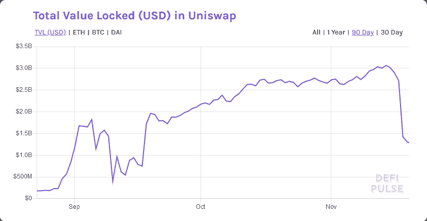

# 为什么 Uniswap 在一天之内损失了 50%的流动性？

> 原文：<https://medium.com/coinmonks/why-uniswap-lost-50-of-liquidity-in-one-single-day-e3130c208381?source=collection_archive---------2----------------------->

## 11 月 17 日，世界上最著名的 DEX unis WAP 失去了近 50%的流动性。

DeFi Pulse chart of Uniswap’s liquidity

正如我们所知，分散式交易所只对外部用户提供的流动性起作用，这些外部用户决定将他们的代币发送到某个资金池，以换取每次掉期(交易所)的费用…