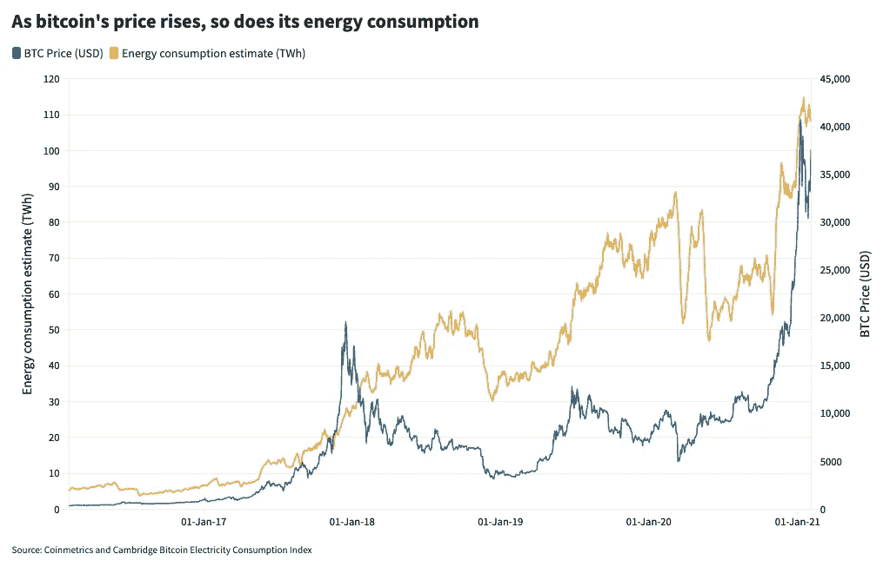
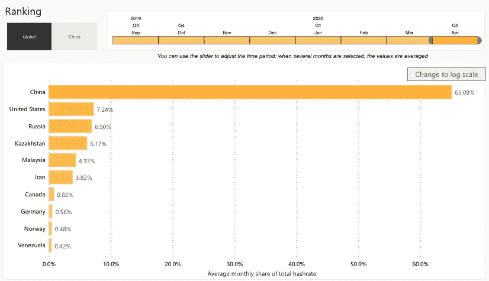
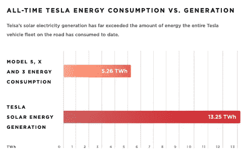

# 为什么我们需要“剥离比特币”运动

> 原文：<https://medium.com/coinmonks/why-we-need-a-divest-bitcoin-movement-220f1c2f5ede?source=collection_archive---------3----------------------->

## 拥有比特币并希望其价值指数级增长，与我们缓解气候变化的努力根本不相容。

两年前，随着加密狂热和 ICOs 激发了人们对比特币和加密货币的兴趣，人们对比特币区块链的巨大能源需求产生了实质性的担忧。随着加密热潮的消退，这些批评被遗忘了，但随着最近几个月人们对比特币的兴趣复苏——达到 4 万美元的历史最高价格——比特币矿工的能源消耗再次增加。目前的估计表明，比特币的年能耗为 110 万亿瓦时，是 2018 年 40 万亿瓦时能耗的两倍多。相比之下，[英国的*总*年用电量约为 350TWh](https://assets.publishing.service.gov.uk/government/uploads/system/uploads/attachment_data/file/904805/DUKES_2020_Chapter_5.pdf) 。

我认为，我们需要一场从比特币撤资的运动，这场运动要比从石油和天然气公司撤资的力度更大。拥有比特币，通过增加稀缺性和需求来提高其价值，以及增加能源消耗之间有着非常明显的直接关系。

这种观点并不新鲜——大多数人都听说过比特币(或者具体来说，它的工作证明)的能源消耗。**但理解比特币的能耗不是固定的非常重要:它随着比特币价值的增加而增加。**

Data from Coinmetrics & Cambridge Bitcoin Electricity Consumption Index [https://public.flourish.studio/visualisation/5189004](https://public.flourish.studio/visualisation/5189004/?utm_source=embed&utm_campaign=visualisation/5189004)

Satoshi 的加密经济发明的天才之处在于将比特币账户的安全性与矿工的激励机制结合起来。比特币的价格越高，攻击的动机就越大，因此对加密安全的需求也就越大。

与此同时，随着比特币价格的上涨，“区块奖励”的金融价值越大，矿工应该愿意花费更多的精力和计算能力来开采比特币区块奖励。随着越来越多的矿工将计算能力投入到挖掘过程中，“哈希率”，或计算过程的难度增加(使对比特币区块链的攻击更加困难，因此增加了链的安全性)——但所有的矿工都必须增加他们的计算和能量输入，以获得比特币块奖励。

就像石油价格一样:石油价格越高，石油公司就越有动力在难以开采的地区(如北极、深海钻探)寻找“昂贵”的石油，通常环境成本也越高。

比特币也是如此。比特币的价格越高，越多的钱&能源矿工愿意花在开采比特币上，通常边际电力来源是碳强度高的化石能源。

比特币的支持者会说，比特币开采的很大一部分是利用可再生能源进行的。数据尚不清楚，在比特币价格*低*的情况下，有经济意义来支持这一点——如果比特币的价值很低，那么只值得花费低成本的能源来开采比特币，通常这是可再生能源，每千瓦时的边际成本为零。随着比特币价格的上涨，每千瓦时的能源值得花费更多，矿工们有动力使用任何(包括化石/碳密集型)电力来源。

[https://cbeci.org/mining_map](https://cbeci.org/mining_map)

剑桥大学[另类金融中心](https://cbeci.org/)的数据清楚地显示，大多数比特币挖矿[发生在中国](https://cbeci.org/mining_map)。虽然有大量的可再生能源，但超过 50%的中国电力仍然来自煤炭。希望比特币大部分由可再生能源提供动力是短视和幼稚的。我交谈过的许多人认为所有的矿商都在冰岛，使用廉价的可再生地热能——冰岛甚至不在十大矿商之列。名单上的大多数国家并不以可再生能源发电量高而闻名，而是以其石油和天然气产量而闻名。现实是，这肯定涉及到碳成本，比特币的价格越高，碳成本就越大。

我不反对比特币、去中心化金融或分布式账本技术的原则。我相信加密货币有巨大的潜力，但我们需要意识到，随着比特币价格的上涨，其巨大的能源和环境影响也在增加。分布式账本共识机制还有其他替代方案——比如股权证明、权威证明——其他区块链正在努力实现。但是当前实例中的工作证明与我们的气候目标不一致。

## **作为一种长期投资选择，我们不能被激励去提高比特币的价值，也不能寄希望于其价值的指数级增长——环境和碳成本太大了。**

Tesla most recent Impact Report

埃隆·马斯克最近公开表示支持比特币，并宣布[特斯拉购买了 15 亿美元的比特币](https://www.cnbc.com/2021/02/08/tesla-buys-1point5-billion-in-bitcoin.html)——比特币价格飙升至 44200 美元。如果比特币的价格和能源消耗增加 20%，估计为 20 千瓦时，这将超过所有特斯拉太阳能系统的累计发电量。最新的特斯拉影响报告指出，特斯拉太阳能系统已经累计产生了 13.25 千瓦时(非年化)——为*历史*累计。

在未来的世界里，我们所有的电力都来自可再生能源，而且可再生能源非常丰富，或许比特币将成为我们金融体系的重要组成部分——但除非这种情况发生，否则我们无法忽视比特币对气候的影响。

*了解更多&加入我们的努力:***(工作进行中！)**

> *加入 Coinmonks [Telegram group](https://t.me/joinchat/EPmjKpNYwRMsBI4p) 并了解加密交易和投资*

## *另外，阅读*

*   *什么是[闪贷](https://blog.coincodecap.com/what-are-flash-loans-on-ethereum)？*
*   *最好的[密码交易机器人](/coinmonks/crypto-trading-bot-c2ffce8acb2a) | [网格交易](https://blog.coincodecap.com/grid-trading)*
*   *[3 商业评论](/coinmonks/3commas-review-an-excellent-crypto-trading-bot-2020-1313a58bec92) | [Pionex 评论](/coinmonks/pionex-review-exchange-with-crypto-trading-bot-1e459d0191ea) | [Coinrule 评论](https://blog.coincodecap.com/coinrule-review-a-perfect-trading-bot)*
*   *[AAX 交易所评论](/coinmonks/aax-exchange-review-2021-67c5ea09330c) | [德里比特评论](/coinmonks/deribit-review-options-fees-apis-and-testnet-2ca16c4bbdb2) | [FTX 交易所评论](/coinmonks/ftx-crypto-exchange-review-53664ac1198f)*
*   *[n 零复习](/coinmonks/ngrave-zero-review-c465cf8307fc) | [Phemex 复习](/coinmonks/phemex-review-4cfba0b49e28) | [PrimeXBT 复习](/coinmonks/primexbt-review-88e0815be858)*
*   *[Bybit Exchange 审查](/coinmonks/bybit-exchange-review-dbd570019b71) | [Bityard 审查](https://blog.coincodecap.com/bityard-reivew) | [CoinSpot 审查](https://blog.coincodecap.com/coinspot-review)*
*   *[3Commas vs Cryptohopper](/coinmonks/3commas-vs-pionex-vs-cryptohopper-best-crypto-bot-6a98d2baa203)*
*   *最好的比特币[硬件钱包](/coinmonks/the-best-cryptocurrency-hardware-wallets-of-2020-e28b1c124069?source=friends_link&sk=324dd9ff8556ab578d71e7ad7658ad7c) | [BitBox02 回顾](/coinmonks/bitbox02-review-your-swiss-bitcoin-hardware-wallet-c36c88fff29)*
*   *[莱杰 vs n rave](https://blog.coincodecap.com/ngrave-vs-ledger)|[莱杰 nano s vs x](https://blog.coincodecap.com/ledger-nano-s-vs-x)*
*   *[加密拷贝交易平台](/coinmonks/top-10-crypto-copy-trading-platforms-for-beginners-d0c37c7d698c) | [比特码拷贝交易](https://blog.coincodecap.com/bityard-copy-trading)*
*   *[Vauld Review](https://blog.coincodecap.com/vauld-review)|[you hodler Review](/coinmonks/youhodler-4-easy-ways-to-make-money-98969b9689f2)|[BlockFi Review](/coinmonks/blockfi-review-53096053c097)*
*   *最好的[加密税务软件](/coinmonks/best-crypto-tax-tool-for-my-money-72d4b430816b) | [硬币追踪评论](/coinmonks/cointracking-review-a-reliable-cryptocurrency-tax-software-5114e3eb5737)*
*   *最佳[加密借贷平台](/coinmonks/top-5-crypto-lending-platforms-in-2020-that-you-need-to-know-a1b675cec3fa) | [杠杆代币](/coinmonks/leveraged-token-3f5257808b22)*
*   *[莱杰纳米 S vs 特雷佐 one vs 特雷佐 T vs 莱杰纳米 X](https://blog.coincodecap.com/ledger-nano-s-vs-trezor-one-ledger-nano-x-trezor-t)*
*   *[block fi vs Celsius](/coinmonks/blockfi-vs-celsius-vs-hodlnaut-8a1cc8c26630)|[Hodlnaut Review](https://blog.coincodecap.com/hodlnaut-review)*
*   *[Bitsgap 审查](/coinmonks/bitsgap-review-a-crypto-trading-bot-that-makes-easy-money-a5d88a336df2) | [Quadency 审查](/coinmonks/quadency-review-a-crypto-trading-automation-platform-3068eaa374e1)*
*   *[埃利帕尔泰坦评论](/coinmonks/ellipal-titan-review-85e9071dd029) | [赛克斯斯通评论](https://blog.coincodecap.com/secux-stone-hardware-wallet-review)*
*   *[DEX Explorer](https://explorer.bitquery.io/ethereum/dex) | [区块链 API](https://explorer.bitquery.io/graphql)|[local bitcoins 审核](https://blog.coincodecap.com/localbitcoins-review)*
*   *最佳[区块链分析](https://bitquery.io/blog/best-blockchain-analysis-tools-and-software)工具| [赚比特币](https://blog.coincodecap.com/earn-bitcoin)*
*   *[加密套利](/coinmonks/crypto-arbitrage-guide-how-to-make-money-as-a-beginner-62bfe5c868f6)指南:新手如何赚钱*
*   *最佳[加密制图工具](/coinmonks/what-are-the-best-charting-platforms-for-cryptocurrency-trading-85aade584d80) | [最佳加密交易所](/coinmonks/crypto-exchange-dd2f9d6f3769)*
*   *了解比特币的[最佳书籍有哪些？](/coinmonks/what-are-the-best-books-to-learn-bitcoin-409aeb9aff4b)*

> *[直接在您的收件箱中获得最佳软件交易](/coinmonks/newsletters/coinmonks)*

**