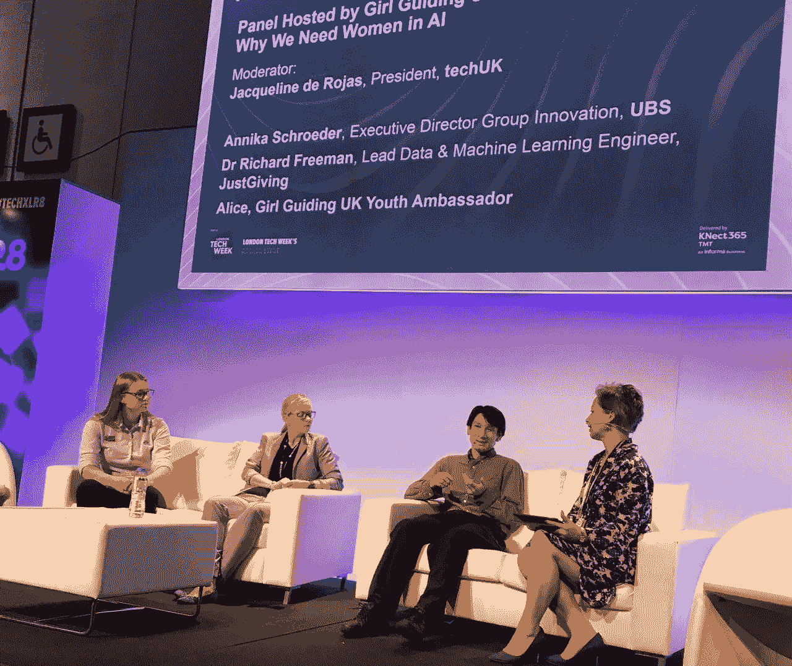

# 为什么人工智能需要女性

> 原文：<https://medium.com/coinmonks/why-we-need-women-in-ai-ebeaa896dd08?source=collection_archive---------5----------------------->

在参加小组讨论后，我得到了极好的反馈，由于没有记录，我想我会写一篇博客，介绍我讨论的一些内容，我对核心问题的回应以及我对该主题的一些其他想法。

“Panel Hosted by Girl Guiding UK: Why We Need Women in AI”, Inclusive Innovation, Panelist at [TechXLR8](https://tmt.knect365.com/techxlr8/), ExCeL, London, 12 June, 2018

人工智能(AI)通常被认为是目前难以自动化的新领域，是使用计算机解决的难题，并最终取代人类的工作。然而，自 20 世纪 50 年代以来，我们一直在使用一种形式的人工智能或机器学习(ML)作为[人工神经网络](https://en.wikipedia.org/wiki/Artificial_neural_network)，后来在 20 世纪 70 年代被企业采用，最初作为[决策支持系统](https://en.wikipedia.org/wiki/Decision_support_system)，后来演变为数据挖掘、商业智能、分析&洞察力，以及最近的数据科学。发生变化的是，销售和营销团队现在也参与进来，有时甚至会过度承诺什么是可能的！然而，计算能力和存储能力也有所提高，从大量来源收集了大量数据集，开源数据科学代码、软件包和教程随时可用。所有这些都有助于更多的组织和个人更容易接触到它。

**问:构建人工智能的问题以及它将继承的偏见&为什么以平等为核心构建人工智能至关重要**

就个人而言，我认为你可以将其分为三个方面:数据、经验和背景/领域知识，在所有这些方面，团队的多样性有助于减少偏见。

我要说的是，**数据**是一个重要的因素，无论谁分析它或者用它来训练一个模型，它都是自然语言处理(NLP)和 ML 中使用的必不可少的原材料。我会把它分成定量的(量化的度量，比如数字)和定性的(思考如何解释文本、评论、回应等等)。)，这是一个重要的区别，因为不是所有东西都可以测量。数据集也存在固有的偏差，例如，这可能取决于所使用的时间框架，如社会随时间的变化。斯坦福大学[最近的一篇论文量化了 100 年来的性别和种族刻板印象](https://arxiv.org/pdf/1711.08412.pdf)发现，20 世纪和 21 世纪初的文本中的单词嵌入本质上带有种族主义和性别歧视。例如，NLP 模型发现男性和女性在某些形容词和职业上有很强的联系。当自动学习时，这些可能会被解释为刻板印象，例如，如果用于搜索排名、过滤用户或推荐引擎，这可能会有问题。随着时间的推移，历史上的社会观点发生了变化，放眼望去，国家甚至社区往往有不同的文化、价值观、情感和信念，这些都可以反映在他们使用的词汇中。如果该文本是用于训练模型的输入，那么让来自不同背景的人参与进来有助于对数据提出问题，并确定什么是缺失的、不完整的或代表不足的。

下一个因素是理解数据的**经验**以及它在 ML 模型中使用时的局限性。有了经验，你就会明白如何在训练集和测试集之间正确分割数据，需要做哪些数据准备，使用哪些机器学习算法和设置哪些参数，以及如何评估和监控准确性。例如，在我参加的一次关于自动驾驶汽车的演讲中，他们讨论说，即使在试验期间收集了所有视频和传感器数据，他们也需要为训练生成合成数据，因为不可能提供所有可能的驾驶场景。当面对不完整的数据时，询问原因、理解局限性并正确解释它们总是很重要的。

**背景和领域知识**在您的组织、垂直或行业部门中应用 ML 时非常重要。你可能听说过“相关性并不意味着因果关系”，例如，当海滩上的冰淇淋销量增加时，你可能会错误地认为这导致更多的人溺水，因为这两者是相关的，但实际上这只是因为夏天有更多的人游泳。还有更多有趣的[虚假相关性](http://www.tylervigen.com/spurious-correlations)。如果你想知道，找到支持因果关系的证据的一般方法是使用 AB 测试并理解上下文和领域。

**问:人工智能由一个群体开发的风险……导致产品只迎合一个市场**

在未来，我们开始关注人工智能的责任、透明度和问责制。例如，当自动驾驶汽车坠毁时，谁负责？是汽车制造商、保险公司、车主、另一辆车的司机，还是可能主动跳到汽车前面看它如何反应的人？这可能发生在几乎所有使用人工智能的垂直领域。在任何业务中，特别是随着欧洲通用数据保护法规(GDPR)的引入，客户可能会问为什么他们的产品或服务被拒绝。如果你使用了深度学习，如[递归神经网络(RNN)](https://en.wikipedia.org/wiki/Recurrent_neural_network) ，并且没有做一些分析，那么就很难解释为什么它们会被拒绝，因为 RNN 是一种黑盒。相比之下，如果你使用一个更简单的[决策树](https://en.wikipedia.org/wiki/Decision_tree)，解释起来会容易得多，因为多级分割很容易理解。

这个问题也反映在行业中，例如麻省理工学院的[研究](http://news.mit.edu/2018/study-finds-gender-skin-type-bias-artificial-intelligence-systems-0212)评估了商业面部识别软件，看看它是否可以根据 1200 张照片正确识别性别。研究发现，对于浅色皮肤的男性来说，这种方法在 99.2%的情况下都是正确的，但深色皮肤的女性只有 65.3%的情况下被正确归类为女性。如果这被用于更高级的识别场景，那么如此高的错误率会对市场营销以及安全、产品和服务产生影响。拥有更多样化的团队来帮助平衡需求、道德和信仰是至关重要的。

你也可能错过投资或增长机会，因为你没有问正确的问题，特别是如果数据中没有太多信号或没有关于某一部分人口的数据。例如，如果你使用 20 世纪 70 年代英国的饮料消费数据来确定欧洲大陆是否需要更好的咖啡，你可能会发现人们大多喜欢茶和速溶咖啡。像 Costa Coffee 这样的公司是由意大利人在 20 世纪 70 年代创建的，与意大利的标准相比，他们对英国的咖啡不满意。如果你在 20 世纪 70 年代在意大利拿同样的数据，你会得到一个不同的市场观点。2016 年，Costa Coffee 在全球 3401 个地方营业，收入 11.67 亿英镑。这是关于问正确的问题，克服先入为主的观念，并为机会敞开大门。

**问:如何确保多元化团队考虑所有特征，为地球构建多元化的人工智能未来**

我认为拥有一个多元化的团队是至关重要的，我喜欢将它分解为背景、思想和个性的多元化。在《纽约时报》一篇名为[科技令人不安的新趋势:多样性在你的头脑中](https://www.nytimes.com/2017/10/16/opinion/diversity-tech-women-silicon-valley.html)的文章中，它谈到了认知多样性的重要性。如果你思考自己的组织或者职场经历，你会发现有些团队需要安静的工作环境来进行深度思考，有些人会戴上耳机，这可以与更有创造力和表现力的团队形成对比。更深入地探讨这个话题，其他研究发现，个人经历和弹性也基于职业、地理和组织水平。

**问:你对现在想去 AI 工作的女性有什么建议？**

目前，人工智能仍处于起步阶段，有更多的机会和角色正在出现。使用一个支持网络，如女孩指导，做在线课程( [Coursera](https://www.coursera.org) ，[可汗学院](https://www.khanacademy.org/)等。)，找到自己的激情区域。

无论是 STEM 还是非 STEM/人文学科都可以从中受益并有所涉及。

对于 STEM 中对软件工程有热情、兴趣或经验的人，我建议考虑 ML 或数据科学中的工程角色，这些角色技术性很强，需要计算机科学和软件背景。激情是需要的，因为它变化非常快，一些框架和知识甚至在 6 个月后就会过时，即使技能是可转移的，代码有时更容易编写。因此，你需要有动力并热衷于自学，例如，深度学习过去一直都是关于谷歌的 [TensorFlow](https://www.tensorflow.org/) 仍然非常受欢迎，自 2017 年以来，有更简单的替代框架，如亚马逊&微软支持的 [MXNet](https://mxnet.apache.org/) 或脸书支持的 [Cafe2](https://caffe2.ai/) 和 [PyTorch](https://pytorch.org/) 。或者你可以使用像 [Keras](https://keras.io/) 或者[glon](https://mxnet.apache.org/gluon)这样的抽象框架。

对于那些在软件交付方面经验不丰富的 STEM 人员，他们可以考虑涉及更多分析性思维的角色，比如分析师或数据科学家。你可能不是一名开发人员，但我仍然建议你最大限度地接触软件交付过程和语言，如 SQL、Python 或 r。你还可以考虑开放、透明、仔细检查和解释算法。例如，如果你被一家保险公司拒绝，你可能会问为什么，他们用了什么数据？

对于非 STEM/人文学科，有许多非技术相关的角色，如数据新闻、营销、UX 和讲故事。如果你想一想人工智能在伦理和社会中被使用和测试的角色，你会发现更多关于人类的方面。随着人工智能进入机器人、自动驾驶汽车和工作场所，你需要考虑结果和变化。人工智能的最终目标是将其用于改善人们的生活、公共保护、生产力、福利和医疗保健等领域。

**问:科技领域的性别差异真实存在吗？**

在我的职业生涯中，我与许多有才华的男性和女性合作过，我认为任何有适当热情和兴趣的人都可以在技术和人工智能领域工作，这可能归结于克服刻板印象和拥有正确的机会。

开放大学的研究估计，在英国只有 17%的女性从事 IT 工作，而在印度这一比例是 35%。为什么？在印度，围绕从事 STEM 职业的人的类型的刻板印象较少，教育提供商和行业之间的合作更多，父母对追求科技职业的鼓励更多。在英国，他们说这些问题是初级的，女性通常在更高级的时候进入 IT 行业。该研究还称，在英国，对通常担任科技角色的人的刻板印象使女孩从年轻时就不愿选择科技职业。父母在支持女孩的选择方面有很大的作用。

我想以一项由华盛顿大学学习和脑科学研究所(I-LABS)进行的[研究来结束我的演讲，这项研究涉及了大约 100 名 6 岁的男孩和女孩。孩子们被分成三组:一组是给像动物一样的机器人编程的孩子，一组是玩讲故事游戏的孩子，另一组是没有活动的孩子。这三组人都接受了一项调查，询问他们对技术的看法，以及他们对男孩和女孩是否有不同能力的看法。他们发现男孩和女孩兴趣相同。](https://eandt.theiet.org/content/articles/2017/04/let-girls-play-with-robots-to-boost-their-confidence-study-says/)

> “作为一个社会，我们有这些内在的信念，促使男孩比女孩更倾向于某些活动。所以我们的想法是，如果你给男孩和女孩同样的经历，会发生什么？”大师说。“我们发现，如果你给他们同样的机会，那么女孩和男孩会有同样的反应——同样的兴趣和信心。”
> 
> “刻板印象从许多不同的来源和经历中在我们的头脑中建立起来，但如果我们给女孩更多做这类活动的经验，可能会给她们更多的资源来抵制这些刻板印象，”马斯特尔博士说。“他们可能会说，‘尽管存在文化偏见，但我仍然可以做得很好，并且乐在其中。’"

我所在的法国国际学校的宗旨是“丰富我们的差异”，我认为来自不同背景的人的新想法和经验可以融合在一起，从而创造出更丰富的产品或服务。打破陈规，给每个人一个在人工智能领域工作的机会，就是做到这一点的方法！

在 [LinkedIn](https://www.linkedin.com/in/drfreeman/) 上与我联系