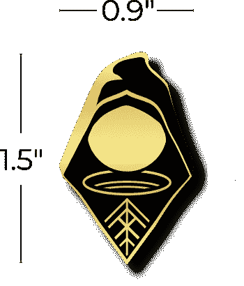
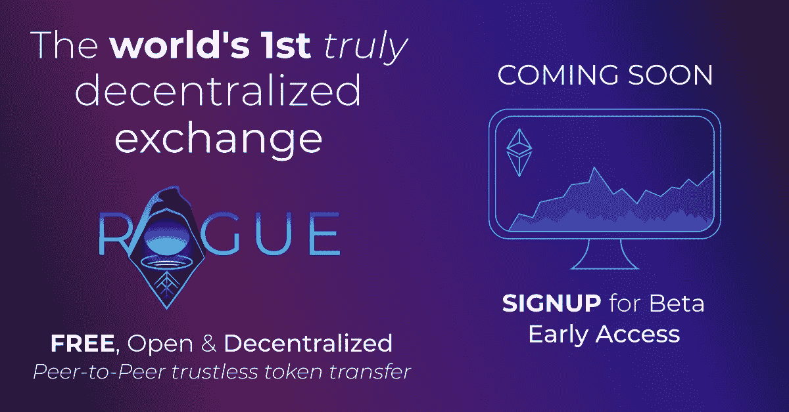

# 为什么我们变得无赖…

> 原文：<https://medium.com/coinmonks/why-we-went-rogue-cff611907424?source=collection_archive---------1----------------------->

两年前，我写了一篇[文章](/coinmonks/the-dark-side-of-decentralized-exchanges-82d49d55e419)，讲述了“去中心化”这个词是如何被欺骗性地作为一个营销噱头使用的，特别是与 EtherDelta、Waves Dex 和 0x platform 等“去中心化”交易所的关系。即使是现在，欺骗性的做法仍然很强，但很明显，当时需要有人来填补以太坊生态系统的适当分散交换的空白。

快进到今天，再过几周我们就要推出世界上第一个真正的[去中心化交易所](https://www.rogue.exchange/)。这肯定是一个超现实的时刻。

当我和我的联合创始人伊恩坐下来解决这个问题时，我们发现了现有解决方案面临的两个核心问题；集中控制的账户和链外做市商。我在 2018 年对这些问题和更多[进行了更详细的描述，但以下是重点:](/coinmonks/the-dark-side-of-decentralized-exchanges-82d49d55e419)

## 1.中央控制账户

> “订单匹配的另一个问题是需要在单独的托管账户中保存资金以确保交易安全，这减缓了买卖双方的交易过程。这再次迫使用户信任中介托管账户，以确保他们的资金和功能符合预期。”— 2018 年文章

这是最明显的缺陷，完全违背了分散系统的目的。信任第三方来管理和保护您的私钥是对一个人的自主权和自立的公然丧失。当一个平台声称是去中心化的，但它有一个涉及密钥或资产移交的注册过程，这只是名义上的去中心化。充其量使用“分散”一词纯粹是为了营销目的；在最坏的情况下，这样做是为了混淆事实，颠覆法律，直到立法者赶上技术。

## 2.链外做市

> “集中式订单匹配再次暴露了用户试图摆脱的集中化问题，如对第三方的信任、易受恶意攻击或资金损失。”

最初是为了降低在区块链交易代币的成本，像 EtherDelta 或 0x 这样的链外做市是一种重新集中化的形式。虽然这充其量是分布式信任，但它更多地依赖于可信的第三方；字面上的中间人从差价赌注和其他计划中获利。

# 我们的解决方案:流氓协议

## 协议？

是的，协议！Rogue 的用户界面确实提供了人们期望从交换中看到的相同的核心功能，但是在引擎盖下*(并且在高级功能中可访问)*是一种协议，其被设计成促进适当分散的对等无信任令牌传输。

*不可信？*是的，我正要说到这一点……

## 流氓特工

流氓代理是一种替代可信第三方角色的特殊令牌，是协议的核心创新，其编程能力建立了一个不可信的实体。

简而言之，客户端创建一个流氓，编码并向流氓传输指令以及与这些指令相关的令牌，并将流氓定向到可以完成这些指令的目标。

关于这一点有很多要说的，但我想保持这篇文章的简短，所以我将在另一个时间离开深潜。

## 客户端订单匹配

将订单匹配完全交给以太坊上的智能合约会导致大量的 gas。这种情况已经持续了一段时间，即使以太坊在不断改进，天真地实现这样一个系统总是会非常昂贵。这是离线订单匹配的核心原因，因为读取区块链是免费的，与完全在线实现相比要快得多。

我们对这个重新集中化问题的解决方案是实现一个客户端“最佳猜测”订单匹配提示系统。客户端界面免费读取区块链，并确定订单的当前最佳位置，然后交给链上智能合约。智能合约将使用该提示信息来简化列表插入，而不完全依赖信息的可信度。如果客户将最有效的位置发送给智能合同使用，他们的天然气成本将与 Uniswap 交易成本具有竞争力(ERC20->ERC20 ~90k 天然气)。

## 流氓自由了

我们可以很容易地对我们推出的第一个 DEX smart 合同征税和收费，但我们不会这样做。为什么？Rogue 是一个真正的分散式协议。我们相信以太坊的未来，我们相信它的使命是“不可阻挡的、不可改变的、永远的”，我们相信个人拥有去中心化技术可以实现的自由和公民自由的权利。我们相信《侠盗猎车手》很特别，将会对区块链的未来产生持久的影响。从这种不需要我们开销的东西中获利，似乎是错误的。

# 捐赠并关注更新

Rogue 是完全免费和开源的**。它的发展依赖于像你一样的以太坊公民*的贡献！请查看我们的[登录页面](https://www.roguedex.com/)并考虑捐赠，这样我们就可以继续投入无数的时间来使 Rogue 功能齐全并可扩展。如果您捐赠了 0.25 乙醚或更多，并且居住在美国，您可以填写我们的表格并申请一个 Rogue pin 作为对您贡献的感谢！***

******

> ***[直接在您的收件箱中获得最佳软件交易](https://coincodecap.com/?utm_source=coinmonks)***

******