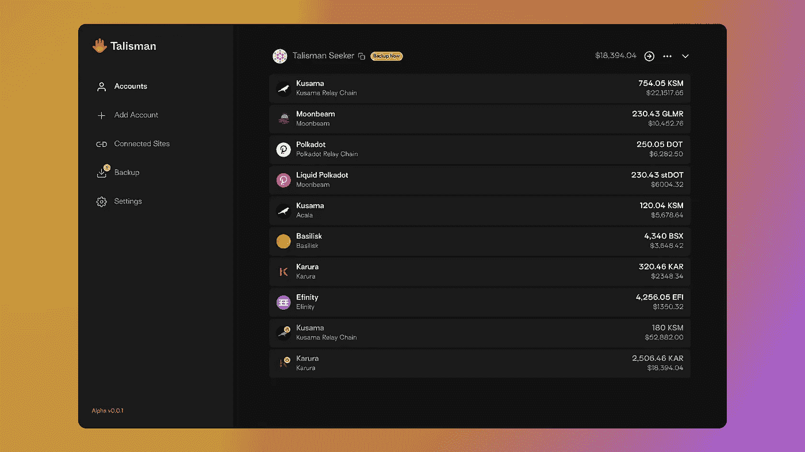
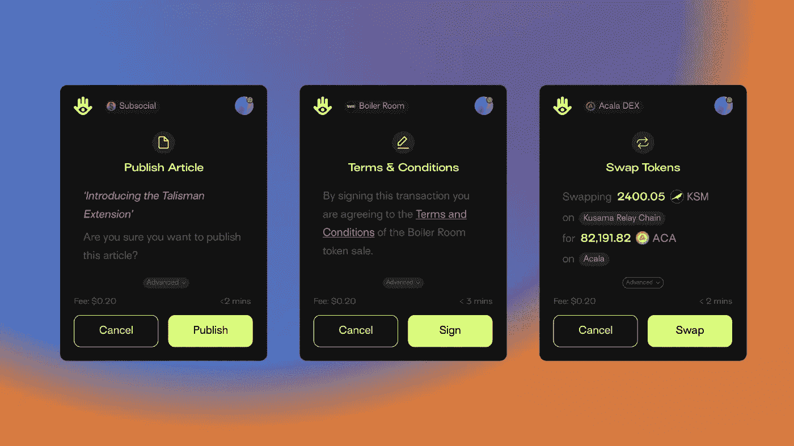

# 为什么你应该对 Talisman 感到兴奋

> 原文：<https://medium.com/coinmonks/why-you-should-be-excited-about-talisman-b38680f91519?source=collection_archive---------3----------------------->

## 推动波尔卡多、草间弥生和仿链的大规模采用

Champions of the Paraverse being briefed on the arrival of the Talisman, what it is, and what it might mean for DotSama. | Created by [Matias Basla](https://www.instagram.com/matiasbasla), Talisman Sentinel

易于使用的钱包为 web3 的大规模采用铺平了道路。对于 DotSama 来说尤其如此，其固有的复杂性包括中继链、副链和众包等等。

正如 Talisman 团队正确指出的，Polkadot-JS 是一个非常棒的帐户管理工具。这确实是我在秘密生活中使用过的最强大的套件。也就是说，Polkadot-JS 对于不太懂技术的人和(潜在的)社区成员来说很难访问，这也是事实。

一些钱包已经出现来填补这一可用性空白，他们在这方面做得很好。因此，如果它们存在，为什么还要用护身符呢？

1.  因为在区块链的生态系统中，多样性是一件美好的事情。
2.  因为 Talisman 有一个敏锐而雄心勃勃的愿景，最适合支持 DotSama parachains 独特的数字星系。Sharp 是因为它专注于 DotSama，而雄心勃勃是因为它的使命是通过 parachain 可组合性实现 DotSama 的大规模采用(而不仅仅是提供钱包)。稍后将详细介绍。

在这篇短文中，我对 Talisman、其愿景、产品以及我为何对其未来充满期待进行了高度概括。

完全披露:我是那些被称为护符哨兵的特殊实体之一，但我们不是激进的月亮男孩和粉丝女孩的邪教。我们是被我们相信的重要基础设施项目吸引的个人。为了理解，让我们从 Talisman 的愿景开始。

# 护身符愿景

这是一个公开的秘密，web3 领域的每一个建设者都在关注下一个 20 亿用户。正是这个目标促使 Polkadot 的诞生，作为一种扩展区块链和促进互操作性的方式，导致了创新的爆发和各种区块链产品的创造。

许多在 DotSama 安家的建筑商都被这一愿景蒙蔽了，包括 Talisman 团队。对于真正理解的人来说，近乎无缝的链互操作性所释放的可能性太诱人了。这是 Polkadot 的主要特点，它将在许多不同的方向上推动无数的创新。

因此，Talisman 的主要任务是通过创建一个工具来帮助实现互操作性，该工具将安全地引导那些希望穿越 Paraverse(副链的数字宇宙)的人。Talisman 试图创建一个 Polkadot-JS 的替代品，它非常适合初学者，同时保持完全分散，这意味着它不属于任何一个(parachain)团队。

# 护身符的执行

为了实现其愿景，Talisman 专注于两个关键领域:

## 1.轻松的投资组合可视化和导航

Talisman portfolio dashboard — Photo by Talisman

应该可以一目了然地查看您的全部 DotSama 投资组合，或者最多点击 3 次。再多就不好了 UX。使用 Talisman，您可以直接从登录页面/资产仪表板查看您的整个 DotSama 投资组合(？).

这里的另一个挑战是确保提供的服务没有任何中心故障点。

> 最终，我们希望 Talisman 很少或完全不依赖于集中的依赖。这意味着我们需要为 Talisman 客户端开发连接到 Parachains 和收集数据的方法，而不需要使用集中式中间件、RPC 或为每个链初始化完整的 API。
> 
> — **阿盖尔**，护身符守护者

该团队已经在这方面开展工作，并创造了直接与副链数据接口的 API[。这些库是完全开源的，任何人都可以使用。接下来，将开发新的库来匹配即将到来的副链的独特性和复杂性。这就是 Talisman 的模块化设计和架构的酷之处。](https://github.com/TalismanSociety/api)

## 2.钱包的多功能性和交易理解

在一个有 100 多条副链和无限多种交易类型的平行宇宙中，一个平行宇宙传送器足够灵活以处理任何扔给它的东西是很重要的。它需要能够去最隐蔽的地方，执行最不可思议的任务。但除此之外，它必须指导准公民，并确保他们理解他们正在做的一切。

为了理解我真正想表达的意思，请考虑 DotSama 当前迭代中可以进行的不同种类的链和事务:

*   发布、喜欢和评论 Subsocial
*   同意各种众筹贷款的服务条款
*   在区块链的游戏中购买一块土地
*   在 Singular 上购买 NFT
*   向 Acala DEX 提供流动性
*   在副链之间传送资产
*   在 RMRK 的卡娜莉亚，将一个 NFT 装备成另一个
*   注册 PNS 名称

Examples custom transaction experiences Talisman can enable — Photo by Talisman

一方面(钱包多功能性)，Talisman 努力让用户能够跨各种链完成所有这些操作(以及未来将出现的任何操作)。另一方面(交易理解)，Talisman 试图确保用户理解他们用钱包批准的每一笔交易的上下文。

它通过使用模块化方法来实现这一点，其中每个 parachain 团队或 dapp 开发人员都能够定制事务流(主要是事务及其组件的描述)。这将确保尽管您使用的是一个钱包/扩展，但会显示更广泛的交易确认消息，具体取决于您使用的 dapp 和/或您采取的操作。

这种级别的透明度对于新用户的加入和建立信任至关重要，这些新用户通常对 crypto 一无所知，并担心丢失他们的令牌。

# 现在和未来

Talisman 钱包和扩展的第一个版本正在由 Talisman 哨兵和一些 Talisman 天使进行内部测试。作为少数几个之一，我已经可以告诉你，这是一个相当好的产品。目前，扩展仍然有一些问题需要解决，但它肯定会朝着一个全新的方向发展。

未来几周，将有超过 1000 名 Spirit Key holders 对 Alpha 钱包进行更加开放的测试。二月初是大众试驾这款加长车的暂定时间。

我完全期待 DotSama 用户会喜欢 Talisman 钱包。我可以用“爱”这个词，但我不想听起来太咄咄逼人。我相信产品会自己说话。

## 探索护身符

[Webapp](http://app.talisman.xyz/) ~ [护身符的入门文章](/we-are-talisman/the-talisman-extension-is-here-247842989f9d) ~ [推特](https://twitter.com/wearetalisman) ~ [不和](https://discord.gg/Z63Bqte9jq)

***gbaci*** *是一个热衷于去中心化的人，他共同维护着一份* [*每周时事通讯*](https://newsletter.dotleap.com/subscribe) *，报道 DotSama (Polkadot 和草间弥生)生态系统中的最新动态。*

> 加入 Coinmonks [电报频道](https://t.me/coincodecap)和 [Youtube 频道](https://www.youtube.com/c/coinmonks/videos)了解加密交易和投资

## 也阅读

 [## 杠杆代币[多头代币]终极指南

### 杠杆化令牌是具有杠杆化风险敞口的 ERC20 令牌，不考虑保证金、要求、管理…

medium.com](/coinmonks/leveraged-token-3f5257808b22)  [## 最佳加密交易所| 2021 年十大加密货币交易所

### 编辑描述

blog.coincodecap.com](https://blog.coincodecap.com/crypto-exchange)  [## 2021 年最佳加密交换平台| CoinCodeCap

### 编辑描述

blog.coincodecap.com](https://blog.coincodecap.com/best-swap-platforms)  [## 2021 年最佳加密借贷平台| 6 大比特币借贷平台

### 获得比特币和其他加密货币的最佳贷款利率

medium.com](/coinmonks/top-5-crypto-lending-platforms-in-2020-that-you-need-to-know-a1b675cec3fa)  [## 2021 年 6 大最佳硬件钱包|顶级加密硬件钱包[更新]

### 最好的加密货币硬件钱包是绝对必要的。我们将在 NGRAVE、Ledger Nano X 和…

medium.com](/coinmonks/the-best-cryptocurrency-hardware-wallets-of-2020-e28b1c124069)  [## 2021 年最佳免费加密交易机器人

### 2021 年币安、比特币基地、库币和其他密码交易所的最佳密码交易机器人。四进制，位间隙…

medium.com](/coinmonks/crypto-trading-bot-c2ffce8acb2a)  [## 最佳 4 个加密交易信号电报通道

### 这是乏味的找到正确的加密交易信号提供商。因此，在本文中，我们将讨论最好的…

medium.com](/coinmonks/best-crypto-signals-telegram-5785cdbc4b2b)  [## 获取信号、交易机器人和套利

### 编辑描述

blog.coincodecap.com](https://blog.coincodecap.com/bitsgap-review)  [## 40 个最佳电报频道，用于加密、电影、表演和演讲| CoinCodeCap

### 编辑描述

blog.coincodecap.com](https://blog.coincodecap.com/best-telegram-channels)