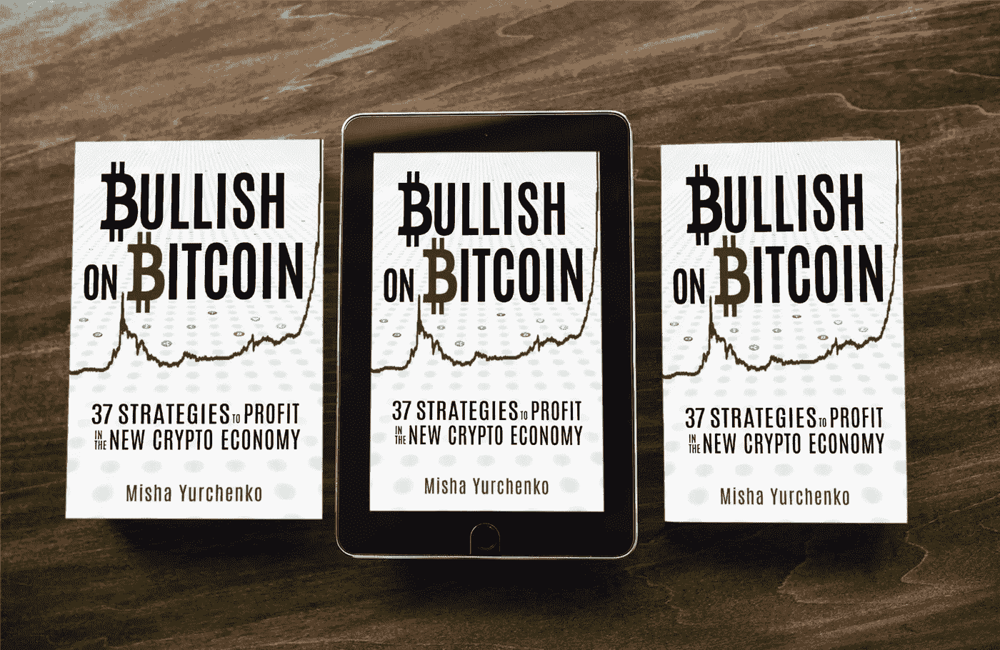

# 为什么你应该获得区块链认证(即使你不是开发者)

> 原文：<https://medium.com/coinmonks/why-you-should-get-blockchain-certified-even-if-youre-not-a-developer-a9eb03ea16e5?source=collection_archive---------1----------------------->

B 锁链是需求量最大的候选短缺行业之一。但是这种需求不仅仅适用于开发人员(他们的收入非常丰厚)。我们看到对行业知识的需求是全面的:接待员、船务员、保安、股票经纪人和营销人员。

一家矿业公司正在寻找一名[公共关系经理](https://www.indeed.com/m/viewjob?from=serp&jk=b01d0c5bbc156ce2)，他应该了解在透明且可听见的数字账本上记录黄金销售将如何减少冲突矿区的盗窃、欺诈和谋杀。一家投资公司[正在招聘销售经理](https://www.indeed.com/m/viewjob?from=serp&jk=ffd00724162dc775)，他们可以解释如何将客户的交易收益实时存入他们的数字钱包，并可以在自动取款机上立即提取。

> [发现并回顾最佳区块链软件](https://coincodecap.com)

银行职员、旅行社和运输职员将使用专有令牌访问安全网络，在安全的生态系统中与客户和供应商直接交易和跟踪贷款、酒店预订和大型货物运输。现在正在发生。

如果区块链是第四次工业革命——如果智能合同将吃掉世界——求职者需要做好准备。如果没有机床技能，一个工人不可能在第一次工业革命中幸存，如果没有计算机技能，他也不可能在信息革命中幸存。那些学得更快的人(并且有足够的自我意识知道他们是如何学习的)会有优势。

**区块链工资溢价**

区块链工程师的短缺将很快蔓延到所有领域——市场营销、金融、物流等等。在[indeed.com](http://indeed.com/)，美国有 500 多个区块链开发人员职位，英国有 200 个，新加坡有 90 个需要填补。而这只是冰山一角。

Source: [Top 20 US Blockchain Job Markets 2018 — Blockchain News](https://www.the-blockchain.com/2018/05/18/top-20-us-blockchain-job-markets-2018/)

我们的组织结构、职能甚至治理结构都在发生变化。非技术人员应该了解基本的区块链功能，例如智能合同在执行业务功能中的作用、提供安全性的加密技术以及交易处理中的挖掘。如果你是一名营销人员，就要努力理解代币经济学，以及激励和奖励在 DApps 中是如何工作的。

奥斯汀·奥尔雷德是[拉姆达学校](https://lambdaschool.com)的创始人，该学校已经培养了数万名程序员。他说，除了表面的炒作，开发者需要了解幕后的技术。[换句话说，当把密码从 a 转移到 b](http://offthechain.libsyn.com/austen-allred) 时，我们实际上在谈论什么？这家创新培训学校发现，对知道如何处理智能合同的毕业生的需求很高。Lambda 的收费结构使其能够加快高需求技能的培训，学校提供免费的前期培训。获得年薪 50，000 美元或以上的工作的学生将支付部分工资用于学费。

即使是基本的区块链认证课程也能增加你的收入。Allred 说，软件工程的薪水因为理解了密码的工作原理而提高了 20%。根据 Hired 的数据，区块链工程师是薪酬最高的软件工程师，平均年薪在 15 万美元至 17.5 万美元之间。与此同时，没有经过区块链培训的普通软件工程师收入为 13.7 万美元。那些继续沿着教育阶梯爬到区块链研究科学家职位的人将获得 27 万美元的薪酬。

也许得到那辆紫色兰博基尼的更快的方法不是四处扔钱进行疯狂的投机，而是努力工作、奉献和良好的教育。有个想法。

**面向非技术人员的区块链课程**

比特币基地[最近报道](https://blog.coinbase.com/the-rise-of-crypto-in-higher-education-81b648c2466f)世界各地的大学已经看到区块链和加密相关课程的数量急剧增加。这是一个好消息，世界各地的学生将准备好填补人才缺口。但是我们其他人呢？

好消息是，在线课程让你很容易获得“区块链认证”，同时可以根据你繁忙的日程安排灵活的学习时间。由于区块链平台分享收入，你甚至可以在培训和求职时赚钱。不错的交易。

[B21Block.com](http://b21block.com/)正在将区块链和加密货币的教育游戏化。当你参加了它的六个学习单元中的一个，包括近 1000 个讲座，你就有资格每月收到硬币空投。你拿工资是为了学习。

一个很好的起点是区块链认证的 B21Block 预备课程。通过成为认证比特币专家，你可以向潜在雇主展示你拥有区块链智慧。提供的其他课程包括区块链和以太坊开发者技能、加密货币投资和交易以及区块链游戏开发。B21Block.com 由比特币教育先驱 Ravinder Deol 创建，他已经成为一个受欢迎的博客作者，教授“非技术新手”加密货币。

另一个区块链认证，[101 区块链，](https://academy.101blockchains.com/?ref=af2edf)让你成为一名企业区块链专业人士，并面向那些想学习如何交谈的商务专业人士。

**上手**

要了解更多关于如何在职业生涯中运用区块链的技能和知识，你可以加入 LinkedIn 上的区块链职业团体。集线器。职业生涯中有一个流行的[区块链子群](https://www.linkedin.com/groups/2881314/profile)。搜索区块链求职板，如 [CryptoJobsList](https://cryptojobslist.com/) 或 [Coinmonks](https://coinmonks.com/) ，它们有一个专注于区块链的求职板。

在你获得面试机会之前，参加一两次区块链研讨会或会议。阅读区块链新闻，了解最新动态。告诉他们一些他们不知道的事情。给他们发一份清单，列出 10 个改善业务的想法。一旦你有了一点经验，就加入吧。正如一位 crypto 创始人所说，*“区块链对我们生活的潜力是巨大的，幸运的是，这还只是第一天。”*

目标是找到激励你的项目，并作为志愿者参与其中——为他们的 github repo 做贡献，提出建议，写博客，并成为一名持续的学习者。项目真的很欣赏社区反馈，所以如果你支持，积极和有建设性，项目将开始要求你发挥更大的作用。

最后，为过山车式的生活方式做好准备。

**感谢阅读！**

如果你有兴趣注册一个加密交易所，这里有两个最大的。请随意使用下面我的会员/推荐链接，在注册时获得退款和轻微折扣:

[Bitfinex 注册](https://bitfinex.com/?refcode=PEfOSCzd)

[比特币基地报名](https://www.coinbase.com/join/yurche_p)

我采访了几十位投资者、交易者和企业家，问了他们这些问题以及更多更多的问题。从奖金到赚取代币的头像， [*看好比特币*](http://mybook.to/bullishonbitcoin) *概述了几十种交易、投资、创造和探索新的分散经济的策略。*

## [今天就在亚马逊上获得这本书](http://mybook.to/bullishonbitcoin)

## 在看好比特币的过程中，你会发现…

*   如何在剧烈的价格波动中掌握自己作为交易者的思维，管理自己的情绪？
*   如何识别有 100 倍潜力的被低估的项目，以及应该避免哪些项目。
*   评估框架可以给你一个优势来评估加密初创公司。
*   通过加密投资逐步建立被动收入流。
*   风险管理、税收策略和专家投资者的建议。
*   如何在区块链找到职业，采访区块链企业家、风投、天使投资人和职业交易员。
*   STOs、stablecoins、atomic swaps 以及未来 2-3 年的展望，从特定技术到单个项目。

## [今天就在亚马逊上买这本书](http://mybook.to/bullishonbitcoin)

> 加入 Coinmonks [电报频道](https://t.me/coincodecap)和 [Youtube 频道](https://www.youtube.com/c/coinmonks/videos)获取每日[加密新闻](http://coincodecap.com/)

## 另外，阅读

*   [复制交易](/coinmonks/top-10-crypto-copy-trading-platforms-for-beginners-d0c37c7d698c) | [加密税务软件](/coinmonks/crypto-tax-software-ed4b4810e338)
*   [网格交易](https://coincodecap.com/grid-trading) | [加密硬件钱包](/coinmonks/the-best-cryptocurrency-hardware-wallets-of-2020-e28b1c124069)
*   [密码电报信号](http://Top 4 Telegram Channels for Crypto Traders) | [密码交易机器人](/coinmonks/crypto-trading-bot-c2ffce8acb2a)
*   [ko only 回顾](https://coincodecap.com/koinly-review) | [Binaryx 回顾](https://coincodecap.com/binaryx-review)|[Hodlnaut vs CakeDefi](https://coincodecap.com/hodlnaut-vs-cakedefi-vs-celsius)
*   [MoonXBT vs Bybit vs 币安](https://coincodecap.com/bybit-binance-moonxbt) | [硬件钱包](/coinmonks/hardware-wallets-dfa1211730c6)
*   [火币交易机器人](https://coincodecap.com/huobi-trading-bot) | [如何购买 ADA](https://coincodecap.com/buy-ada-cardano) | [Geco？一次回顾](https://coincodecap.com/geco-one-review)
*   [币安 vs Bitstamp](https://coincodecap.com/binance-vs-bitstamp) | [比特熊猫 vs 比特币基地 vs Coinsbit](https://coincodecap.com/bitpanda-coinbase-coinsbit)
*   [如何购买 Ripple (XRP)](https://coincodecap.com/buy-ripple-india) | [非洲最好的加密交易所](https://coincodecap.com/crypto-exchange-africa)
*   [最佳加密交易所](/coinmonks/crypto-exchange-dd2f9d6f3769) | [印度最佳加密交易所](/coinmonks/bitcoin-exchange-in-india-7f1fe79715c9)
*   开发人员的最佳加密 API
*   最佳[密码借贷平台](/coinmonks/top-5-crypto-lending-platforms-in-2020-that-you-need-to-know-a1b675cec3fa)
*   杠杆代币的终极指南