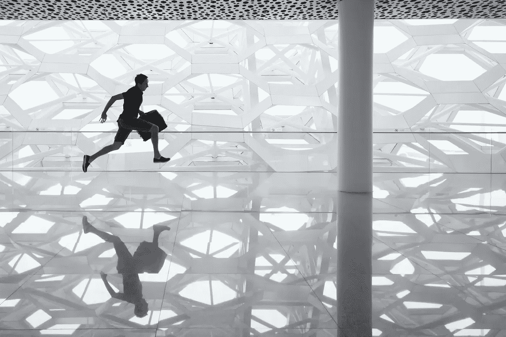

# 为什么你应该 HODL 比特币至少 270 天

> 原文：<https://medium.com/coinmonks/why-you-should-hodl-bitcoin-for-at-least-270-days-1a08e98d3852?source=collection_archive---------7----------------------->

## 利用加密的恐惧和贪婪指数赚钱

Photo by [Andy Beales](https://unsplash.com/@andybeales?utm_source=unsplash&utm_medium=referral&utm_content=creditCopyText) on [Unsplash](https://unsplash.com/s/photos/jump?utm_source=unsplash&utm_medium=referral&utm_content=creditCopyText)

比特币和加密市场最近出现了一些强劲的走势，因为比特币从 2021 年 7 月 21 日到 2021 年 7 月 30 日连续 10 个交易日上涨，从 29，500 美元涨到 42，315 美元，在这 10 天里涨幅高达 43.4%。