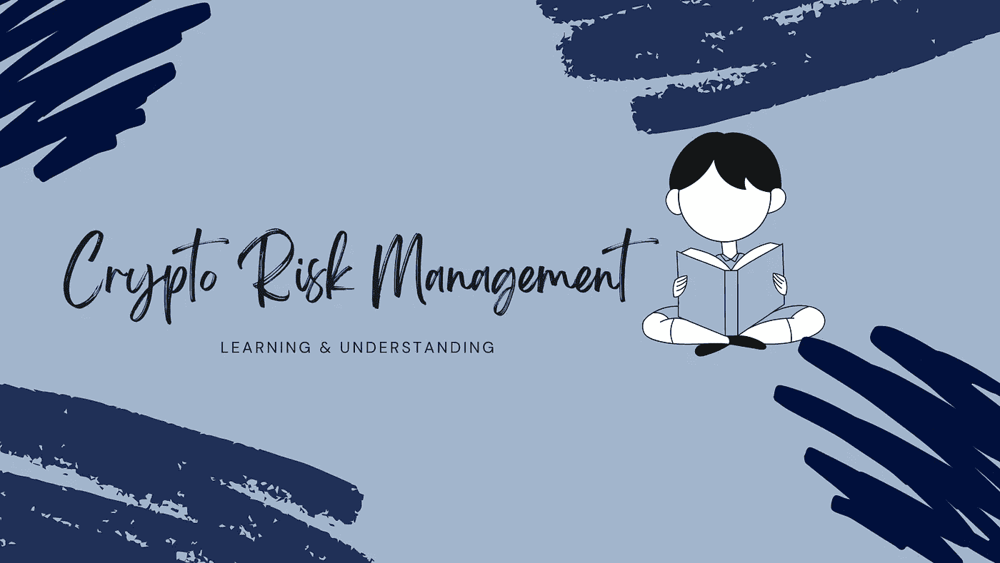

# 为什么你应该练习“边学边学”

> 原文：<https://medium.com/coinmonks/why-you-should-practice-earn-crypto-while-learning-252923fa63b7?source=collection_archive---------8----------------------->

## [加密货币](/topic/cryptocurrency)

## 学习和理解是风险管理的一部分，对任何形式的投资都很重要

无论您是加密货币领域的新手还是老手，每天总有一些东西需要学习。因此，学习永远是潮流，这是你应该…