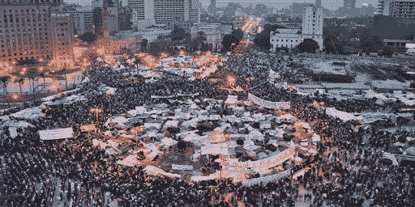
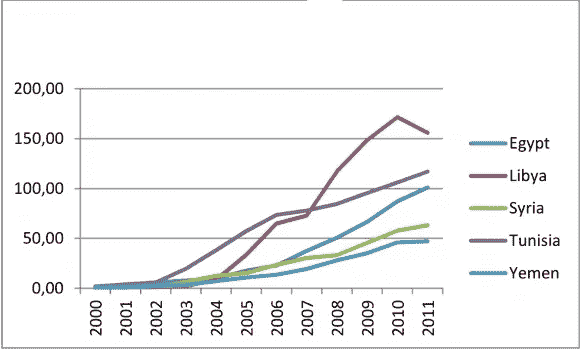
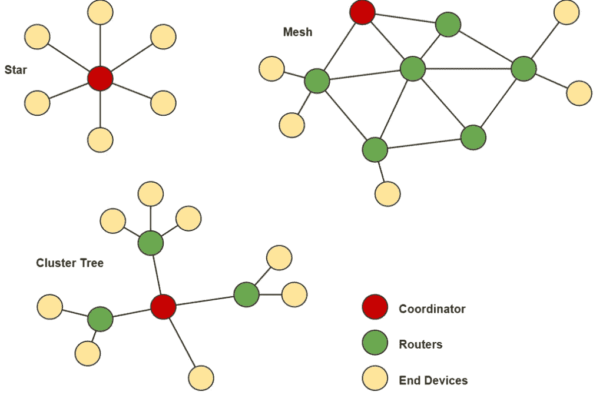
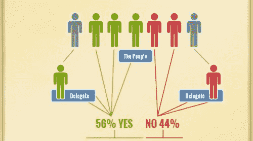

# 为什么你应该(非常)关心最近的全球互联网中断

> 原文：<https://medium.com/coinmonks/why-you-should-probably-care-a-lot-about-the-recent-global-internet-outage-8273aff2af3b?source=collection_archive---------7----------------------->

Sites that were down on Tuesday evening. Source: [www.newswire.lk/](http://www.newswire.lk/)

周二晚上(2021 年 6 月 8 日)，不可思议的事情发生了。

在美国科技公司 Fastly 运营的云计算网络遭遇重大软件漏洞后，世界各地的互联网用户发现自己无法访问主要的在线平台，如亚马逊、Hulu、CNN、卫报、纽约时报、Reddit、Spotify 和 Twitch 等。

甚至英国政府的官方网站也受到了影响。

请注意，我们离一个完全失灵的互联网只有几个平台之遥。举个例子，如果 Whatsapp 也倒下了，或者 Telegram、Grab、优步、Youtube……嗯，你会明白的。

## **T3【互联网的力量】T4**

在我们的日常生活中，我们认为许多事情是理所当然的。对我们许多人来说，粮食安全、水安全、人身安全等都是理所当然的。互联网也是如此。具有讽刺意味的是，互联网已经成为我们生活中的必需品，我们再也看不到它了。它变得无所不在，无所不能，以至于变得无形。它无处不在，因此无处不在。

也就是说，直到我们失去它。当我们失去对互联网的访问时，突然之间——我们感觉到互联网在我们生活中的大量存在(或缺乏)。

周二，我们尝到了一点点甜头。除了在我们心中留下一个大洞(和时间表)，这个事件对许多人产生了严重的影响。全职抽搐飘带暂时失去了他们唯一的收入来源；记者们无法发布突发新闻；由于疫情，人们被困在家里，无法了解外面的世界发生了什么。

换句话说，我们对互联网的真正力量有了非常非常小的了解。

Source: [https://theconversation.com/](https://theconversation.com/)

如果我让你们现在退后一步，思考一下你们每天是如何生活的，我会愿意花一大笔钱在互联网上。无论是与你的同事或爱人保持联系，了解世界各地已经发生/正在发生的事件，还是只是在工作中做你的工作，所有这些活动都需要互联网。见鬼，你之所以能读到这个*是因为互联网*！

我们实际上是在互联网上生活。

这确实是一个发人深省和令人恐惧的想法，尤其是考虑到法斯特丽事件。如果我们的生活如此依赖互联网，那么任何个人、组织或机构都不应该拥有互联网的万能钥匙。

## ***关于中央集权***

周二晚上，我们所有人都受到了一个突然而令人不快的认知的打击，那就是这把隐喻的万能钥匙也许并不那么隐喻。有一个肯定是法斯特丽拿的。

如果一个小小的软件漏洞就能彻底瘫痪所有这些巨大而强大的互联网平台，而我们在世界各地的日常工作都非常依赖这些平台，我不敢想象任何人在 fast fast ly 上颠覆我们的生活——甚至就此而言颠覆世界——会有多么容易。

尽管互联网服务在中断后不久就恢复了，但这一事件不应被掩盖。它必须被仔细审查，深入挖掘，并最终得到解决。我们的生活再也不会像从前一样了。

互联网万能钥匙的概念——这种形式的权力，应该*永远不要*存在。至少，不是在*一个人*手中的奇异实体。

这就是巨大影响力和/或权力集中的问题所在:没有人应该对人们的生活有如此大的发言权。没有人有能力以如此巨大的方式影响人们的生活。作为全球民众，我们永远不应受制于少数人的突发奇想和幻想。

唉，周二晚上透露给我们，不幸的是，我们肯定是。我们中太多的人受到互联网的支配，甚至受到像 Fastly 这样的实体的支配。

从很多方面来说，我们很幸运，周二的事件不过是一场意外，一个由非恶意方犯下的非恶意错误；没有人在 fast 故意或有目的地拨动服务器机房的开关，在世界范围内造成混乱——或者至少我们希望是这样。

如果一个心怀不轨的演员得到了这样一把钥匙，后果将不堪设想。

事实上，我们甚至不需要想出一个虚构的场景来理解这种情况是如何发生的。我们只需回到 2010 年代初。

2010 年，世界上了一课，当代互联网是多么容易受到自上而下的集中控制。面对大部分通过社交媒体组织的持续抗议，埃及政府干脆关闭了该国的互联网。值得庆幸的是，这一举动适得其反，因为它让世界其他地方看到了穆巴拉克政权到底有多专制。这也是煽动众多言论自由团体——包括臭名昭著的匿名黑客团体——支持解放广场抗议者的火花。

Tahrir Square, 2010\. Source: [http://arabcenterdc.org/](http://arabcenterdc.org/)

直到今天，尽管穆巴拉克扳动了“死亡开关”，但该国的互联网流量几乎消失的图表，仍然是阿拉伯之春最具标志性的图像之一。

Internet Traffic Chart. Source: [https://journals.openedition.org/](https://journals.openedition.org/)

## ***关于分权的概念***

在穆巴拉克决定按下“死亡开关”后，似乎一些活动家已经开始重新思考他们的网络中立的方法。他们不再满足于游说那些控制现有互联网的人，而是试图创造一个新的、民主化的互联网。

无论是在各种占领抗议活动中可以找到的“自由塔”，还是 Reddit 用户的 Darknet 计划，都有一种公开的和越来越多的推动发展去中心化网状网络作为极端集中的互联网的替代方案。

**这些网状网络利用点对点和分布式系统技术，允许在多个设备**之间共享 **到互联网的单一连接，其中许多设备可以在网络不出现故障的情况下被移除。简而言之，这样一个网络中的所有设备仍然能够相互连接和聊天，即使互联网连接被完全切断。**

Visual Representation of a mesh network topology. Source: [https://datarespons.com/](https://datarespons.com/)

这是去中心化的缩影，像这样的技术将会(并且已经)在帮助被压迫者颠覆中央政权的恶意行为方面走得很远。

我的意思是，如果不是这些网状网络使得解放广场的抗议者在互联网被官方关闭后仍能保持连接，谁知道穆巴拉克政权会对他们做什么。

这就是为什么我如此反对公开的中央集权，并且如此热衷和支持分权。前者使少数特定的行动者能够滥用权力，而后者将权力分散给大众，使其更加负责。

当然，我并没有极端到认为我们需要在*生活的每一个方面*去中心化。在某些领域，权力的集中确实可以达到一些实质性的目的，比如提高效率或者防止决策僵局。

然而，在许多其他情况下，权力下放将是理想的。

例如，在政治领域:我们应该努力在将决策权集中在少数人手中和将决策权下放给大众之间取得更大的平衡。现在，天平在很大程度上倾向于前者，这对民主来说可能并不太好。

令人欣慰的是，新兴技术使得上述政治领域的权力下放变得触手可及。随着区块链技术在最近一段时间脱颖而出，像*液体民主*或*基于二次投票的民主*这样的新政治形式已经成为可能(我将在未来的文章中讨论这些概念，所以请密切关注它们！).

Liquid Democracy

随着技术的全面进步，我们的隐私权也应该得到保护；前者不应以后者为代价。如果是这样的话，技术只会为少数人的利益服务，而损害大多数人的利益。

权力下放是一把隐喻的万能钥匙，可以防止这种情况，所以我们需要继续努力，使其恰到好处。

> 加入 [Coinmonks 电报频道](https://t.me/coincodecap)，了解加密交易和投资

## 另外，阅读

*   [什么是保证金交易](https://blog.coincodecap.com/margin-trading) | [美元成本平均法](https://blog.coincodecap.com/dca)
*   [3 商业评论](/coinmonks/3commas-review-an-excellent-crypto-trading-bot-2020-1313a58bec92) | [Pionex 评论](/coinmonks/pionex-review-exchange-with-crypto-trading-bot-1e459d0191ea) | [Coinrule 评论](/coinmonks/coinrule-review-2021-a-beginner-friendly-crypto-trading-bot-daf0504848ba)
*   [莱杰 vs n rave](/coinmonks/ledger-vs-ngrave-zero-7e40f0c1d694)|[莱杰 nano s vs x](/coinmonks/ledger-nano-s-vs-x-battery-hardware-price-storage-59a6663fe3b0) | [币安评论](/coinmonks/binance-review-ee10d3bf3b6e)
*   [by bit Exchange Review](/coinmonks/bybit-exchange-review-dbd570019b71)|[bit yard Review](/coinmonks/bityard-review-7d104239be35)|[coin spot Review](https://blog.coincodecap.com/coinspot-review)
*   [3 commas vs crypto hopper](/coinmonks/3commas-vs-pionex-vs-cryptohopper-best-crypto-bot-6a98d2baa203)|[赚取加密利息](/coinmonks/earn-crypto-interest-b10b810fdda3) | [网格交易机器人](https://blog.coincodecap.com/grid-trading)
*   最好的比特币[硬件钱包](/coinmonks/the-best-cryptocurrency-hardware-wallets-of-2020-e28b1c124069?source=friends_link&sk=324dd9ff8556ab578d71e7ad7658ad7c) | [BitBox02 回顾](/coinmonks/bitbox02-review-your-swiss-bitcoin-hardware-wallet-c36c88fff29)
*   [CoinLoan 审核](/coinmonks/coinloan-review-18128b9badc4) | [YouHodler 审核](/coinmonks/youhodler-4-easy-ways-to-make-money-98969b9689f2) | [BlockFi 审核](/coinmonks/blockfi-review-53096053c097)
*   最好的[加密税务软件](/coinmonks/best-crypto-tax-tool-for-my-money-72d4b430816b) | [硬币追踪评论](/coinmonks/cointracking-review-a-reliable-cryptocurrency-tax-software-5114e3eb5737)
*   最佳[加密借贷平台](/coinmonks/top-5-crypto-lending-platforms-in-2020-that-you-need-to-know-a1b675cec3fa) | [杠杆令牌](/coinmonks/leveraged-token-3f5257808b22)
*   最佳[加密制图工具](/coinmonks/what-are-the-best-charting-platforms-for-cryptocurrency-trading-85aade584d80) | [最佳加密交易所](/coinmonks/crypto-exchange-dd2f9d6f3769)
*   [如何在印度购买比特币？](/coinmonks/buy-bitcoin-in-india-feb50ddfef94) | [WazirX 审核](/coinmonks/wazirx-review-5c811b074f5b) | [HitBTC 审核](/coinmonks/hitbtc-review-c5143c5d53c2)
*   [WazirX vs CoinDCX vs bit bns](/coinmonks/wazirx-vs-coindcx-vs-bitbns-149f4f19a2f1)|[block fi vs coin loan vs Nexo](/coinmonks/blockfi-vs-coinloan-vs-nexo-cb624635230d)
*   [本地比特币评论](/coinmonks/localbitcoins-review-6cc001c6ed56) | [加密货币储蓄账户](https://blog.coincodecap.com/cryptocurrency-savings-accounts)
*   [比特币基地评论](/coinmonks/coinbase-review-6ef4e0f56064) | [德里比特评论](/coinmonks/deribit-review-options-fees-apis-and-testnet-2ca16c4bbdb2) | [FTX 评论](/coinmonks/ftx-crypto-exchange-review-53664ac1198f)
*   [n 零复习](/coinmonks/ngrave-zero-review-c465cf8307fc) | [Phemex 复习](/coinmonks/phemex-review-4cfba0b49e28) | [PrimeXBT 复习](/coinmonks/primexbt-review-88e0815be858)
*   最佳[区块链分析](https://bitquery.io/blog/best-blockchain-analysis-tools-and-software)工具| [赚比特币](/coinmonks/earn-bitcoin-6e8bd3c592d9) | [期货交易机器人](/coinmonks/futures-trading-bots-5a282ccee3f5)
*   [加密套利](/coinmonks/crypto-arbitrage-guide-how-to-make-money-as-a-beginner-62bfe5c868f6)指南| [如何做空比特币](/coinmonks/how-to-short-bitcoin-568a2d0b4ae5) | [Prokey 回顾](/coinmonks/prokey-review-26611173c13c)
*   [最佳加密交易信号电报](/coinmonks/best-crypto-signals-telegram-5785cdbc4b2b) | [MoonXBT 评论](/coinmonks/moonxbt-review-6e4ab26d037)
*   [Godex.io 审核](/coinmonks/godex-io-review-7366086519fb) | [邀请审核](/coinmonks/invity-review-70f3030c0502) | [BitForex 审核](/coinmonks/bitforex-review-c4bb28d9e271) | [OKEx 审核](/coinmonks/okex-review-6b369304110f)