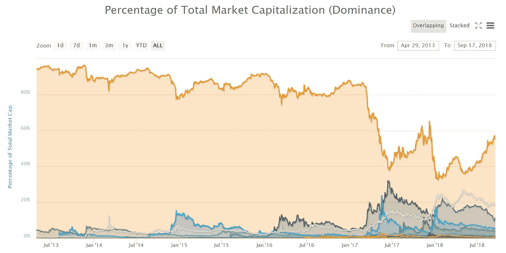
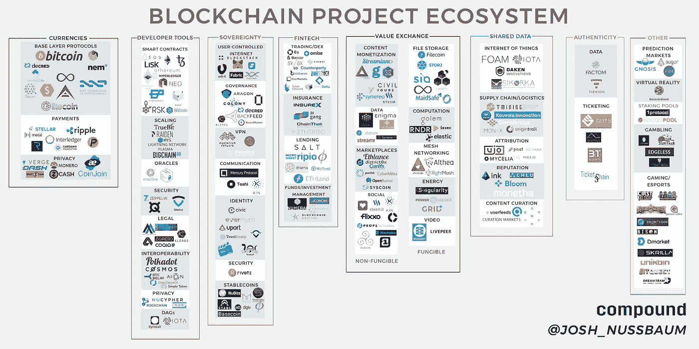
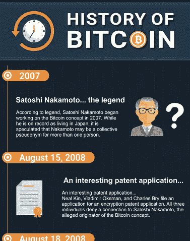

# 为什么你的代币可能是一项糟糕的投资&为什么比特币的可扩展性是次要的

> 原文：<https://medium.com/coinmonks/why-your-token-is-likely-a-bad-investment-why-bitcoin-scalability-is-secondary-91e1f82dd2f1?source=collection_archive---------1----------------------->

[Bitcoin dominance in orange](https://coinmarketcap.com/charts/)

抛开 cryptos 的[易变性不谈，当人们向各种密码项目投入资金时，一个几乎从未得到解决的关键悖论是:](/coinmonks/crypto-volatility-the-phantom-chicken-and-egg-problem-81caf9089cd7)

> 当我投资一个代币时，我希望将来有人愿意以更高的价格购买它来使用这个平台。然而，如果代币的价格如我预期的那样持续上涨，为什么还会有人购买我的代币来使用平台呢？

这个看似简单的问题是加密评估的核心，与许多加密爱好者所设想的去中心化的未来密不可分。如果不理解这一点，任何投入到 crypto 的钱本质上都是盲目的钱，不管项目团队执行他们声明的目标有多好。

> [发现并回顾最好的比特币软件](https://coincodecap.com)

这种混乱的核心是缺乏对平台令牌的核心用例的区分，以及对货币实际用途的一般表面理解。正如这里的[所提到的](/@kaishinaw/the-scarcity-problem-why-cryptocurrencies-are-so-divisive-1ecab558c2e2)，由于密码的复杂性，人们倾向于将所有密码归入一个篮子，而不考虑实现的差异。再加上[值](/predict/redefining-our-valuation-of-the-world-what-institutions-tech-and-cryptos-can-tell-us-about-real-bcd9a5803329)的抽象本质，许多人只是满足于简化的、看似逻辑一致的分析模型，而没有进一步考虑它在特定用例中的实际适用性。其中的关键是相信“更高的网络使用率意味着更高的网络价值”，这并没有说谁真正获得了网络产生的价值。

已经有许多令人惊讶的文章(最后的链接)详细讨论了这个问题(又名“令牌速度问题”)，这不是其中之一。相反，我的目标是避免太多的技术术语，并最终通过阐明以下观察结果来回答标题中提出的问题:

*   用户使用、交易或持有代币的可能性取决于代币作为价值储存手段、交换媒介或效用的程度。(例如，它更像黄金、现金还是优惠券？).
*   网络的总价值更多地是用户愿意为每个令牌支付多少钱的函数，而不是网络上活动的总量。如果网络使用成本随着令牌价格线性上升，网络将无法扩展。
*   区块链产生的好处将以成本节约的形式累积到用户身上，这意味着这种价值不是由网络本身获取的，而是用户更低的自付费用。
*   鉴于区块链协议的公共性质，每个链不仅要与竞争对手竞争，还要面临分流风险。在功能相似的情况下，用户可能会使用成本较低的服务，从而在运行服务所需的成本之上没有多少利润空间。
*   价值储存功能将倾向于自然垄断，因为在单个资产中获取的价值比例越大，剩余资产的潜在影响就越小。只要合理，这种资产的交易成本和吞吐量是次要的。

你用钱做什么？

钱是生活中所有问题的解决方案，直到你拥有太多的钱。它使我们能够过上我们想要的生活，因为我们可以用足够的钱购买其余的生活必需品。因此，我们努力储存尽可能多的钱，以便我们能够面对未来抛给我们的一切。我们把它存在银行里以保证安全，并且只在需要的时候取出。提取现金的数量是在让我们的日常交易更方便和害怕失去它(或者对一些人来说，害怕花掉它)之间的微妙平衡。

[How money keeps us out of trouble](http://blondie.com/comic_tag/saving-money/)

因此，根据我们想用它做什么，钱有不同的用途:

*   作为一种价值储存手段，我们希望有信心和安全感，让我们今天的一美元明天也值一美元。
*   作为交换媒介，我们希望它能方便我们日常使用。
*   作为一家公用事业公司(想想可兑现的优惠券)，我们甚至不想知道是否涉及金钱，我们只需要承诺的产品/服务。

值得注意的是，上述特征是由我们的需求驱动的，因此适用于任何形式的货币，无论其背后的技术如何。只要有必要量化我们周围的世界，围绕货币(我们用它作为价值评估)的新创新就会推动用户生活得更好。加密货币延续了这一传统，使货币能够被编程，并围绕当前价值流扁平化层级结构。

这种困惑的产生是因为人类历史上从未有过这样一个时刻，人们在如此短的时间内接触到如此多形式的货币(货币基础)。此外，在此之前，现代世界的许多人从未被迫考虑稳定货币的效用，甚至也没有持有不同的货币。不用说，几乎没有人准备好必要的知识来真正评估这些作为独立货币基础的新加密货币的复杂性。随后发生的是加密货币之间激烈的不受监管的竞争，以获取更大比例的全球价值流(“金钱”)，这种竞争基于谁拥有最好的承诺或谣言。

[In it for the tech](https://www.reddit.com/r/btc/comments/73hlog/dont_let_your_kid_talk_with_crypto_traders/)

在没有真正理解网络令牌用途的情况下，人们对区块链技术的信任与市值、交易量和令牌价格等更简单的指标深深交织在一起。因此，当试图确定令牌的“真实”价值时，争论通常是这样的:

> 这种代币的市值现在只有 1000 万美元，而它所针对的行业价值为 100 亿美元，因此，由于供应有限，我预计每枚代币的价格将增长 1，000 倍。与下一个最佳竞争对手相比，该网络的交易数量也是其两倍，因此，由于网络效应，它的价值至少应该是竞争对手价值的两倍。

这一论点的基础是这样一种假设，即所讨论的代币至少会在持有期间保持其价值，以便将来可以出售。虽然所有货币都在一定程度上显示了这种价值储存的质量，但对于大多数加密算法来说，它们的核心用例不是作为价值储存，而是作为一种令牌，授予它们使用相关平台的能力。这是在购买代币时必须做出的关键区分，因为它本质上决定了您是基于代币的“固有”属性持有代币，还是基于某人愿意为使用平台的权利支付更多费用的信念持有代币。

**市场价值的破坏者，真实价值的传递者**

不考虑交易成本，如果您的令牌只是允许使用网络，并且您认为它与当前企业的价值相同，那么对消费者来说没有任何好处，因为他们仍然必须为本质上相同的服务支付相同的价格。即使通过区块链技术公司节省的成本或新的资金如此之多，以至于你仍然可以在用户节省成本的同时获得利润，你本质上是在取代所谓的分散化解决方案中的中间商。

考虑到区块链应该“摆脱中间商”，持有这类代币能够产生任何利润的唯一时间是这样做有助于保护或稳定网络的时候。这是许多令牌试图通过使用不同版本的标记协议来实现的，在该协议中，拥有足够大的存储空间的用户将能够在网络上标记他的令牌，以便获得兴趣。正确处理这个问题是一个很好的平衡，因为它本质上是在处理令牌的供求关系。

必须注意的是，股份证明极大地减少了保护平台所需的计算资源，因此极大地减少了网络价值流向采矿者或令牌持有者的比例。此外，让更多的人持有代币会减少流通供应，但不一定会减少平台的交易量。事实上，这种流动性的缺乏实际上可能会阻碍网络的发展。

退一步看大局，区块链协议的公共性质也将确保令牌的用户而不是投资者将从这项技术中获得最大的盈余。由于该链可以很容易地被分割，并携带所有原始链的数据，用户最终将以最低的成本迁移到该链，给定类似的功能。

[Number of different chains](/@josh_nussbaum/blockchain-project-ecosystem-8940ababaf27)

此外，上面没有考虑到公共协议通过开放和廉价的实验来促进竞争。其结果是，可能会有越来越多的专用协议，每种协议都通过消除平台上任何不必要的成本来降低用户的成本。因此，从保护网络中获得的利益可能会收敛到高于实际成本的几分之一，几乎没有额外利润的空间。对投资者来说，更糟糕的是，这个领域的失败率将会非常高，大多数“获胜”协议还没有建立。对用户有好处，对投资者没什么好处。

**人们使用代币做什么？**

鉴于这项技术本身将把大部分剩余转移给用户，接下来需要问的问题是用户将如何实际使用令牌。社会现在使用金钱的不同方式将提供一瞥个人将如何对待未来的象征。正如上面所暗示的，人们通常需要钱来根据情况表现出不同的特征。

我们把钱存在银行里是为了安全，尽管我们最终会因为利息损失而支付很多钱(看看我们向银行借款时支付的利息与我们借钱给他们时支付的利息之间的差异)。我们用钱购买房产，希望有一个储蓄账户，尽管我们最终通过抵押贷款支付了额外的费用，并失去了流动性。当我们对政府失去信心时，我们会用钱换黄金，尽管黄金的用途非常有限。

[Difficulties of having too much money](http://hagarthehorrible.com/comics/march-25-2017/)

我们把现金放在钱包里，这样我们可以随时交易，即使我们有失去现金的风险。我们在不同的情况下使用不同的卡来累积利益或节省成本，即使这样做不方便。我们将钱转移到各种公司/手机钱包中，以便我们可以更容易地访问他们的服务，即使我们失去了任何利息支付。我们购买可赎回的优惠券或 kickstarter 产品，这样我们就可以通过批量购买或提前获得来节省资金，即使这意味着我们的钱会被锁定，直到我们获得服务/产品。

上面的一个主要结果是用例将决定我们希望以这种特定的形式保存价值多长时间。我们把钱存在银行里，因为我们近期不打算用它。如果我们有足够的资本，我们会购买金融资产，这样储存的价值可以抵御未来的通货膨胀。我们交易黄金以防范未来的灾难。另一方面，我们将只携带接下来几天所需的足够现金，或者将所需的现金转移到其他账户/优惠券，这样我们就不会锁定我们的资金，损失利息支付。因此，我们的价值储存需求将与持有期紧密交织在一起。

因此，人们倾向于储存价值形式，同时尽量减少交换媒介或效用形式的时间和数量。这实际上意味着，媒介作为价值储存手段的作用越小，我们就越有可能只在需要访问平台时交易它。因此，使用平台的成本成为这种令牌的决定性需求因素。如果令牌价格和交易成本不分离，网络将无法扩展。即使完全脱钩，代币的价值也只会随着基础公用事业的需求而线性增长，正如上一节所述，市场动态不断推动此类公用事业的成本下降。

可以认为，由于该技术相对于货币价值储存以及特定支付形式的特定优势，可能会有一种加密货币成功地同时作为价值储存和交换媒介竞争。尽管如此，鉴于加密协议的竞争性，社会更有可能选择在特定资产中存储价值，同时继续利用适合特定用例的日益专业化的协议。考虑到我们在跨链交换或链间可操作性方面取得的进步，这一点就更加重要了。随着代币之间转换摩擦的减少，用户将没有理由囤积非储值代币。

**这一切意味着什么？**

给定令牌协议之间的竞争量，大多数令牌将很可能是不良投资，因为难以识别“赢家”,并且如果令牌没有价值特征的存储，市场动态实际上对令牌设置了硬上限。这些相同的力量也是为什么与资产适应变化的能力相比，价值资产存储中的支付功能相对微不足道。有趣的是，在密码的潜在使用案例中，储值功能的技术风险最小。比特币(BTC)是最有可能成为这种纯粹的价值储存手段的候选者，它一贯优先考虑弹性，并且已经处于在现实世界中接受测试的阶段。

[A great detailed history dive here](https://fried.com/history-of-bitcoin/)

这并不是说，如果交易成本和确认时间飙升，人们将继续使用 BTC，而是说，代币成为价值储存手段比成为交易媒介要困难得多。BTC 目前的状况已经满足了价值资产存储的要求，尽管未来需要对其支付功能进行一些调整。与此同时，其他令牌仍在尝试定义或满足更复杂、更专业的用例。这就是为什么相对于其他代币，BTC 似乎是更好的投资，尤其是如果持有者将 BTC 的所有叉子作为对冲工具的话。

代币的盈利能力将在很大程度上取决于其代币模型，该模型决定了用户想要持有代币的程度。这也将受到其特定用例的严重影响。例如，由于隐私和匿名要求导致更长的持有期，隐私令牌可能会有更高的交易摩擦。至关重要的是，这种模式必须建立在当前网络价值相对于企业价值减去中间商成本的框架内。当然，这个框架假设令牌的效用与其对应的效用完全匹配，并获取该效用的所有值。

最终，公共区块链技术将把很大一部分公用事业转移给用户，而不是令牌持有者或矿商。这将以牺牲传统业务为代价，因此企业对这项技术持谨慎态度。约翰·普费弗总结得很好:

> 加密货币相对于现有货币的性能优势在于:
> 
> (a)作为价值的货币储存手段最强和最明显；(b)对某些付款，但远非所有付款，更为有利；以及(c)为一些选定的目的而作为记账单位进行区分。

因此，除了价值的货币存储之外，cryptos 可能会与当今的许多集中式解决方案相协调，而不是取代它们。Cryptos 将使不同价值流的访问民主化，并为新形式的价值生成铺平道路。这是一个令人兴奋的未来，我们正在建设，但它不会通过向有前途的项目团队扔钱来实现。在早期投资这样的团队，并为他们提供实现产品所需的资本，肯定会有一些利润。然而，为了让区块链科技扩大规模并实现其真正的潜力，投资者必须认识到，与当前的商业模式不同，该平台的好处也必须进行分配。

*对于那些对深入兔子洞感兴趣的人，我强烈推荐以下内容(尤其是第一条，它帮助我将许多想法付诸文字):*

*   [*(机构)投资者对加密资产的看法*](https://s3.eu-west-2.amazonaws.com/john-pfeffer/An+Investor%27s+Take+on+Cryptoassets+v6.pdf) *作者约翰·普费弗*
*   [*论价值、速度和货币理论*](/blockchannel/on-value-velocity-and-monetary-theory-a-new-approach-to-cryptoasset-valuations-32c9b22e3b6f) *作者亚历克斯·埃文斯*
*   [*TwoBitIdiot*2018](/tbis-weekly-bits/95-crypto-theses-for-2018-ca7b74f8abcf)*95 篇加密论文*
*   [*论维塔利克·布特林*的《中间交换令牌估价](https://vitalik.ca/general/2017/10/17/moe.html)
*   *[*关于加密资产价值的速度问题*](/thoughtchains/on-the-velocity-problem-for-cryptoasset-value-aad235694211) *刘伟信**
*   *[*理解令牌速度*](https://multicoin.capital/2017/12/08/understanding-token-velocity/) *作者凯尔·萨马尼**

*谢谢你坚持到最后。希望听到你的想法/评论，所以请留言。我活跃在 twitter 上[*@*AwKaiShin](https://twitter.com/awkaishin)*如果你想收到更多可消化的与密码相关的信息，或者访问我的* [*个人网站*](https://www.awkaishin.com/) *如果你想要我的服务:)**