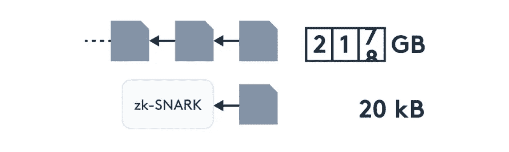

# 为什么 zk-SNARK 是区块链的未来？

> 原文：<https://medium.com/coinmonks/why-zk-snark-is-the-future-of-blockchain-d84f605f0566?source=collection_archive---------2----------------------->

## 在未来，区块链不断增长的规模将成为一个大问题，在本文中，我们将讨论 zk-SNARK 如何解决这个问题。

区块链是许多现实世界问题的解决方案，但区块链有一些局限性，随着时间的推移，这些局限性可能会成为用户的问题。它不仅会损害区块链网络，还会损害生态系统的参与者。

例如，比特币的区块链每天都在增长，现在比特币区块链的大小超过 300GB，这是不可能使用轻型设备处理的。于是，很多矿工停止了开采，这就导致了比特币开采的[集中化。一旦比特币变得集中，控制器可以改变区块，从而进行交易，这不是一件好事，但无论如何，在这篇文章中，我们将讨论](https://www.investopedia.com/investing/why-centralized-crypto-mining-growing-problem/)[什么是 zk-SNARK](https://minaprotocol.com/blog/what-are-zk-snarks) ？以及 zk-SNARKS 的好处。

# zk-SNARK 是什么？

它代表知识的零知识简洁非交互论证，一个可以证明任何事情而不泄露信息的数字证书，使用 zk-SNARK MINA 协议，创建一个 22kb 的简洁区块链。

**我们先来了解一下 zk-SNARK 是如何帮助** [**MINA 协议**](https://minaprotocol.com/) **创建一个简洁的 22kb** 的区块链的，不过在此之前我们先来了解一下[比特币](https://en.wikipedia.org/wiki/Bitcoin)的挖矿工作原理。所以当你通过向你的朋友发送一些比特币来发起交易时，比特币从未虚拟转移，但比特币的所有者发生了变化。比特币仍然留在网络中，但当你开始交易时，你的数据会进入一个区块。该区块排队等待验证，然后在矿工之间，一场计算机权力的战争开始了，强大的计算机通常会获胜。

在这场战争中，计算机会验证该区块的数据，并通过检查比特币的来源来确定你想做的交易是否合法。但是 zk-SNARK 可以帮助矿工节省他们的时间和精力，因为他们只需要验证一件事，这就是 zk-SNARK。

因此，zk-SNARK 可以被视为一个虚拟证书，每当通过替换最新的块而产生新的块时，就会生成该证书。假设区块链可以为第一个块创建三个块，如块 1、块 2 和块 3，生成大小为 22kb 的 zk-SNARK 1，然后为第二个块生成大小为 22kb 的 zk-SNARK 2，zk-SNARKS 1 + zk-SNARK 2 组合生成一个 22kb 的 zkSNARK。在 block3 产生 22kb 的 zk-SNARK3 之后，它与现有的 22kb 大小的 zk-SNARK 组合，再次创建单个 22kb 大小的 zk-SNARK。因此，作为一个矿工，你不需要验证块 1，2，3，但你只需要验证最终的 zk-SNARK，这将节省你的时间，精力，精力等。{ [引用](https://minaprotocol.com/blog/what-are-zk-snarks) }

# zkSNARK 的优势

zk-SNARK 的最大好处是它可以将区块链的大小减少到 22kb。所以区块链的大小永远不会增加，所以我们永远不会面临任何与区块链大小相关的问题，并且每个光端设备都可以是区块链的一个节点，以受益于区块链提供的所有功能。

zk-SNARK 有助于提供数据保护，所以当你连接到第三方时，它永远不会透露你的数据，但允许你证明你想要的任何东西。例如，假设您访问互联网上的某个地方进行开户，该方要求您提供数据。然后代替数据，你提供你数据的 zk-SNARK，证明你有真实姓名和地址，但不需要公开。SNARK powered 应用程序可以帮助我们保护从您的家庭设备中流出的成千上万的数据。

# **结论:**

MINA 协议仅退出使用 zk-SNARK 来减小区块链大小的区块链，并计划创建一个可从移动设备访问并可通过保护互联网用户数据与互联网交互的区块链生态系统。[简而言之](https://blog.ethereum.org/2016/12/05/zksnarks-in-a-nutshell/)，zkSNARK 仍然有许多可能性，MINA 协议为开发者提供了使用 zk-SNARK 构建任何东西的授权。在我看来，zkSNARK 将是区块链空间的一场革命。

> 加入 [Coinmonks 电报频道](https://t.me/coincodecap)，了解加密交易和投资

## 另外，阅读

*   [尤霍德勒 vs 科恩洛 vs 霍德诺特](/coinmonks/youhodler-vs-coinloan-vs-hodlnaut-b1050acde55a) | [Cryptohopper vs 哈斯博特](https://blog.coincodecap.com/cryptohopper-vs-haasbot)
*   [币安 vs 北海巨妖](https://blog.coincodecap.com/binance-vs-kraken) | [美元成本平均交易机器人](https://blog.coincodecap.com/pionex-dca-bot)
*   [如何在印度购买比特币？](/coinmonks/buy-bitcoin-in-india-feb50ddfef94) | [WazirX 审核](/coinmonks/wazirx-review-5c811b074f5b) | [BitMEX 审核](https://blog.coincodecap.com/bitmex-review)
*   [比特币主根](https://blog.coincodecap.com/bitcoin-taproot) | [Bitso 回顾](https://blog.coincodecap.com/bitso-review) | [排名前 6 的比特币信用卡](/coinmonks/bitcoin-credit-card-bc8ab6f377c6)
*   [双子座 vs 比特币基地](https://blog.coincodecap.com/gemini-vs-coinbase) | [比特币基地 vs 北海巨妖](https://blog.coincodecap.com/kraken-vs-coinbase) | [硬币罐 vs 硬币点](https://blog.coincodecap.com/coinspot-vs-coinjar)
*   [印度加密交易所](/coinmonks/bitcoin-exchange-in-india-7f1fe79715c9) | [比特币储蓄账户](/coinmonks/bitcoin-savings-account-e65b13f92451) | [Paxful 审核](/coinmonks/paxful-review-4daf2354ab70)
*   [杠杆令牌](/coinmonks/leveraged-token-3f5257808b22) | [最佳加密交易所](/coinmonks/crypto-exchange-dd2f9d6f3769) | [AscendEX 评论](/coinmonks/ascendex-review-53e829cf75fa)
*   [Godex.io 审核](/coinmonks/godex-io-review-7366086519fb) | [邀请审核](/coinmonks/invity-review-70f3030c0502) | [BitForex 审核](https://blog.coincodecap.com/bitforex-review) | [HitBTC 审核](/coinmonks/hitbtc-review-c5143c5d53c2)
*   【Crypto.com 费用】 | [僵尸密码审查](/coinmonks/botcrypto-review-2021-build-your-own-trading-bot-coincodecap-6b8332d736c7) | [币安替代品](https://blog.coincodecap.com/crypto-com-alternatives)
*   [有哪些交易信号？](https://blog.coincodecap.com/trading-signal) | [Bitstamp vs 比特币基地](https://blog.coincodecap.com/bitstamp-coinbase)
*   [ProfitFarmers 回顾](https://blog.coincodecap.com/profitfarmers-review) | [如何使用 Cornix 交易机器人](https://blog.coincodecap.com/cornix-trading-bot)
*   [MXC 交易所评论](/coinmonks/mxc-exchange-review-3af0ec1cba8c) | [Pionex vs 币安](https://blog.coincodecap.com/pionex-vs-binance) | [Pionex 套利机器人](https://blog.coincodecap.com/pionex-arbitrage-bot)
*   [我的加密副本交易经历](/coinmonks/my-experience-with-crypto-copy-trading-d6feb2ce3ac5) | [比特币基地评论](/coinmonks/coinbase-review-6ef4e0f56064)
*   [CoinFLEX 评论](https://blog.coincodecap.com/coinflex-review) | [AEX 交易所评论](https://blog.coincodecap.com/aex-exchange-review) | [UPbit 评论](https://blog.coincodecap.com/upbit-review)
*   [AscendEx 保证金交易](https://blog.coincodecap.com/ascendex-margin-trading) | [Bitfinex 赌注](https://blog.coincodecap.com/bitfinex-staking) | [bitFlyer 审核](https://blog.coincodecap.com/bitflyer-review)
*   [麻雀交换评论](https://blog.coincodecap.com/sparrow-exchange-review) | [纳什交换评论](https://blog.coincodecap.com/nash-exchange-review)