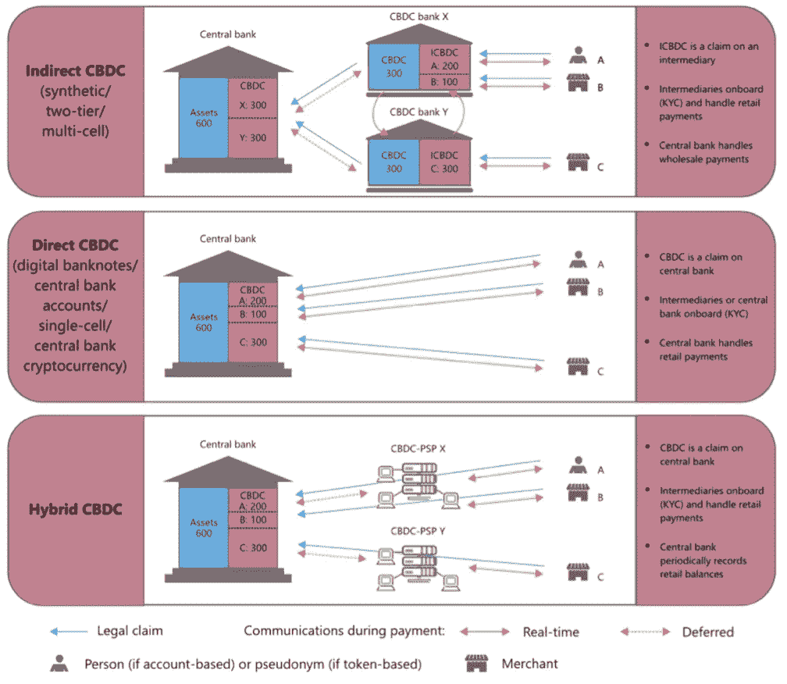
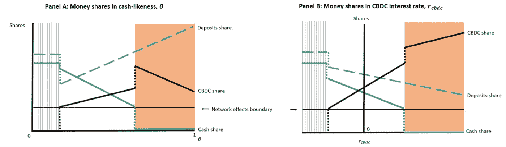
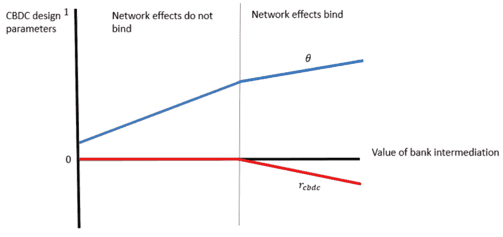

# 附息的 CBDC 会塑造贷款行业吗？

> 原文：<https://medium.com/coinmonks/will-an-interest-bearing-cbdc-shape-the-lending-industry-ac4e9e441358?source=collection_archive---------4----------------------->

## CBDC(中央银行发行的数字货币)的最优设计

*马克·卡罗特，伦敦大学学院倒数第二名经济学学士*

**Figure I**. Zimbabwe’s ‘worthless’ currency: ‘Hyper-inflation at its height’. Source: [Financial Times.](https://www.google.com/url?sa=i&url=https%3A%2F%2Fwww.ft.com%2Fcontent%2F34d75e42-10e8-11e5-8413-00144feabdc0&psig=AOvVaw0IoDbxyzytsN7IqhF12ViK&ust=1626278751594000&source=images&cd=vfe&ved=0CAoQjRxqFwoTCMCbitG24PECFQAAAAAdAAAAABAD)

> “螃蟹和各种各样的东西，”*羊说:*“选择很多，只需下定决心。现在你想买什么？” *—透过镜子*

随着比特币在 4 月份创下今年最大跌幅后从令人满意的水平缓慢回升，一批央行和政府正加大对加密世界的监管力度。[泰国银行](https://cointelegraph.com/news/thailand-s-central-bank-warns-against-using-digital-currencies-for-payments)宣布，随着这种非合法货币(即 BTC 和 ETH)的广泛使用，它将与该国的 SEC 合作，在亚洲地区对加密支付实施进一步的监管。尽管 BOT 仍在研究其 CBDC 项目的路线图，但它强调有必要了解这一新的资产类别及其不稳定的回报——泰国证券交易委员会(SEC)为加密投资设立最低年收入要求的计划因反弹加剧而被推翻。

虽然中国最近就一些省份的[采矿禁令](https://www.coindesk.com/3-reasons-why-chinas-bitcoin-crackdown-isnt-all-that-bad)打击比特币生态系统，加上之前的限制公告，如 2017 年 ICO 热潮期间宣布 ICO(首次发行硬币)为非法，可能会吓坏加密社区，但投资者必须记住，BTC 在该国并未被禁止，只是引起了重大动荡，被认为是其对国家经济和金融稳定的挑战性标志。

正是出于这个原因，在如此艰难的时刻，我将在本文的其余部分，来理解央行在金融游戏中最新的、令人难以置信的王牌，以及它可能如何扰乱整个贷款行业:CBDC。

## **为什么保持支付工具的多样性很重要？**

在一个存在大量选择(对现金、中央银行存款和银行存款的需求)的环境中，类似现金的 CBDC 和网络效应会减少现金，使其几乎消失——这就是当今瑞典的情况，对电子支付日益增长的需求导致了实物现金使用的下降[1]。

相反，**存款类 CBDC** 可能引发借贷摩擦，从而加剧银行中介(Agur et al .，2019)。因此，对这两个极端的过度需求会阻碍经济稳定。

中央银行(简称 CBs)作为 CBDC 的唯一发行者，将选择 CBDC 的最优设计，旨在最大化福利国家，同时考虑到家庭对支付工具的匿名性和安全性的异质性偏好。因此，商业银行面临着银行中介和支付多样性之间的**权衡**，正如最近对法律索赔架构的研究所表明的那样(Auer R .和 hme R .，2020)。例如，虽然一个 [**直接 CBDC**](https://levelup.gitconnected.com/my-short-take-on-the-legal-structure-behind-a-retail-cbdc-ae6fbd2bc191) 可能更*安全*，但它在支付方面缺乏*匿名性*(债权完全由中央银行管理)。

此外，通过签发**间接 CBDC** 允许第三方进入，CBs 将放弃其对可追溯性的部分控制，失去对可能导致不法行为的电子交易的追踪。

**混合 CBDCs** ，仅仅是上述权利要求的组合，看起来很有前途，但是整个系统的复杂性可能会加重 CBDC 的两个核心基本价值:易用性**和操作弹性**。图一说明了上文讨论的要点。

**Figure II.** The legal Structure of a CBDC. Source: (Auer R., Böhme R., 2020)

## **对 CBDC 设计的进一步分析**

根据奥尔等人的分析。此外，家庭对特定类型货币进行分类的决定有三个考虑因素:他们的异质偏好、网络效应——来自支付工具的易用性和用户数量，以及存款和 CBDC 的利率。图三显示了货币份额的演变，涉及现金相似性 *θ* (面板 A)，其中 0 表示类似存款的 CBDC，1 表示类似现金(因此代表极端情况)。面板 B 考虑*RC BDC*——CBDC 速率。

**Figure III.** Money share evolution and CBDC design. Source: (Agur et al., 2019)

根据该模型，如果我们沿着 x 轴移动，当 CBDC 更像现金时( *θ* 更接近 1)，面板 A 的白色区域显示存款增加，实物现金减少。因此，我们得出结论，存款利率的上升导致 CBDC 持有者数量的增加(由向上的黑线表示)。然而，当 CBDC 变得更像现金时——*θ*越来越接近 1——它达到了网络外部性导致无现金均衡的阈值。越来越多的用户成为 CBDC 持有者，使得现金变得无足轻重，消失不见。随着 *θ* 越来越接近 1，持有存款的回报超过了持有 CBDC 的回报，因此减少了 CBDC 用户的数量。

相反，B 图显示了 CBDC 利率和现金持有量之间的负相关关系；随着 *rcbdc* 上升，实物现金缩水。**存款也减少**。高 *rcbdc* 导致现金实际消失。

> 尽管如此，请注意拥有一个有利息的 CBDC 实际上是天真的，这确实可以打开许多决策的大门:中央银行可以改变 CBDC 利率以避免现金减少，从而促使家庭使用更多的现金或存款。正是在这个阶段，附息 CBDC 开始发挥作用——下文将详细介绍。

## **附息 CBDC:央行潜在的钻石？**

引入与银行存款竞争的 CBDC，可能会导致银行提高存款利率，使其更具吸引力。考虑到银行在存款市场参与古诺竞争，并面临一个完全竞争的贷款市场(这是一个深远而大胆的假设，允许上述模型工作)，CBDC 也将扩大银行中介，前提是 CBDC 的利率设定在 0.05%和 1.79%之间(Chiu J. et al .，2020)。

因此，从某种意义上说， **CBDC 将迫使银行提高存款利率**，在不完全竞争的存款市场，存款利率通常保持在较低水平。更高的存款利率将吸引更多的存款，降低贷款利率并扩大放贷。正如已经说过的，这是一个生息的 CBDC 的奇妙特征；作为一种外部力量，它推动非竞争性银行达到 CBDC 比率。

**Figure IV.** Optimal interest-bearing CBDC design. Source: (Agur et al., 2019)

这个模型的另一个重要发现是，通过利率的变化，生息的 CBDC 保持了现金的活力。

在图四中观察到了这种相关性，如图中的 RHS 所示，当网络效应与负面的 *rcbdc 结合在一起时，*对现金的负面网络效应得到缓解，使 CBDCs 的兴趣降低，对现金的需求增加。

此外，作为决定企业和家庭借贷成本水平的银行存款利率，而不是政策利率(又称基本利率)，附息 CBDC 可以增强存款市场的竞争，通过宽松的贷款政策促进投资，并恢复经济稳定，特别是在津巴布韦和委内瑞拉等高通胀管辖区，恢复消费者对本币的信心。

由于附息的 CBDC 更具有政策相关性，并具有改变贷款行业的巨大潜力(正如我们在本文中所讨论的)，考虑到有关 CBDC 设计的主要文献涉及不附息的 cbdc，预计在不久的将来，对该问题的进一步定性研究将会激增，这将有助于更好地评估这种新支付工具的可行性，尤其是其设计部分。

**参考文献**

1.阿米留斯、克劳森和雷斯洛(2020)。*现金萎缩:瑞典似乎很特别，而不是走在潮流的前面。* VOXEU。【在线】。[于 2021 年 4 月 16 日获取]。可从[https://voxeu . org/article/萎顿-现金-瑞典-似乎-特别-相当-超前-曲线](https://voxeu.org/article/withering-cash-sweden-seems-special-rather-ahead-curve)获得

Agur，I .，Ari，a .，& Dell 'Ariccia，G. (2019)。*设计央行数字货币* (№1065)。ADBI 工作文件系列。

奥尔河和伯姆河(2020 年)。零售央行数字货币技术。*国际清算银行季度回顾，3 月*。

邱，j，Davoodalhosseini，m，蒋，J. H .，，朱，Y. (2019)。*银行市场势力与央行数字货币:理论与量化评估*(№2019–20)。加拿大银行。

Agur，I .，Ari，a .，& Dell 'Ariccia，G. (2019)。*如何设计央行数字货币？*。*苏尔夫政策说明*，(129)。

> 加入 [Coinmonks 电报频道](https://t.me/coincodecap)，了解加密交易和投资

**也读作**

 [## 加密交易机器人——最佳免费加密交易机器人

### 2021 年币安、比特币基地、库币和其他密码交易所的最佳密码交易机器人。四进制，位间隙…

medium.com](/coinmonks/crypto-trading-bot-c2ffce8acb2a)  [## 最佳 6 个加密交易信号电报通道

### 这是乏味的找到正确的加密交易信号提供商。因此，在本文中，我们将讨论最好的…

medium.com](/coinmonks/best-crypto-signals-telegram-5785cdbc4b2b)  [## BlockFi 评论 2021:利弊和利率

### 今天，我们提出了一个全面的 BlockFi 评论，这是一个成立于 2017 年的加密贷款平台，拥有其…

blog.coincodecap.com](https://blog.coincodecap.com/blockfi-review)  [## 加密税务软件——五大最佳比特币税务计算器[2021]

### 不管你是刚接触加密还是已经在这个领域呆了一段时间，你都需要交税。

medium.com](/coinmonks/best-crypto-tax-tool-for-my-money-72d4b430816b)