# 银行会灭亡还是会适应？DeFi 的未来将会决定。

> 原文：<https://medium.com/coinmonks/will-banks-perish-or-adapt-the-future-of-defi-will-decide-80f13284f76?source=collection_archive---------4----------------------->

## 银行从 14 世纪就开始运作了。通过债务/信贷体系，它们带来了经济增长，但一旦出现问题，它们就会失灵。

人类历史上第一家官方银行成立于 14 世纪(准确的说是 1401 年)。Taula de la Ciutat 于 1401 年在巴塞罗那成立，并开始作为加泰罗尼亚政府的国库。

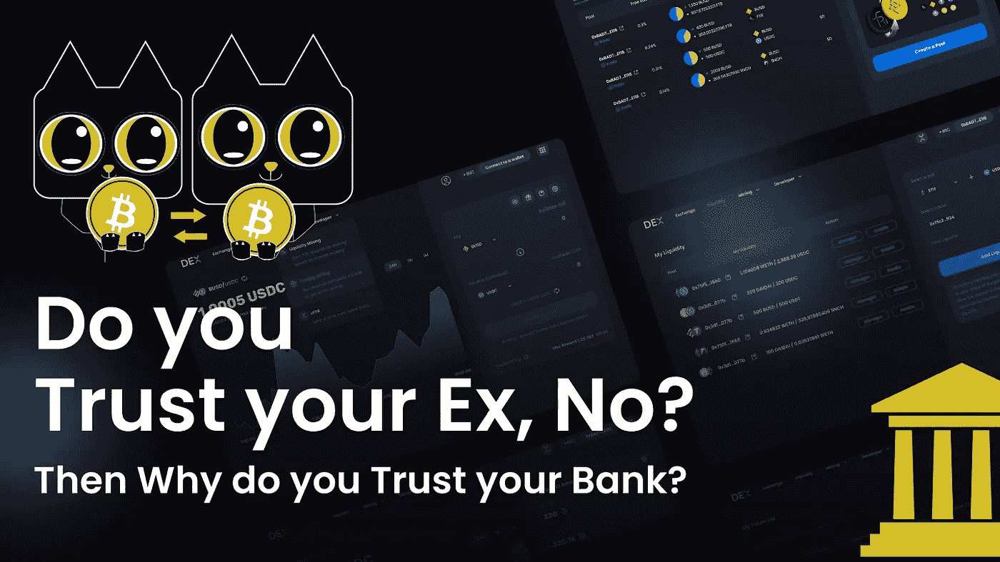

600 多年过去了，从那以后，政府不断发展，银行变得更有组织性，数字银行加快了发展速度。但是到底有多快呢？

只需点击几下鼠标，你就可以把钱从你的银行账户汇给你所在国家的任何人。此外，你只需扫码就可以在你最喜欢的餐馆支付三明治的费用。太快了，对吧？

# 跨境支付

银行与技术相结合，可以成就大事。但前提是他们希望适应不断变化的时代，而时代正以前所未有的速度变化着。

从现在起，你可以在几秒钟内直接从一个国家的银行账户汇款。但是跨境支付呢？

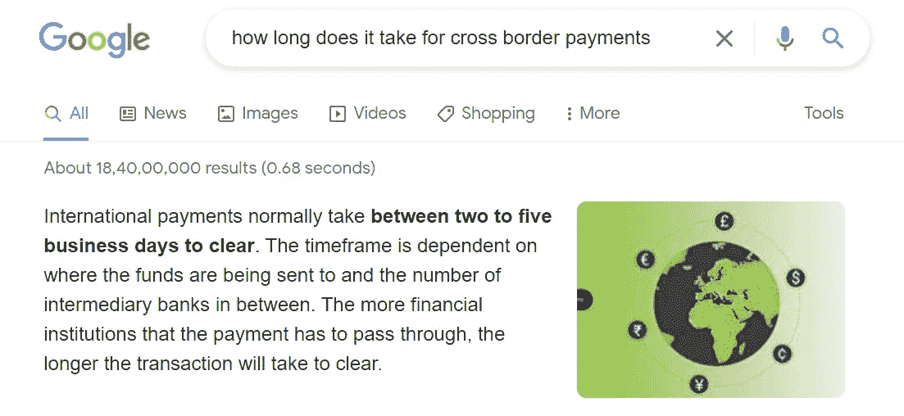

现在，根据谷歌上的一个特色片段，国际支付通常需要 2-5 天(我猜这是最少的，可能需要更长时间)。

假设你来自印度，你的妻子发生了意外(假设，她可能仍然会因为你阅读这篇文章而看你一眼，而不是花时间陪她)，而你的银行账户中没有足够的资金支付治疗费用。唯一能借钱给你的人住在美国。

你打算怎么办？即使你的朋友在半夜转账，也需要 3-5 个工作日(尽管我用大写字母写了 BUSINESS)。我不认为我们现在有解决这个问题的方法，是吗？我们将在本文的后面回到这个问题。现在，让我们谈点别的；让我们来谈谈我们的货币。

# 钱是什么？

现在，暂时不要用谷歌搜索东西:金钱为你提供了任何商品/服务的购买力，并且有其内在价值。比如 1973 年以前的美元。

[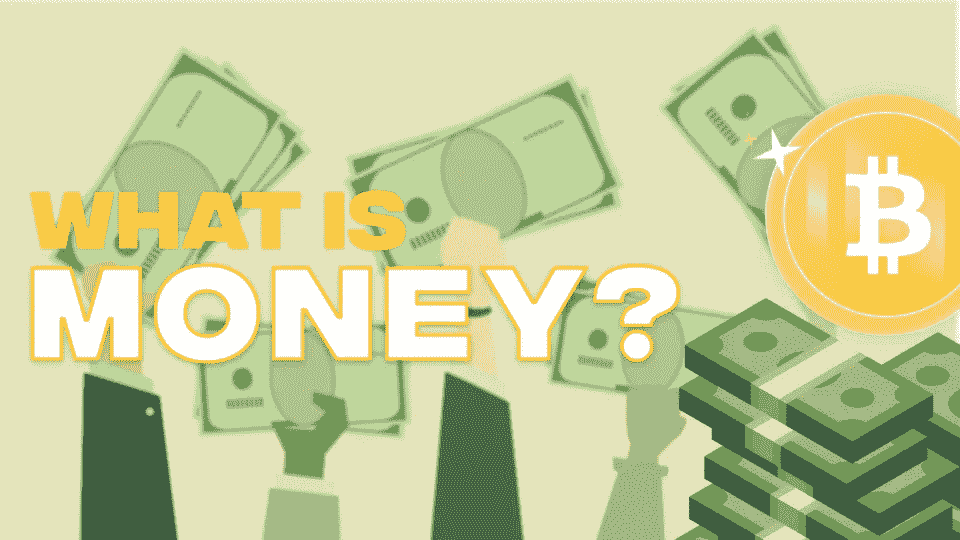](https://medium.com/coinmonks/is-the-100-bill-in-your-wallet-money-or-something-that-has-no-value-99263e8dfba6?source=user_profile---------0----------------------------)

之前，是的，美国在 1973 年[放弃了金本位制。在前面提到的一年前，你可以很容易地把你的美元换成真正的黄金，而现在，它只是墨水和纸。让我们不要在这里延伸太久；我在之前的文章中已经谈到了](https://sgp.fas.org/crs/misc/R41887.pdf) [***什么是金钱***](/coinmonks/is-the-100-bill-in-your-wallet-money-or-something-that-has-no-value-99263e8dfba6) 。

现在来谈谈这个问题…

# 如果货币没有任何有价值的东西作为支撑，会发生什么？

这个问题的答案是，它是所有的墨水和纸，仅此而已。创造更多的货币可能听起来像是 zoooom zoooom……此外，随着技术的发展，凭空创造货币变得更加简单。中央银行的一个家伙点击一下，新的 100 万美元就产生了。点击，又是一百万。咔嚓咔嚓，那是创造新货币的声音。

现在，由于政府或银行控制了货币，它没有任何附加价值。举例来说，如果现在你的懒汉 a$$从沙发上站起来，走进中央银行，要求银行把你所有的货币换成硬的东西，比如黄金，小麦，石油，任何在现实世界中有用的东西。

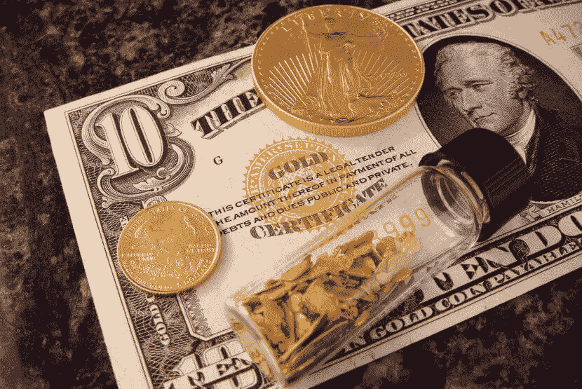

Source: US Money Reserve

他们会把你踢出去的！没有如果，没有但是，直接从银行出来。那我们为什么要用政府让我们用的货币呢？如果你问我，唯一的原因是:因为我们使用他们，这是唯一的原因，我们停止使用他们的货币的那一天将是他们失去对我们控制的那一天。

现在，由于中央银行正在印刷所有的钱，如果他们印得太多会发生什么？或者如果他们印得太少会怎么样？让我们一个一个来。

## 太多了？通货膨胀

随着越来越多的货币进入流通，它的价值会随着时间的推移而降低。再说一遍，让我们谈谈历史，这次是关于津巴布韦。1990 年左右，津巴布韦总统一直在印钞票，而且从未停止过。因此， *ZIM 元被比作卫生纸*。

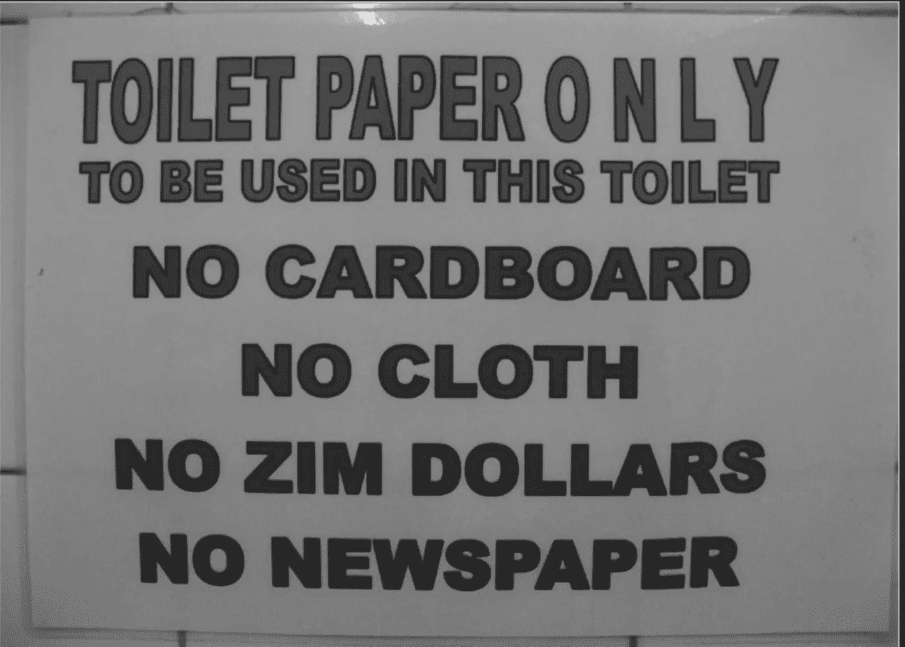

Photo by Eugene Baron

## 太少了？通货紧缩

通货紧缩意味着价格下降。所以价格下降是好事，对吧？不。想象一下商品价格开始下降，工资也开始下降。但与此同时，你的债务并没有下降；银行仍然接受你每月支付相同的分期付款。因此，*通货膨胀对一个国家不好，但通货紧缩更糟糕！*

坐在椅子上，并被赋予这种控制，以防止或导致经济灾难是一个巨大的责任。但是还有一种方式会出错！

# 银行在经济灾难中的角色

银行基本上是靠信用来运作的。所以基本上，他们以高利率把你存在银行的钱借出去，并付给你一小部分利息。这是它们维持稳定的方式，也是银行推动创新、发展和经济增长的方式。

一切运转顺利；银行从借款人那里获得利息，你只是把钱存在银行里就能获得利息。在借款人有能力偿还之前，一切都是音乐和聚会。但是如果他们不是呢？

# 灾难

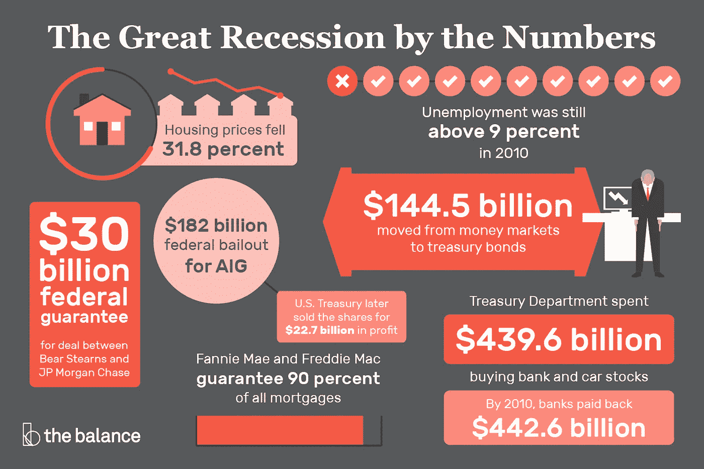

Source: The Balance

目前的金融体系完全依赖于银行。如果他们失败/犯了像 2008 年那样的错误，我们所有人肯定都会受到影响。你可能会说，你不会受到建筑公司无法偿还贷款的影响。这和你的钱有什么关系？你的资金存在银行里是完全安全的，对吗？对吗？

但是他们是吗？银行把你的钱借给那些愿意借钱支付大学学费、创业资金或在赌场赌博的人。所以现在这完全取决于银行借给你的钱，以及他们是否能够收回。

如果他们真的拿回来，那都是彩虹和太阳；但是如果借款人无法偿还债务，灾难就会降临。简而言之，借款人没有能力还钱；现在，银行不能把你的钱还给你；因为他们没有钱，你不能用你的钱去买日常用品。

很明显，市场价格的上涨或下跌是因为我们这些买方/卖方。著名科学家艾萨克·牛顿爵士总结道，*“我可以计算天体的运动，但不能计算人类的疯狂。”*当然，有时我们可以证明崩溃是合理的，但通常情况下，正是人们做出的愚蠢决定导致了崩溃。在加密市场，这是因为衍生品市场出现抛售，导致价格下跌。

## 你认为恒大发生了什么？

整个市场在一天之内崩溃，恒大无法偿还贷款，因此影响了整个市场，甚至是加密市场！然而，中国政府似乎在灾难影响全球市场之前阻止了它。

*“它有 3000 亿美元的未偿债务。如果中国恒大问题得不到解决，就会有一个传染问题。我认为最终会有一些资金雄厚的国有企业接手。”吉米·张说。*

**但是为什么加密市场会因为恒大而崩盘？**

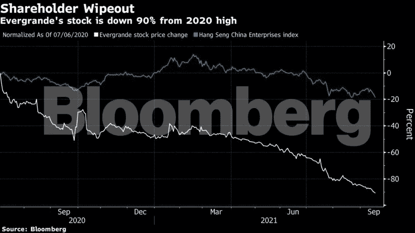

你觉得有原因吗？不，没有，你可以说是恒大，但这只是人类的情感让 BTC 的价格下降了 7%。

另一个原因可能是缺乏信息；人们通常会购买比特币和其他加密货币，因为他们希望快速致富，更经常的是当一些令人不安的事情发生时，他们往往会退出，导致崩溃(想象一下 200 万交易者同时抛售？)

# 比特币的陨落

说点别的吧。**还记得 2017 年吗？**比特币价格打破所有记录，创下 2 万美元左右的历史新高。一切都很顺利；新的交易者正在注册，人们每天都在增加投资，每个人都想搭上比特币的列车。

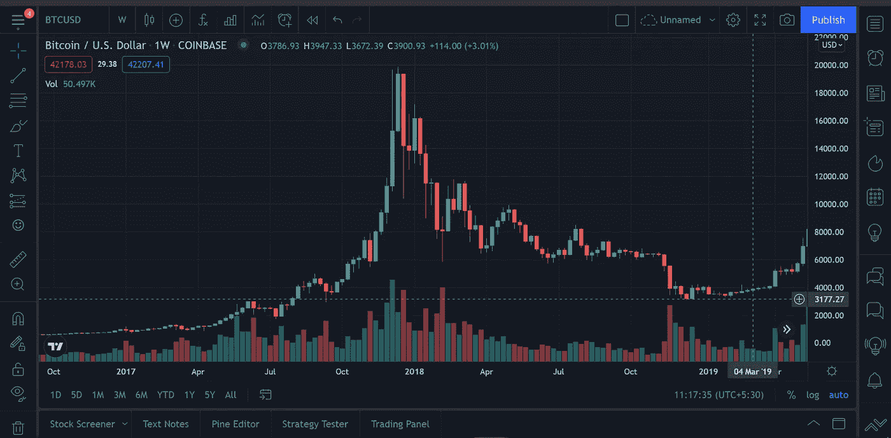

然而，只到音乐停止播放。后果是灾难性的；比特币在 2018 年 11 月低至 3900 美元。这是任何市场都会发生的事情，无论是股票、商品、黄金等等。如果音乐停得太刺耳，人们就会跑去把钱拿出来。

在密码方面，他们立即出售他们的 HODLings，导致价格进一步下跌。但与此同时，会有其他人一直在购买(至少是为了满足卖家的需求)。这些投资者的目标是积累足够的资金，以便在音乐即将停止时再次卖出。

## 人为什么要卖？

正如金德尔伯格在他的著作《狂热、恐慌和崩溃》中所写的那样，“一些资产价格的下跌导致人们担心资产价格会进一步下跌，金融系统会经历‘困境’。”在价格进一步下跌之前急于出售这些资产变得自我实现，而且如此仓促，以至于变成了恐慌。商品价格——房屋、建筑、土地、股票、债券——暴跌至峰值价格的 30%至 40%。破产激增，经济活动放缓，失业率上升。

但是当我们遇到加密市场崩溃时，一项资产的价值可能会损失 70%、90%，甚至 97%。为什么？因为一小部分加密投资者是因为它的基本面而购买，其余的是为了快速致富。

需要注意的是，这种情况不只发生过一次。金德伯格解释的情况几乎在每次市场崩盘中都发生过。这是银行从来没有准备好的。

正如耶鲁大学经济学家 Gary Gorton 所说，“银行业有一个基本的结构性特征，如果不加以防范，就会导致这样的危机。

# 我们为什么需要银行？

两百年或者五百年前，我们不能带着一生的积蓄到处旅行。我们需要有人替我们保管它，替我们保管它，因此也需要银行。

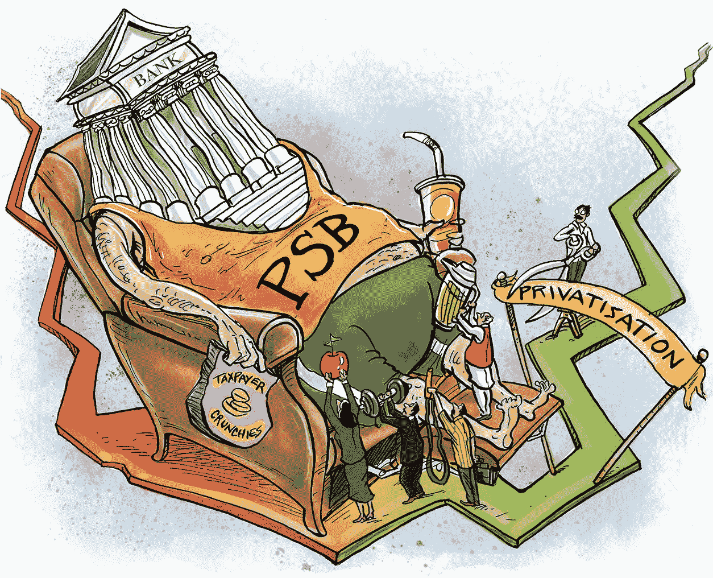

Source: Times of India

此外，银行肯定会推动创新和经济增长，但你把钱存在银行里能得到什么？***2%的利息*** ？让我问些别的问题，你们国家目前的通货膨胀率是多少？ ***4%还是 24%？***

所以，基本上，你正在失去你存在银行里的货币的价值。显然，你是推动创新的一部分，但代价是什么？你一生的积蓄会在几年内变得一文不值。那么你会对你的退休计划做些什么呢？你打算工作一辈子吗？不对，对！

# 我提出什么解决方案？

现在可能已经很明显了，不是吗？比特币是我们的解决方案。

1.  使用闪电网络进行跨境支付？ ***查***
2.  没有通货膨胀的影响？**查*查*查**
3.  满足供需？ ***检查***
4.  同行 2 同行借贷？ ***检查***
5.  不需要第三方来存储您的资产？ ***检查***
6.  你一生的收入都可以储存在一个小小的安全装置里。
7.  保安？ ***勾选***

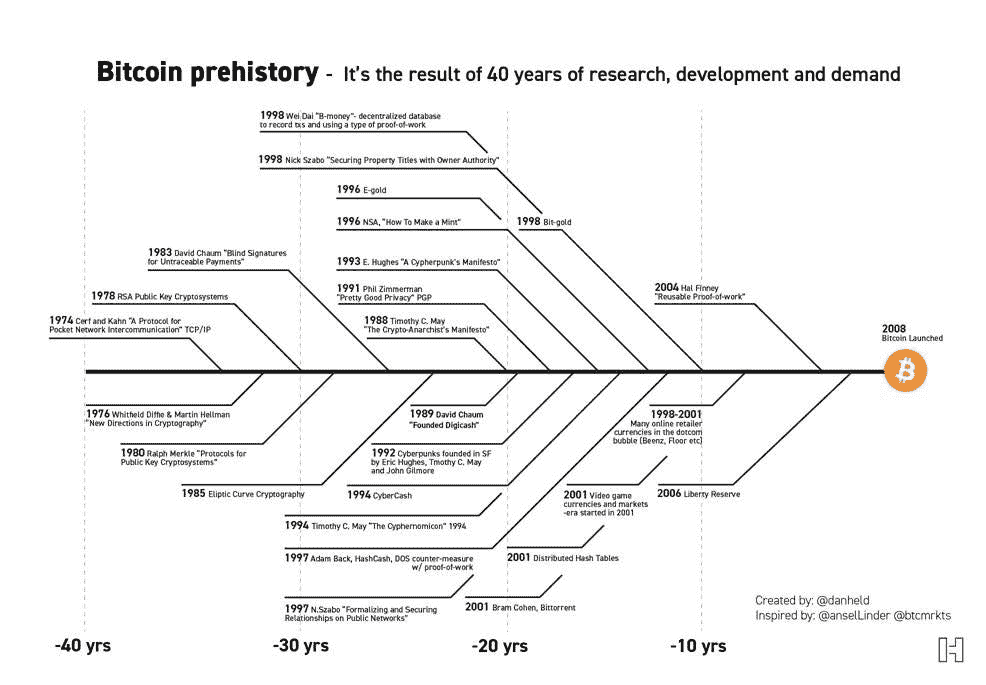

# 回到我们的故事

现在假设你使用比特币在全球转移资产。你的朋友半夜醒来，打开手机，通过闪电网络向你的钱包地址发送 1 BTC。

你觉得要花多少钱？几秒钟？是的。最近，Twitter 通过与 Strike API 合作，实现了比特币支付。现在，你可以通过你的 Twitter 账户将 BTC 直接发送给世界各地的任何人。

想知道怎么做吗？在这里阅读我的指南 [Twitter 提示](https://blog.coincodecap.com/twitter-tips)。

# 比特币如何用于借贷？

这就是 DeFi 的用武之地；术语“分散金融”旨在将所有金融工具带入加密世界。截至目前，你可以很容易地用你的比特币作为抵押，获得美元支持的稳定货币贷款。

这样，你就永远不必卖掉你的比特币，只需偿还贷款就能拿回你的比特币。借款人仍将拥有他们的比特币，其价格会随着时间的推移而上涨；他们想要偿还贷款，拿回他们的比特币。

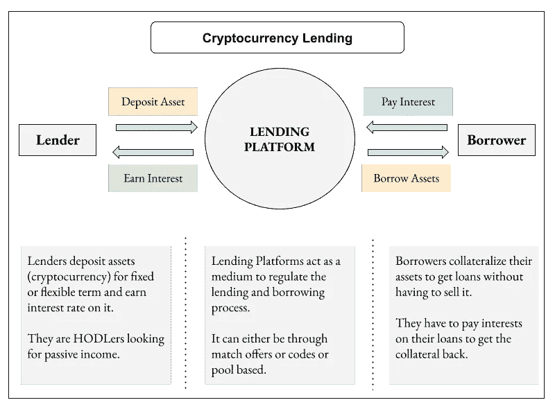

Crypto Lending

现在，对于贷款人来说，锁定的比特币充当了一种担保。如果借款人无法在预定期限前支付贷款，他们的比特币将被清算，资金将返还给贷款人。从而创建一个稳定的借贷系统。

# 无抵押贷款

闪贷，听说过吗？如果你已经在密码世界呆了一段时间，我敢打赌你有。闪贷允许你在没有任何抵押品的情况下借入资金。因此，你可以想借多少就借多少，用它做你想做的任何事情，然后在更短的时间内归还资金。

然而，如果你不能归还资金，所有的交易都会逆转，贷方不会遭受损失。听起来很刺激，对吧！

我们改天再讨论 DeFi，我相信这篇文章已经够长了，所以让我们结束吧。

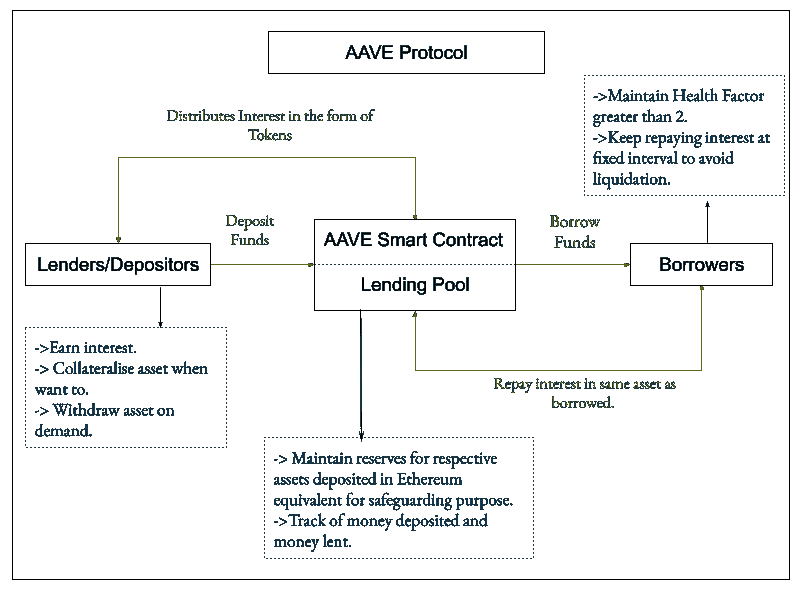

AAVE Working

# 独角兽还是蛋糕？

不涉及细节，DeFi 是一个不断发展的世界。因此，现在预测它的未来并不是最好的选择。然而，看看事情从这里走向哪里会很有趣。比如，是 DeFi 接管传统金融而银行灭亡，还是银行与科技携手，提供现代金融服务。我相信后者是最普遍的选择，但是我们的未来不在本文预测的范围之内。

下周末我会带着另一篇文章回来。在那之前，请点击“关注”按钮继续阅读我的文章，如果你读得不错，请鼓掌表示支持！

与我联系，

[推特](https://twitter.com/prabxat) | [领英](https://www.linkedin.com/in/praxhat/)

1.  [你钱包里的 100 美元是钱还是没有价值的东西？](/coinmonks/is-the-100-bill-in-your-wallet-money-or-something-that-has-no-value-99263e8dfba6?source=user_profile---------0----------------------------)
2.  [2021 年底前比特币还在破 100K 的路上吗？](/coinmonks/is-bitcoin-still-on-its-path-to-break-100k-before-the-end-of-2021-4716a56745ce?source=user_profile---------1----------------------------)
3.  [我是如何在大学本科阶段开始投资 Crypto 的？](https://praxhat.medium.com/how-did-i-start-investing-in-crypto-as-a-college-undergrad-ac9635d9d6b3?source=user_profile---------2----------------------------)

这篇文章中所写的一切都是我所相信的，很可能你的想法和我的不同(显然我们是两个不同的人)。因此，把这篇文章作为一个轻松的读物，如果你不喜欢它的内容，就忘记你曾经读过它！

> 加入 Coinmonks 电报频道，了解加密交易和投资

**同样，阅读**

*   [币安 vs 北海巨妖](https://blog.coincodecap.com/binance-vs-kraken) | [美元成本平均交易机器人](https://blog.coincodecap.com/pionex-dca-bot)
*   [如何在印度购买比特币？](/coinmonks/buy-bitcoin-in-india-feb50ddfef94) | [WazirX 评论](/coinmonks/wazirx-review-5c811b074f5b) | [BitMEX 评论](https://blog.coincodecap.com/bitmex-review)
*   [比特币主根](https://blog.coincodecap.com/bitcoin-taproot) | [Bitso 点评](https://blog.coincodecap.com/bitso-review) | [排名前 6 的比特币信用卡](/coinmonks/bitcoin-credit-card-bc8ab6f377c6)
*   [双子座 vs 比特币基地](https://blog.coincodecap.com/gemini-vs-coinbase) | [比特币基地 vs 北海巨妖](https://blog.coincodecap.com/kraken-vs-coinbase)|[coin jar vs coin spot](https://blog.coincodecap.com/coinspot-vs-coinjar)
*   [印度密码交易所](/coinmonks/bitcoin-exchange-in-india-7f1fe79715c9) | [比特币储蓄账户](/coinmonks/bitcoin-savings-account-e65b13f92451) | [Paxful 审核](/coinmonks/paxful-review-4daf2354ab70)
*   [杠杆令牌](/coinmonks/leveraged-token-3f5257808b22) | [最佳加密交易所](/coinmonks/crypto-exchange-dd2f9d6f3769) | [AscendEX 评论](/coinmonks/ascendex-review-53e829cf75fa)
*   [Godex.io 审核](/coinmonks/godex-io-review-7366086519fb) | [邀请审核](/coinmonks/invity-review-70f3030c0502) | [BitForex 审核](https://blog.coincodecap.com/bitforex-review) | [HitBTC 审核](/coinmonks/hitbtc-review-c5143c5d53c2)
*   [Crypto.com 费用](/coinmonks/binance-fees-8588ec17965) | [僵尸密码审查](/coinmonks/botcrypto-review-2021-build-your-own-trading-bot-coincodecap-6b8332d736c7) | [替代品](https://blog.coincodecap.com/crypto-com-alternatives)
*   [有哪些交易信号？](https://blog.coincodecap.com/trading-signal) | [比特斯坦普 vs 比特币基地](https://blog.coincodecap.com/bitstamp-coinbase)
*   [ProfitFarmers 回顾](https://blog.coincodecap.com/profitfarmers-review) | [如何使用 Cornix Trading Bot](https://blog.coincodecap.com/cornix-trading-bot)
*   [MXC 交易所评论](/coinmonks/mxc-exchange-review-3af0ec1cba8c) | [Pionex vs 币安](https://blog.coincodecap.com/pionex-vs-binance) | [Pionex 套利机器人](https://blog.coincodecap.com/pionex-arbitrage-bot)
*   [我的密码交易经验](/coinmonks/my-experience-with-crypto-copy-trading-d6feb2ce3ac5) | [比特币基地评论](/coinmonks/coinbase-review-6ef4e0f56064)
*   [CoinFLEX 评论](https://blog.coincodecap.com/coinflex-review) | [AEX 交易所评论](https://blog.coincodecap.com/aex-exchange-review) | [UPbit 评论](https://blog.coincodecap.com/upbit-review)
*   [AscendEx 保证金交易](https://blog.coincodecap.com/ascendex-margin-trading) | [Bitfinex 赌注](https://blog.coincodecap.com/bitfinex-staking) | [bitFlyer 评论](https://blog.coincodecap.com/bitflyer-review)
*   [麻雀交换评论](https://blog.coincodecap.com/sparrow-exchange-review) | [纳什交换评论](https://blog.coincodecap.com/nash-exchange-review)
*   [加密货币储蓄账户](/coinmonks/cryptocurrency-savings-accounts-be3bc0feffbf) | [赌注加密](https://blog.coincodecap.com/staking-crypto)
*   [BigONE 交易所评论](/coinmonks/bigone-exchange-review-64705d85a1d4) | [CEX。IO 审查](https://blog.coincodecap.com/cex-io-review) | [交换区审查](/coinmonks/swapzone-review-crypto-exchange-data-aggregator-e0ad78e55ed7)
*   [最佳比特币保证金交易](/coinmonks/bitcoin-margin-trading-exchange-bcbfcbf7b8e3) | [比特币保证金交易](https://blog.coincodecap.com/bityard-margin-trading)
*   [加密保证金交易交易所](/coinmonks/crypto-margin-trading-exchanges-428b1f7ad108) | [赚取比特币](/coinmonks/earn-bitcoin-6e8bd3c592d9) | [Mudrex 投资](https://blog.coincodecap.com/mudrex-invest-review-the-best-way-to-invest-in-crypto)
*   [WazirX vs CoinDCX vs bit bns](/coinmonks/wazirx-vs-coindcx-vs-bitbns-149f4f19a2f1)|[block fi vs coin loan vs Nexo](/coinmonks/blockfi-vs-coinloan-vs-nexo-cb624635230d)
*   [BlockFi 信用卡](https://blog.coincodecap.com/blockfi-credit-card) | [如何在币安购买比特币](https://blog.coincodecap.com/buy-bitcoin-binance)
*   [火币交易机器人](https://blog.coincodecap.com/huobi-trading-bot) | [如何购买 ADA](https://blog.coincodecap.com/buy-ada-cardano) | [Geco。一次复习](https://blog.coincodecap.com/geco-one-review)
*   [加密复制交易平台](/coinmonks/top-10-crypto-copy-trading-platforms-for-beginners-d0c37c7d698c) | [五大 BlockFi 替代方案](https://blog.coincodecap.com/blockfi-alternatives)
*   [CoinLoan 点评](https://blog.coincodecap.com/coinloan-review)|[Crypto.com 点评](/coinmonks/crypto-com-review-f143dca1f74c) | [火币保证金交易](/coinmonks/huobi-margin-trading-b3b06cdc1519)
*   [Bybit vs 币安](https://blog.coincodecap.com/bybit-binance-moonxbt)|[stealth x 回顾](/coinmonks/stealthex-review-396c67309988) | [Probit 回顾](https://blog.coincodecap.com/probit-review)