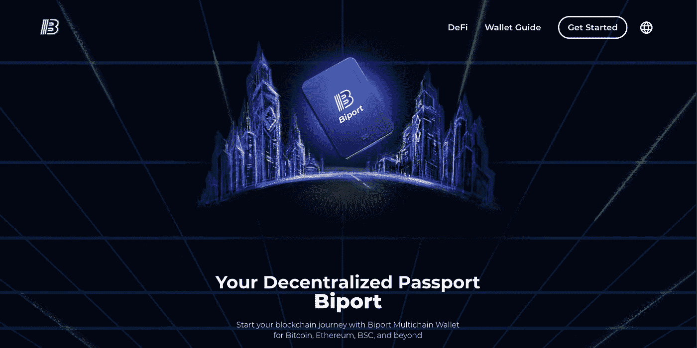
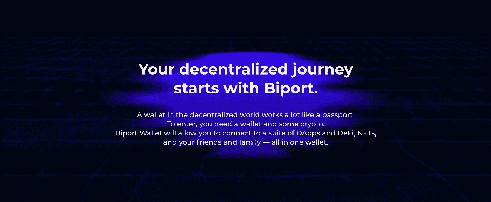
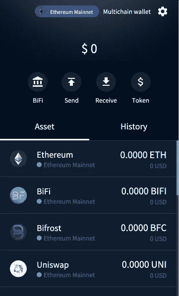
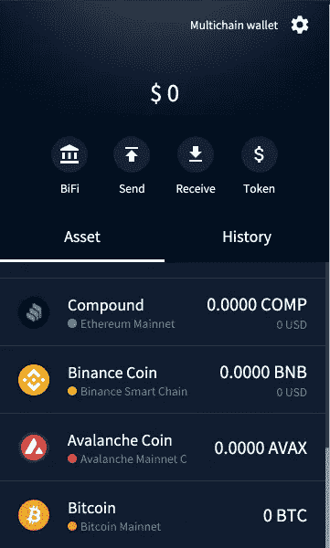
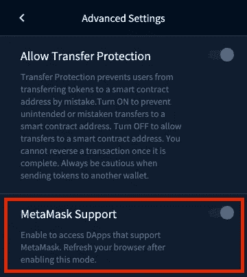
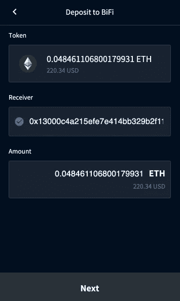
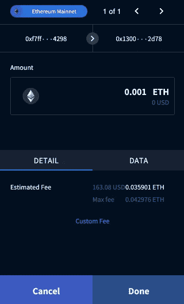
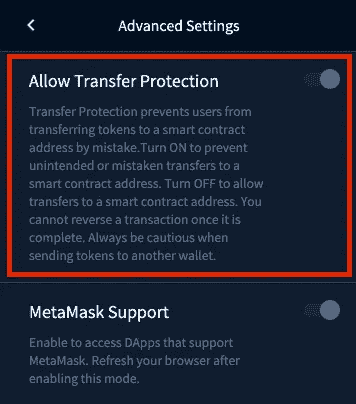
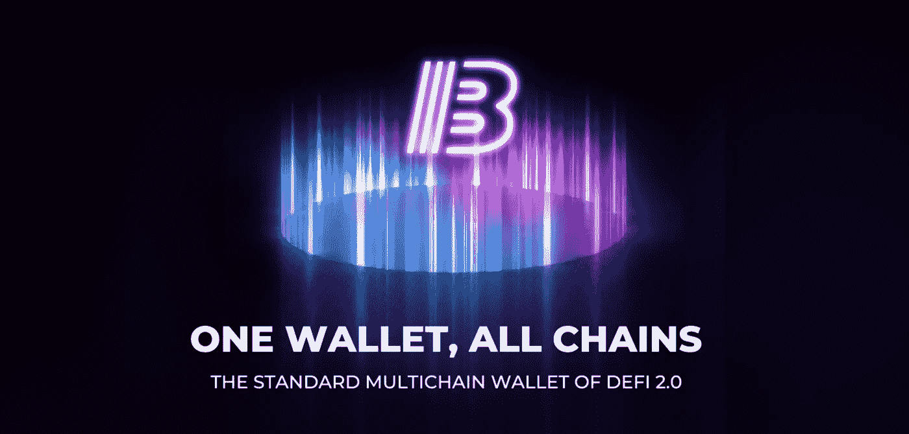

# Biport 会成为 DeFi 2.0 的标准多链钱包吗？

> 原文：<https://medium.com/coinmonks/will-biport-become-the-standard-multichain-wallet-of-defi-2-0-8c3f1151db40?source=collection_archive---------8----------------------->

> 区块链在不到十年的时间里改变了我们生活和呼吸了几千年的体系。尽管这种技术有明显的优势，但仍有许多问题无法妥善解决。

自从分散金融(DeFi)迅速扩张以来，无数钱包涌入市场。但是没有一个占主导地位的领导者——目前还没有——真正履行了他们的使命，将整个区块链和数万亿美元的资本市场连接起来。

进入 [**双端口钱包**](https://biport.io/?utm_campaign=biport&utm_source=coinmonks_medium&utm_medium=earned)**——去中心化网络中最新最激动人心的钱包之一。Biport 由 BIFROST 的区块链专家构建，以其面向用户和直观的功能提升了分散式钱包游戏的水平。**

***本文旨在解释 Biport 如何连接所有连锁店及其资本市场，成为 DApps、DeFi、NFTs、GameFi 等区块链生态系统的门户。***

## ****大纲****

1.  **什么是 Biport 钱包？**
2.  **Biport 与其他多链钱包的区别是什么？**
3.  **结论**

# **双端口钱包**

**在以前的去中心化钱包中，资产被限制在各自的链中。如果您想要转移或管理不同链上的资产，则每次都需要手动切换链。**但是有了** [**双口**](https://biport.io/?utm_campaign=biport&utm_source=coinmonks_medium&utm_medium=earned) **，你再也不用这么做了。****

****

# ****多链连接****

**Biport 允许你在一个地方管理分散在不同区块链*的加密货币。Biport 已经支持以太坊、币安智能链(BSC)、Avalanche，甚至**比特币**等几个主流网络，未来还会支持更多的网络。***

**您可以通过网络发送、接收和存储各种资产，而不会影响便利性和安全性，从而在 DeFi 2.0 中为用户带来最佳的多链体验。Biport 的多链连接是一流的，可能是最高级的连接之一。**

********

**👉前往[双端口钱包指南](https://docs.bifi.finance/biport-guide/)**

# **元掩码支持**

**我相信你知道 [MetaMask 是当今使用最广泛的去中心化钱包之一](https://markets.businessinsider.com/news/currencies/metamask-users-defi-ethereum-decentralized-finance-consensys-crypto-2021-8#:~:text=MetaMask%20has%20benefited%20from%20the%20boom%20in%20interest%20in%20decentralized%20finance%20in%202021%2C%20becoming%20the%20most-used%20DeFi%20wallet.)。如果你曾经使用过 DApp 或 DeFi，很可能你已经有一个 MetaMask 帐户。**

**那么，如果您想使用支持元掩码的 DApps，但又想使用 Biport 特性，该怎么办呢？**

**别担心。双港抓到你了。**

**Biport 的**元掩码支持**特性允许您访问和使用所有支持元掩码的 DApps。通过启用此模式，DApp 会将 Biport 识别为元掩码。这意味着即使没有 MetaMask，你也可以使用 Uniswap、SushiSwap、Compound、Aave 和许多其他 DApps 这多酷啊，对吧？**

****

**👉[前往 Biport 的 MetaMask 支持指南](https://docs.bifi.finance/biport-guide/advanced-features/metamask-support)**

# **BiFi 可访问性**

**BiFi 是第一个连接比特币和以太坊网络并提供本地比特币借贷的 DeFi。**

**您可以直接从 Biport 将资产存入 [BiFi Lending](https://app.bifi.finance/?utm_campaign=biport&utm_source=coinmonks_medium&utm_medium=earned) 资金池，以赚取存款利息和 BiFi 代币，并最大化您的收益。**

**Biport 最终将与所有 BIFROST 和 BiFi 产品集成，并扩展到其他具有更高级 DeFi 特定功能的 DeFi 协议。**

********

**👉[点击这里查看 Biport 的 BiFi 可访问性指南。](https://docs.bifi.finance/biport-guide/biport-wallet-101/deposit-to-bifi)**

# **转移保护**

**你是否曾经不小心将代币发送到智能合约地址，然后茫然地盯着屏幕问自己“刚刚发生了什么？”**

**按照设计，在区块链网络上进行的交易是不可逆转的。如果你无意中误将它发送到了另一个钱包地址，有*可能有*的方法来取回你的钱。然而，在智能合约的情况下，这是不可能的。**

**因此，为了防止意外发送到智能合约地址，Biport 的**传输保护**功能可以防止用户将令牌传输到智能合约地址。安装钱包保护用户资金时，默认启用此模式。你也可以关闭这个模式，但是…老实说，我不明白你为什么要这样做。**

****

**👉[转至 Biport 的传输保护指南](https://docs.bifi.finance/biport-guide/advanced-features/transfer-protection)**

# **结论**

**在未来，Biport 将成为 crypto、DApp、DeFi、NFTs、GameFi 等的标准网关。BIFROST 的愿景是创建一个多链分散的基础设施，连接所有资本市场，让资本从一个区块链无缝地流向另一个。通过 Biport，您可以提前了解 DeFi 2.0 和区块链网络之都，这是一个区块链时代的缩影。**

****

## **[在你的 Chrome 扩展](https://chrome.google.com/webstore/detail/biport-wallet/mapbhaebnddapnmifbbkgeedkeplgjmf)上下载 Biport，开始探索 [BIFROST](https://thebifrost.io/?utm_campaign=biport&utm_source=coinmonks_medium&utm_medium=earned) 、 [BiFi](https://app.bifi.finance/?utm_campaign=biport&utm_source=coinmonks_medium&utm_medium=earned) 和 [Biport](https:///biport.io/?utm_campaign=biport&utm_source=coinmonks_medium&utm_medium=earned) 的精彩世界！**

**📢在 [BIFROST Medium](https://medium.com/bifrost) 、 [Twitter](https://twitter.com/BiportWallet) 和 [Telegram](https://t.me/BIFROST_Global) 上找到最新公告。**

> **加入 Coinmonks [电报频道](https://t.me/coincodecap)和 [Youtube 频道](https://www.youtube.com/c/coinmonks/videos)了解加密交易和投资**

## **另外，阅读**

*   **[AscendEx 保证金交易](https://blog.coincodecap.com/ascendex-margin-trading) | [Bitfinex 赌注](https://blog.coincodecap.com/bitfinex-staking) | [bitFlyer 点评](https://blog.coincodecap.com/bitflyer-review)**
*   **[麻雀交换评论](https://blog.coincodecap.com/sparrow-exchange-review) | [纳什交换评论](https://blog.coincodecap.com/nash-exchange-review)**
*   **[维护卡审核](https://blog.coincodecap.com/uphold-card-review) | [信任钱包 vs MetaMask](https://blog.coincodecap.com/trust-wallet-vs-metamask)**
*   **[Exness 点评](https://blog.coincodecap.com/exness-review)|[moon xbt Vs bit get Vs Bingbon](https://blog.coincodecap.com/bingbon-vs-bitget-vs-moonxbt)**
*   **[如何开始通过加密贷款赚取被动收入](https://blog.coincodecap.com/passive-income-crypto-lending)**
*   **[加密货币储蓄账户](/coinmonks/cryptocurrency-savings-accounts-be3bc0feffbf) | [加密交易机器人](https://blog.coincodecap.com/best-crypto-trading-bots)**
*   **[BigONE 交易所评论](/coinmonks/bigone-exchange-review-64705d85a1d4) | [CEX。IO 审查](https://blog.coincodecap.com/cex-io-review) | [交换区审查](/coinmonks/swapzone-review-crypto-exchange-data-aggregator-e0ad78e55ed7)**
*   **[最佳比特币保证金交易](/coinmonks/bitcoin-margin-trading-exchange-bcbfcbf7b8e3) | [比特币保证金交易](https://blog.coincodecap.com/bityard-margin-trading)**
*   **[加密保证金交易交易所](/coinmonks/crypto-margin-trading-exchanges-428b1f7ad108) | [赚取比特币](/coinmonks/earn-bitcoin-6e8bd3c592d9)**
*   **[WazirX vs CoinDCX vs bit bns](/coinmonks/wazirx-vs-coindcx-vs-bitbns-149f4f19a2f1)|[block fi vs coin loan vs Nexo](/coinmonks/blockfi-vs-coinloan-vs-nexo-cb624635230d)**
*   **[BlockFi 信用卡](https://blog.coincodecap.com/blockfi-credit-card) | [如何在币安购买比特币](https://blog.coincodecap.com/buy-bitcoin-binance)**