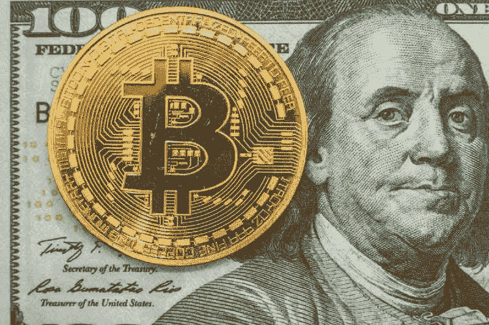
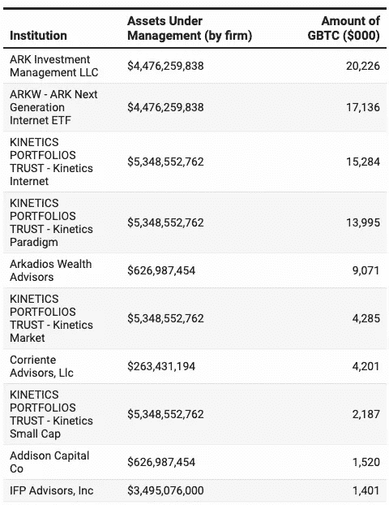
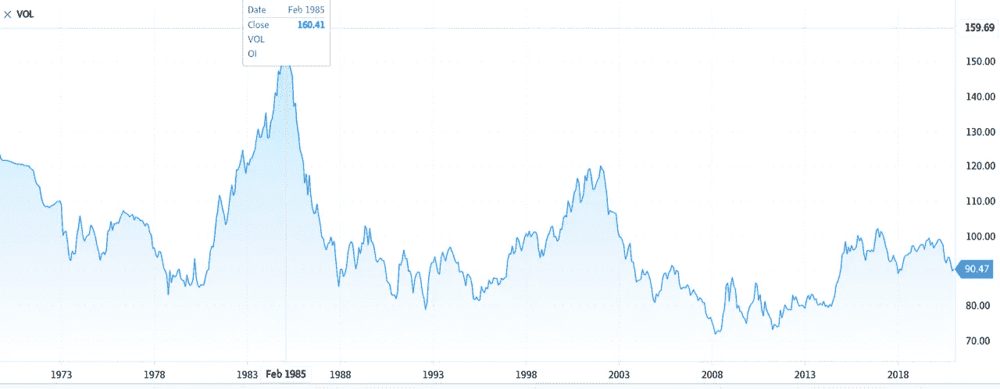
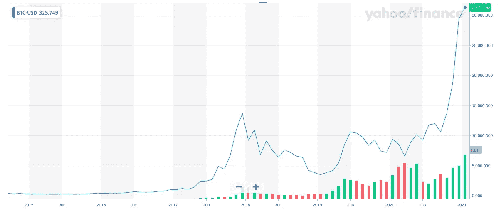

# 比特币会取代美元吗？

> 原文：<https://medium.com/coinmonks/will-bitcoin-replace-the-us-dollar-f5598add5ef6?source=collection_archive---------0----------------------->

> 个人投资者应该始终如一地扮演投资者的角色，而不是投机者。 —本·格雷厄姆

关于加密货币，尤其是比特币，有炒作、希望和困惑的混合。有人把比特币当做交换媒介。其他人把它当作一种投资和交易工具，就像股票一样。然而，有些人对加密货币不屑一顾，认为它们在监管严格的金融领域没有一席之地。对于比特币的重要性还没有达成共识。但不管我们喜不喜欢，比特币都是一个不容忽视的现实。如果比特币是一家公司，它今天应该是一家市值 5000 亿美元的公司。

> **美元不仅仅是一种货币，它还是美国霸权的象征。**

但在任何比特币辩论中，一个突出的主题都围绕着美元和央行。一些人认为比特币是美元的潜在替代品，美元也是一种全球储备货币。一些比特币支持者担心，美国政府的赤字越来越大，还在不停地印美元。因此，他们将数量有限的比特币视为可靠的价值储存手段，不受政府干预；他们将比特币视为一个避风港，一种针对波动性较大的美元的对冲工具。比特币的稀缺性也很重要:你不能像印制法定货币那样无限期地创造比特币。因此，有些人甚至认为加密货币是货币的未来。但是，加密货币，尤其是比特币，真的能取代美元吗？

由 [Unsplash](https://unsplash.com?utm_source=medium&utm_medium=referral) 上的 [Bermix 工作室](https://unsplash.com/@bermixstudio?utm_source=medium&utm_medium=referral)拍摄的照片

答案并不简单。存在显著差异。美元是一种传统货币，而比特币是一种基于技术的货币:一种是纸张，另一种是比特的集合(提示:比特币)。一个是有形的，一个是无形的。美元由政府支持的中央实体管理，银行可以追踪资金流向。政府、执法和情报机构以及金融机构共同努力，全天候监控、报告和发现非法交易，包括资助恐怖主义的交易。金融机构对如何管理和保护人们的资金负责。当人们和机构违反法律时，会有既定的规则和严重的后果。

> **比特币是一个不容忽视的现实。请记住，第一部电话在 1876 年出售时也遭到了拒绝。**

另一方面，比特币是去中心化的(点对点)，交易由基于区块链技术的公共账本验证。没有政府，没有银行，没有担保，也没有监管。比特币是一种价值储存手段、一种投资选择、一种交易媒介、一种货币和一个数字钱包——取决于你的要求。

> **技术快；监管缓慢，但两者都很复杂。这就是为什么很难监管技术。**

# 支持比特币和反对比特币的阵营

强烈相信比特币或强烈反对比特币的人不在少数。基本上有两个对立的阵营。这里有几个例子可以说明比特币上的分歧。

社交资本公司(Social Capital)首席执行官、前脸书高管查马斯·帕里哈皮蒂亚(Chamath Palihapitiya)是比特币的坚定信徒——尽管他强调你应该只把总投资的 1%投入比特币:

“这(比特币)现在是一场信心游戏，没错，它没有真正的效用，这是一种针对专制政权和银行基础设施的奇妙的基本对冲和储存价值，我们知道这些对世界正常运转的方式具有腐蚀性。你不能让央行无限地印刷货币，你不能让你认识的人被误导和误导货币和财政政策……”***Chamath Palihapitiya，美国消费者新闻与商业频道，2017 年 12 月。***

Morgan Creek Digital Assets 的创始人兼合伙人 Anthony Pompliano 是另一位坚定的支持者:

“所有新的东西从一开始看起来都不一样，我认为你必须意识到比特币尤其是货币是一种信仰体系。所以美元，你和我使用它的唯一原因是因为我们相信它有价值，所以我给你一美元，你给我一个商品或服务作为交换；我们相信它有价值。比特币之所以有价值，是因为交换它的两个人相信它有那个价值。我们看到的是数量，对吧，看看使用它的人，这才是最重要的”。 ***安东尼·蓬皮亚诺，美国消费者新闻与商业频道，2019 年 5 月***

反加密货币的呼声也同样强烈。

O 'Shares ETFs 董事长、《鲨鱼池》(Shark Tank)联合主持人凯文奥利里(Kevin O'Leary)将比特币称为“数字游戏”，他在美国消费者新闻与商业频道辩称:

“金融市场与监管机构打交道，你只能在这些规则的范围内运作。所以，当我们赞美像比特币这样的东西时，它与让整个世界运转的金融市场毫无关系。” ***凯文·奥利里，美国消费者新闻与商业频道，2020 年 12 月***

然而，最直言不讳和最强烈的话来自国际清算银行( [BIS](https://seekingalpha.com/symbol/BIS) )的负责人奥古斯丁·卡斯滕斯，他在 2018 年将比特币称为“庞氏骗局”，认为加密货币作为货币是不可持续的，它们不符合“货币的教科书定义”。他支持央行作为对抗加密货币的“可信”机构:

“让公众对公共资金产生信心的可靠、可信和有弹性的现代方式是独立的央行。”**奥古斯丁·卡斯滕斯，2018 年 2 月，康德斯克**

机构也注意到了加密货币的流行。以下是排名前十的机构比特币持有者名单。

**十大机构比特币拥有量(截至 2020 年 6 月)**

来源:福布斯

# 美元不仅仅是一种货币

一些反对美元和支持加密货币的人对美元的理解非常狭隘，只关注美元贬值的风险。他们将美元视为一种简单的货币，只关注美元的贬值，因为美国政府印了更多的钱。现实是，美元不仅仅是一种货币。它是美国作为经济、政治和军事强国的霸权和霸权的象征。美元还坐在资本主义和自由市场制度的宝座上。这种力量不仅仅是象征性的，它是真实而强大的。

> 逃离美元，奔向比特币，就像逃离暴风雪，奔向即将到来的雪崩。

但反对美元不确定性和疲软的观点在一定程度上是有道理的。下图显示了衡量美元对六种世界货币(欧元、瑞士法郎、日元、加拿大元、英镑和瑞典克朗)价值的美元指数。该指数创建于 1973 年，当时美国放弃了布雷顿森林协定。截至 2011 年 1 月 21 日的美元指数为**90.47**；大约是全球金融危机期间的 70 年和 1985 年 2 月的 160 年。鉴于美元价值的波动性，许多投资者担心被投资于美元。但是，美元在更大的全球金融市场中并不是孤立存在的。价值波动和任何资产未来价值的不确定性是自由市场的特征(情绪、宏观经济、政治(不)稳定、贸易等)。

# **美元指数，DXY(1973–2020)**

图表来源:环球邮报。每月间隔

讽刺的是，那些抱怨美元波动的人也应该看看比特币的历史波动。如果你逃离美元，去比特币‘避风港’避难，就像从暴风雪中逃向迎面而来的雪崩。下图描绘了比特币的波动性。比特币在几天内损失超过 20%的价值并不罕见。例如，2021 年 1 月 8 日，比特币创下 41，962 美元的历史新高，今天(2021 年 1 月 27 日)为 30.278 美元。比特币的支持者还应该评估这种数字货币被盗和永久锁定/丢失的风险(稍后将详细介绍)。

# **比特币历史价格。每月间隔。**

来源:雅虎财经

# **富有弹性的美元**

尽管存在负面情绪，但面对对其未来价值的严重悲观情绪，美元仍保持主导地位和相关性。这并不是说美元没有贬值，而是指出美元并没有像一些人预测的那样崩溃。今天，有超过 2 万亿美元在全球流通。基本上，任何在当地或网上的购买多少都要借助美元。因为美元，你喝的咖啡、买的西红柿、开的车、在加油站加油、在网上购买的礼物都成为可能。在几乎所有的跨境交易以及人员、商品和服务的流动中，美元都有一只无形的手。因此，全球贸易和全球银行体系与美元紧密相连。

美元也是美国在其他国家实现其战略目标的工具。例如，当美国对伊朗等对手实施制裁时，它依赖的是美元的力量。当伊朗被排除在全球银行体系(由美国主导)之外时，伊朗经济就会受到重创，因为伊朗无法在公开市场上出售石油或收款。萨达姆·侯赛因执政时，美国也对伊拉克使用了这一策略。美国还威胁称，如果伊拉克试图要求美军离开伊拉克，美国将在 2020 年对其实施类似制裁(就在美国在伊拉克暗杀一名伊朗将军之后)。因此，将美元仅仅视为一种货币是错误的——它应该被视为它在全球舞台上的权力和控制工具。美国对对手实施的所谓经济制裁实际上是“美元制裁”，因为没有美元就没有“经济”。

# 为什么比特币不会取代美元？

有人说“你可以预测一切，但不能预测未来”。考虑到这一点，我不做任何预测，而是概述了比特币无法取代美元的原因:

1.  **技术与监管:**技术不能轻易替代监管。仅仅因为一个社区痴迷于技术和加密货币，并且不信任央行，并不意味着监管者会袖手旁观，让技术让它们变得无关紧要。具有讽刺意味的是，俄亥俄州成为美国第一个接受比特币缴税的州——但这一计划是短暂的。在被报道俄亥俄州的 [***比特币税收计划违法后被迫放弃该计划，州检察长称***](https://radio.wosu.org/post/ohios-bitcoin-tax-program-was-illegal-state-attorney-general-says#stream/0) **。这证明了在不了解法律法规的情况下采用技术是多么困难。监管很慢，技术很快，但两者都很复杂。这就是为什么很难监管技术，因为在监管者有机会了解他们试图监管的技术之前，该技术可能已经过时了。**
2.  多米诺骨牌效应:以美元为储备货币的全球银行体系存在多米诺骨牌效应的风险。想象一下这样一个理论场景，某家央行宣布他们也将使用比特币作为储备货币。最终结果将是混乱的。
3.  **缺乏基础设施:**大多数国家现有的金融和系统基础设施还没有为比特币做好准备(包括央行)。这也包括零售商。
4.  **比特币的波动性:**比特币作为价值储存手段的波动性和不稳定性是一个很大的风险。比特币在几天内损失 20%的价值并不罕见。想象一下，持有比特币或者用比特币借款；你会在经济上和情感上破产。
5.  **非法交易:**洗钱、逃税和恐怖主义融资的风险确实存在，尽管加密货币的支持者不这么认为。一些加密货币无法被追踪和识别的事实使它们成为犯罪分子和恐怖分子的磁石，因为他们可以从事非法活动，并在全球范围内收集和转移收益，而不用担心被执法机构发现(或者至少他们是这样认为的)。
6.  **未来创新:**被未来创新和技术取代的风险始终存在。我们永远不知道未来会发生什么。会不会有另一种创新能够智胜并取代加密货币，尤其是比特币？如果你相信答案是否定的，未来会让你大吃一惊。请记住，加密货币和比特币不是货币进化的“最后边界”。

# 美国的衰落？

正如我之前所说的，美元的主导地位是由美国作为一个经济、军事、技术、政治和外交超级大国的优势所驱动的。比特币的支持者和美国政府之间的权力动态非常明显:在美国政府和一群科技爱好者和“央行反对者”之间的主导地位之战中，美国政府将在很长一段时间内占据上风。

如果有一天比特币成为主导货币、交易媒介、价值储存手段或标准支付方式，美国政府可能会制定规则(至少在美国是这样)。美国政府已经开始采取措施，通过引入执法框架来控制加密货币。就在去年 10 月有报道称， [**美国加密执行框架是对国际交易所**](https://www.coindesk.com/doj-crypto-framework-warning) **的警告。**

我认为，从长期来看，美元可能失去主导地位的一个原因是美国在全球经济、金融、外交和军事领域的实力下降。即使这种情况真的发生了，也会有其他竞争者:人民币和欧元。美元的崩溃可能会对作为主导力量的美国的生存产生影响。

# 美国政府对比特币

目前，美国在对抗比特币的潜在主导地位方面处于强势地位。美国政府有理由抵制比特币。比特币在某种程度上试图挑战美国的霸权，如果不加控制，它可能会对美国在全球的经济、军事外交和情报能力产生意想不到的后果——我已经提到过这一点。

纵观历史，其他货币和商品一直是通用货币和可靠的价值储存手段。例如，直到一个世纪前，英国的英镑还是占主导地位的货币；英国利用其殖民和帝国权力来促进和维持英镑的主导地位(有些人可能会认为这是英国对外国土地非法占领的剥削和延伸，但这是另一个问题)。因此，尽管美国很清楚美元不会永远成为主导货币，但它不会轻易让比特币让美元变得无关紧要。

事实上，美国政府已经在一定程度上控制了比特币。2020 年 11 月，据**报道，美国政府从黑暗网络市场丝绸之路没收了 10 亿美元的比特币。这不是美国第一次没收比特币。美国法警署也在 2020 年 2 月 [**拍卖了**](https://www.usmarshals.gov/assets/2020/febbitcoinauction/) 4041 枚比特币。**

# **比特币的安全性和可恢复性**

**对比特币安全性的误解比比皆是。人们经常将比特币交易的“完整性”与比特币或数字钱包的安全性相混淆。交易得到验证，因为它是通过建立在区块链上的全球公共分类账复制的。但这并不能阻止拥有合适工具和技术的人从你的“私人”数字钱包中窃取或夺取比特币。**

**这方面的一个证据是美国政府没收比特币，以及多起比特币丢失和被盗的事件。美国很可能向那些希望隐藏在加密货币的匿名性背后的人发出了一个信号，他们认为加密货币无法被追踪或识别。**

**你应该读过这个故事， [**男子做最后的努力，追回他不小心扔出的 2.8 亿美元比特币**](https://www.cnbc.com/2021/01/15/uk-man-makes-last-ditch-effort-to-recover-lost-bitcoin-hard-drive.html) 或[**mt . Gox 的内幕，比特币的 4.6 亿美元灾难**](https://www.wired.com/2014/03/bitcoin-exchange/) **。还有一个科技记者的故事，他建议道:“请从我的错误中吸取教训。”，正如他描述[**‘我的加密货币被盗时我是如何损失了 25000’**](https://www.bbc.com/news/business-49177705)**。******

**如果你把钱放在银行的保险箱里，你会丢钱吗？虽然这是可能的，但至少你有银行和监管机构提供一定程度的保护和担保。令人震惊的是，据报道，总部位于法国的硬件数字钱包公司 Ledger 成为了网络攻击的目标。 利用窃取的客户数据，黑客们一直在利用网络钓鱼攻击来诱骗人们泄露他们用来保护自己比特币的私钥。所有这些都与安全有关，但也与关于美元的讨论有关。在缺乏保护和保证以及存在盗窃和黑客攻击风险的情况下，大多数人都不愿意将自己辛苦赚来的美元换成比特币。**

# **结束语**

**归根结底，我认为比特币是一个现实，它在金融市场上有一席之地，但需要采取保护措施来应对风险、不确定性和加密货币点对点网络上猖獗的犯罪交易的可能性。但我不认为比特币有理由开始取代美元。正如我之前所说，监管进展缓慢，而技术进展迅速，所以这应该告诉你我对全面监管比特币的看法。**

> ****如果一方试图摧毁另一方，双方都不会成功。****

**因此，我认为监管比特币是一项痛苦的任务，它还可能阻碍和减缓金融科技的创新，并干涉自由市场。但是，如果没有一定程度的政府监管，比特币不太可能在更广泛的市场和主要金融机构获得接受和认可——更不用说比特币取代美元的可能性了。没门儿。**

**如果一方试图摧毁另一方，双方都不会成功。**

# ****参考资料和进一步阅读****

**美元作为世界储备货币已经有 100 年了。但是一类新的竞争者是…**

**[观点:当 U.S…financialpost.com 疫情来袭时，数字货币对美元的霸主地位构成了重大威胁](https://financialpost.com/financial-times/the-dollar-has-had-a-100-year-run-as-the-worlds-reserve-currency-but-a-new-class-of-contenders-is-emerging)**

**[美联储——有多少美国货币在流通？](https://www.federalreserve.gov/faqs/currency_12773.htm)**

**[华盛顿 DC.www.federalreserve.gov 联邦储备理事会](https://www.federalreserve.gov/faqs/currency_12773.htm)**

**[美国将重新实施针对伊朗经济的制裁](https://www.wsj.com/articles/u-s-to-reimpose-sanctions-targeting-iranian-economy-1533565830)**

**美国再次对伊朗实施惩罚性制裁，并威胁对 this…www.wsj.com 采取更严厉的措施**

**美元支撑着美国的实力。竞争对手正在寻找解决办法。**

**[美国的盟友希望对抗美国对国际贸易的控制，他们正在开发替代系统](https://www.wsj.com/articles/the-dollar-powers-american-dominance-rivals-are-building-workarounds-11559155440)**

**[特朗普力推伊拉克，投票驱逐美军后威胁制裁](https://www.wsj.com/articles/iraqi-parliament-votes-in-favor-of-expelling-u-s-troops-11578236473)**

**在美国空袭杀死伊朗一名有影响力的将军 on…www.wsj.com 后，伊拉克议会投票赞成驱逐美军**

**[https://www . Gresham . AC . uk/lecture/抄本/print/when-currency-empires-fall/](https://www.gresham.ac.uk/lecture/transcript/print/when-currency-empires-fall/)**

**[美元霸主地位:还能持续多久？](https://www.youtube.com/watch?v=P6I-wDAOhn4&ab_channel=Roundtable)**

**[比特币:美国政府从丝路账户中查封 10 亿美元](https://www.bbc.com/news/technology-54833130)**

**[USMS 资产没收比特币出售](https://www.usmarshals.gov/assets/2020/febbitcoinauction/)**

**[20 家机构比特币投资者透露，但很快名单可能会消失](https://www.forbes.com/sites/michaeldelcastillo/2020/08/06/valuable-sec-data-on-20-institutional-bitcoin-investors-could-soon-disappear/?sh=681d18a11de2)**

**[https://www . coin desk . com/bis-chief-slams-bit coin-as-Ponzi-scheme-and-threat-to-central-banks](https://www.coindesk.com/bis-chief-slams-bitcoin-as-ponzi-scheme-and-threat-to-central-banks)**

**[Morgan Creek 的 Anthony Pompliano 和 Kevin O'Leary 争论比特币](https://www.youtube.com/watch?v=tY5OF_gfIzw&ab_channel=CNBCTelevision)**

**[观看鲨鱼池的凯文·奥利里挑战比特币牛市](https://www.youtube.com/watch?v=SmjUvdJdlDM&ab_channel=CNBCTelevision)**

** [## 发明电话？引发全面的专利战

### 1876 年 3 月 3 日，亚历山大·格雷厄姆·贝尔庆祝了他的 29 岁生日，并收到了他一直想要的一份礼物…

web.archive.org](https://web.archive.org/web/20060311000120/http://www.americanheritage.com/events/articles/web/20060307-alexander-graham-bell-telephone-patent-telegraph-elisha-gray-thomas-watson-gardiner-hubbard-western-union-thomas-edison.shtml) 

Salam Nahzat 的文章

> 加入 Coinmonks [Telegram group](https://t.me/joinchat/EPmjKpNYwRMsBI4p) 并了解加密交易和投资

## 另外，阅读

*   什么是[闪贷](https://blog.coincodecap.com/what-are-flash-loans-on-ethereum)？
*   最好的[密码交易机器人](/coinmonks/crypto-trading-bot-c2ffce8acb2a) | [网格交易](https://blog.coincodecap.com/grid-trading)
*   [3 商业评论](/coinmonks/3commas-review-an-excellent-crypto-trading-bot-2020-1313a58bec92) | [Pionex 评论](/coinmonks/pionex-review-exchange-with-crypto-trading-bot-1e459d0191ea) | [Coinrule 评论](https://blog.coincodecap.com/coinrule-review-a-perfect-trading-bot)
*   [AAX 交易所评论](/coinmonks/aax-exchange-review-2021-67c5ea09330c) | [德里比特评论](/coinmonks/deribit-review-options-fees-apis-and-testnet-2ca16c4bbdb2) | [FTX 密码交易所评论](/coinmonks/ftx-crypto-exchange-review-53664ac1198f)
*   [n 零审核](/coinmonks/ngrave-zero-review-c465cf8307fc)
*   [Bybit Exchange 审查](/coinmonks/bybit-exchange-review-dbd570019b71) | [Bityard 审查](https://blog.coincodecap.com/bityard-reivew)|[inter tax 审查](https://blog.coincodecap.com/interdax-review)
*   [3Commas vs Cryptohopper](/coinmonks/3commas-vs-pionex-vs-cryptohopper-best-crypto-bot-6a98d2baa203)
*   最好的比特币[硬件钱包](/coinmonks/the-best-cryptocurrency-hardware-wallets-of-2020-e28b1c124069?source=friends_link&sk=324dd9ff8556ab578d71e7ad7658ad7c) | [BitBox02 回顾](/coinmonks/bitbox02-review-your-swiss-bitcoin-hardware-wallet-c36c88fff29)
*   [总账 vs 平均](https://blog.coincodecap.com/ngrave-vs-ledger)
*   [加密复制交易平台](/coinmonks/top-10-crypto-copy-trading-platforms-for-beginners-d0c37c7d698c) | [比特码复制交易](https://blog.coincodecap.com/bityard-copy-trading)
*   [莱杰 nano s vs x](https://blog.coincodecap.com/ledger-nano-s-vs-x)
*   [Vauld Review](https://blog.coincodecap.com/vauld-review)|[you hodler Review](/coinmonks/youhodler-4-easy-ways-to-make-money-98969b9689f2)|[BlockFi Review](/coinmonks/blockfi-review-53096053c097)
*   最好的[加密税务软件](/coinmonks/best-crypto-tax-tool-for-my-money-72d4b430816b) | [硬币追踪评论](/coinmonks/cointracking-review-a-reliable-cryptocurrency-tax-software-5114e3eb5737)
*   最佳[加密贷款平台](/coinmonks/top-5-crypto-lending-platforms-in-2020-that-you-need-to-know-a1b675cec3fa)
*   [莱杰纳米 S vs 特雷佐 one vs 特雷佐 T vs 莱杰纳米 X](https://blog.coincodecap.com/ledger-nano-s-vs-trezor-one-ledger-nano-x-trezor-t)
*   [block fi vs Celsius](/coinmonks/blockfi-vs-celsius-vs-hodlnaut-8a1cc8c26630)|[Hodlnaut Review](https://blog.coincodecap.com/hodlnaut-review)
*   [Bitsgap 审查](/coinmonks/bitsgap-review-a-crypto-trading-bot-that-makes-easy-money-a5d88a336df2) | [Quadency 审查](/coinmonks/quadency-review-a-crypto-trading-automation-platform-3068eaa374e1)
*   [埃利帕尔泰坦评论](/coinmonks/ellipal-titan-review-85e9071dd029) | [赛克斯斯通评论](https://blog.coincodecap.com/secux-stone-hardware-wallet-review)
*   [BlockFi 评论](/coinmonks/blockfi-review-53096053c097) |在您的密码中赚取高达 8.6%的利息
*   [DEX Explorer](https://explorer.bitquery.io/ethereum/dex) 和[区块链 API](https://explorer.bitquery.io/graphql)
*   [加密套利](/coinmonks/crypto-arbitrage-guide-how-to-make-money-as-a-beginner-62bfe5c868f6)指南:新手如何赚钱
*   最佳[加密制图工具](/coinmonks/what-are-the-best-charting-platforms-for-cryptocurrency-trading-85aade584d80)
*   了解比特币的[最佳书籍有哪些？](/coinmonks/what-are-the-best-books-to-learn-bitcoin-409aeb9aff4b)

> [直接在您的收件箱中获得最佳软件交易](/coinmonks/newsletters/coinmonks)

**