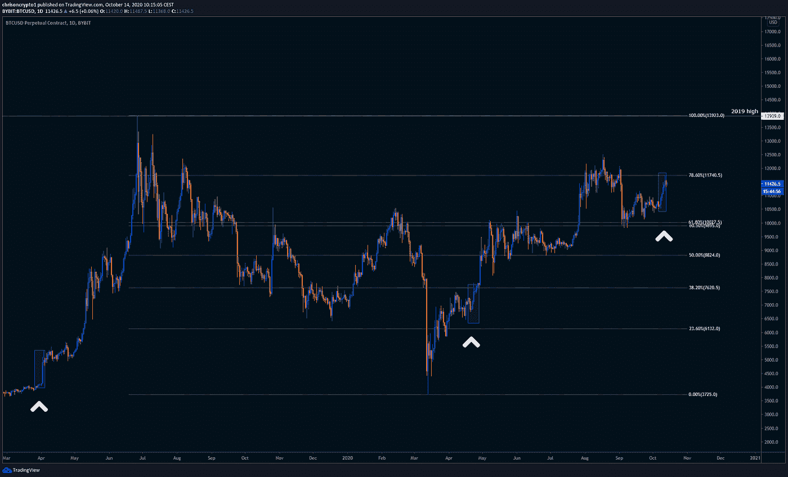
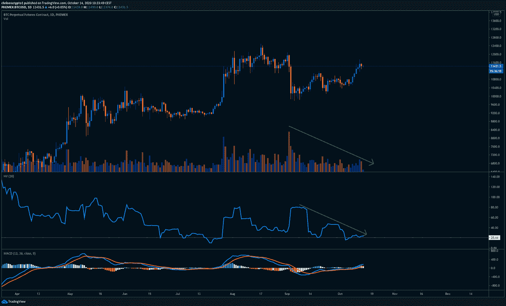

# 比特币斯巴达会不会兵临 14000 美元？

> 原文：<https://medium.com/coinmonks/will-bitcoin-spartans-soldier-on-to-14-000-de1bf240cbbd?source=collection_archive---------3----------------------->

随着 cryptoverse 开始伸腿，人们可以期待健忘时代遗留下来的金融恐龙开始对试图取代它们的新系统表现出兴趣。

不用说，随着各种运动部件合谋加速这一过程，保守派的时代即将结束。活着是多么美好的时光。

让我们开始吃吧。

## 遗留金融显示出生机

在一份令人想起 2017 年“区块链技术运动”的报告中，普华永道的经济学家现在预计，如果区块链应用被大规模采用，该技术的应用变体将为世界经济带来重大提振。

显然，高层中的某些人还没有听说过“DeFi”是 2020 年前沿公司的新的必备加密绰号。

虽然[报告](https://chrisoncrypto.com/blog/f/legacy-finance-white-noise-pwc-expect-17tn-blockchain-boost)通过明确回避比特币发出了危险信号，但有理由推测传统金融和产品跟踪等各种其他应用也可能受益于区块链变体。值得注意的是，这些叙事在 2017 年就已存在，尚未得到有意义的发展或应用。

该报告确定了具有潜在经济价值的令人感兴趣的应用:产品跟踪和追踪(9620 亿美元)，金融服务和支付(4330 亿美元)，身份安全和凭证(2240 亿美元)，合同和争议解决(730 亿美元)，客户参与和奖励计划(540 亿美元)。

以典型的模糊和空洞的方式，斯蒂夫·戴维斯普华永道的全球区块链领导人在报告中说:“区块链周围的严重活动正在渗透到全球的每个行业。”

事实上，很难不阅读这样的报告并得出任何结论，除了四大之一正在向投资者发出信号，表明他们在“区块链”问题上“处于领先地位”。此外，鉴于集中式区块链(可能会被撤销)违背了公开可核实信息的目的，它是否有意义还有待观察。

然而，为了不把婴儿和洗澡水一起倒掉，看到传统机构重新点燃他们对这个空间的兴趣当然不可怕，即使重点最终是不正确的。

# **严格来说**

随着比特币进入一个新的范式，最重要的是要坚定地脚踏实地，以应对未来肯定会出现的任何逆风或障碍。

## 比特币日报显示了更多的上升空间

自 10 月 7 日以来，排名第一的加密公司已经经历了连续 6 天的上涨势头。从历史上看，这种价格波动会在接下来的几周内持续看涨，成为头号数字资产的跳板。纯粹基于历史先例，这对比特币来说是个好兆头。

此外，比特币从 20 周均线的近乎完美的反弹进一步证实了朝着 13，800 美元/14，000 美元水平的持续势头。

通过分析最基本形式的价格行为，很明显比特币想要进一步升值。

## 大动作还没有实现

考虑到各种其他因素，也有可能“大动作”尚未实现。通常，宏观突破伴随着全面的高交易量，以及历史波动率指数的上升。

根据上面的图表，有理由持怀疑态度，因为空头在 11500 美元建立了他们的最后防线；一旦这个水平被决定性地征服，它可能是一条直线上升到新的局部高点。然而，倒退一点也不罕见，保持对这些可能的礼物机会的警惕可以决定一笔好交易和一笔好交易的区别。

**要观看的关卡**

*   每日收盘在 11，500 美元以上，推动价格上涨至 12，000 美元。
*   11100 美元光纤回撤支撑位。
*   收盘低于 10900 点，确认突破失败。

## 外部风险仍有可能让派对提前结束

你肯定知道，没有风险就没有潜在的收益，否则我们都会在檀香山的阳光下啜饮柠檬水。[根据之前的简讯](https://us4.campaign-archive.com/home/?u=8b8731d22cf3702dbbc2f10b3&id=208b715d99)，这些风险很大程度上取决于美元走强的前景、可能的股市崩盘以及美国大选动荡。

毫无疑问，比特币最糟糕的**短期**情景将是美元走强，伴随着标普 500 下跌和刺激谈判失败。由于任何一届政府都会采取类似的量化宽松措施，美国的货币和财政政策都不太可能大幅改变比特币的宏观轨迹。毕竟，数万亿美元的损失已经造成。

然而，基于市场通常更喜欢现状的事实，特朗普的胜利可能会在传统市场进入最后一个季度时带来有利的一帆风顺。

在撰写本文时， [S & P500](https://www.tradingview.com/x/TaZKkb7u/) 已经收复 3500 点，并正在刷新历史新高。然而，仔细观察，每周 RSI 看跌背离加上价格上涨表明灾难性失败的可能性——随着美国大选的临近，下行风险增加。

与此同时， [DXY](https://www.tradingview.com/x/rc8AWc2X/) 在几周前被宏观通道拒绝后，似乎正在与 20 日均线作战。在这一阶段，美元的持续疲软将推动法定货币向 88.67 左右的宏观支点目标迈进，在这一点上，大幅反弹是合理的预期。

这种情况可能需要几周到几个月的时间才能结束，在现阶段，要求美元全面崩溃的观点基本上是妄想。

总而言之，关注这些外部风险因素以发现比特币可能的弱点是一种谨慎的方法——尽管比特币可能不会在乎旧世界，如果它真的超过 2019 年的高点。

改变世界从来都不是一件容易的事，但比特币将会做到这一点。

前进吧斯巴达人。

下次再见。

**在你的社交网站上分享这些内容。感谢您的支持！
加入** [**电报频道**](https://t.me/chrisoncryptochannel) **进行实时更新！
关注我的** [**推特**](https://twitter.com/ChrisOnCrypto1)**&**[**insta gram**](https://www.instagram.com/chrisoncrypto/)**了解更多轻松内容。也欢迎推荐、商机和反馈。**

**阅读更多:比特币持有者以比 2017 年更快的速度倍增**

[https://chrisoncrypto.com/blog/f/bitcoin-holders-multiply-at-a-faster-rate-than-in-2017](https://chrisoncrypto.com/blog/f/bitcoin-holders-multiply-at-a-faster-rate-than-in-2017)

[https://chrisoncrypto.com](https://chrisoncrypto.com)

你经常阅读吗？给我小费！发送
**BTC** 到这个地址:
**3 eydseypjhn 68 axkncuqbb 7 ebqcxrejamr**

最诚挚的问候，

**克里斯托·阿塔尔德**克里斯托·阿塔尔德
克里斯托的创始人
www.cityam.com[的撰稿人](https://www.cityam.com)直接接通:[电报](https://t.me/chrisoncrypto)

*最初发布于*[*https://mailchi . MP*](https://mailchi.mp/4bafe149f74e/will-bitcoin-spartans-soldier-on-to-14000?e=[UNIQID])*。*

## 另外，阅读

*   最好的[密码交易机器人](/coinmonks/crypto-trading-bot-c2ffce8acb2a)
*   [密码本交易平台](/coinmonks/top-10-crypto-copy-trading-platforms-for-beginners-d0c37c7d698c)
*   最好的[加密税务软件](/coinmonks/best-crypto-tax-tool-for-my-money-72d4b430816b)
*   [最佳加密交易平台](/coinmonks/the-best-crypto-trading-platforms-in-2020-the-definitive-guide-updated-c72f8b874555)
*   最佳[密码借贷平台](/coinmonks/top-5-crypto-lending-platforms-in-2020-that-you-need-to-know-a1b675cec3fa)
*   [最佳区块链分析工具](https://bitquery.io/blog/best-blockchain-analysis-tools-and-software)
*   [加密套利](/coinmonks/crypto-arbitrage-guide-how-to-make-money-as-a-beginner-62bfe5c868f6)指南:新手如何赚钱
*   最佳[加密制图工具](/coinmonks/what-are-the-best-charting-platforms-for-cryptocurrency-trading-85aade584d80)
*   [莱杰 vs 特雷佐](/coinmonks/ledger-vs-trezor-best-hardware-wallet-to-secure-cryptocurrency-22c7a3fd391e)
*   了解比特币的[最佳书籍有哪些？](/coinmonks/what-are-the-best-books-to-learn-bitcoin-409aeb9aff4b)
*   [3 商业评论](/coinmonks/3commas-review-an-excellent-crypto-trading-bot-2020-1313a58bec92)
*   [AAX 交易所评论](/coinmonks/aax-exchange-review-2021-67c5ea09330c) |推荐代码、交易费用、利弊
*   [Deribit 审查](/coinmonks/deribit-review-options-fees-apis-and-testnet-2ca16c4bbdb2) |选项、费用、API 和 Testnet
*   FTX 密码交易所评论
*   [n 零审核](/coinmonks/ngrave-zero-review-c465cf8307fc)
*   [Bybit 交换审查](/coinmonks/bybit-exchange-review-dbd570019b71)
*   [3Commas vs Cryptohopper](/coinmonks/cryptohopper-vs-3commas-vs-shrimpy-a2c16095b8fe)
*   最好的比特币[硬件钱包](/coinmonks/the-best-cryptocurrency-hardware-wallets-of-2020-e28b1c124069?source=friends_link&sk=324dd9ff8556ab578d71e7ad7658ad7c)
*   最佳 [monero 钱包](https://blog.coincodecap.com/best-monero-wallets)
*   [莱杰 nano s vs x](https://blog.coincodecap.com/ledger-nano-s-vs-x)
*   [bits gap vs 3 commas vs quad ency](https://blog.coincodecap.com/bitsgap-3commas-quadency)
*   [莱杰纳米 S vs 特雷佐 one vs 特雷佐 T vs 莱杰纳米 X](https://blog.coincodecap.com/ledger-nano-s-vs-trezor-one-ledger-nano-x-trezor-t)
*   [block fi vs Celsius](/coinmonks/blockfi-vs-celsius-vs-hodlnaut-8a1cc8c26630)vs Hodlnaut
*   [Bitsgap 评论](/coinmonks/bitsgap-review-a-crypto-trading-bot-that-makes-easy-money-a5d88a336df2)——一个轻松赚钱的加密交易机器人
*   [Quadency Review](/coinmonks/quadency-review-a-crypto-trading-automation-platform-3068eaa374e1) -专为专业人士打造的加密交易机器人
*   [PrimeXBT 审查](/coinmonks/primexbt-review-88e0815be858) |杠杆交易、费用和交易
*   [埃利帕尔泰坦评论](/coinmonks/ellipal-titan-review-85e9071dd029)
*   [SecuX Stone 评论](https://blog.coincodecap.com/secux-stone-hardware-wallet-review)
*   [BlockFi 评论](/coinmonks/blockfi-review-53096053c097) |赚取高达 8.6%的加密利息