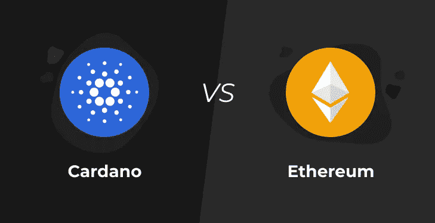

# 从长远来看，卡尔达诺会击败以太坊吗

> 原文：<https://medium.com/coinmonks/will-cardano-beat-ethereum-in-the-long-run-1fa5662abcd9?source=collection_archive---------4----------------------->

Cardano vs Ethereum

De-Fi 爱好者团体推测，从长远来看，像 Cardano 这样的网络将比以太坊网络更大。其他人预计以太坊的势头最终会放缓，让新的网络超越它。据预测，由于这一点，机构将采用像 Cardano 这样的网络。然而，以太坊的忠实者，另一方面，坚持认为以太坊将会存在，这仅仅是一个开始。他们预测以太坊最终将成为密码世界的典范，其网络将成为行业标准。

不如做些分析来解释一下？

以太坊于 2015 年推出，大约两年后，Cardano 推出。它们都有相似之处，因为它们都是拥有可编程生态系统的数字货币。在查尔斯·霍金森离开以太坊开始开发卡尔达诺之前，他们各自的创始人都致力于以太坊的开发。Cardano 自诩为通过基于证据的方法开发的同行评审平台。Cardano 的目标是解决困扰以太坊的问题，如可扩展性。

而以太坊更多的是一个老大哥。这意味着它更受欢迎，更受信任。以太坊的发展速度更快，因为它不像 Cardano 那样接受同行评审。然而，以太坊的卖点是智能合约的部署，迄今为止尚未内置到 Cardano 网络中。

以太坊和 Cardano 都是潜力巨大的平台，旨在解决同样的问题，却选择了走不同的路线。决定哪一个网络更大的竞赛将在很大程度上取决于以下两个因素:

## **部署智能合约**

智能合约是区块链上的自动执行合约，买卖双方之间的协议条款直接写入代码行。这意味着智能契约不需要仲裁者来履行契约，只要满足契约的要求，程序就会自动执行。现在，区块链可以执行交易，而不仅仅是记录交易，智能合约使这成为可能。

智能合约是 NFT 市场的基石。

以太坊网络自诩为智能合约的典范，这一功能使其比 Cardano 略胜一筹。然而，Cardano 目前正在测试智能合约在其网络上的可用性，并希望在今年年底前全面推出。当这个功能完全部署到它的网络上时，Cardano 很可能会获得动力，因此，Cardano 游戏比以太坊游戏更有希望拥有更多皮肤，除非以太坊有所改变。

那会是什么呢？

看我们的下一个观点。

## **股权证明**

在分散金融中，交易记录在区块链上，然后通过一个称为“工作证明”的过程来验证这些交易的真实性。这个过程确保了系统没有被篡改，这是为了避免重复消费或对区块链系统的欺诈性攻击等问题。以太坊使用“工作证明”方法来验证其交易。

由于这种方法消耗大量能源，并被描述为不环保，因此最近受到了抨击和很多批评。另一方面，Cardano 选择了一种不同的、更节能的替代方案来验证其网络上的交易，这种替代方案被称为“股权证明”。Proof-of-Stake 比 Proof-of-work 节能得多，而且作为一种扩展，它比 Proof-of-work 更环保，每秒钟可以处理大约 100 万笔交易。这是 Cardano 超越以太坊的另一个优势，但不会持续太久，因为以太坊计划迁移到 ETH 2.0，以太坊将放弃工作证明，而采用更有效的利益证明。

## **这些差异将意味着什么**。

Cardano 整合了智能合约功能，而以太坊采用了工作证明，这意味着两种加密技术可以相互平衡。与此同时，谁能以最少的技术问题实现这些升级将决定谁是赢家。然而，我们不应该忘记以太坊是最早出现的，多年来赢得了更多的信任，它也有更多的用户可能不愿意放弃他们已经习惯的东西，转而使用新的网络。尽管如此，用户仍不时对以太坊网络上的交易因网络拥塞而产生的高额油费感到沮丧。所以，是的，我们将继续看到更多的机构逐渐转移到其他网络，如 Cardano。

事实是:它们都是坚实的区块链生态系统，仍将继续成为伟大事业的基石。此外，加密的天空足够大，所有人都可以发光。然而，如果我是一个赌徒，我会在以太坊上全押。

作者:

查尔斯·泰米托普。

> 加入 Coinmonks [电报频道](https://t.me/coincodecap)和 [Youtube 频道](https://www.youtube.com/channel/UCbyDhTbOiKh2iUMKBi4-4Zg)了解加密交易和投资

## 另外，阅读

*   [尤霍德勒 vs 科恩洛 vs 霍德诺特](/coinmonks/youhodler-vs-coinloan-vs-hodlnaut-b1050acde55a) | [Cryptohopper vs 哈斯博特](https://blog.coincodecap.com/cryptohopper-vs-haasbot)
*   [币安 vs 北海巨妖](https://blog.coincodecap.com/binance-vs-kraken) | [美元成本平均交易机器人](https://blog.coincodecap.com/pionex-dca-bot)
*   [如何在印度购买比特币？](/coinmonks/buy-bitcoin-in-india-feb50ddfef94) | [WazirX 审核](/coinmonks/wazirx-review-5c811b074f5b) | [BitMEX 审核](https://blog.coincodecap.com/bitmex-review)
*   [比特币主根](https://blog.coincodecap.com/bitcoin-taproot) | [Bitso 回顾](https://blog.coincodecap.com/bitso-review) | [排名前 6 的比特币信用卡](/coinmonks/bitcoin-credit-card-bc8ab6f377c6)
*   [双子座 vs 比特币基地](https://blog.coincodecap.com/gemini-vs-coinbase) | [比特币基地 vs 北海巨妖](https://blog.coincodecap.com/kraken-vs-coinbase) | [硬币罐 vs 硬币点](https://blog.coincodecap.com/coinspot-vs-coinjar)
*   [印度加密交易所](/coinmonks/bitcoin-exchange-in-india-7f1fe79715c9) | [比特币储蓄账户](/coinmonks/bitcoin-savings-account-e65b13f92451) | [Paxful 审核](/coinmonks/paxful-review-4daf2354ab70)
*   [杠杆令牌](/coinmonks/leveraged-token-3f5257808b22) | [最佳加密交易所](/coinmonks/crypto-exchange-dd2f9d6f3769) | [AscendEX 评论](/coinmonks/ascendex-review-53e829cf75fa)
*   [Godex.io 审核](/coinmonks/godex-io-review-7366086519fb) | [邀请审核](/coinmonks/invity-review-70f3030c0502) | [BitForex 审核](https://blog.coincodecap.com/bitforex-review) | [HitBTC 审核](/coinmonks/hitbtc-review-c5143c5d53c2)
*   【Crypto.com 费用】 | [僵尸密码审查](/coinmonks/botcrypto-review-2021-build-your-own-trading-bot-coincodecap-6b8332d736c7) | [币安替代品](https://blog.coincodecap.com/crypto-com-alternatives)
*   [有哪些交易信号？](https://blog.coincodecap.com/trading-signal) | [Bitstamp vs 比特币基地](https://blog.coincodecap.com/bitstamp-coinbase) | [买索拉纳](https://blog.coincodecap.com/buy-solana)
*   [ProfitFarmers 回顾](https://blog.coincodecap.com/profitfarmers-review) | [如何使用 Cornix 交易机器人](https://blog.coincodecap.com/cornix-trading-bot)
*   [MXC 交易所评论](/coinmonks/mxc-exchange-review-3af0ec1cba8c) | [Pionex vs 币安](https://blog.coincodecap.com/pionex-vs-binance) | [Pionex 套利机器人](https://blog.coincodecap.com/pionex-arbitrage-bot)
*   [我的加密副本交易经历](/coinmonks/my-experience-with-crypto-copy-trading-d6feb2ce3ac5) | [比特币基地评论](/coinmonks/coinbase-review-6ef4e0f56064)
*   [CoinFLEX 评论](https://blog.coincodecap.com/coinflex-review) | [AEX 交易所评论](https://blog.coincodecap.com/aex-exchange-review) | [UPbit 评论](https://blog.coincodecap.com/upbit-review)
*   [AscendEx 保证金交易](https://blog.coincodecap.com/ascendex-margin-trading) | [Bitfinex 赌注](https://blog.coincodecap.com/bitfinex-staking) | [bitFlyer 审核](https://blog.coincodecap.com/bitflyer-review)
*   [麻雀交换评论](https://blog.coincodecap.com/sparrow-exchange-review) | [纳什交换评论](https://blog.coincodecap.com/nash-exchange-review)
*   [加密货币储蓄账户](/coinmonks/cryptocurrency-savings-accounts-be3bc0feffbf) | [赌注加密](https://blog.coincodecap.com/staking-crypto) | [加密交易机器人](https://blog.coincodecap.com/best-crypto-trading-bots)
*   [BigONE 交易所评论](/coinmonks/bigone-exchange-review-64705d85a1d4) | [CEX。IO 审查](https://blog.coincodecap.com/cex-io-review) | [Swapzone 审查](/coinmonks/swapzone-review-crypto-exchange-data-aggregator-e0ad78e55ed7)
*   [最佳比特币保证金交易](/coinmonks/bitcoin-margin-trading-exchange-bcbfcbf7b8e3) | [比特币保证金交易](https://blog.coincodecap.com/bityard-margin-trading)
*   [加密保证金交易交易所](/coinmonks/crypto-margin-trading-exchanges-428b1f7ad108) | [赚取比特币](/coinmonks/earn-bitcoin-6e8bd3c592d9) | [Mudrex 投资](https://blog.coincodecap.com/mudrex-invest-review-the-best-way-to-invest-in-crypto)
*   [WazirX vs CoinDCX vs bit bns](/coinmonks/wazirx-vs-coindcx-vs-bitbns-149f4f19a2f1)|[block fi vs coin loan vs Nexo](/coinmonks/blockfi-vs-coinloan-vs-nexo-cb624635230d)
*   [BlockFi 信用卡](https://blog.coincodecap.com/blockfi-credit-card) | [如何在币安购买比特币](https://blog.coincodecap.com/buy-bitcoin-binance)
*   [火币交易 Bot](https://blog.coincodecap.com/huobi-trading-bot) | [如何购买 ADA](https://blog.coincodecap.com/buy-ada-cardano) | [Geco？一次回顾](https://blog.coincodecap.com/geco-one-review)
*   [加密副本交易平台](/coinmonks/top-10-crypto-copy-trading-platforms-for-beginners-d0c37c7d698c) | [五大 BlockFi 替代方案](https://blog.coincodecap.com/blockfi-alternatives)
*   [信用贷款审核](https://blog.coincodecap.com/coinloan-review)|[Crypto.com 审核](/coinmonks/crypto-com-review-f143dca1f74c) | [货币融资融券交易](/coinmonks/huobi-margin-trading-b3b06cdc1519)
*   [拜比特 vs 币安](https://blog.coincodecap.com/bybit-binance-moonxbt)|[stealthexreview](/coinmonks/stealthex-review-396c67309988)|[Probit Review](https://blog.coincodecap.com/probit-review)
*   [顶级付费加密货币和区块链课程](https://blog.coincodecap.com/blockchain-courses)
*   [在美国如何使用 BitMEX？](https://blog.coincodecap.com/use-bitmex-in-usa) | [BitMEX 评论](https://blog.coincodecap.com/bitmex-review)
*   [最佳免费加密信号](https://blog.coincodecap.com/free-crypto-signals) | [YoBit 评论](/coinmonks/yobit-review-175464162c62) | [Bitbns 评论](/coinmonks/bitbns-review-38256a07e161)
*   [OKEx 评论](/coinmonks/okex-review-6b369304110f) | [Kucoin 交易机器人](/coinmonks/kucoin-trading-bot-automate-your-trades-8cf0ca2138e0) | [期货交易机器人](/coinmonks/futures-trading-bots-5a282ccee3f5)
*   [AscendEx Staking](https://blog.coincodecap.com/ascendex-staking)|[Bot Ocean Review](https://blog.coincodecap.com/bot-ocean-review)|[最佳比特币钱包](https://blog.coincodecap.com/bitcoin-wallets-india)
*   [霍比审核](https://blog.coincodecap.com/huobi-review) | [OKEx 保证金交易](https://blog.coincodecap.com/okex-margin-trading) | [期货交易](https://blog.coincodecap.com/futures-trading)
*   [比特币基地赌注](https://blog.coincodecap.com/coinbase-staking) | [Hotbit 评论](/coinmonks/hotbit-review-cd5bec41dafb) | [KuCoin 评论](https://blog.coincodecap.com/kucoin-review)
*   [最佳加密交易信号电报](/coinmonks/best-crypto-signals-telegram-5785cdbc4b2b) | [MoonXBT 评论](/coinmonks/moonxbt-review-6e4ab26d037)
*   [Coinswitch 俱吠罗评论](/coinmonks/coinswitch-kuber-review-1a8dc5c7a739) | [电网交易机器人](https://blog.coincodecap.com/grid-trading) | [比特币基地收费](/coinmonks/coinbase-fees-831e77d4f2c5)
*   [Bitget 回顾](https://blog.coincodecap.com/bitget-review)|[Gemini vs block fi](https://blog.coincodecap.com/gemini-vs-blockfi)|[OKEx 期货交易](https://blog.coincodecap.com/okex-futures-trading)
*   [OKEx vs KuCoin](https://blog.coincodecap.com/okex-kucoin) | [摄氏替代品](https://blog.coincodecap.com/celsius-alternatives) | [如何购买 VeChain](https://blog.coincodecap.com/buy-vechain)
*   [币安期货交易](https://blog.coincodecap.com/binance-futures-trading)|[3 comas vs Mudrex vs eToro](https://blog.coincodecap.com/mudrex-3commas-etoro)