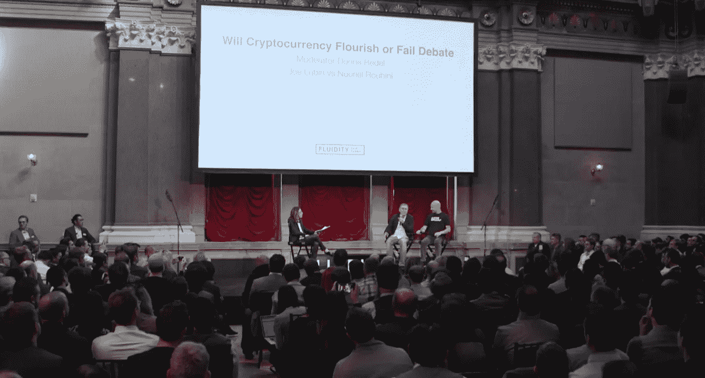

# 密码技术会繁荣还是会失败

> 原文：<https://medium.com/coinmonks/will-crypto-flourish-or-fail-debate-fe1ce1fd76a4?source=collection_archive---------5----------------------->

> 如果你错过了，约瑟夫·卢宾和努里埃尔·鲁比尼在 2018 年 5 月 10 日举行的[流动性峰会](https://www.fluiditysummit.io/)上进行了一场辩论。主要话题是关于分散化的宣传与现实，以及这种彻底颠覆性技术对未来可能产生的潜在后果。我观看并总结了每个发言人的要点，以及他们的反驳。为了尽可能准确，我鼓励社区留下遗漏或错误的注释，以防我错过。

# 搭建舞台:

> “去中心化意味着你的交易，甚至你的言论都不会受到审查，你可以控制自己的身份和价值。”~鲁宾
> 
> “有很多关于权力下放的讨论。有一个乌托邦式的无政府主义梦想，我们不需要政府，我们不需要机构，我们不需要提供信任的机构。”~鲁比尼

——主持人唐娜·雷德尔
- [约瑟夫·卢宾](https://twitter.com/ethereumjoseph)，加拿大企业家，以太坊联合创始人，Consensys 创始人，前高盛校友
- [努里埃尔·鲁比尼](https://twitter.com/nouriel)，美国经济学家，Alum 斯特恩教授，经济咨询公司董事长，经济顾问委员会、财政部以及 IMF 高级经济学家，“末日博士”

## **Q1)为鲁比尼**

你对是什么导致如此关注权力下放有什么看法？你认为有什么方法可以重新建立信任？
-加密领域的混乱:传统观点认为央行和法定货币会导致泡沫
-金融危机、通货膨胀、经济衰退在法定货币出现之前就已经发生了。
-金融危机的波动性/程度比中央银行更严重
-金融服务需要革命。有一场革命:金融科技，但它需要民主化。
-人工智能，物联网正在发生革命性的变化，并且有数字货币被利用，但我们今天使用的零解决方案使用加密。

## **Q2)为鲁彬**

人们对区块链的金融应用给予了极大的关注。
您能谈谈您认为正在取得进步的其他领域吗？
-区块链是下一代数据库技术
-彼此不认识的参与者能够在各种交易中相互信任
-Ethereal-供应寿司-已知食物的来源和位置，跟踪供应链
-互联网为协议而发展-web 3
-我们已经建立了已经超越旧基础设施的系统；我们需要更好的值得信赖的服务
-在构建到互联网之前，没有身份和金钱的概念
-使用 OpenLaw 系统，基于区块链的协议
-许可证-实时支付音乐，价值实时分配给艺术家，消费者支付更少

***回应？(来自 Rubini)**
——技术有一场革命:AI/BigData/IoT 将彻底改变我们的运营方式，但大多数与区块链无关，与加密货币无关。
-关于集权的观点:“我们不相信传统机构。”/“一切都将是对等的”
-我看到了相反的情况:
1)采矿集中化——前三名控制了 60%的采矿量>。前 5 名控制> 75%。
2)工作证明——>利害关系证明变差；变成寡头垄断。
3)所有加密交易的 99%发生在集中式交换中，非常容易被黑客攻击
4)开发过程的集中化；开发者就是法律——决定协议的是维塔利克·布特林，他是生命的仁慈独裁者。警察、检察官、出事时的法官
8)财富的总集中！BTC 的精灵系数为 0.88。Cryptoland 比朝鲜更不平等。
“这是一个完全集权的制度！谈论权力下放简直是胡说八道。”

***反驳(来自 Lubin)** ——挖矿系统，工作证明易受集权影响，尤其是比特币，部分在以太坊——硬件军备竞赛。
-利益证明:将弥补许多关于计算/能源浪费的问题，取代硬件基础设施
-成为验证者的障碍当我们转向混合利益证明时，将实现更大的分散化
-如果有恶意参与者，您可以分叉系统
-交换确实是集中的。AirSwap 是一个巨大的协议/服务集，它将支持 P2P 可信原子交换。将启用 1:多、多:多，启用做市商。治理——维塔利克很出色，但他并不真的写代码。
-以太坊客户端的 10 种不同实现，独立的团队，与另一个战斗。
-像互联网一样的一套协议，我们都是写客户端的。
-开源。参与者:核心开发者，EAA——500 家银行、保险、汽车等行业的公司。
-从一个受益于这项技术的世界中走出来，这个世界在互联网上是一个可以被操纵的封闭花园。我们正在构建从根本上原子化协作的系统。

## Q3)现在，有清算系统的受监管的集中式交易所正在步入非正统的加密世界，您如何看待这一格局的演变？它们能与分散的共存吗？这会改变可伸缩性和安全性吗？

卢宾:WRT 加密公司将会比 WRT 证券公司更复杂。
-在人们跨境支付的能力方面，汇款有很多使用案例。
-有许多公司会把它卖给任何人/运送它，但是没有办法支付这些购买。
-在世界各地，人们需要更好的理财选择。许多人没有银行账户。甚至在美国，也有数百万人没有银行账户，因为他们被扣了 35 美元的费用。
-以太坊有一个代币标准，使我们和世界各地的许多其他项目能够发行代币。
-这些代币可以是代币化证券，我们将能够对股票进行代币化，以在未来做出惊人的事情。
-效用令牌代表平台上的会员资格，消耗稀缺资源。
-基于协议的开放平台是创建向消费者提供服务的生态系统的一种新方式
-你可以使用这些令牌来操作这些平台
-尽管我们会看到围绕令牌的一些项目的生态系统中出现一些负面消息，但我们也会得到一些好的正面消息，我们将在 2018 年获得一些真正的澄清。

鲁比尼:我认为我们有制度是有原因的。
——要点:对于要成为货币或货币的东西:记账单位，支付手段，(不用于真实交易。现在是 5-7 txns/sec)
-不一致性三位一体:可伸缩性、分散性、安全性
-不是稳定的价值存储:价值某天上涨 50%，第二天下跌 50%。
-假设你是一个商家，你想用比特币支付交易。
1)拿美元，兑换成 BTC，txn cost
2)拿 BTC，也许用另一种硬币来换商品和服务
3)拿其他硬币换回美元，因为你不能冒+/-20%的风险，你会损失利润率。
4)任何想用它做 txn 的人，都有巨大的市场风险，都没有在用。
-不是记账单位，不是稳定的价值储存手段，不是货币

***反驳(出自鲁宾)** -(法定)货币崩溃。阿根廷/委内瑞拉——宁愿让代币升值，也不愿让他们的“传统代币”贬值。
-以太坊上的项目，价值 10 亿美元，价格稳定令牌 maker Dao——令牌是阿呆，停留在 1 美元。复杂，但有多个层次来保持价格稳定，以有效地发挥自动化中央银行的作用。
- Trilemma 对于版本 1 协议是准确的，在该系统中，每个完整节点必须处理每个 txn 并存储数据。我们正在建立国家频道，侧链，等离子，分片；这些银行处理一系列全新的交易。
-区块链用我们在网络中看到的可扩展性换取了信任，许多人认为这非常有价值。现在轮到我们来构建可伸缩性了。

## Q4)——如果它是加密资产而不是加密货币会怎么样？

*鲁比尼——关于它是一种货币、商品，还是证券等等，存在着一场激烈的辩论。
- ICO: 1500+大多数人认为这些是不合规的证券
-最近的研究:在所有最近的 ICO 中，81%是*总骗局*，11%失败或死亡，8%在交易所交易，甚至不是合规的证券
-硬币世界的两个基本问题，以及为什么他们会失败而不管任何法律问题:
1)如果任何企业想通过以最高价格出售尽可能多的商品&服务来实现利润最大化 你要做的最后一件事是通过首先购买令牌来限制任何人购买这些服务的能力？ 为什么我应该购买代币而不是购买美元/欧元来购买商品/服务？唯一的原因是创建一个卡特尔，这是欺骗客户。不仅有不守法者，还有非法卡特尔。
2)记账单位！在一个所有商品/服务都用代币购买的世界里，我不知道两件商品的相对价格？
denta coins 和 Dodgecoins 的相对价格是多少？那个的相对价格是多少？制造混乱。没有价格发现系统，矛盾的是，你将进入燧石族的物物交换系统，而不是高效的低成本。还不如回到以物易物的石器时代。完全没有效率，而且永远不会成功。

Lubin——我同意很多观点，但有不同的结论。
-多项目；许多发行代币或安全/实用代币。欺诈项目很多。
——千百年来，无良演员一直在利用天真的消费者；通常基于信息不对称。
-信息不对称是巨大的，运行这些计划的低门槛加剧了这种不对称&全球背景。容易占人便宜。全球背景和我们获取信息的能力将能够创建一个更好的基础设施来保护消费者
- TrueSet 建立这些不同项目的数据库；同伴的压力会披露重要的数据。未来:自我+外部监管
——花大量时间与监管者交谈；阿姆诺格监管机构非常兴奋。我们需要使这些方法符合社会现在的运作方式。我们可以将监管纳入智能合同；监管机构需要跟上技术发展的步伐。那正在发生。监管机构/软件开发商合作制定规范和测试套件，以确保合规性。
-我们并不是要强迫每个人去中心化。我们正试图就如何利用这项技术进行明智的讨论。

你谈到更喜欢自我监管。现实是，这个行业没有自我监管。
- 81%的 ico 完全是骗局
- 50%的 Dapps 基本上是分散的交易所，没有人使用，没有流动性，什么都没有发生
-其中 25%是赌场游戏或像 cryptokitties 这样的愚蠢游戏
-比特币的总交易量完全崩溃，而交易成本已经飙升
-在像股票市场这样的发达市场中，交易成本随着交易量的增加而下降。
-在加密的情况下，交易成本上升，交易量下降。
-大部分是骗局，庞氏游戏。注定如此。如果你想自我调节，你会阻止它。所有这些东西都在你的以太坊基础上，而你却对此无动于衷。
-关于保管的最后一点:首先，即使是去中心化的东西也被黑了。每个人都必须保管自己的东西。
-这么想吧:数十亿人应该在使用 BTC 或 ETH。每个人都可能被黑，每个电话/系统什么的。
-你打算如何保护它？你必须写在一张纸上，并把它放在一个安全的盒子里，在什么？在银行里！
——老鼠吃货币，枪口要求私钥。完全胡说八道！作为一个系统完全疯了。

*** Lubin**——让我们快速解决自律问题。
-我们正在与监管机构合作。我们正在建立系统，使我们能够自我监管，激励分析师广泛分享他们的发现。
-即使你看看像 Reddit 这样的系统:有这么多的疯子在审查白皮书。很多项目都暴露了。中国政府和美国证券交易委员会正在采取行动。

***鲁比尼**——要把坏人赶出去，你必须登记这些证券，你必须登记发行人，KYC/反洗钱/反逃税
***鲁宾(对鲁比尼)**——你建议我们把婴儿和洗澡水一起扔出去吗？区块链不好吗？
***鲁比尼** —这不是好坏的问题。有很多技术是成功的，也有一些不是。人们说‘这是互联网的开端’不是的！txn 正在崩溃，成本正在上升。
*** Lubin**——以太坊网络没有崩溃，我们正在呈指数增长。交易数量是所有其他区块链系统的两倍多，而且成本低得多。
***鲁比尼** — 7 txn/秒。维萨卡每秒 2 万英镑。

## 主持人:网络繁荣/萧条对比。有没有可能这里有什么东西，或者没有？

***鲁比尼**——我不这么认为。
-我是最早采用互联网的人之一，从网络到电子邮件/创办网站/生意兴隆/生意兴隆。
-即使业务失败，我也有注册的证券，可以接管一些知识产权。我知道谁是发行人。我有一些权利。
-交易失败的互联网公司的知识产权有一个巨大的市场。即使有违约，我也有一些资产。有了代币，我没有权利。

***鲁本** —提及令牌化货币。比较了 1989 年蒂姆·伯恩斯·李/公司内部网。
-认为比特币最初是一种货币理论实验，不应该从那里开始，我们应该从以太网开始(还不到 3 岁)
-你认为 10 年后像以太网这样的区块链系统不会具有系统重要性吗？

***鲁比尼**——我真的不知道。我当然相信密码货币空间是一个你不可能有成百上千的不同代币的空间。金钱的定义是每个人都在使用相同的东西。
-密码货币不是货币，我对此表示怀疑。我没见过有可扩展性+安全性+分散性的世界
——你说的是一个无政府的世界，一切都分散，一切都象征性的。
-可能有私人应用程序……<被主持人的哨声切断>

## 问题 5)你哪里错了？

***鲁本**——可能是错的，因为它可能会腾出更多的时间。收养的速度令人吃惊。
-作为一个人，很难生活在这样的指数时代。

*** Rubini**——我首先将 Blockchain 作为一项技术与密码货币和所有其他技术分开。
-Blockchain 领域可能会取得一些成功，但可能会有一些公司和企业利用它来创造半私人的区块链，因为没有理由对每一笔交易都进行公开分类。
-任何大公司都会发生数十亿笔交易。有很好的理由不希望这些信息公开。
-即使是这项技术，拥有电子表格或分布式系统的更复杂版本将由私人区块链托管，

***鲁斌** — Web 1 —静态，Web 2 —电子商务，数量级，Web 3 —增加可扩展性，隐私机制
- 2018 将迎来区块链互联网。不同的系统有不同程度的分散信任。
-技术发展迅速，将使我们远离集中式系统。

## 问题 6)有什么让你晚上失眠的吗？

*** Rubini**——金融市场中的欺诈行为，但我不认为我们即将迎来另一场全球金融危机。
- Fintech 革命将减少这些危机。大数据+人工智能会有所帮助。

太多的工作要做，太多的兴趣，太多的兴奋。

Debate starts at 3:10:00

*丹·埃蒙斯是* [*埃蒙斯皮雷有限责任公司*](http://www.emmonspired.com/) *的所有者，一名* [*认证比特币专业人士*](http://cryptoconsortium.org/lookup/6f0d14) *，认证以太坊开发者，全栈开发者，加密货币项目顾问。他还是一个名为*[*# ByteSizeBlockchain*](https://www.youtube.com/watch?v=SVBZ7mdgGcA)*的 Youtube 频道和 iTunes 播客的创作者。*