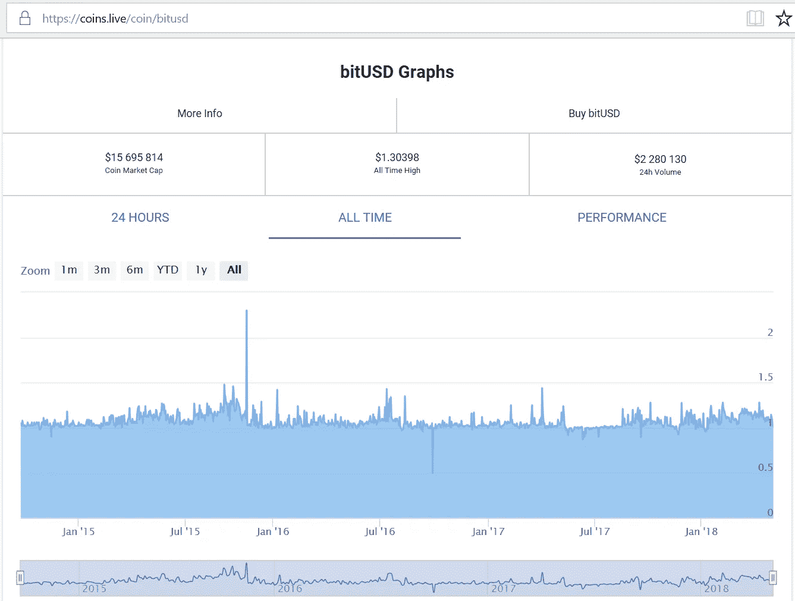
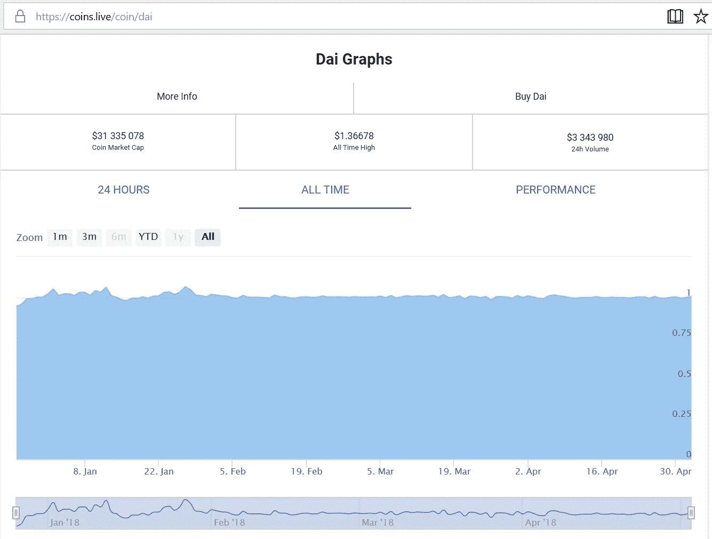

# 加密货币会取代法定货币吗？

> 原文：<https://medium.com/coinmonks/will-cryptocurrencies-replace-fiat-732ca57b751b?source=collection_archive---------1----------------------->

货币已经从最初的形式(贝壳、盐、铜、金)发展到了最新的形式——互联网中的加密比特。比特币的出现引入了无摩擦货币的概念，这种货币完全没有内在价值，甚至没有建立在对第三方信任基础上的价值。这种货币形式有可能使目前最流行的货币形式(法定货币，以美元为例)过时。加密货币领域的大多数知识分子认为，加密货币最终将取代法定货币。我不相信。

我认为，目前形式的加密货币无法取代法定货币。问题在于货币政策:通缩(保持数量不变)还是通胀(允许数量增加)。

从 2011 年开始，我在博客中写了几篇关于比特币的深思熟虑的文章(见样本[这里](https://ctapang.com/2011/03/05/what-is-money/)、这里[这里](https://ctapang.com/2013/01/30/more-on-bitcoins/)、这里[这里](https://ctapang.com/2013/03/26/the-miners-greed-will-save-bitcoin/))。我的观点是，[甚至追溯到 2013 年](https://ctapang.com/2013/03/23/would-bitcoin-suffer-a-similar-fate-as-that-of-unix/)，硬性限制比特币的数量不利于其作为交易媒介的使用。我试图说服比特币社区，但他们置若罔闻。最近，我试图说服以太坊社区把以太作为交换媒介，但几乎没人听。我可以理解为什么目前比特币和以太网的持有者会抵制任何通胀性货币政策:他们希望自己持有的比特币继续升值。

这是我对通货膨胀问题的立场:如果没有通货膨胀，没有加密货币可以取代法定货币作为交换媒介。通货膨胀是价值稳定的要求，而价值稳定是交换媒介最重要的要求之一。

我相信我理解 Vitalik Buterin 对以太坊逐步淘汰采矿时安全方面的通货膨胀的担忧:如果采取通货膨胀的货币政策，人们将没有足够的动机冻结他们在股权证明系统中的持股(即使是一会儿),以保持网络安全。这是值得商榷的，但可能是我没有完全理解它。所以现在让我们跟随 Vitalik——安全是最重要的。不管怎样，以太不应该成为交换媒介:它应该被用作支付汽油的货币。(在以太坊宇宙中，交易不是免费的。它不是免费的，所以没有人可以用无用的交易阻塞网络，从而使它变得无用。交易耗气，气用醚付费。)

**权力下放**

从分散化的角度来看，简单货币政策的优点是显而易见的:如果你简单地限制数量，没有人必须决定何时增加/减少数量以及减少多少。然而，权力下放并不一定意味着失去灵活性。事实上，最成功的分散系统是那些最灵活的系统。去中心化纯粹主义者否定了将系统某些方面的控制权让给中心的重要性，事实上有些东西需要留在中心。

在不可信的自动机网络中，去中心化是至关重要的:你消除了单点故障，任何人都可以建立一个节点，只要那个节点运行的是网络程序的未修改版本。网络本身是分散的，但是网络程序必须遵守一套集中确定的规则。事实上，在大多数情况下，这样的程序是由同一组人编写的(大约每个网络一个中心团队)。

**中央银行**

我理解加密货币知识分子对央行的仇恨。在一个资本主义的、去中心化的世界里，央行作为社会主义的控制中心而存在。从根本上说，每家央行都是一个独裁政权，统治着自己的领地。一家央行和支持它的政府之间存在一种邪恶的联盟:政府允许央行控制本币，作为回报，央行允许政府轻松获得资金。在这种安排中，人民是冤大头。看看委内瑞拉人民是如何因为恶性通货膨胀而受苦的吧——委内瑞拉政府及其中央银行指责商人定价过高，而大多数人相信他们。即使在像美国这样高度开放的社会，每当美联储购买政府债券时，通胀就会被用来为超支的政府提供资金。在这种情况下，通货膨胀是货币数量的受控增长；但即使是这种周期性的、精确的升值也会导致货币价值温和而缓慢的下降，这仍然是有害的。简而言之，人们普遍认为，由于央行参与了通胀，通胀肯定是糟糕的。

**美联储之前**

有一种东西叫做良性通货膨胀。在没有中央银行这样的垄断机构的情况下，银行可以被允许发行自己的银行券。过去，在被政府认可的中央银行垄断之前，地方银行被允许发行人们用作货币的钞票。这种钞票由黄金或政府债券支持。作为一家企业，银行只有在兼顾安全和利润的情况下管理这些钞票的通货膨胀，才是安全和健康的。如果它将这些银行券的数量增加到超过安全限度，它就将自己暴露在灾难性的银行挤兑中，这可能使它消失。如果相对于黄金和政府债券持有量，它能很好地管理流通中的银行券数量，那么它就能像任何企业一样，在利润、规模和声望方面有所增长。此外，正如人们可以将比特币兑换成乙醚一样，当时人们可以将 A 银行的纸币兑换成 B 银行的纸币，反之亦然。

那么，你会问，如果真的那么好，为什么在任何一个国家，纸币不再存在，而是被单一货币所取代？这个故事有点复杂，与其在这里讲述整个故事，我强烈推荐乔治·塞尔金教授的一本书《T2 金钱:自由与不自由》。

简言之，央行的出现是误诊疾病的结果。简而言之，问题在于存在阻止银行分支的规则，这导致了纸币的季节性短缺，每次都变得严重，每次灾难性的短缺发生时，除了规则之外，责任都被推到了其他地方，于是更多的规则被引入，这自然使事情变得更糟。直到最后，领导人们引入了“万法之母”，一项旨在让世界摆脱银行问题的法律:为了解决问题，他们决定建立一个垄断机构(一家中央银行)。故事的细节要复杂得多，但塞尔金教授的书很好地描述了整个故事。底线是:中央银行不是一种市场现象——任何一个国家的中央银行的存在只有一个原因:它是依法存在的，而不是亚当·斯密所说的“看不见的手”。

**Stablecoins**

好消息是有可能引入从一开始就被设计为稳定的加密货币(所谓的 stablecoins)，事实上现在已经有几种了。包括 Vitalik 本人在内的加密货币知识分子对这些稳定的货币嗤之以鼻，因为它们并没有完全去中心化。目前，这些货币中最受欢迎的是“Tether”。

Tether 存在于比特币网络中，作为独立于比特币的账本。背后的公司声称，每一个系绳单元都由存在两家台湾银行中任何一家的美元支持。如果这是真的，那么就不会有“银行挤兑”:即使所有的股票持有者同时要求得到美元，公司也肯定能够满足需求。让每一个栓绳都有一个美元甚至是不必要的，就像过去的地方银行没有为他们发行的每一个单位的钞票都有一个美元一样(在中央银行出现之前)。有传言说，系绳没有百分之百的支持所有的时间，我不会感到惊讶。你的钱还是安全的。

系绳广泛应用于交易所，已成为现存最受欢迎的稳定货币。

USDT (Tether) exchange rate graph from 2015 to present (bottom graph is volume)

另一个稳定币是 BitUSD，它更有趣，因为它基于看跌期权和看涨期权。BitUSD 不是凭空产生的；相反，它是作为针对加密货币抵押品的贷款而创建的。在 BitUSD 出现的瞬间，抵押品的价值可能是 BitUSD 的两倍。如果抵押品的价格下降，比如说，是以美元计算的原始贷款价值的 1.5 倍，那么抵押品将被自动出售，美元收益将分配给 BitUSD 公司和抵押品的所有者。这样，每个 BitUSD 都有其抵押品作为支持。当然，它应该被用作货币，所以最初的所有者(他将加密货币借给 BitUSD 以换取 BitUSD)可以将它作为支付传递给任何在 Bitshares 网络中拥有账户的人。

BitUSD exchange rate graph from 2015 to present (bottom graph is volume)

第三种稳定的硬币是戴，相对较新，存在于以太网上。这种稳定币背后的公司(MakerDAO)设计了一种复杂的机制来保持戴的稳定，类似于 BitUSD。我不会深入讨论这种稳定硬币的细节，但可以说，如果你看一下这三种稳定硬币的历史价格图，你会发现它们一直相当稳定。BitUSD 的波动性最大(注意 2015 年非常高的峰值)，但最近相当稳定。总的来说，稳定性仍然不理想，但没有什么会使这些货币变得无用。

几个更稳定的硬币将很快推出:稳定和基本硬币。还会有更多。

Dai exchange rate graph, from January of this year (bottom graph is volume)

**一个最有趣的情况**

加密货币不受任何国界的限制。央行的领地在范围和领域上都是有限的。人们知道通货膨胀缓慢，市场肯定会选择最稳定的货币。我认为我们面临的情况是，拥有法定货币的央行将与拥有稳定货币的加密货币公司直接竞争。谁会赢？

理智投资于央行并且对央行感到放心的人肯定会维护现状，甚至要求政府完全禁止加密货币。根据政府法令，这是央行获胜的唯一途径。

但是，只要能收税，美国政府就不一定会受到加密货币的威胁。此外，请说出一位公开反对加密货币的美国政治家的名字？我们无法预测未来，但我们可以肯定的是，美国政府欠美联储和债券持有人大约 22 万亿美元。它不可能支付这笔借来的钱，但有一条出路，加密货币只能有所帮助。怎么会？允许美元贬值。这种情况以前发生过，事实上发生过很多次。此外，不只是美国会这样做:日本、中国和欧洲国家都有巨额债务，因此我们可以预计日元、人民币和欧元也会贬值。

这就是加密货币能够获胜的地方，因为它基本上没有边界，也没有政府的支持。例如，戴背后的 MakerDAO 公司可能总部就在美国；相反，它选择把自己放在新加坡。为什么？实体公司位于何处并不重要。如果它位于美国，它可能会受到美国法律的阻碍。

政府选择禁止加密货币的国家或州的公民会发现自己处于非常不利的地位。这将限制他们的自由，并会看到他们所选择的居住地的经济停滞不前。他们日常使用的法定货币将会贬值，因为与流通中的数量相比，对这种法定货币的需求将会大大减少；而且，正如上文所解释的，如果允许本币贬值，政府的处境会更好。在某种程度上，人们将无法避免使用加密货币，尤其是稳定货币。人们会开始无视不合理的金融法律，他们会想办法通过秘密手段使用稳定的货币，比如使用虚拟专用网络。

抛弃旧银行和它们的纸币，并建立一个中央银行是相对容易的。这一次，驯服加密货币的狂野世界不会那么容易。谁会赢？我认为这一次人民将最终获胜。

你已经把这篇文章读完了！如果你按下掌声按钮，我会很感激。谢了。