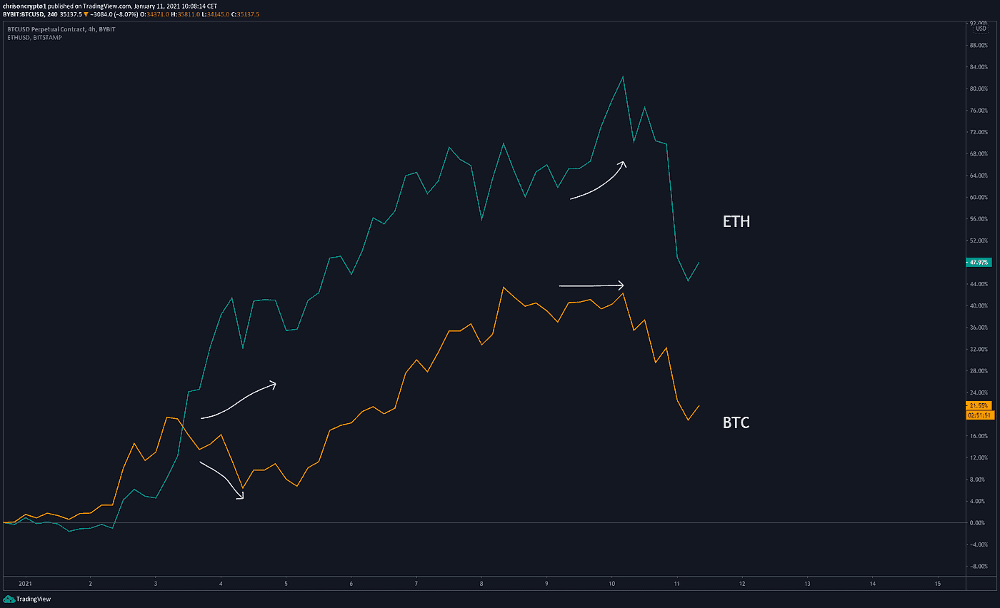
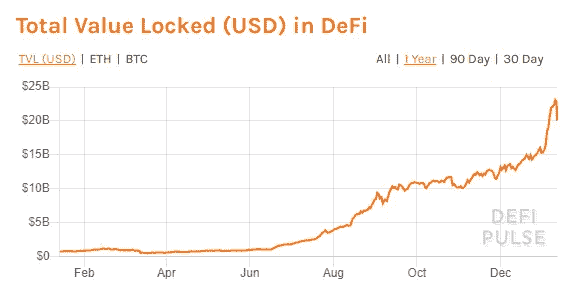
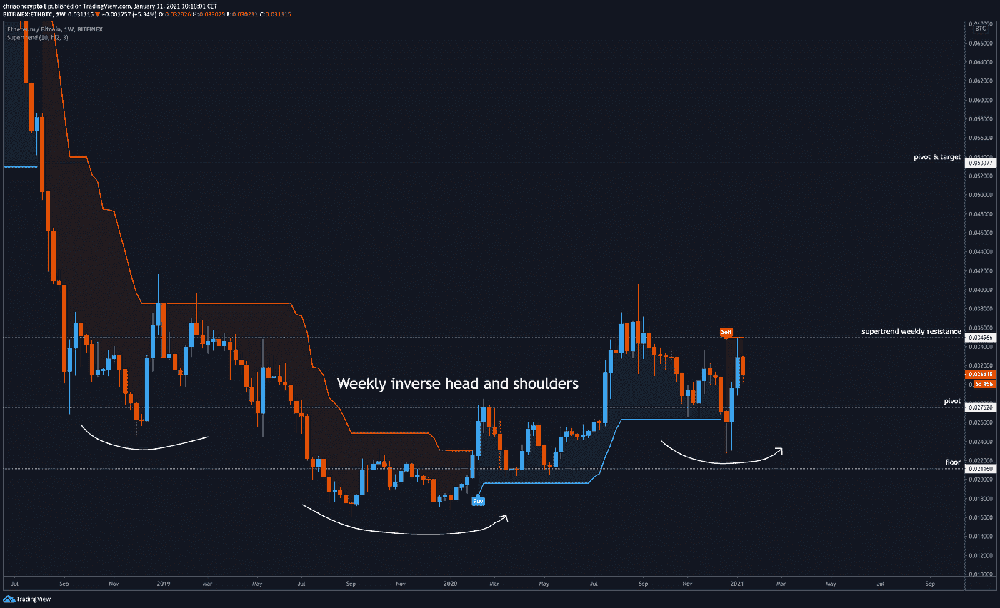
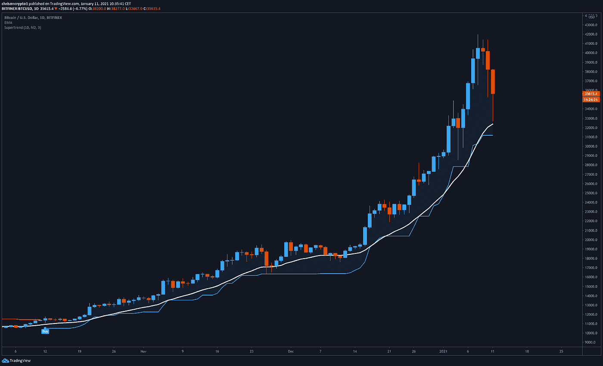
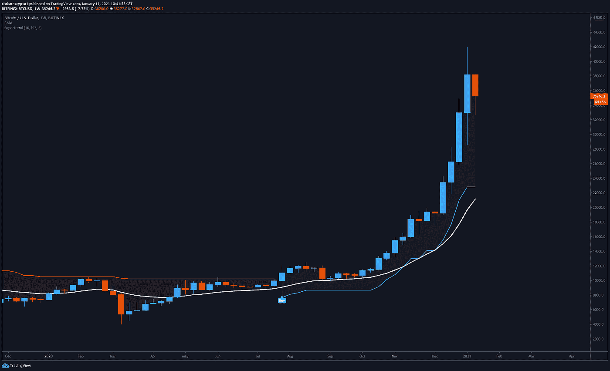

# 未来几周，瑞士联邦理工学院的表现会超过 BTC 吗？

> 原文：<https://medium.com/coinmonks/will-eth-outperform-btc-in-the-coming-weeks-ecf8f82cf302?source=collection_archive---------2----------------------->

比特币在周末失去动力之前曾触及 42，076 美元的价格，周末暴跌 22%。既然急需的调整已经到来，是时候仔细看看以太坊了吗——它仍处于历史高点之下的趋势？

## 未来几周 ETH 会跑赢比特币吗？

由于投资者担心深度调整，加密市场下跌了 600 多亿美元。截至发稿时，比特币在暴跌中损失了 22%左右，以太坊损失了 24%，莱特币损失了 33%。

现在，期待已久的调整已经到来，问题是在哪里和什么时候跳回来——但这是本通讯下半部分的主题。

现在，让我们关注以太坊在未来几周开始超越比特币的潜力。事实上，随着比特币的交易价格接近 2017 年历史高点的两倍，以太坊至少有理由赶上。

一段时间以来，以太坊在每一个上升阶段都表现不佳或落后于比特币，但在 1 月 3 日，这种行为发生了变化，在这次纠正行动中，争夺市场控制权的斗争变得更加明显。

如上图所示，以太坊在最终屈服于比特币主导的看跌压力之前，在两个关键时刻表现优于比特币。就在昨晚，Bitmex & Bitfinex 上以太坊永久基金的融资利率为 0.5%或更高，表明即使在衍生品领域(自上一期简讯以来)，对以太坊的看涨胃口也在持续增加。

从基本面来看，以太坊也是几乎所有 DeFi 产品的构建平台——无论是收益率、分散式交易所、贷款、稳定债券还是其他衍生产品。

根据来自 [defipulse](https://defipulse.com) 的数据，以太坊驱动的 DeFi 锁定的总价值(TVL)超过 200 亿美元，并且自 2020 年初以来一直在增长。

在我们进入下一个阶段之前，我建议你放松一下，系好安全带，因为机会可能是巨大的。

在周线图上，ETH/BTC 组合看起来像是一个惊人的头肩底反转。如果这种情况发生，0.05 的 Satoshi 水平可能是一个保守的数字。

在牛市中，一切都将对美元价值上涨，即使随着即将上任的美国总统乔·拜登的安顿， [DXY](https://www.tradingview.com/x/J63MAUhC/) 有一个临时的恢复期。问题是哪种加密资产将胜过比特币，也许最终同样的问题也可以问 Altcoin/Ethereum 对——但我们不要超越自己。

自 12 月下旬以来，以太坊和比特币一直在争夺对叙事的控制权，这绝不是一个新现象。2019 年 8 月，当 DeFi 起飞时，发生了叙事翻转，这将再次发生，不管百万富翁比特币持有者告诉你什么。

密码市场的动态已经改变。鉴于 2020 年发生的所有事件，长期持有比特币几乎没有风险，所有这些事件都在我的[博客](https://chrisoncrypto.com/blog)上有所报道。

因此，分散投资于以太坊和各种 DeFi 项目，在你的投资组合中占据适当的比例，可能会在本轮牛市中大幅提高回报率。

给你一些视角，我们在[电报频道](https://t.me/chrisoncryptochannel)(除了 Filecoin)讨论的每一笔 altcoin 购买都已经翻了一倍或两倍，而 alt-season 甚至还没有开始。一旦 ETH 启动，历史先例告诉我们，预计一些硬币会增加 100 倍。

当然，交易 DeFi altcoins 肯定不是每个人都适合的，这就是以太坊的用武之地。通过拥有以太坊，你自动暴露于 DeFi，因为它是一切运行的基础资产。

最终，就市值而言，衍生品让传统市场上的贵金属黯然失色——为什么在加密领域会有所不同？市场说金融产品存在，衍生产品是结果。以太坊存在系统性风险，但回报可能性的上升空间和风险太大，不容忽视。

比特币无疑是加密之王，但如果我仅仅因为比特币清教主义的某种错位感而错过了一个机会，我会被诅咒的。

***获取本新闻稿！*** [***订阅邮件列表***](http://www.chrisoncrypto.com) ***。***

# 技术上来说

## 比特币购买区变得简单！

在撰写本文时，比特币触及了日线超级趋势上方的第一个买入区，从 20 日线均线反弹了 8.26% (Bitfinex)。

先锋加密交易高于自 2020 年 10 月 12 日 11，400 美元以来首次建立的每日超级趋势。在价格收于 31，100 美元以下之前，逢低买入者将继续获得回报。

然而，记住每一个趋势最终都会结束，突破这个水平意味着一个更深更长的调整正在进行中。

因此，谨慎的做法是缩小到每周的时间框架来研究长期买入区。

根据上面的图表，20 周均线和超级趋势现在分别位于 21200 美元和 22700 美元。书中最古老的技巧是简单的“均线”技术分析。最终，价格要么停下来等待均线赶上，要么大幅下跌，以修正过度扩张和泡沫化的市场。

在撰写本文时，第一种情况似乎正在发生，并且是更可取的情况。

既然比特币正在看涨区域内降温，那么许多叫嚣比特币价格打折的人要么会因为恐惧而不买，要么已经陷入困境，没有资本可供配置。

这就是为什么为几种情况做计划是如此重要，记住没有完美的交易。

没有解决办法，只有权衡。

公牛领路。

下次再见。

在你的社交网站上分享这些内容。感谢您的支持！
**加入** [**电报频道**](https://t.me/chrisoncryptochannel) **进行实时更新！**
**关注我** [**推特**](https://twitter.com/ChrisOnCrypto1)**&**[**insta gram**](https://www.instagram.com/chrisoncrypto/)**更多轻松内容。**
**引荐，商机和反馈也很感谢。**

[https://chrisoncrypto.com/blog/f/fincen-receives-65000-comments-against-impractical-crypto-bill](https://chrisoncrypto.com/blog/f/fincen-receives-65000-comments-against-impractical-crypto-bill)

www.chrisoncrypto.com

你经常阅读吗？给我小费！发送 **BTC** 到这个地址:
**3 eydseypjhn 68 axkncuqbb 7 ebqcxrejamr**

*最初发布于*[*https://mailchi . MP*](https://mailchi.mp/4ee936d6227e/will-eth-outperform-btc-in-the-coming-weeks?e=[UNIQID])*。*