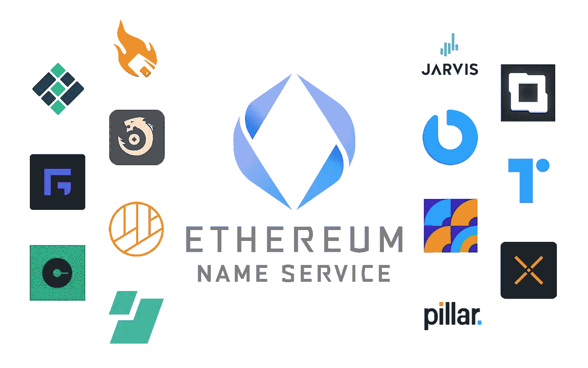
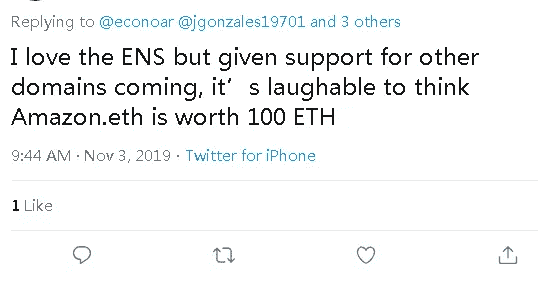
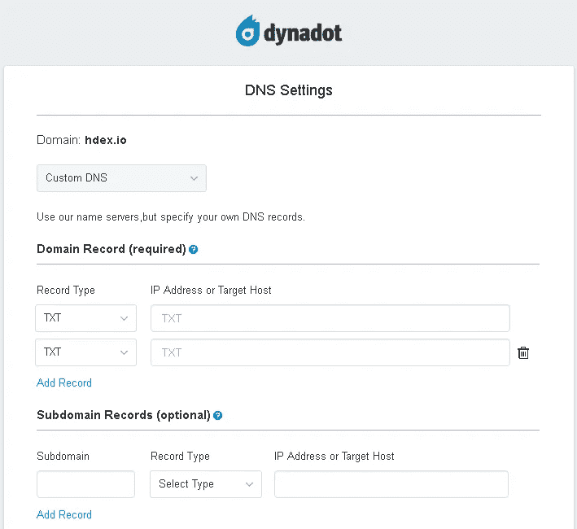
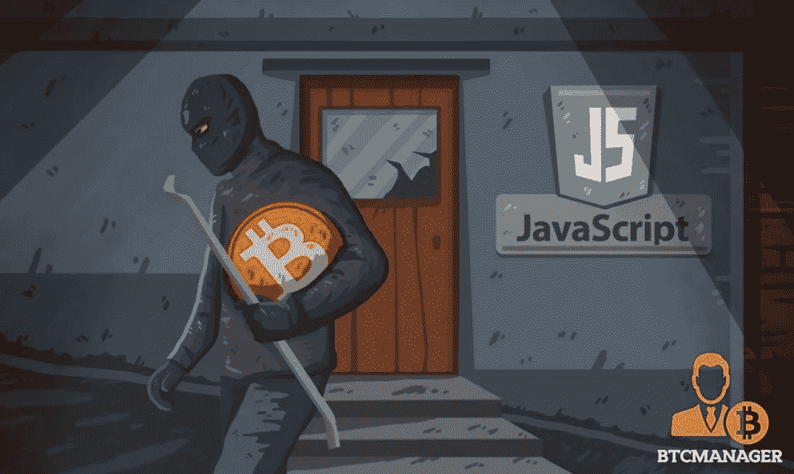
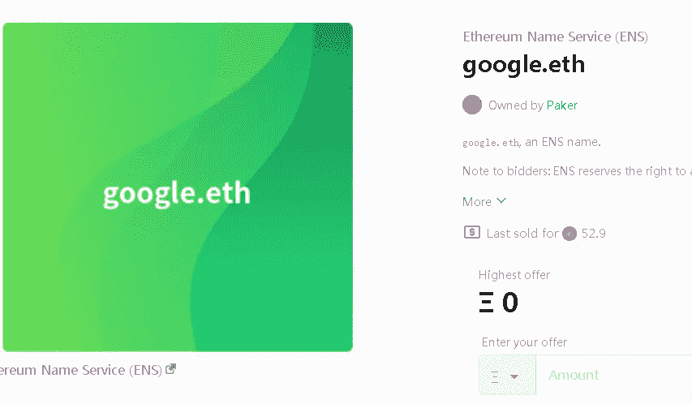
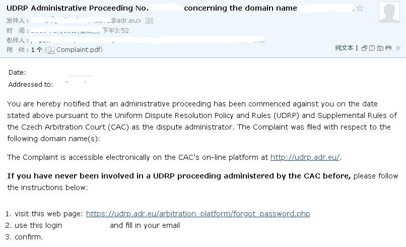
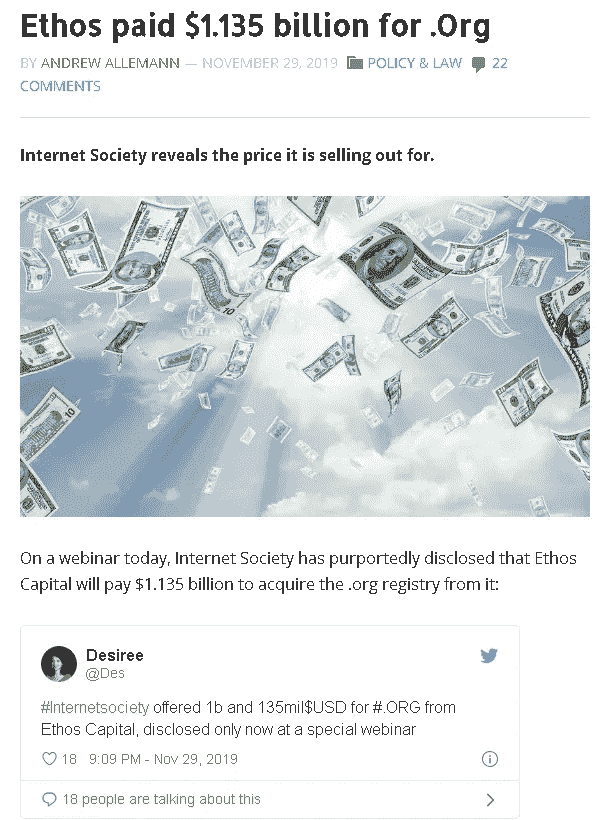
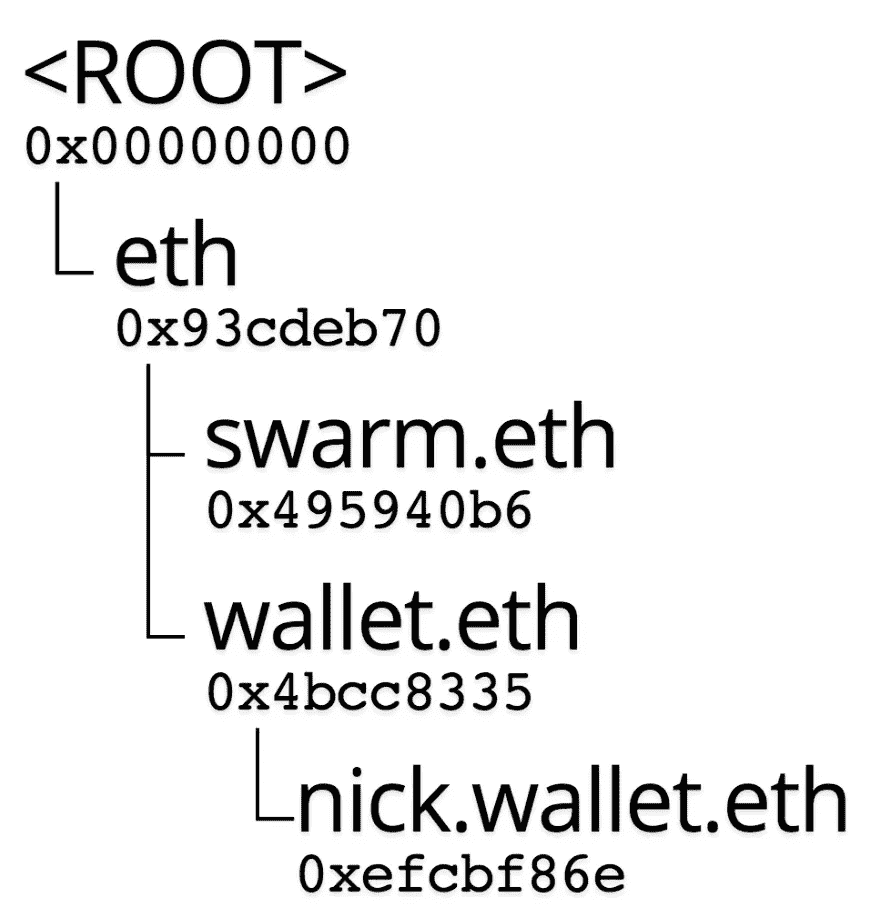
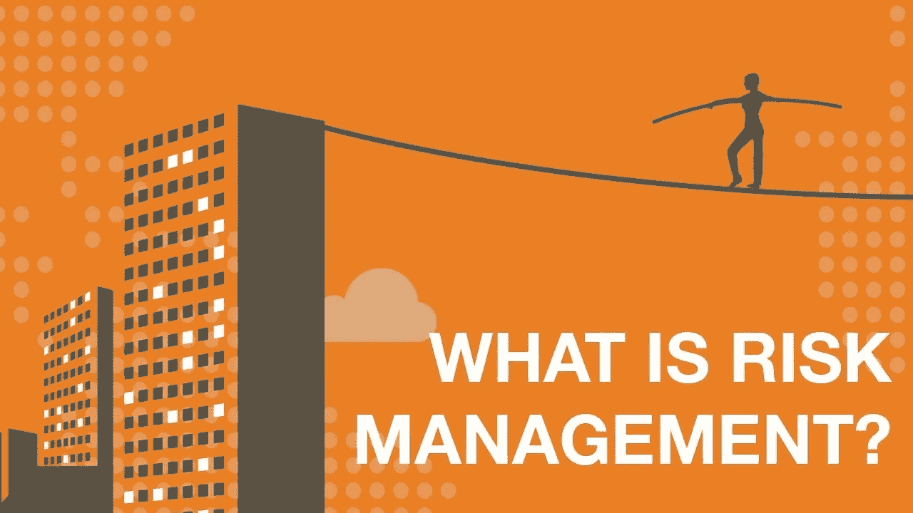

# 威尔。总有一天，它还是有价值的。com 等 TLD 也能做 ENS？

> 原文：<https://medium.com/coinmonks/will-eth-still-be-valuable-when-some-day-com-and-other-tlds-can-realize-ens-as-well-f8b970df2462?source=collection_archive---------0----------------------->

众所周知，ENS 是区块链领域的先驱，在未来我们可以运行。eth 域名完全通过区块链的智能合同，没有服务器，没有 UDRP 或任何“大老板”在后面，这可能会改变我们的域名。转移区块链域名所有权的唯一方法是让前所有者“给出密钥”与传统的顶级域名相比，这是一种更先进的方式。

ENS Ecosystem

与此同时，ENS 官方也宣布，未来欢迎所有 TLD 通过 DNS SEC 连接到 ENS，这意味着技术上传统的域名(如。com)以后既可以做 DNS(IP 关联)，也可以做 ENS(哈希关联)。老实说，这确实是 ENS 团队的伟大愿景，拥抱顶级域名(给予更多选择)无疑可以进一步增强 ENS 生态系统，但同时，一些。eth 域名所有者可能会提出这个问题:如果。com 能够做到这一点，有什么价值。那么 eth 呢？仍然值得为购买/拍卖域名花费这么多时间吗？

要回答这个问题，我们需要了解一下如何将。eth 地址以及如何通过 DNS SEC 为 TLD 提供该地址。

点 eth 是 ENS 的原生，如果你去 [http://app.ens.domains](http://app.ens.domains) ，可以直接搜索你的。eth 域名，添加哈希，支付汽油费，然后在几秒钟的广播后在区块链上更新。最终用户直接在 BLOCHCHAIN 上进行更改。

如果您想要一个 TLD 来关联一个散列(比如一个加密地址，如 ETH，BTC，BNB。等等)，那么你需要在你的域名注册商那里添加一个文本记录。从技术上来说，你依赖于每一级的 DNS 服务提供商将文本记录带到区块链世界。这很酷，因为在这之后，一个 TLD 域名可以同时做 DNS 和 ENS。然而，显然，最终用户和区块链之间仍然有人，毕竟我们使用 DNS 的方式来修补区块链的顶级域名。

Record Management in DNS

在我看来，有 3 个主要的优势。eth 与 ENS 上的 TLD 比较:

1.当地的

区块链的精神在技术上是“不集权”。当 TLD 通过 DNS SEC 关联 ENS 时，注册服务商和 DNS 服务提供商仍然高度参与其中。如果我拥有 Google LLC(这种情况永远不会发生),并且我选择使用 google.com 作为我们的钱包地址，我想我会一直担心我的地址是否会被黑客更改(我需要通过频繁检查该域是否关联了正确的哈希来验证这一点),或者 DNS 服务是否会可靠地将准确的文本记录传递给区块链世界。区块链世界是关于智能合约的，DNS 世界仍然是所有的人和服务器，总是有易受攻击的问题。故事的可怕之处在于，DNS 中的任何错误都可能在区块链导致不可挽回的结果。在区块链世界，该做的已经做了。

尽管如此，如果我仍然拥有 Google LLC(允许我再次享受那个美好的梦想)，我不认为以 50 或 100ETH(或更多)的价格收购 google.eth 真的很可笑，因为这将允许我直接访问智能合同，这将帮助我绕过集中式世界的所有潜在风险，这将让我睡个好觉。

Google.eth lately auctioned 52.9ETH

2.所有权的确定性

我的一个朋友去年获得了一个非常好的. com 域名(大约 1 万美元)，他对这笔交易非常自豪，并在“微信时刻”上展示了几次。他非常肯定这个域名几年后可以卖出更高的价格。他没想到的是，在接下来的一个月里，他收到了 CAC 发来的 UDRP 案件通知，表明某公司已经就该域名提出了投诉，因为它与他获得该域名之前他们注册的一个商标相冲突。不幸的是，最终他败诉了，注册服务商根据 UDRP 的裁决直接将域名转让给了申诉人。

传统域名市场上现在有数千个顶级域名，每个 TLD 的注册管理机构都由一家域名公司所有和运营(一些公司拥有多个顶级域名)，所有和本地注册服务商将所有不同的顶级域名分发给最终用户。与此同时，所有的顶级域名都由 ICANN 管理，并遵守 UDRP 规则。哦对了，最近。ORG 域名的注册被出售。

Business is Business

为了让以上乱七八糟的信息更容易理解:太多人可以决定你的 TLD 域名的命运。

在智能合同上，世界上只有一个人可以访问你的。eth 域:自己。

3.子域的分布

我们知道在未来。eth 和 TLD 可以创建子域。然而，TLD 做不到的是。eth 允许您设置智能合同来分发并在您的子域名上贴上价格标签。如果你真的很酷。eth 域名，你可以设置你的子域为 1 美元/年(或更多),这样你可以很容易地检索根域名的更新费用。比如说，你拥有 music.eth，你可以把 love.music.eth 卖给某个音乐粉丝，那个粉丝甚至可以把子子域名卖给其他人比如 i.love.music.eth，helen.love.music.eth 等等，智能合约正好可以帮助每一级子域名所有者管理自己的租金和收入。这只是我们不希望在 DNS 世界看到的。

现在怎么样，你还担心吗。eth 的未来？在我看来，如果你对你的 DNS 服务提供商和注册商超级自信，如果你不需要太担心你的 TLD 域名被商标滥用，如果你不会因为利益原因而考虑分配子域名，是的，通过 TLDs 的 ENS 对你来说是一个完美的选择，因为它可以同时覆盖 IP 和 Hash world。对于大公司来说。eth 似乎更合适，大公司享受风险管理:)

Don’t want any risk? Choose .eth!

我认为给予更多的选择正是 ENS 团队的精神，我相信他们开放和“愿意合作”的态度将使 ENS 生态系统更加繁荣。毕竟目前市场上有两种类型的领域:传统领域和区块链领域，毫无疑问。eth 只是。在区块链领域。

> [在您的收件箱中直接获得最佳软件交易](https://coincodecap.com/?utm_source=coinmonks)

