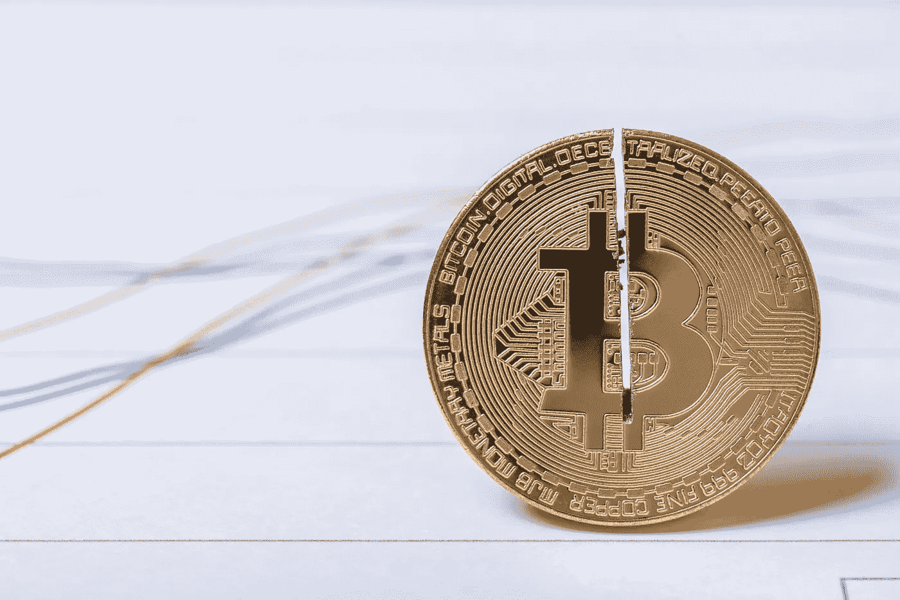
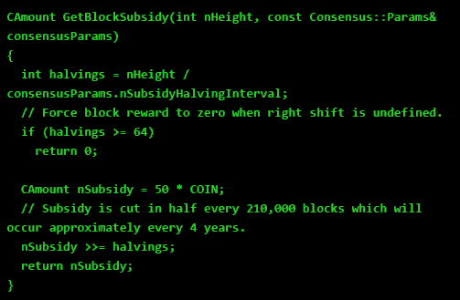
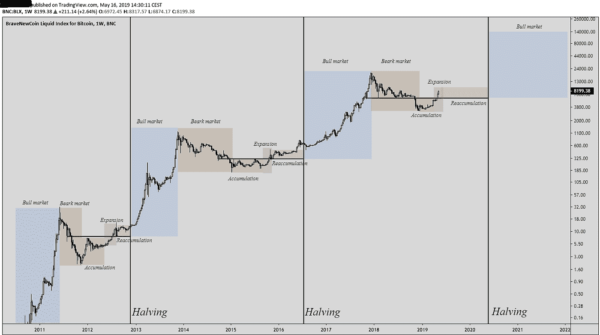
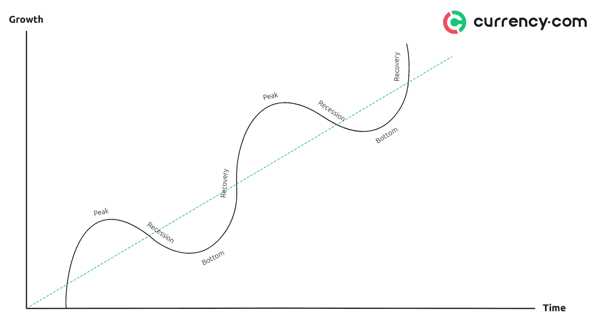
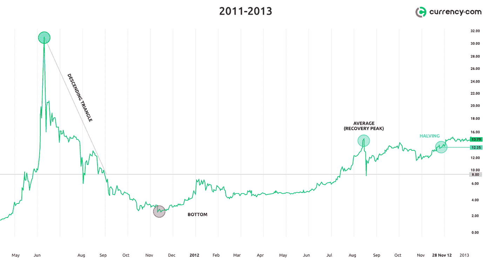
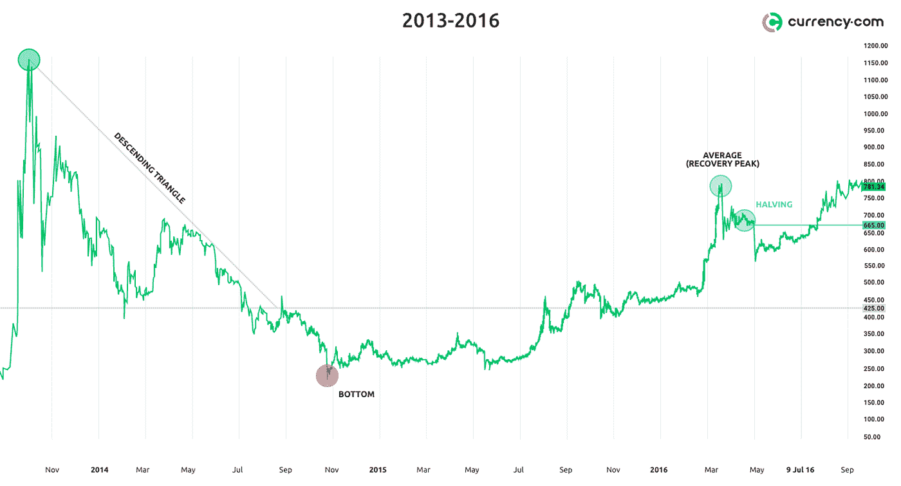
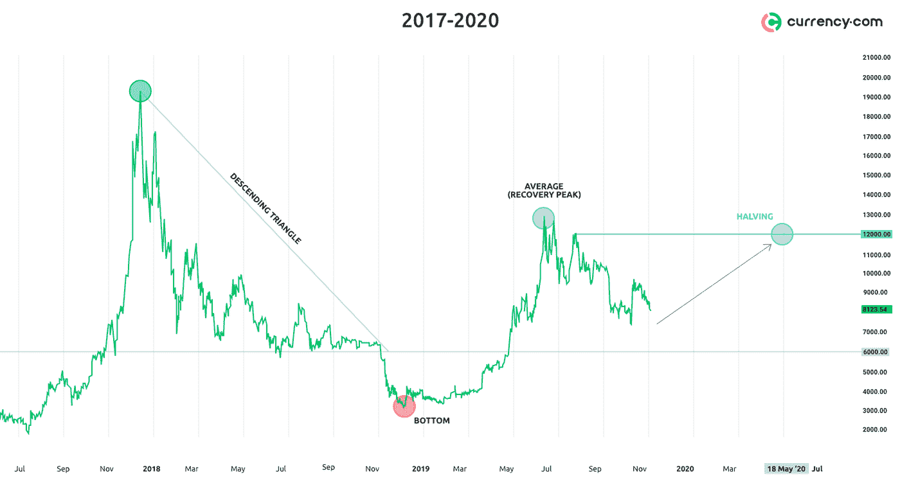
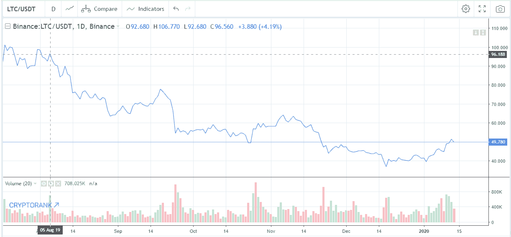

# 减半会把 BTC 税率提高到 12000 美元吗？

> 原文：<https://medium.com/coinmonks/will-halving-raise-the-btc-rate-to-12-000-3b84444eff6b?source=collection_archive---------0----------------------->

2020 年密码界最值得期待的事件是比特币减半。会对数字黄金的价格和整体加密货币市场产生怎样的影响？

减半是减少矿工为区块链增加一个新区块所获得的奖励。加密货币程序代码包含自动触发减半事件的语言。它不仅出现在比特币中，还出现在莱特币、以太币和其他几种使用工作证明(PoW)共识算法的硬币中。

*负责减半的比特币代码部分*

在比特币网络上，每 210，000 个区块就会减半。它第一次发生在 2012 年 11 月 28 日，在该网络推出近四年后。在此期间，共埋设了 10，500，000 枚 BTC，正好是现存总数的一半。在第一次减少奖励后，矿工开始为开采的区块获得 25 BTC，而不是 50 BTC。第二次减半发生在 2016 年 7 月 9 日，格挡奖励减少到 12.5 BTC。总共将发生 32 次减半。根据计算，最终开采区块的奖励将是 0.00000005820766091 BTC。

> [发现并回顾最好的比特币软件](https://coincodecap.com)

下一次减半将发生在今年 5 月(对矿工的奖励将减少到 6.25 英镑)，许多人预计到这个日期价格将出现非凡的增长。我们将更详细地研究是否值得等待这一事件，如果值得，我们可以期待什么价格水平。

**为什么我们需要减半**

减半在比特币和类似 PoW altcoins 的经济模式中起着至关重要的作用。以太坊(Ethereum)的创造者 Vitalik Buterin 通过将比特币与黄金进行对比来解释这一想法:“世界上的黄金储量是有限的，随着每开采一克，获得剩余的未开采黄金变得越来越困难。由于供应量有限，黄金在 6000 多年的时间里一直保持着国际交换媒介和价值储存手段的价值，比特币也有希望做到这一点”。我们可以说，减半的任务是增加比特币开采的复杂性及其 130 年排放的分布。减半有助于抑制恶性通货膨胀，并使比特币成为更稀缺的资产，这应该对其未来的价值产生积极影响。

**比特币周期**

让我们来看看比特币的历史图表:

似乎之前的减半事件表明了一个牛市周期的开始。在矿工的报酬减半后，比特币的价格成倍增长，达到了新的高度。此外，在图表上，周期性是显而易见的。

一个类似的模型，称为“Kitchin 周期”，每 2-4 年呈现一次繁荣和萧条周期。可能中本聪最初在比特币代码中设想并实现了这样一个经济模型。BTC 减半每四年发生一次，降低了通货膨胀，增加了需求，这完全符合基钦周期模型。

让我们仔细看看每一个比特币周期。

**2011 年至 2013 年**

比特币在 2011 年 6 月达到第一个高点，当时达到 30 美元，随后价格大幅下跌。底部达到 2 美元左右。然后复苏过程开始了，价格回到了 15 美元左右的平均值。2012 年 11 月 28 日减半日，价格为 12.25 美元，接近前期峰值的平均水平。减半 13 个月后，比特币达到了新的高度。

**2013–2016**

在接下来的几年里，从 2013 年 12 月到 2016 年 7 月，情况几乎相同(峰值——下降——底部——恢复到平均水平——减半——峰值)。当时最高价 1177 美元，最低 163 美元，平均 784 美元。价格接近 665 美元的一半。减半 17 个月后，价格达到新高峰。

**2017–2020**(我们在这里)

2017 年 12 月，比特币达到 20089 美元的历史最高水平，随后出现熊市下跌，底部为 3148 美元，随后有所回升。从前一个峰值得到的平均价格是 13，830 美元。如果上述模型是正确的，那么理论上，2020 年减半事件将把价格推高至 12，000 美元左右。。但是为什么呢？

恢复价格与减半当日价格之间的差异通常为 9–10%。2012 年，复盘价为 15 美元，较之前 32 美元的峰值上涨了 46.87%。减半日的价格是 12 美元，或 37.5%，从最后一次飙升至 32 美元。两个数值相差 9.37%。

2016 年，恢复价格为 784 美元，是之前峰值 1177 美元的 66.6%。减半日的价格为 665 美元，涨幅为 56.49%。两个数值相差 10.11%。

按照这个逻辑，13，830 美元是峰值 20，089 美元的 69.86%。分别通过减半，价格将约为峰值的 59.8% -60.8%或 11，836 美元-12，034 美元，对应于 12，000 美元的关键阻力位，这为比特币新的增长铺平了道路。

但值得注意的是，我们只有两个减半的样本，这根本不适合编制准确的统计数据。别忘了比特币的试玩版，莱特币。该公司在将奖金减半后，也将价格减半。

总之，我们想指出的是，减半对比特币非常重要，但不要抱有每枚硬币一百万美元的错误期望。2020 年 5 月很可能看不到这样的水平。统计数据显示，减半之日，价格接近前一个峰值的平均值，在 2020 年 5 月减半之日，价格应为 12，000 美元左右。

减半后的增长几乎立即开始，但它是逐渐进行的，仅在 5-7 个月后更新历史最高值。此外，请记住，减半效应可能已经反映在价格中(“买入谣言——卖出新闻”)。虽然模型是合理的，但其他宏观条件，如受股票和债券市场影响的流动性、监管压力、地缘政治事件和整体投资者情绪，都可能在这一新生资产类别中发挥作用，所以 DYOR！

> [在您的收件箱中直接获得最佳软件交易](https://coincodecap.com/?utm_source=coinmonks)

卷

