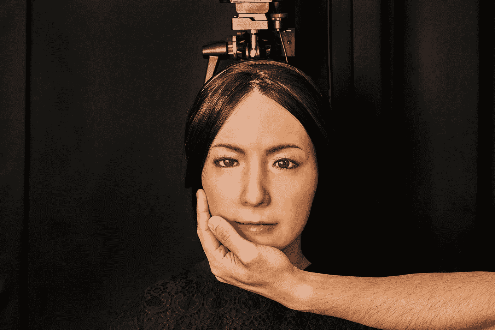

# 在机器时代我们会有什么感觉？

> 原文：<https://medium.com/coinmonks/will-the-new-machine-age-produce-new-emotions-c8f50af61484?source=collection_archive---------8----------------------->

Apollo and Daphne by Bernini (Villa Borghese, Rome); photo: Andrea Jemolo/Scala / Art Resource, NY

## 随着人工智能正在改变我们的人性，情感是最终的前沿。我们可能不得不扩大它们的规模，让它们茁壮成长。

*“如果有痛苦，护理它，如果有火焰，不要熄灭它，不要残酷对待它。当退缩让我们夜不能寐时，它可能是一件可怕的事情，看着别人比我们希望被遗忘的时间更快地忘记我们也不会更好。为了更快地治愈疾病，我们撕裂了太多的自我，以至于我们在 30 岁时就破产了，而且每次我们与新的人开始相处时，我们能提供的就更少了。但是为了没有任何感觉而没有任何感觉——这是多么浪费啊！”*

Sony Classics

以上是电影*以你的名字* 呼唤我[闭幕独白的文字(根据安德烈·阿西曼同名著作改编)；这是父亲帕尔曼先生的独白，他向儿子埃利奥保证情绪的不可思议程度，坚持认为即使是最矛盾的情绪也比没有好。](https://www.youtube.com/watch?v=BoTOd-j28Lw)

这些线路再及时不过了。我们已经开始意识到，感受更多不仅能让生活更丰富，也是自我优化和效率世界的最佳解毒剂，在其他世界，这是一个机器的世界。

## **效率与爱:一种新的情感**

在今年的达沃斯世界经济论坛上，阿里巴巴联合创始人兼执行主席马云提出了投资我们情感能力的理由，甚至提出了“爱情商数”管理思想家认为，社会情感技能将成为未来市场的关键资产，因为需要卓越运营和效率的任务可能会由人工智能和机器人更有效地完成。然而，情感仍然是人类的堡垒。我们的弱点就是我们的优势。

在 2016 年[的一项调查](https://www.weforum.org/agenda/2016/01/the-10-skills-you-need-to-thrive-in-the-fourth-industrial-revolution/)中，世界经济论坛将社交情感技能列为对未来职业成功越来越重要的因素。商学院正在调整他们的课程，将他们纳入其中，私立教育机构如生命学院已经将教授他们作为自己的使命。

然而，尽管我们尽了最大努力去揭开它们的神秘面纱，情感仍然是完全神秘和难以捉摸的。它们更容易被感觉到，而不是被解释，更容易被描绘——通常是通过艺术作品——而不是被分析。除非我们感觉到它们，否则我们无法理解它们，当然感觉到它们是一个盲点，可能会阻止我们“客观地”理解它们。

## 幸灾乐祸:27 种情绪之一？

关于什么是人类情感，什么不是，以及我们的哪些情感是独特的，甚至出现了一些混乱。在相当长的一段时间里，常识认为有六种基本的“经典”情绪:快乐、惊讶、害怕、厌恶、愤怒和悲伤。但在 2014 年，格拉斯哥大学[神经科学和心理学研究所](https://www.cell.com/current-biology/abstract/S0960-9822(13)01519-4)的一项研究声称，只有四种基本情绪——快乐、悲伤、害怕/惊讶和愤怒/厌恶。啊，如果是那样的话，生活岂不是既轻松又无聊！？

The Book of Human Emotions by Tiffany Watt Smith

然而，在 2017 年，美国国家科学院[学报](http://www.pnas.org/content/early/2017/08/30/1702247114.abstract)的一项新研究表明，情绪有多达 27 种不同的类别，事实上它们沿着一个梯度发生，并没有明显的区别或相互排斥。这一组新的情绪包括钦佩、崇拜、敬畏和令人惊讶的异常值，如“审美欣赏”，嫉妒、兴奋、恐惧和“移情痛苦”，以及同样意想不到的竞争者，如怀旧、浪漫或胜利。

看看这份综合清单，有几个情绪很突出。人们想知道浪漫是一种情感还是一种感觉，是一种情感的诠释，还是仅仅是一种与世界联系的方式。同样，对孤独的忽略也很明显，尽管在这种情况下，人们也可以说它是一种感觉，而不是一种情感。根据神经科学家 Sarah McKay 博士的定义，“感觉是身体状态的精神体验，当大脑解释情绪时产生，情绪本身是身体对外部刺激的反应。”然而两者之间的界限仍然模糊。

此外，一些情绪可能没有被列出来，因为它们在文化上是独特的，例如，T2 幸灾乐祸，这是德国人对另一个人的不幸或不幸的喜悦。或者这些班图语、塔格罗语和荷兰语术语:*mbuki-mvuki*——那种“跳舞时脱掉衣服”的不可抗拒的冲动——kilig——当你与吸引你的人交谈时那种飘飘欲仙的感觉——或者*uitwaaien*——在风中散步的清爽效果。其他被列入名单的情绪——比如“胜利”——似乎是我们这个时代的一个暂时标志，而不是一种固定的情绪:在我们这个赢者通吃的社会中，获胜可以说是一种将所有其他情绪置于第二位的情绪。胜利者感受到了一切。

## **同理心:机器，我们对你有感觉**

数字技术，特别是人工智能和机器人技术，将如何影响我们的情绪？

研究人员长期以来一直在研究我们与机器的情感关系。无数的研究已经证明，我们很快就会对机器人产生情感依恋，探索我们需要哪些社交技能来与它们合作可能确实是值得的。

由 [Affectiva](https://www.affectiva.com/) 、 [Emotient](http://fortune.com/2016/01/07/apple-emotient-acquisition/) (被苹果收购)和[情感研究实验室](https://emotionresearchlab.com/)等公司提出的所谓人工情感智能(AEI)，现在试图通过扫描我们的面部表情和肢体语言来分析我们的情绪。从研究马克·扎克伯格在国会听证会期间的行为到在工作面试中使用候选人评估 [HireVue](https://www.hirevue.com/) ，AEI 像任何技术一样，可以用于善意和恶意的目的，从提高我们的情商到操纵和情绪工程我们作为公民和消费者，从帮助自闭症儿童识别他们的情绪(例如，参见 [Kaspar 项目](https://slate.com/technology/2018/03/the-kaspar-robot-that-aids-autistic-children-is-the-future-of-social-a-i.html))到[在工作场所惩罚我们不快乐。](https://www.bustle.com/articles/165399-dont-worry-be-happy-writing-app-deletes-your-work-if-it-senses-youre-mad-but-the)

Reuters

移情机器人出现在两种趋势的及时交汇处:移情和人工智能。随着我们担心文明的丧失，以及仇外心理、种族主义和民族主义在许多自由社会的兴起，同理心已经成为一个热门话题，激发同理心的倡议包括与那些不喜欢我们甚至欺负我们的人的播客(例如[与讨厌我的人的对话](http://www.dylanmarron.com/podcast/))[麻省理工学院的深度同理心](https://deepempathy.mit.edu/)倡议或[谷歌的同理心实验室](https://www.vice.com/en_au/article/ywe33m/this-woman-believes-ai-can-be-taught-empathy)，以及使用虚拟现实和其他沉浸式技术作为伟大的[同理心机器](https://www.projectempathyvr.com/)

在今年拉斯维加斯举行的[消费电子展](https://www.fin24.com/Tech/new-emotional-robots-aim-to-read-human-feelings-20180111)上，展出了几个机器人，它们可以对人类用户应用移情和情商，例如社交机器人巴迪；打乒乓球的人能够读懂对手的肢体语言，预测他们的动作；或者 Pepper，根据它的制造商软银的说法，它“能够解释微笑，皱眉，你的语调，以及你使用的词汇和非语言语言，如你的头部角度”。在[日本](https://widerimage.reuters.com/story/ageing-japan-robots-role-in-future-of-elder-care)，一个人口老龄化的社会，像 Paro 这样应用于老年人护理的同理心机器人正在成为一种主流现象。

分析公司 [Gartner](https://www.gartner.com/newsroom/id/3843263) 最近预测，到 2022 年，智能机器将比我们的亲密朋友和亲戚更了解我们的情绪，这当然是一个令人愤慨的说法，正如人种学家 [Jonathan Cook](https://becominghuman.ai/time-to-get-smart-about-artificial-intelligence-predictions-3b7ddf5fce2) 所指出的那样:“某些研究公司越是声称他们有能力以量化的精度测量情绪，他们实际上就越有可能无法完成这项任务——因为他们已经失去了与情绪实际上是什么的联系，”他写道。

## 嫉妒、FOMO、厌倦:有意识的情感是进化的晚期成果

然而，问题仍然存在:如果机器人变得更善于阅读和回应我们人类的情感，人工智能和机器人技术的进步是否会导致新的情感的出现，这些情感不仅是以前无法测量、命名和识别的，而且是无法感受的？

你可能会说，人类所有可能的情感一直都存在，我们只是缺少描述它们的词语，只是随着时间的推移，我们对它们的理解变得更加精确了。但是有很好的理由接受情绪史的概念，即相信情绪像我们的身体和认知能力一样，也随着时间的推移而进化，以应对不断变化的环境和社会刺激。

加州大学圣地亚哥分校和密歇根大学的心理学家 Piotr Winkielman 和 Kent Berridge 在 2014 年进行了一项实验，他们向参与者快速展示悲伤和快乐的面孔，以至于他们根本没有意识到看到了任何面孔。之后，当参与者被要求喝一种新的柠檬-酸橙饮料时，那些潜意识中看到快乐面孔的人对这种饮料的评价更高，而且比其他人喝得更多。研究人员将此作为证据，表明“无意识情绪”的存在:我们没有实际感受到的感觉。“从进化的角度来说，拥有有意识的感觉的能力可能是一个迟到的成就，”他们总结道。换句话说，一种*情感教育*，对我们心灵的教育，可能确实是文明的一种成就，对现代人来说是福也是祸。

除了我们的情感意识，进化可能已经导致了新情感的形成。以嫉妒，尤其是“地位嫉妒”为例，这是一种更近的现象，是发达国家工业革命和日益增长的消费主义的产物。嫉妒需要一种唯物主义文化。如果你愿意的话，嫉妒是嫉妒的精炼、商品化版本。它描述了失望和屈辱的自我，没有拥有或接受另一个人所拥有或接受的东西，自我发现自己被排除在市场之外，无法参与交易。

Macbook Selfie Stick

在今天的体验经济中，嫉妒的天然伴侣是[FOMO](https://www.psychologytoday.com/us/blog/ritual-and-the-brain/201804/the-science-fomo-and-what-we-re-really-missing-out)——害怕错过的人。这种恐惧是关于错过一次经历:这是一种对失去的先发制人的恐惧，就像是对另一个人可能更丰富、更有价值的经历的嫉妒一样。归根结底，FOMO 是一种对死亡的恐惧——没有活过就死去。

虽然 FOMO 是它的反常版本，无聊才是真正的恐怖真空。乍一看，这似乎是一个越来越珍贵的好东西。事实上，无聊可能会消失，因为智能手机和其他设备的激增剥夺了我们任何空闲的时间。然而，由于自动化和传统就业的丧失，我们中的许多人将在未来面临更多无组织的时间，并将需要帮助来对抗无聊的麻木，因为它吞噬了我们的生活。

## **敬畏:混合情感是未来**

在今年的 TED 大会上，科学作家 Jessa Gamble 举办了一场关于敬畏的精彩研讨会，敬畏是一种由进入圣彼得大教堂或体验广袤沙漠而引发的情感。

Gamble 引用了斯坦福大学研究员 [Melanie Rudd](http://www.fasciastore.com/fascial-thoughts/the-science-of-awe) 的话，她研究了敬畏对消费者行为的影响，并声称在感受到敬畏后，我们倾向于选择电影等体验性商品，而不是衣服等物质商品。她进一步总结说，这也让我们更愿意在我们的社区做志愿者。看起来我们不仅需要公民课程，还需要敬畏的经历来建立更多的公民社会。尽管注意到敬畏同时赋予力量和剥夺力量是很重要的。它让我们变得更大，也变得更小。甘布尔指出，“小我”既是敬畏的前提，也是敬畏的结果:敬畏压倒了自我。这既鼓舞人心又令人羞愧。

TED

这种情绪在我们与人工智能和机器人的关系中发挥了作用:我们敬畏它们，这意味着，我们同时着迷和恐惧。“恐怖谷”(uncanny valley)——这个术语用来描述一个几乎完全是人工的、也不是完全有血有肉的人工智能的令人毛骨悚然，它被限制在机器人和人类之间的模糊边界上，只是人形的足以引发我们对人类错乱的感知——将是我们在可预见的未来的恒定状态。

正是这种紧张，这种矛盾的感觉，可能成为未来情感的蓝图。我们感受到的范围可能会增加，而且会越来越少二进制。甚至我们的语言也不得不迎头赶上，创造出表达这种矛盾心理的新词。一如既往，德国人特别擅长发明新动词，只要想想“Verschlimmbessern”(粗略翻译，意思是通过试图让事情逐渐变好来让事情变得更糟)。

## 正念，ikigai，目的:当情绪走向极端时，我们希望感觉更平衡

一方面，我们正在目睹我们的情绪变得激进，因为它们正逃向极端边缘(我们大多数人会点头回应像潘卡杰·米什拉的《[愤怒的时代](https://www.theguardian.com/books/2017/jan/23/age-of-anger-pankaj-mishra-rage-rules-politics)》这样的书名)；另一方面，我们的情感变得更加复杂，更加矛盾，不同种类的情感相互叠加。

与此同时，我们这个数字时代的易变性和复杂性正在普及简单而平衡的情绪状态，比如正念或日本的 [ikigai](/thrive-global/ikigai-the-japanese-secret-to-a-long-and-happy-life-might-just-help-you-live-a-more-fulfilling-9871d01992b7) 概念，它正在西方世界吸引越来越多的追随者。日本的冲绳岛，也就是 T2 的故乡，据说是世界上百岁老人最多的地方，其中一个吸引人的地方就是长寿。 *Ikigai* 是四个基本要素的交汇点:你热爱什么(你的激情)，这个世界需要什么(你的使命)，你擅长什么(你的职业)，以及你能从什么中获得报酬(你的职业)。

Ikigai 类似于西方的目标概念，它已经成为组织和个人变革的圣杯。“你的目的是什么？”作为一个品牌、公司、个人甚至国家，这是每个人都乐意问的最大也是最小的问题，尽管有大量的顾问和机构致力于此，但很少有人能够真正回答。这并不是一个全新的概念。美国哲学家、民权领袖霍华德·w·瑟曼说得最好:“问问是什么让你活了过来，去做吧。因为世界需要的是活着的人。”

正念、我觉或目的既不是情绪也不是感觉——它们是当我们的情绪变得更加极端时帮助我们恢复平衡的技术，也是帮助我们改进管理它们的工具。

## **亲密与浪漫:只要我们有感觉，我们的情感是否真实就有关系吗？**

自然，情感也受到数字化、我们生活的原子化的影响。在我们快节奏的日常互动中，微攻击——一个暴躁的服务员的微妙羞辱——会让我们的心情变得糟糕，就像微依恋的时刻——地铁里陌生人的微笑——会让我们的一天变得糟糕一样。似乎我们正以更快的速度从一种情绪状态转换到另一种情绪状态(心理学家苏珊·大卫(Susan David)创造了术语“[情绪敏捷度](https://hbr.org/2013/11/emotional-agility)”来指出我们必须发展的一种新技能来应对这种现象)，我们正在失去中间立场、共同点以及长期关系的稳定性和连续性。相反，我们要么通过在线“T10”多巴胺经济的即时刺激、小逃避(社交媒体、游戏、电影、旅行)，要么通过大逃避来满足我们的情感需求:假设一个替代身份、一个化身、一个流动的自我。

我们自我的虚拟化可能最终导致我们情绪的虚拟化，我们从在新的虚拟环境中体验古老的情绪到在数字或至少部分数字互动中体验新的情绪，再到完全的替代情绪，真实事物的数字占位符:虚假的亲密关系，虚拟的悲伤，等等。

Wired

日本机器人专家 Hiroshi Ishi guro 建造了人形机器人，最近在这个引人入胜的[Wired story](https://www.wired.com/2017/10/hiroshi-ishiguro-when-robots-act-just-like-humans/)**中被描绘，他确信人类的情感只不过是对外部刺激的反应。大卫·利维在他 2007 年的开创性著作《与机器人的爱与性》*中赞同这一观点:“如果一个机器人表现得好像它有感情，我们能合理地认为它没有感情吗？”他认为，人类的情绪不比人工智能的情绪少:“我们有荷尔蒙，我们有神经元，我们以一种创造我们情绪的方式‘连线’。”利维预计，大约到 2050 年，人类将希望机器人成为朋友、性伴侣，甚至配偶。***

***这提出了一些大问题:如果我们的人类情感越来越多地被智能算法操纵，甚至变得不真实，这有关系吗？或者我们能够感觉到它们就足够了吗？情感曾经纯洁过吗——它们能纯洁吗？可以说，我们从未对它们有过太多的控制。情感从来都不是完全属于我们的——相反，尽管我们坚持认为它们是私有的，但它们是公共资源的一部分，是某种开源软件。然而，有太多我们觉得无法分享的东西。我们似乎缺乏打开它的完整代码，这导致了巨大的挫败感——以及克服它的强烈愿望。也许，在未来，黑客攻击我们的大脑可能也包括黑客攻击我们的情感。技术可以让我们将自己的情绪和他人的情绪(重新)混合在一起，作为深度联系的最终形式。***

***使我们成为人类的是我们倾向于爱上别人:一个不是我们的人，一个我们无法控制的，比我们更伟大的人。我们不由自主地被那些承诺给我们新的情感、新的感觉、新的高潮和低谷、新的快乐和幸福，但也有新的心碎和痛苦的人、物或经历所吸引。***

***虽然我们叫他们的名字(Alexa，巴迪，索菲亚，卡斯帕，萨曼莎，艾丽卡…)，作为我们自己的一面镜子，人工智能机器人仍然难以捉摸。他们是神秘的他者，是最大的欲望，是终极的浪漫。如果它们能帮助我们感受更多，感受新的情感，如果我们通过更高级的情商来提炼这些情感，用艺术和人文作为我们的解释者，那么那些越来越擅长分析和操纵我们感受的机器将确保我们领先它们一步。***

***###***

****这篇文章的浓缩版出现在* [*今日心理*](https://www.psychologytoday.com/intl/blog/the-romance-work/201807/the-new-emotions-the-new-machine-age) *上。****

****如果你对这场关于技术和人性、情商以及一种新的领导者情感教育的对话感兴趣，请加入我于 2018 年 11 月 3 日至 8 日在里斯本举办的* [*美丽商业之家*](https://houseofbeautifulbusiness.com/) *。****

******

***houseofbeautifulbusiness.com***