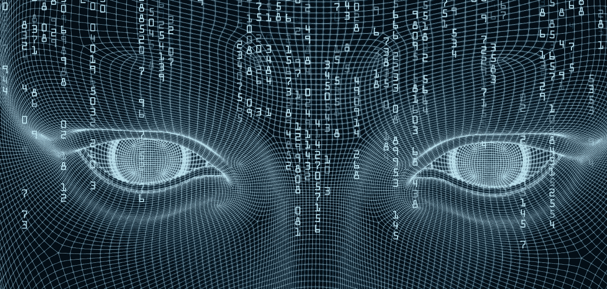
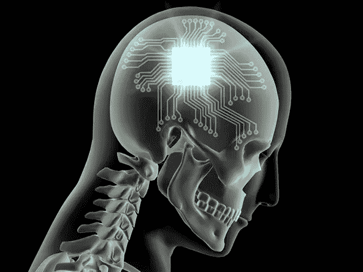
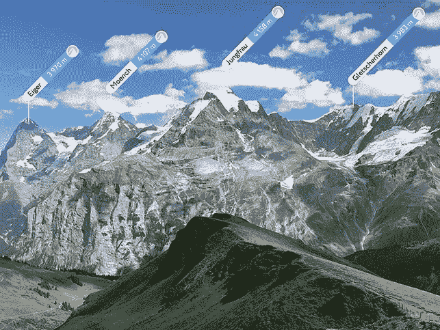
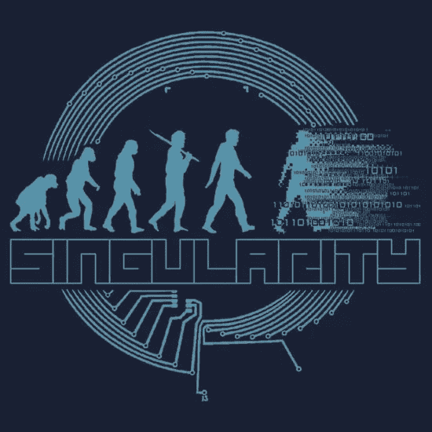

# 我们会进化成共生生物吗？

> 原文：<https://medium.com/coinmonks/will-we-evolve-into-symbiotic-beings-38db7b123be?source=collection_archive---------1----------------------->

对我们未来的进化相当乐观，尽管我们面临着气候变化的厄运或我们自己的自我毁灭的本性。我相信在不久的将来，我们将通过科学和技术的手段来适应和进一步提高我们的人类经验，并学会与自然和彼此完全和谐地生活。这么说的话，这里有一些方法可以增强我们在宇宙中的人类或共生体验。

# **神经植入物**

这个领域最早的突破之一是由威廉·豪斯医生在 60 年代早期完成的，他用人工耳蜗帮助耳聋的人恢复听力。人工耳蜗的听力恢复是通过切断听觉神经来实现的。今天，全世界有超过 300，000 名患者使用这种植入物。目前，有[众多的工作](https://www.nbcnews.com/mach/science/memory-boosting-brain-implants-are-works-would-you-get-one-ncna868476)正在进行，以治疗帕金森氏症、癫痫、注意力缺陷多动障碍、老年痴呆症，甚至退伍军人遭受的创伤性脑损伤。美国国防高级研究计划局(DARPA)已经资助了超过 7000 万美元用于该领域的研究。

然而，最重要的声明之一是由埃隆·马斯克在[乔·罗根播客](https://www.youtube.com/watch?v=ycPr5-27vSI)上做出的，他在播客中描述说，我们总是连接到网络的智能手机使我们成为共生生物。马斯克进一步提到，他正在致力于创造一种具有极高带宽的大脑植入物，以减少我们与智能手机的外部关系。

# **感官增强**

与我们相比，有许多动物物种具有更高的感官。我们都听说过这样的话:像狗一样嗅，像蝙蝠一样听，像鹰一样看。然而，有些动物香料的感觉与我们的感觉很不一样，例如；蜜蜂能感觉到花的电场，鲑鱼能感觉到地球的磁场，猫鼬有内置的太阳镜，可以遮挡耀眼的阳光，有助于看清远距离，最后，缓步动物(水熊)这些微小的生物可以在没有食物或水的情况下生存十年以上，它们可以在各种环境中生存，如温泉，冰川，山顶，海底，甚至太空真空中。

神经科学将这些发现与其他技术进步相结合，来提升我们自己的感官。例如，想象一下在一座山顶上，有能力读出你能看到的山峰的名称，它们的岩石成分和它们的高度这都可以通过增强现实来实现。此外，想象一下拥有内置望远镜视觉、夜视、热视、x 射线视觉以及更宽的光谱。类似地，感官植入物可以增强我们的听觉、嗅觉、味觉和触觉。

此外，在未来，我们甚至可以放弃我们的生物身体来提升我们的身体和精神能力。我们的有机身体有耐力极限，也容易生病，当然还有衰老。此外，我们的生物身体也需要水、食物、空气和睡眠的基本要求。尽管如此，我们仍然必须弄清楚如何整合使我们成为有意识的人类的核心方面。具有讽刺意味的是，意识是我们仍然无法理解的东西。

# **奇点**

科学家、发明家和未来学家预测，随着技术的指数级发展，我们将获得超越我们目前智力的超级智慧。生物技术公司 United Therapeutics Corp .的首席执行官马丁·罗斯布拉特介绍了“[大脑克隆](https://www.livescience.com/37499-immortality-by-2045-conference.html)的概念，这是可以永生的人类的数字版本。这种不朽将通过将我们的思想上传到电脑上来实现。

你有什么想法？

___________________________________________________________________

**参考列表**

克里斯蒂娜·达罗尔德(2015)。技术如何扩展我们的感官。网络中的科学。可从以下网址获取:[http://www . scienceonthenet . eu/content/article/Cristina-da-rold/how-technology-can-extend-our-senses/2015 年 1 月](http://www.scienceonthenet.eu/content/article/cristina-da-rold/how-technology-can-extend-our-senses/january-2015)【2020 年 1 月 4 日获取】。

赫特森，M. (2017)。超越五感。[在线]大西洋。可在:[https://www . theatlantic . com/magazine/archive/2017/07/beyond-the-five-senses/528699/](https://www.theatlantic.com/magazine/archive/2017/07/beyond-the-five-senses/528699/)【2020 年 1 月 5 日访问】。

科恩斯，B. (2015 年)。8 种具有超自然能力的动物。[在线]渡渡鸟。可用地点:[https://www.thedodo.com/8-animals-with-1178301730.html](https://www.thedodo.com/8-animals-with-1178301730.html)【2020 年 1 月 4 日获取】。

t .刘易斯(2013 年)。奇点临近:2045 年之前介意上传？[在线]livescience.com。可从以下网址获取:[https://www . live science . com/37499-不朽于 2045 年-conference . html。](https://www.livescience.com/37499-immortality-by-2045-conference.html.)

奥克斯，K. (2013 年)。27 只拥有真正超能力的神奇动物。[在线] BuzzFeed。可在:[https://www . BuzzFeed . com/Kelly oakes/incredible-animals-with real-super-power](https://www.buzzfeed.com/kellyoakes/incredible-animals-with-real-superpowers)【2020 年 1 月 4 日访问】。

鲍威尔，C.S. (2018)。增强记忆的大脑移植正在进行中。你能买一个吗？[在线] NBC 新闻。可在:[https://www . NBC news . com/mach/science/memory-boosting-brain-implants-are-works-would-you-get-one-ncna 868476](https://www.nbcnews.com/mach/science/memory-boosting-brain-implants-are-works-would-you-get-one-ncna868476)【2020 年 1 月 4 日获取】。

Specktor，B. (2018 年)。军方资助的研究成功测试“修复记忆”大脑植入物。[在线]livescience.com。可从以下网址获取:[https://www . live science . com/62234-professional-memory-neural-implant . html](https://www.livescience.com/62234-prosthetic-memory-neural-implant.html.)

> 加入 Coinmonks [电报频道](https://t.me/coincodecap)和 [Youtube 频道](https://www.youtube.com/c/coinmonks/videos)了解加密交易和投资

# 另外，阅读

*   [如何在 FTX 交易所交易期货](https://coincodecap.com/ftx-futures-trading) | [OKEx vs 币安](https://coincodecap.com/okex-vs-binance)
*   [OKEx vs KuCoin](https://coincodecap.com/okex-kucoin) | [摄氏替代品](https://coincodecap.com/celsius-alternatives) | [如何购买 VeChain](https://coincodecap.com/buy-vechain)
*   [ProfitFarmers 回顾](https://coincodecap.com/profitfarmers-review) | [如何使用 Cornix Trading Bot](https://coincodecap.com/cornix-trading-bot)
*   [如何匿名购买比特币](https://coincodecap.com/buy-bitcoin-anonymously) | [比特币现金钱包](https://coincodecap.com/bitcoin-cash-wallets)
*   [瓦济里克斯 NFT 评论](https://coincodecap.com/wazirx-nft-review)|[Bitsgap vs Pionex](https://coincodecap.com/bitsgap-vs-pionex)|[Tangem 评论](https://coincodecap.com/tangem-wallet-review)