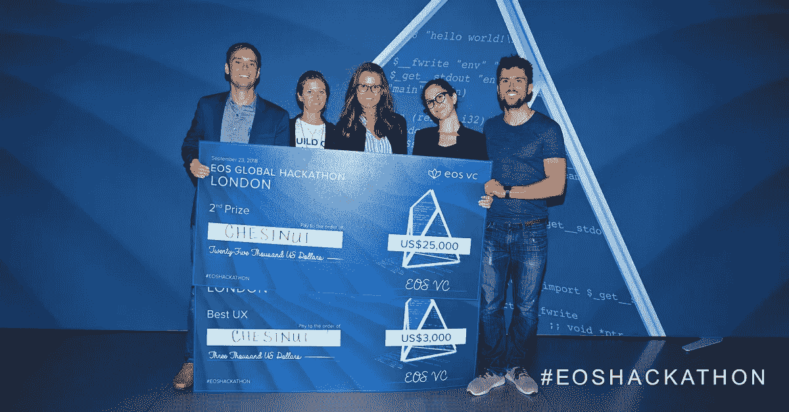
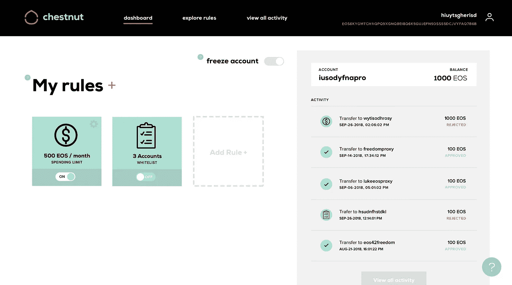
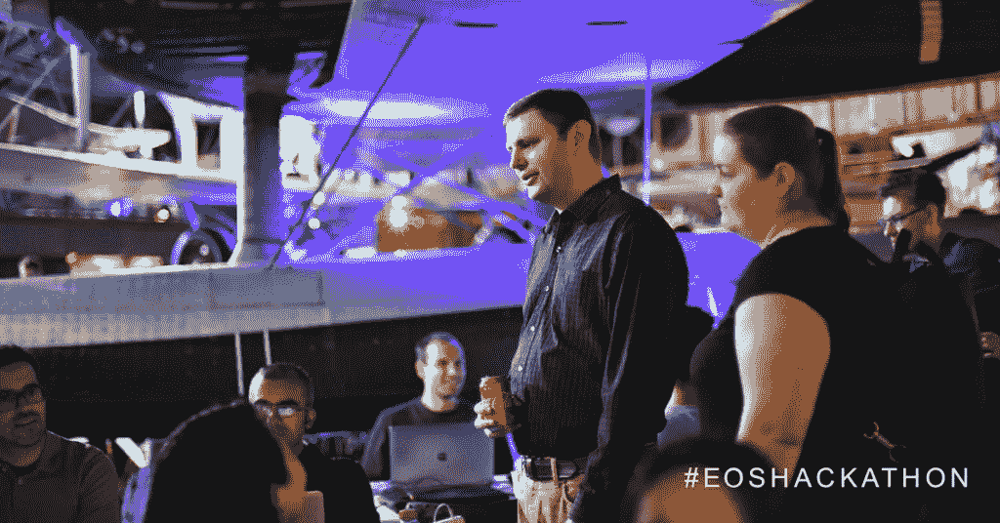

# 在 EOS 伦敦黑客马拉松比赛中获胜(第二名&最佳 UX)

> 原文：<https://medium.com/coinmonks/winning-at-the-eos-london-hackathon-1c23c77e91c3?source=collection_archive---------2----------------------->

我发现自己不是每天都站在大约 700 人的人群面前，还有成千上万通过 YouTube 直播收看的人。之前的 24 小时是头脑风暴、设计、编码和咖啡因的模糊时光。然后是 3 分钟的闭门演示，由 3 名评委决定 90 个团队的 450 名参与者中谁将进入前 10 名并出现在主舞台上。

EOS 区块链的创始人 Block.one 在 4 月份宣布了一个 4 人黑客马拉松系列赛，该系列赛将在由每场黑客马拉松的获胜者组成的大结局中达到高潮。每一个相隔 2 个月的黑客马拉松都有自己的“挑战”。在伦敦，挑战是“在 EOSIO 平台上创建一个应用程序，改善技术与用户隐私或安全之间的关系”。你可以在这里阅读我在香港第一届黑客马拉松的经历。

整个黑客马拉松和数百名观众涌入 iMax 影院观看或参与最终演示。决赛队伍没有被提前告知他们被选中了，而是以一次 3 或 4 波的形式宣布。我们满怀希望，但在前两波中没有被召唤时，我们相当紧张。最后一波他们把 [**队叫做栗子**](https://www.chestnutaccounts.com/) ，我们都兴高采烈。即使能进入前 10 名也是一项成就和荣誉。我们的演示进行得很顺利，EOS 区块链的首席开发者丹尼尔·拉里默问了我们一些聪明的问题。

## 赢得第二名和最佳 UX 奖

当我们被召回舞台接受最高奖项最佳 UX 奖时，我们第一次意识到可能会有特别的事情发生。此后不久，我们获得了第二名**和一个参加 12 月南非总决赛**的机会。真匆忙！

第一名获奖者是一个两人团队，他们建立了一个信誉和身份验证协议。他们的投球完美无瑕，播音员宣布他们以整个黑客马拉松系列赛中最一致的决定获胜。3d place winner 建立了一个身份护照，用户可以使用它来控制谁可以访问。

From left to right: Ashe Oro, Danielle Diamond, Anette Wilms, Patricia Parkinson, and Daniel Liebeskind (me)

今年早些时候，我们这个神奇的团队走到了一起，当时我们碰巧都住在巴厘岛，因为我们对区块链的共同热爱而联系在一起。我喜欢和他们一起工作的每一分钟！

## 我们建造的东西

我们在 [Team Chestnut](https://www.chestnutaccounts.com/) 相信，只有当我们开发出**智能账户**并具有类似于当前银行系统中存在的**安全和保护**时，区块链技术的广泛采用才会发生。然而，有了区块链账户，就没有第三方中介来监控你的交易，决定它们是否可以接受。这就是问题的关键。然而，如果您不小心发送了 10k EOS 而不是 1k EOS，或者如果您不小心将 crypto 发送到错误的地址，则没有追索权。

与当前的银行系统不同，Chestnut 帐户使用户能够避开中介(银行)并使用智能合同**设置自己的**偏好，包括**每日消费限额**、**黑名单/白名单帐户**，以及基于时间的**交易限额**。

The dashboard of our winning Chestnut hackathon project

栗子账户是一个多签名账户，这意味着任何交易都需要多个签名。帐户的所有者控制其中一个签名，而栗子智能合约拥有另一个签名。每当交易发生时，Chestnut 会将交易与预定义的用户阈值进行比较，如果交易符合用户偏好，则签署交易，如果交易超出可接受的参数，则不签署交易。

## 赢得 EOS 黑客马拉松的关键是什么？

赢得 EOS 黑客马拉松需要什么？我觉得不是开发商的特警队。我们有一个很棒的团队，拥有多样化的技能，而我是唯一一个真正写代码的人。你应该尽可能地拥有以下几个人:一个拥有多样化技能的**优秀团队**，一个你正在解决的**重要问题**，一个解决该问题的经过深思熟虑的**产品**，一个拥有直观 UX 的漂亮**设计，以及一个能够**推销你的原型**并脱颖而出的人。我们很幸运拥有所有这些。**

您还需要能够使用集成的智能合约构建产品的工作原型，因此您需要一个能够编写前端代码并了解智能合约 C++的开发人员。样板文件是用 React 编写的，Demux 从 Redux 中汲取了很多灵感，所以了解这些会加分。

## 黑客马拉松本身

如果你曾经参加过黑客马拉松，你可能经历过在一个有 50-100 名参与者的大型商业房间里通宵编码，而且没有什么大张旗鼓。也许有像样的食物，但最有可能是简单的比萨饼，苏打水和水。

EOS 黑客马拉松与此完全不同。那是在伦敦科学博物馆举行的，我们在古董飞机的地板上。我们被各种形状和颜色的大型飞机包围着。这是美丽和鼓舞人心的。食物是美味的，他们提供浓咖啡。他们甚至有一整层楼专门用来睡觉，里面全是豆袋。提供的赠品也令人印象深刻，包括一件巴塔哥尼亚毛衣、便携式电池充电器、Moleskine 和化妆品。

EOS creator Dan Larimer talking to some participants with an antique airplane in the background

在黑客马拉松期间，他们举行了智能合同开发、前端开发、设计和推介的分组会议。还有无数专门从事开发、设计和商业的导师。导师是一个极好的资源，尤其是对于第一次使用 EOS 的开发人员来说。很容易把他们标记下来，而且 Slack 还有一条热线，你可以在那里请求一位导师到你的桌子上。在黑客马拉松中有这么多的专家是非常独特的，可能是整个活动中最有价值的元素。我们还与其他团队合作，完善我们的想法/产品，交流技术知识并实践我们的推介。

本系列还有一场 EOS 黑客马拉松，将于 11 月 10 日在旧金山举行。如果可以的话，我强烈建议你参加。总决赛是一个孵化周和演示，也将在 12 月初举行，但只有前 3 名团队+每个黑客马拉松的社会影响力获胜者将出席。通过在伦敦获得第二名，我们也锁定了总决赛的席位！

## 下一步是什么？

自从在黑客马拉松中获胜以来，我们收到了大量积极的支持和帮助我们继续将 Chestnut 建设成一家真正的公司的兴趣。我们认为这是通往广泛采用的必不可少的基础设施，我们很自豪能够从事如此重要的工作。我们希望参与 12 月的 EOS 大结局将使我们进入领先的 EOS 基础设施项目。如果您想了解最新动态，请点击此处在我们的网站上[注册！](https://www.chestnutaccounts.com/)

如果你对一篇关于我们为黑客马拉松创建的 dapp 的技术文章感兴趣，请在评论中告诉我。我们正处于早期阶段，我们希望与您讨论合作或加入我们的事业！

> [在您的收件箱中直接获得最佳软件交易](https://coincodecap.com/?utm_source=coinmonks)

