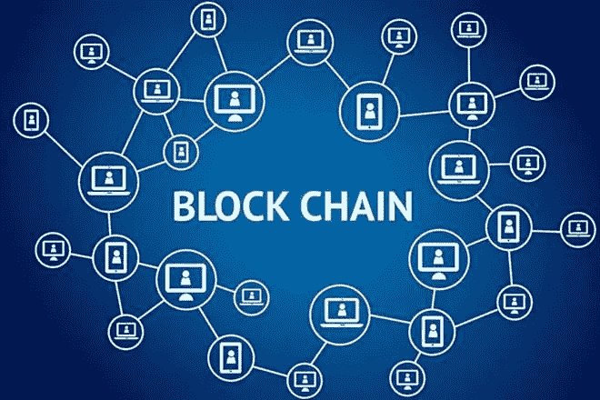

# 简而言之，区块链是什么

> 原文：<https://medium.com/coinmonks/with-modern-eras-rapid-pace-of-technology-advancement-the-awe-of-revolution-seem-to-be-subtle-and-bd30dea50aa6?source=collection_archive---------1----------------------->

[Source](https://www.financialexpress.com/india-news/blockchain-multiple-use-cases-across-multiple-industries/1126169/)

随着现代技术进步的快速步伐，对革命的敬畏似乎是微妙而短暂的。例如，智能手机问世仅十年，但它们给我们生活带来的变革现在已被认为无处不在。

今天的 Z 世代或后千禧一代正在见证另一场沉默的革命:区块链。

## 什么是区块链？

对于外行来说，它是一个分布式数据库，维护着一个不断增长的有序记录列表，称为“块”但是事情远不止表面上看起来的那样。使用加密技术链接和保护这些块。直到最近，密码学还是加密的同义词，但是这一概念已经被它与数学理论和计算机科学实践的联系所取代。

每个数据块都包含前一个数据块的加密签名(也称为加密哈希)、时间戳和交易数据。区块链天生廉洁。它是一个开放、高效、安全的分布式计算系统，具有高度的“拜占庭容错(BFT)”。它是一个永久的、可验证的数字分类账，不仅包括金融交易，还包括几乎所有有价值的东西，如事件、医疗记录和其他记录管理活动，如身份管理、交易处理、记录出处、食品可追溯性或投票。

所有区块链信息都属于一个可共享的、不断协调的数据库。该数据库不存储在任何单一位置，这意味着记录是公开可访问和可验证的。一旦被记录，任何给定块中的数据都不能在不改变所有后续块的情况下被追溯性地改变，这需要网络多数的共谋。

区块链是由化名中本聪在 2008 年发明的，用于加密货币比特币，作为其公共交易账本。比特币区块链的发明使其成为第一种无需可信机构或中央服务器就能解决双重支出问题的数字货币。

> [在您的收件箱中直接获得最佳软件交易](https://coincodecap.com/?utm_source=coinmonks)

