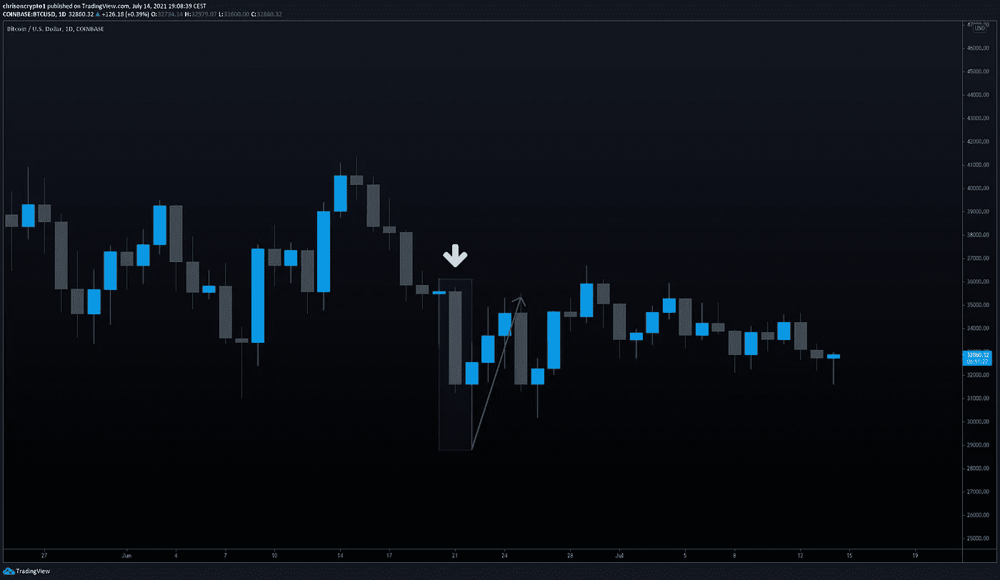

# 有了数字欧元，只有欧洲央行能够决定你的隐私权

> 原文：<https://medium.com/coinmonks/with-the-digital-euro-only-the-ecb-will-be-able-to-determine-your-right-to-privacy-75dc1a33a69e?source=collection_archive---------5----------------------->

一家数万亿美元的资产管理公司通过代理购买了比特币，获得了 MicroStrategy 12.2%的股份。但所有人都在关注灰度公司本周晚些时候的 GBTC 解锁，期待它对价格可能意味着什么。与此同时，欧洲央行披露了 CBDC 数字欧元项目的下一步措施，并首次声明只有欧洲央行能够决定如何保护公民隐私。

咱们挖吧。

## 2 万亿美元投资公司收购 MicroStrategy 的股份

一家价值数万亿美元的资产管理公司通过代理购买了比特币。

根据上周发布的一份 [SEC 文件](https://www.sec.gov/Archives/edgar/data/0001562230/000156223021000116/SEC13G_Filing.htm)，管理着超过 2.3 万亿美元资产的资本集团的子公司资本国际投资者已经购买了 953，242 股商业智能公司 MicroStrategy 的股票。

**查看** [全文点击这里](https://chrisoncrypto.com/blog/f/2-trillion-investment-firm-buys-122%25-stake-in-microstrategy) **！**

# 技术上来说

## BTC 未来波动？

又一周过去了，比特币继续横盘磨。然而，正如上一篇[更新](https://mailchi.mp/5a51f8ccfe6a/bitcoin-hashrate-rebounds-as-miners-turn-on-their-rigs)中所述，这种看似无止境的折磨即将结束。

早在 7 月，我们[讨论了](https://mailchi.mp/bffd9f863894/are-concerns-over-grayscales-gbtc-unlock-later-in-july-overrated)gray 即将推出的 GBTC 解锁(本周到期)以及它对市场的意义。具体来说，我们质疑悲观预期，并假设市场可以在 30，000 美元到 36，000 美元的既定区间内消化抛售压力。

如果我们看看从 6 月 20 日至 22 日的最后一个解锁期，大约有 30，620 BTC 被释放到市场上。这个数字远远大于本周设定解锁的比特币数量(大约多 22%)。

在此期间，BTC/美元从 36，000 美元跌至 28，700 美元，这表明接下来的周末将面临额外的抛售压力。然而，在接下来的几天里，价格迅速反弹至 35，000 美元的水平，完全取消了这一举动。

在解释这些类型的事件时，分析师通常会将他们持有的任何偏见归因于此。但在现实中，机构很可能对冲，因此平均更接近中性立场。这并没有低估正常的市场力量，这些力量可以在眨眼之间左右市场。话虽如此，这一事件还是值得关注的，波动性几乎肯定会随之而来。

## 欧洲央行称数字欧元将比 BTC 更环保

不出任何人所料，欧洲央行公布了其即将推出的央行数字货币(CBDC)计划的下一步措施，同时选择诋毁比特币网络。

去年 11 月，欧洲央行[发起了一项公众调查](https://chrisoncrypto.com/blog/f/ecb-opens-public-consultation-on-the-digital-euro)，询问欧盟民众对与发行 CBDC 相关的几个话题的看法和偏好。下一步将涉及 24 个月的“调查阶段”，根据[周三发布的新闻稿](https://www.ecb.europa.eu/press/pr/date/2021/html/ecb.pr210714~d99198ea23.en.html)，该阶段将用于“解决关于设计和发行的关键问题”

欧洲央行完全支持 CBDC 的潮流，并建议它可以使用欧元系统目标即时支付结算(TIPS)或数字欧元的区块链，这两者“已被证明每秒钟能够处理超过 4 万笔交易”。目前还不清楚欧洲央行将使用哪种技术。

在新闻稿中，欧盟还抓住机会在其官方[推特](https://twitter.com/ecb/status/1415273627872866309)账户上抨击比特币，称其实验工作“还表明，与比特币等加密资产的能源消耗和环境足迹相比，基础设施的能源需求可以忽略不计。”

自然，欧洲央行知道央行使用工作证明既无必要也不可取，因为它的存在与比特币和去中心化加密货币的定义完全相反。

谈到隐私权，欧洲央行表示，只有他们能够确定保护隐私权的可能方式，也就是说，根据定义，隐私也是不存在的。

令人欣慰的是，欧洲央行的间谍货币似乎还需要几年时间，两年的调查期今年才刚刚开始。

回头见。

**加入** [电报](https://t.me/chrisoncryptochannel) **频道，实时更新&设置！
关注我** [推特](https://twitter.com/ChrisOnCrypto1) **&** [多嘴多舌](https://gab.com/chrisoncrypto) **下面还有我的社交门户。**

[https://www.paypal.com/donate?hosted_button_id=C9VRLGTBHQX2N](https://www.paypal.com/donate?hosted_button_id=C9VRLGTBHQX2N)

# 阅读更多内容:2 万亿美元投资公司收购 MicroStrategy 的股份

[https://chrisoncrypto.com/blog/f/2-trillion-investment-firm-buys-122%25-stake-in-microstrategy](https://chrisoncrypto.com/blog/f/2-trillion-investment-firm-buys-122%25-stake-in-microstrategy)

[http://www.chrisoncrypto.com/](http://www.chrisoncrypto.com/)

你也可以用比特币支持我！
**BTC** 地址:**3 eydseypjhn 68 axkncuqbb 7 ebqcxrejamr**

最诚挚的问候，
T21 克里斯托
克里斯托
上的加密创始人[www.cityam.com](https://www.cityam.com)上的
直接接通:[电报](https://t.me/chrisoncrypto)

*最初发布于*[*https://mailchi . MP*](https://mailchi.mp/e95eb7a849cd/with-the-digital-euro-only-the-ecb-will-be-able-to-determine-your-right-to-privacy?e=[UNIQID])*。*