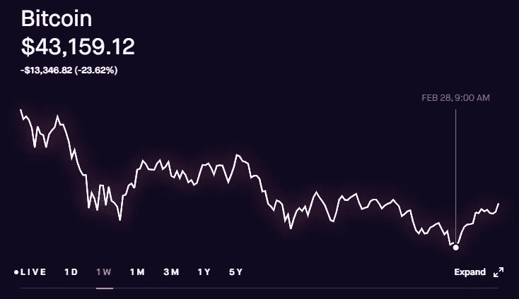

# 在这个减半周期中，逆向寻找比特币的最终目标价格

> 原文：<https://medium.com/coinmonks/working-backwards-to-find-bitcoins-ultimate-target-price-this-halving-cycle-389bc60011a8?source=collection_archive---------2----------------------->

在我的文章[利用比特币减半周期赚钱](/coinmonks/bitcoin-halving-cycles-and-projections-b1c54dd3ed0b)中，我根据比特币减半周期中的历史价格走势分析了比特币的定价目标。我们正处于第三个比特币减半周期，最终的问题是比特币的价格接下来会发生什么？在我的帖子[比特币:何时套现或崩溃](/coinmonks/bitcoin-when-to-cash-out-or-crash-out-23098caee11a)中，我提到了一些…