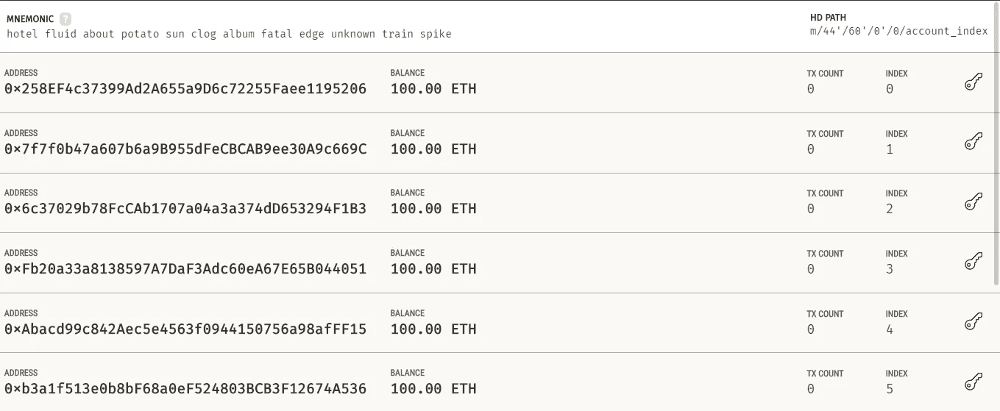

# 与以太坊和 IPFS 合作

> 原文：<https://medium.com/coinmonks/working-with-ethereum-and-ipfs-b9d83fe09863?source=collection_archive---------0----------------------->


Photo by [Zoltan Tasi](https://unsplash.com/@zoltantasi?utm_source=medium&utm_medium=referral) on [Unsplash](https://unsplash.com?utm_source=medium&utm_medium=referral)

我们将看到一个快速演示，演示我们如何一起使用 [IPFS](https://ipfs.io/) 和[以太坊](https://ethereum.org/en/)。我们将在 IPFS 网络上上传一些数据，并将返回的内容标识符(CID)保存在以太坊区块链上，我们可以通过智能合约访问该标识符。为了快速开始，你可以使用一个已经有 Dapp 项目结构的样板文件。那里有吨，但是得到 [**这个**](https://github.com/cyberhawk12121/Ethereum-dapp-boiler) 一个以便跟随。
**(注意:所有命令都是在这个项目目录下运行)**

# 以太坊设置和代码

以太坊是一个总部位于区块链的平台，用于开发去中心化的应用和智能合约。以太坊区块链就像一个通用的区块链，任何想做某事的人都不需要为他们的应用程序制作自己的区块链。他们可以在这个区块链的基础上构建应用程序。而 IPFS 是星际文件系统的缩写，它是一个区块链网络，用来存储各种文件。以太坊从来不是用来存储大量数据的，因为这对网络来说成本很高。因此，我们有一个像 IPFS 那样的解决方案。

假设您的设备上安装了 NodeJS 和 React.js，请安装以下软件:

1.  安装所有软件包:`npm install`
2.  安装松露:`npm install -g truffle`
3.  下载 Ganache app [**这里**](https://www.trufflesuite.com/ganache)

## 松露

Truffle 是以太坊的开发环境、测试框架和资产管道，旨在让以太坊开发者的生活更轻松。您可以运行`truffle compile`、`truffle migrate`和`truffle test`来编译您的合同，将这些合同部署到网络中，并运行它们相关的单元测试。在本演示中，我们将只在本地环境中工作。

## 加纳切

我们还需要一个当地的以太坊区块链和一些以太来支付改变区块链州的交易所需的燃气费。为此，我们已经下载了[加纳切](https://www.trufflesuite.com/ganache)。你只需要快速启动 Ganache 就够了。



Ganache main screen after QuickStart

你可以在那里看到许多地址，这些地址可以用来支付开发过程中的燃气费。

## 撰写智能合同

现在，在`./contracts` 文件夹中创建`myContract.sol`并编写以下代码。

```
pragma solidity >=0.4.21 <0.6.0;contract myContract{
    string data;
    function set(string memory data){
        data=data;
    }function get() public view returns(string memory){
        return data;
    }
}
```

这里，我们有两个函数`set()`和`get()`。函数`set()`只是 setter 函数，它在变量`data`中写一些值，而`get()`只是返回变量。

> 注意:如果变量是`string **public** data` ，那么默认情况下，solidity 会给 getter 函数一个与变量相同的名字，也就是说，在这个例子中`data()`会简单地返回相同的变量。

## 部署智能合同

在`./migrations`目录中创建一个名为`2_deploy_migrations.js`的文件，并编写以下代码:

```
const myContract= artifacts.require('myContract');
module.exports = function(deployer) {
    deployer.deploy(myContract);
};
```

在这里，我们将导入合同，然后运行 deploy 命令将其放在区块链上。当我们部署智能合同时，将使用该文件。在迁移之前，请确保测试您的智能合约，因为一旦它在区块链上，就无法更改。在使用命令`truffle compile`做任何事情之前也要编译。要在网络上部署智能合约，请确保 Ganache 应用程序正在运行。然后，我们只需转到控制台并运行:

```
truffle migrate
```

我们会收到一张交易确认收据，上面会说明与交易相关的一切。
请注意，此部署是在区块链本地网络上使用应用程序 Ganache 进行的。现在，您可能想知道我们的应用程序是如何连接到 Ganache 并在那里部署契约的。这一切都是因为我们在后台与应用程序进行通信。你可以检查`truffle-config.js`所有的配置都写在哪里。

# 建立 IPFS

连接到 IPFS 的一种方法是在系统上下载 IPFS，并在机器上运行它，使其成为 IPFS 节点，并将您的应用程序连接到此，阅读[此处](https://docs.ipfs.io/install/)了解必要的步骤。另一种方法(适合这个快速演示)是像 [Infura](https://infura.io/docs/ipfs) 这样的公共客户端。我们可以使用 Infura 来测试和了解 IPFS 的功能，我们可以非常迅速地将文件上传到 IPFS 网络，没有任何麻烦。要使用 IPFS，您需要安装`ipfs-http-client`库:

```
npm install --save ipfs-http-client
```

然后我们可以像这样连接到节点:

```
const create = require('ipfs-http-client')const ipfs = create('https://ipfs.infura.io:5001')
```

如果您让节点在本地机器上运行，客户端地址应该类似于`[*http://localhost:5001*](http://localhost:5001)`。完成后，我们可以简单地运行如下函数:

```
const run = async ()=>{
    const data= await ipfs.add(“Hello World”)
    const resultCID= file[‘path’]
    console.log(resultCID);
}   // You could put a file buffer as well or anything
run();
```

函数 add()返回一些数据，最重要的是 CID，它是一个以“Qm”开头的字符串。我们可以使用这里的第二行来访问(将 CID 保存在某个我们会再次需要的地方)。你也可以在 react 应用程序中制作一个表格，并将任何类型的文件上传到 IPFS 网络。点击了解更多关于不同功能[的信息。](https://www.npmjs.com/package/ipfs-http-client)

> **内容标识符(CID)** :一个*内容标识符*，或 CID，是一个用于指向 IPFS 素材的标签。它并不指示*内容存储在哪里*，而是根据内容本身形成一种地址。CID 是由数据本身的散列形成的，因此数据的任何变化都意味着数据的不同 CID 分配。IPFS 使用一种叫做 Merkle Directed Acyclic Graphs(DAG)的高级数据结构，其中每个节点都承载有效载荷，并被赋予一个标识符。在这里阅读更多[](https://docs.ipfs.io/concepts/content-addressing/)****。****

**去终端运行`truffle console`这将打开松露的控制台。您可以运行函数 set()和 get()来设置 CID 并从以太坊区块链取回它，然后从 IPFS 取回数据。在此之前，再次运行命令`truffle compile`
(如果需要，再次运行部署命令)。现在，运行控制台并运行这些命令。**

```
1\. const contract= myContract.deployed()
2\. setData= contract.set(<paste the CID that was earlier received>)
    // This set() command will consume gas as it's changing state
3\. getData= contract.get()
4\. getData
```

## **从 IPFS 获取数据**

**为了获取数据，我们可以点击带有内容 CID 的 URL `[https://infura.io/ipfs](https://ipfs.io/ipfs/QmUXTtySmd7LD4p6RG6rZW6RuUuPZXTtNMmRQ6DSQo3aMw)/<CID>`或`http://localhost:5001/ipfs/<CID>`(如果节点运行在本地机器上)，它将显示数据。
另外，你还可以构建一个客户端界面，使用 [web3.js](https://web3js.readthedocs.io/en/v1.3.4/) 库的用户可以与智能合约进行交互。让我们把它留到下一个演示中。**

***感谢您的阅读！***

> **加入 [Coinmonks 电报频道](https://t.me/coincodecap)，了解加密交易和投资**

## **另外，阅读**

*   **[电网交易机器人](https://blog.coincodecap.com/grid-trading) | [加密交易机器人](/coinmonks/cryptohopper-review-a388ff5bae88) | [加密交易机器人](https://blog.coincodecap.com/best-crypto-trading-bots)**
*   **[加密复制交易平台](/coinmonks/top-10-crypto-copy-trading-platforms-for-beginners-d0c37c7d698c) | [如何在 WazirX 上购买比特币](/coinmonks/buy-bitcoin-on-wazirx-2d12b7989af1)**
*   **[CoinLoan 点评](/coinmonks/coinloan-review-18128b9badc4)|[Crypto.com 点评](/coinmonks/crypto-com-review-f143dca1f74c) | [火币保证金交易](/coinmonks/huobi-margin-trading-b3b06cdc1519)**
*   **[尤霍德勒 vs 科恩洛 vs 霍德诺特](/coinmonks/youhodler-vs-coinloan-vs-hodlnaut-b1050acde55a) | [Cryptohopper vs 哈斯博特](https://blog.coincodecap.com/cryptohopper-vs-haasbot)**
*   **[顶级付费加密货币和区块链课程](https://blog.coincodecap.com/blockchain-courses) | [币安评论](/coinmonks/binance-review-ee10d3bf3b6e)**
*   **[MXC 交易所评论](/coinmonks/mxc-exchange-review-3af0ec1cba8c) | [Pionex vs 币安](https://blog.coincodecap.com/pionex-vs-binance) | [Pionex 套利机器人](https://blog.coincodecap.com/pionex-arbitrage-bot)**
*   **[如何在印度购买比特币？](/coinmonks/buy-bitcoin-in-india-feb50ddfef94) | [WazirX 评论](/coinmonks/wazirx-review-5c811b074f5b) | [BitMEX 评论](https://blog.coincodecap.com/bitmex-review)**
*   **[印度的加密交易所](/coinmonks/bitcoin-exchange-in-india-7f1fe79715c9) | [比特币储蓄账户](/coinmonks/bitcoin-savings-account-e65b13f92451) | [HitBTC 审查](/coinmonks/hitbtc-review-c5143c5d53c2)**
*   **[币安费用](/coinmonks/binance-fees-8588ec17965) | [Botcrypto 审核](/coinmonks/botcrypto-review-2021-build-your-own-trading-bot-coincodecap-6b8332d736c7) | [Hotbit 审核](/coinmonks/hotbit-review-cd5bec41dafb) | [KuCoin 审核](https://blog.coincodecap.com/kucoin-review)**
*   **[我的加密副本交易经验](/coinmonks/my-experience-with-crypto-copy-trading-d6feb2ce3ac5) | [AAX 交易所评论](/coinmonks/aax-exchange-review-2021-67c5ea09330c)**
*   **[Bybit 融资融券交易](/coinmonks/bybit-margin-trading-e5071676244e) | [币安融资融券交易](/coinmonks/binance-margin-trading-c9eb5e9d2116) | [Overbit 审核](/coinmonks/overbit-review-9446ed4f2188)**
*   **[加密货币储蓄账户](/coinmonks/cryptocurrency-savings-accounts-be3bc0feffbf) | [YoBit 审查](/coinmonks/yobit-review-175464162c62) | [Bitbns 审查](/coinmonks/bitbns-review-38256a07e161)**
*   **[Botsfolio vs nap bots vs Mudrex](/coinmonks/botsfolio-vs-napbots-vs-mudrex-c81344970c02)|[gate . io 交流回顾](/coinmonks/gate-io-exchange-review-61bf87b7078f)**
*   **[Godex.io 评审](/coinmonks/godex-io-review-7366086519fb) | [邀请评审](/coinmonks/invity-review-70f3030c0502) | [BitForex 评审](/coinmonks/bitforex-review-c4bb28d9e271) | [北海巨妖评审](/coinmonks/kraken-review-6165fc1056ac)**